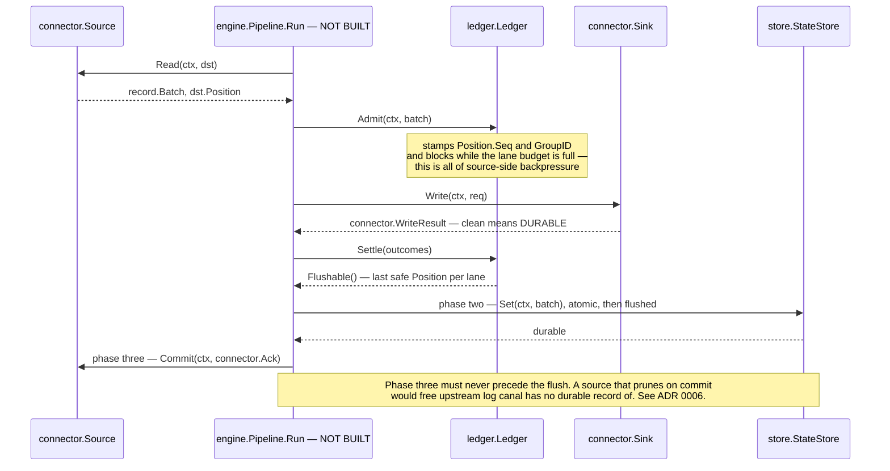
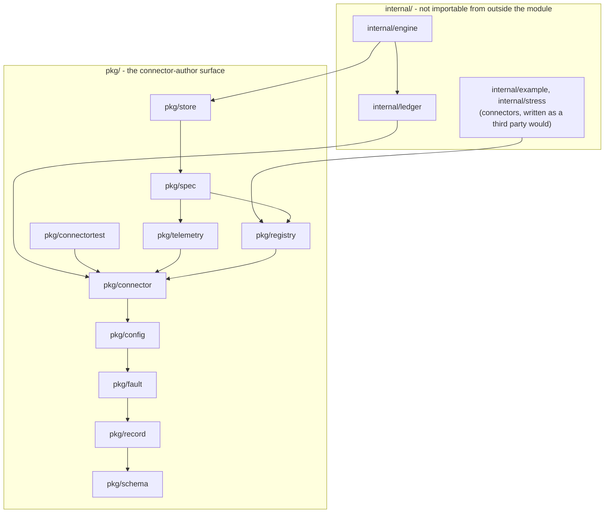

# canal

A source- and sink-agnostic connector and data-movement tool in Go. No third-party dependencies; Go 1.23.6.

The core is deliberately agnostic: no specific system's shape is allowed to leak into it. Adding a source
or a sink means implementing an interface and registering it — no core changes, no per-connector branches
anywhere in the engine.

## Status — read this before anything else

**The interface set is real. The engine is not built.** Nothing has ever moved a record.

| | |
|---|---|
| `pkg/` — the connector-author surface | **real, compiling, documented.** 76 files, 12,108 lines. |
| `internal/engine`, `internal/ledger` | **partly real.** 2,474 lines. `Build` resolves, validates and negotiates a delivery guarantee. `Pipeline.Run` is a one-line error return. |
| `internal/stress` — eight hostile connectors | **real.** 18,285 lines, kept as an interface-shape regression suite; the audit found five of the eight genuinely catch drift today. |
| Durable state store | **does not exist.** The only `store.StateStore` in the tree is [`internal/example/memstore`](internal/example/memstore/store.go), an in-memory map that labels itself as scaffolding. |
| A binary | **does not exist.** There is no `main` package, so there is nothing to `kill -9`. |
| Codecs, buffers, transforms, a frontend, an API | **do not exist.** The interfaces for them do. |

`go build ./...`, `go vet ./...` and `gofmt -l .` are clean. `go test ./...` passes: 42 test functions
across 9 packages, all of them under `internal/`. **`pkg/` has no unit tests** — it is asserted against
today only by the stress corpus and by the compiler.

Design rule [R3](docs/design-rules.md) says one end-to-end path comes before any breadth, and the
project's own compliance audit records R3 as **violated**. That audit
([`docs/decisions/_rule-compliance.md`](docs/decisions/_rule-compliance.md)) ran 19 adversarial checks
against the delivered code and returned **4 violated, 9 partially violated, 6 satisfied-with-caveats,
0 clean**. It is linked here rather than buried because a reader who finds the gap themselves has no
reason to trust anything else in the repository.

## Goals — the end state

- **Many sources, many sinks.** Adding either means implementing an interface and registering it.
- **Several kinds of pipeline.** Streaming change capture, batch and full-scan, and the hybrid
  snapshot-then-stream case where an initial scan hands off to an incremental stream without gaps or
  duplicates.
- **Serialization** as a pluggable concern, separate from connector logic.
- **Checkpointing** that survives `kill -9` and restarts exactly where it should.
- **Initial / state scan** for sources that support it, resumable mid-scan.
- **A frontend** for live metrics and configuration, driven by what connectors declare about themselves
  rather than by connector-specific UI code.
- **Two deployment shapes from one binary:** a standalone dev mode with no external dependencies, and a
  horizontally scaled enterprise mode.

None of these is achieved yet. They are what the interface set is shaped to allow.

## How the pieces fit


Rectangles are interfaces a connector author implements
([`pkg/connector/source.go`](pkg/connector/source.go), [`sink.go`](pkg/connector/sink.go),
[`transform.go`](pkg/connector/transform.go), [`buffer.go`](pkg/connector/buffer.go),
[`codec.go`](pkg/connector/codec.go)); rounded boxes are core machinery
([`internal/ledger/ledger.go`](internal/ledger/ledger.go),
[`pkg/store/state_store.go`](pkg/store/state_store.go)). **Every arrow is dotted because every arrow is
work `internal/engine.Pipeline.Run` would do, and `Run` is a stub**
([`internal/engine/build.go:321`](internal/engine/build.go)). The only registration calls in the whole tree
are `registry.AddSource` and `registry.AddSink` — no transform, buffer, encoder, framer or compressor
exists — so stage 2 is interfaces only.

### The commit protocol

The one thing worth understanding before reading any code. It is specified in full and implemented in
half.



`Admit`, `Settle` and `Flushable` exist and are tested only indirectly
([`internal/ledger/ledger.go`](internal/ledger/ledger.go)); the driver that would call them in this order
does not, and no `StateStore` in the tree is actually durable. The ordering rule is
[ADR 0006](docs/decisions/0006-three-phase-commit.md) and the narrative version is the package comment in
[`internal/engine/doc.go`](internal/engine/doc.go). A sink is never shown progress at all — it signals
durability by returning a clean `WriteResult`, which is why a new sink cannot get progress wrong.

## Repository layout



An arrow means *imports*. This is the transitive reduction of the real graph — edges implied by
transitivity are omitted, so `pkg/spec` also imports `connector`, `fault`, `record` and `schema` through
`registry`. Reproduce it with `go list -deps -f '{{.ImportPath}} {{.Imports}}' ./...`. Two facts the
diagram makes visible: **`pkg/spec` imports `pkg/registry`, not the other way round** (`Node.Kind` is a
`registry.Kind`, [`pkg/spec/node.go:17`](pkg/spec/node.go)), and **`internal/engine` is the only package
that imports everything, and nothing but two test files imports it** — which is what makes the
extensibility claim checkable, because a connector cannot reach an engine type even if it wanted to.

> **Note.** §3 of [`docs/architecture.md`](docs/architecture.md) used to carry a dependency table that was
> wrong in 5 of its rows, named packages that do not exist, and declared a `registry → spec` edge that
> would have been an import cycle — the audit's R12 finding, and the reason
> [`_rule-compliance.md`](docs/decisions/_rule-compliance.md) still describes §3 that way. That table has
> since been replaced with a graph regenerated from `go list`, and the four claimed-and-absent edges are
> now drawn explicitly as absent. Nothing yet stops it drifting again: the
> `TestDependencyDirection` that §3 once claimed to have still does not exist.

The tree as it actually is:

```
pkg/                    the connector-author surface — the public contract
  schema/               canonical type set, Schema, Ref, drift kinds
  record/               Record, Batch, Allocator, Payload, Meta, Position, Origin, Blob
  fault/                Class, Op, Fault, RecordFault, RetryPolicy, Backoff
  config/               Spec, Field, Predicate, Config, Diagnostics, composite fields
  connector/            Source, Sink, Transform, Buffer, codecs, all *Caps, LaneSpec,
                        LaneCtl, StateHandle, the *Runtime interfaces
  registry/             Registry, Default, the *Def structs, Descriptor, Add*, Resolve*
  telemetry/            metric names, closed label vocabulary, Negotiated, the read model
  spec/                 pipeline Spec, Node, Edge, StreamConfig — topology as data
  store/                StateStore, ConfigStore, StatusStore, Coordinator — deployment seam
  connectortest/        embeddable inert runtimes, so a core that grows a method does not
                        break every connector's test suite

internal/               engine machinery and connectors; unreachable from outside the module
  engine/               Build, negotiation, the graph, checkpoint plumbing, Run (a stub)
  ledger/               Tracker[P], Ledger, Disposition, LaneStats, the leak reaper
  example/              linefile source, stdoutsink sink, memstore StateStore (scaffolding)
  stress/               eight deliberately hostile connectors, kept as a regression suite

docs/
  design-rules.md       R1–R13, normative, each derived from an observed defect
  architecture.md       9,505 lines, 30 sections, 57 diagrams, declared normative
  decisions/            0001–0031, the ADRs
  decisions/proposals/  four whole-architecture proposals that were judged against each other
  decisions/reviews/    twelve reviews of those proposals — correctness, extensibility, Go ergonomics
  decisions/_rule-compliance.md    19-check adversarial audit of the code against R1–R13
  decisions/_completeness-audit.md goal-coverage gaps
  research/             ten prior-art dossiers plus the decision space they produced
```

## Adding a connector

This is the project's primary success criterion: if a useful source is not short, the architecture has
failed. Below is a complete source — imports, registration, capabilities, config spec and all four
methods. 62 lines, 55 of them non-blank; the four methods are 25 of those, and the rest is imports plus
one declarative registration block. It was built and its registration exercised from a module outside this
repository, exactly as a third-party connector would be, before being pasted here.

```go
package hello

import (
	"context"

	"github.com/BernardoCSACarreira/canal/pkg/config"
	"github.com/BernardoCSACarreira/canal/pkg/connector"
	"github.com/BernardoCSACarreira/canal/pkg/fault"
	"github.com/BernardoCSACarreira/canal/pkg/record"
	"github.com/BernardoCSACarreira/canal/pkg/registry"
)

func init() {
	registry.AddSource(registry.Default, registry.SourceDef[*src]{
		Meta: registry.Meta{
			Name: "hello", Version: "1.0.0",
			Title: "Hello", Summary: "Emits one record and ends.",
			Support: registry.SupportCommunity,
		},
		Spec: config.NewSpec(),
		Caps: connector.SourceCaps{
			Caps:              connector.Caps{APIVersion: connector.APIVersion},
			DefaultOrdering:   connector.OrderingPrefix,
			Boundedness:       []connector.Boundedness{connector.Bounded},
			LaneKinds:         []connector.LaneKind{connector.LaneKindScan},
			MaxLanes:          1,
			UpstreamRetention: connector.RetentionUnbounded,
			UnitAssignment:    connector.UnitsStatic,
		},
		New: func(context.Context, *config.Config) (*src, error) { return &src{}, nil },
	})
}

type src struct{ done bool }

func (s *src) Open(ctx context.Context, rt connector.SourceRuntime) error {
	as, err := rt.Lanes().Assigned(ctx)
	if err != nil || len(as) > 0 {
		return err
	}
	_, err = rt.Lanes().Announce(ctx, connector.LaneSpec{
		Name: "greeting", Stream: "hello", Kind: connector.LaneKindScan,
		Ordering: connector.OrderingPrefix, Boundedness: connector.Bounded,
	})
	return err
}

func (s *src) Read(_ context.Context, dst *record.Batch) error {
	if s.done {
		return fault.ErrEndOfInput
	}
	dst.Reset() // dst.Lane is already set — a source must never retarget it
	if r := dst.Add(); r != nil {
		r.Payload = record.BytesPayload([]byte("hello"))
	}
	s.done, dst.EndOfLane = true, true
	dst.Position = record.Position{Safe: true}
	return nil
}

func (s *src) Commit(context.Context, connector.Ack) error { return nil }
func (s *src) Close(context.Context) error                 { return nil }
```

Four things this is meant to show.

- **`Source` has four methods and `Sink` has three, and both are frozen.** New core capability arrives
  through the `*Runtime` interfaces — which the core implements, so growing them breaks nothing — or as a
  new optional interface plus a `*Caps` field. See [`pkg/connector/caps.go`](pkg/connector/caps.go).
- **`New` does no I/O.** Config arrives parsed, defaulted and validated, so there is no `Configure`
  callback and no map to re-parse.
- **Registration is checked at `init`.** Six classes of mistake — a capability declared without the Go
  interface that backs it, an empty `LaneKinds` or `Boundedness`, `StableKeys` without `Notes`, an
  unlintable config spec, a duplicate name, an out-of-range API version — panic on the author's first
  `go test`, in the author's own package, naming the field or the interface that fixes them
  ([`pkg/registry/add.go`](pkg/registry/add.go)). The reverse — an interface implemented but not
  declared — is a warning on the `Descriptor`, not a panic.
- **A connector imports four to six packages and no `internal/` package**, all under `pkg/`:
  `connector`, `registry`, `config` and `fault` always; `record` unless it never touches a record body;
  `schema` only when it declares one. Measured with `go list` across the ten connectors in the tree:
  `stdoutsink` imports four, `linefile` and four of the stress connectors import five, and the four
  schema-declaring stress connectors import six.

The compliance audit measured the same property independently: a 34-line source and a 30-line sink,
written and registered into `registry.Default` from a module physically outside this repository, with the
working tree clean before and after and no core change of any kind.

The real reference is [`internal/example/linefile/source.go`](internal/example/linefile/source.go) — same
shape, with a durable cursor, cold and warm start, and comments explaining each decision. §22 of
[`docs/architecture.md`](docs/architecture.md) is the long-form author guide. Its whole-program examples
used to be uncompilable (audit finding C3 — wrong import paths, and promoted-field keys Go forbids); §22
has since been rewritten and its minimal source, minimal sink and registering `main` now build, vet clean
and register at `init` from a module outside this repository. The audit file predates that rewrite.

## Build and test

```sh
go build ./...
go vet ./...
go test ./...
gofmt -l .          # prints nothing
```

There is no `go run` target: there is no `main` package yet.

## Reading order

1. **[docs/design-rules.md](docs/design-rules.md)** — R1–R13. Short, normative, and every rule was paid
   for by an observed defect in an earlier abandoned attempt at this same project. Everything else assumes
   it.
2. **[docs/architecture.md](docs/architecture.md)** — 9,505 lines, 30 sections, declared normative. §1 is
   the spine in one page; §4 the record model; §6 lanes; §7–§8 `Source` and `Sink`; §12 the ledger and the
   commit protocol. Its diagram index is at the top; dotted edges and "NOT BUILT" boxes mark the parts
   that describe an engine which does not run yet.
3. **[docs/decisions/](docs/decisions/)** — 31 ADRs. The load-bearing ones:
   [0005 canonical record model](docs/decisions/0005-canonical-record-model.md),
   [0006 three-phase commit](docs/decisions/0006-three-phase-commit.md),
   [0007 lane is the unit](docs/decisions/0007-lane-is-the-unit.md),
   [0009 topology is a graph](docs/decisions/0009-topology-is-a-graph.md),
   [0013 capability mechanism](docs/decisions/0013-capability-mechanism.md),
   [0015 out-of-process seam](docs/decisions/0015-out-of-process-seam.md),
   [0021 store seam](docs/decisions/0021-store-seam.md),
   [0024 guarantee tiers](docs/decisions/0024-guarantee-tiers.md).
4. **[docs/decisions/_rule-compliance.md](docs/decisions/_rule-compliance.md)** — what the delivered code
   actually does, checked adversarially against R1–R13. Read this before believing any prose in the repo.
5. **[docs/decisions/_completeness-audit.md](docs/decisions/_completeness-audit.md)** — which goals are
   uncovered, and which decisions cost a breaking change if deferred.

Both audits are drafts and neither is normative — under R12, anything adopted from them has to move into
`architecture.md` or a numbered ADR to become binding.

Background, if you want it: [docs/research/](docs/research/) holds ten prior-art dossiers (Kafka Connect,
Debezium, Airbyte/Singer, Benthos, Vector, Conduit, Flink checkpointing, and three on Go idiom, SDK design
and observability) and the decision space distilled from them;
[docs/decisions/proposals/](docs/decisions/proposals/) holds the four competing whole-architecture
proposals and [docs/decisions/reviews/](docs/decisions/reviews/) the twelve reviews that judged them.

## What's next

From section (a) of the compliance audit — the items that are defects in *delivered* code, all of which
the engine executes on its first run, so fixing them later costs more than fixing them now:

1. `applyWaivers` reads the wrong fields, so one signed waiver downgrades every capability and guarantee
   error on a node.
2. A `Ledger.send` / `Ledger.Close` race — a confirmed send-on-closed-channel panic in the exact shutdown
   window the engine reserves for late acks.
3. Ledger group-id reuse silently orphans a tracker ticket, stalling the prefix forever with no detector.
4. `StoreCaps.Supports` never reads `Durability`, so a non-durable store passes `exactly_once`.
5. Two unbounded backpressure paths, including discrete-ordered lanes that get no tracker at all.
6. Decide the enum wire form — eight capability fields serialise as base64 today, in both shipped
   descriptors.
7. `omitempty` on eight slice fields that currently marshal to `null`.
8. Close `Build`'s validation holes: no `default` arm on the node switch, no codec resolution.
9. `stdoutsink`'s `Sync` guard returns `Indeterminate` for a pipe, `/dev/null` and a tty.
10. Write the `TestDependencyDirection` that would keep §3 honest permanently. §3 and §22 have been
    rewritten against the code, but nothing mechanical stops either drifting again.

**Then build the engine** — the audit estimates roughly 750 lines: a bbolt-backed `StateStore`, an ndjson
encoder, the node loops and commit pump whose shapes are already fixed in
[`internal/engine/build.go`](internal/engine/build.go)'s `Run` TODO, a `main`, and one `kill -9` test.
That is R3's milestone, and it is the only thing that turns the guards in this repository from designs
into facts.
