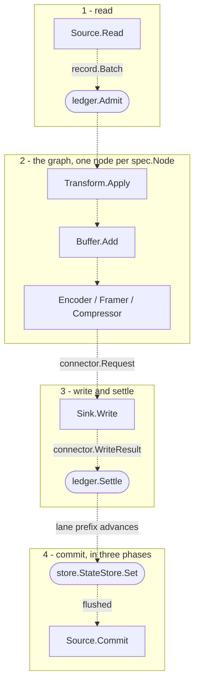
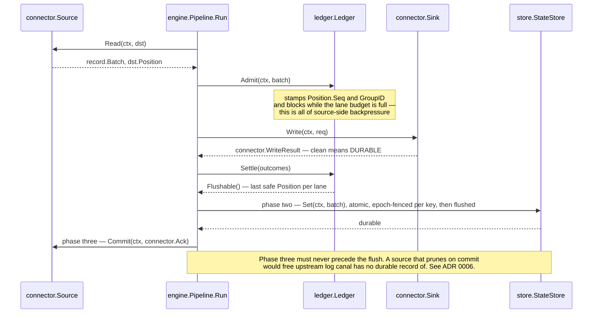
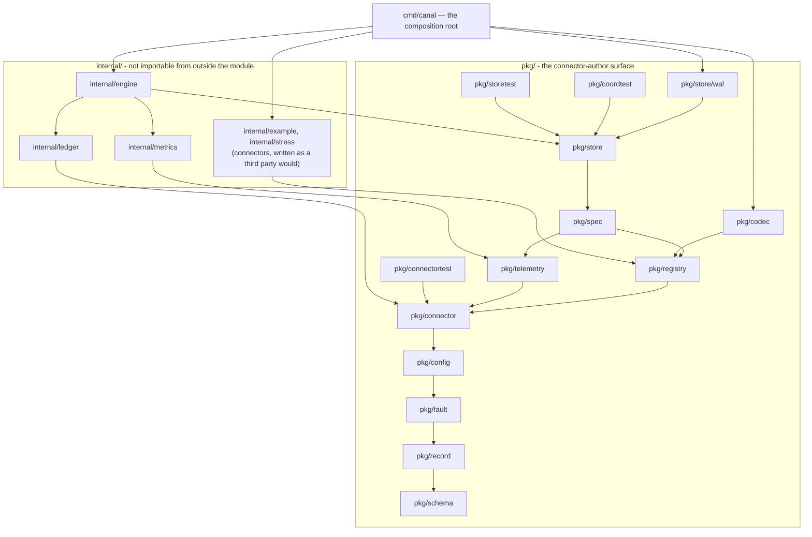

# canal

A source- and sink-agnostic connector and data-movement tool in Go. The core module has zero
third-party dependencies, enforced in CI; coordinated mode is a separate module
([`store/postgres`](store/postgres)) that adds exactly one, the Postgres driver (ADR 0033). Go 1.23.6.

The core is deliberately agnostic: no specific system's shape is allowed to leak into it. Adding a source
or a sink means implementing an interface and registering it — no core changes, no per-connector branches
anywhere in the engine.

## Status — read this before anything else

**One end-to-end path runs, and it survives `kill -9`.** A record moves from a file to a sink, its
position is durable, and killing the process mid-run loses nothing. Everything wider than that path
is still interfaces.

```bash
go run ./cmd/canal check --spec your-pipeline.json
```

| | |
|---|---|
| `pkg/` — the connector-author surface | **real, compiling, documented.** 90 files, 14,982 lines. |
| `internal/engine`, `internal/ledger`, `internal/metrics` | **real for one shape.** 11,153 lines. `Build` resolves, validates and negotiates; `Run` reads, admits, writes, settles, flushes and commits, routes a fault to retry, dead-letter, drop, stop or stall, and measures all of it. The read path drives many lanes per source and follows the assignment as it changes; the multi-worker safety line — leases with epochs, fenced writes and deletes, a revocation fence in the ledger — is built and test-exercised. No transforms, no buffers, and the shipped binary still runs one worker, because no durable `store.Coordinator` exists. |
| `cmd/canal` | **real.** `run`, `check` and `version`, 822 lines of wiring and no policy. |
| Durable state store | **real.** [`pkg/store/wal`](pkg/store/wal) is a hand-rolled write-ahead log: CRC32C framing, fsync before return, a torn tail truncated rather than refused, and a flock the kernel drops when the holder dies. It enforces per-key epoch fencing itself — a write below the highest epoch seen for its key is refused — and deletes are fenced the same way, durably: since format version 2 (ADR 0032) a delete's raised floor survives restart and compaction, and an old log migrates itself at open. [`pkg/storetest`](pkg/storetest) is the contract's own conformance suite; running it found a live corruption bug in this very log. |
| Codecs | **three.** `raw` and `json` encoders, a `newline` framer. json+newline is ndjson; raw+newline is a log tail. |
| Connectors | **two sources, two sinks.** `line_file` and `stdout` were written alongside the core; [`file`](internal/example/filesink) is a real `Flusher`, and [`http_push`](internal/stress/push-source) — one of the deliberately hostile stress connectors — runs end to end unmodified. |
| Durability points | **three of four.** A sink is settled when `Write` returns cleanly, when `Flusher.Flush` makes an accepted batch durable, or when the two-phase commit publishes a committable. Only `TokenSink` is still refused by [`engine.Executable`](internal/engine/build.go) rather than silently under-delivered. |
| Checkpoints | **real.** [`engine.Checkpoint`](internal/engine/checkpoint.go) was a declared shape nothing constructed. It is now written on every flush — committables, lane cursors, writer state and header in ONE atomic batch — and read at open, where committables a previous run left in doubt are handed back to the sink that minted them. |
| `internal/stress` — eight hostile connectors | **real.** 15,674 lines, kept as an interface-shape regression suite; the audit found five of the eight genuinely catch drift today. |
| Fault routing | **real.** A connector states a `Class`, a fact; the engine computes the behaviour from (class, capabilities, policy). Throttling never spends a retry attempt, an indeterminate write against a non-idempotent sink fails loud rather than guessing, and a dead letter is delivered before the record is abandoned. |
| Metrics | **real for twenty-one of twenty-seven names.** [`internal/metrics`](internal/metrics) accumulates and renders Prometheus text; `canal run --metrics :9090` serves it. An unmeasurable quantity is OMITTED rather than reported as zero, which is what makes `canal_checkpoint_age_seconds` usable as the primary alert. The six absent ones measure things that do not exist yet — buffer depth and refusals, dedupe, restore phases, node utilization and blocking. |
| Read model | **real.** [`engine.Pipeline.Status`](internal/engine/status.go) builds `telemetry.PipelineStatus` and `canal run --metrics` serves it at `GET /status?stream=&limit=&cursor=`, plus `?config=1` for the redacted config tree — never the raw one. Lanes page by keyset cursor, a per-stream rollup answers "which of my 900 tables is behind" without downloading 29,000 lanes, and every field the engine cannot measure is a nil pointer rather than a confident zero. |
| Multi-worker | **machinery built, deployment beginning.** Lanes are claimed under leases, a lost lane is dropped from the read set and fenced in the ledger, and every durable write carries its lane's lease epoch down to the store. All of it runs in tests against [`memstore`](internal/example/memstore)'s in-memory `Coordinator`. The cluster-durable `StateStore` now exists — [`store/postgres`](store/postgres), a nested module (ADR 0033) holding the one accepted dependency, held to `pkg/storetest` against a real database — but its `Coordinator` half does not, so the binary still ships standalone. `StatusStore.Aggregate` — the cross-worker merge — refuses with a named fault rather than answering plausibly. |
| Buffers, transforms, a frontend | **do not exist.** The interfaces do, and the negotiation refuses a pipeline that asks for one. |

`go build ./...`, `go vet ./...`, `gofmt -l .` and `go test -race ./...` are clean: 380 test
functions across 28 packages, 116 of them under `pkg/`. **Every published package has tests** —
`pkg/storetest` and `pkg/coordtest` are themselves test suites, run by the implementations they
hold to account.
Writing them found two defects nothing else would have: a retry helper that panics on amd64, and a
key encoding under which two pipelines in one tenant could overwrite each other's state. [CI](.github/workflows/ci.yml) runs all of that on Linux
and macOS, cross-compiles for five targets, verifies the core module still has zero third-party
dependencies, and runs the Postgres store's suite against a real database in a service container.

Design rule [R3](docs/design-rules.md) — one end-to-end path before any breadth — is **closed**.
[`cmd/canal/main_test.go`](cmd/canal/main_test.go) starts the real binary against a 300,000-line
input, `SIGKILL`s it three times mid-run, and asserts that no record is ever skipped: not at a
restart seam, not anywhere in the output. Duplicates are permitted and counted, because the
negotiated tier is at-least-once and pretending otherwise would be the lie the whole design exists
to avoid. Both of that test's assertions were confirmed against deliberately injected defects; the
one class of defect it provably does **not** catch is named in its doc comment.

**The claim the architecture rests on is now tested.** The opening paragraph of this file — adding a
source or a sink means implementing an interface and registering it, with no core changes — had
never been checked: there was one real source and one real sink, written alongside the core by the
same hand. [`internal/engine/thirdparty_test.go`](internal/engine/thirdparty_test.go) runs
`internal/stress/push-source` — an HTTP ingress written to be deliberately hostile — through the
real engine into a real file, with forty concurrent POSTs each answered `204` only after their
record was fsynced. It exercises a discrete-ordered lane, an unbounded lane, a blocking `Read` and
connector-owned metrics, none of which had ever run. The core needed no change; the connector needed
one word, because it asked for a metric label outside the closed vocabulary and the registry refused
it by name.

That exercise also surfaced the worst defect found so far, described on
[`engine.Executable`](internal/engine/build.go): negotiation is a pure function of COMPONENT
capabilities and never asked whether the engine could drive the answer, so a capable source plus a
`Committer` sink negotiated **exactly-once** against an engine that has never called `Committer`.
Such a pipeline would have settled on `Write`, advanced the cursor, and left the sink holding staged
data nothing would commit. `Run` now refuses before opening anything and `canal check` exits
non-zero.

The project's own compliance audit
([`docs/decisions/_rule-compliance.md`](docs/decisions/_rule-compliance.md)) ran 19 adversarial
checks against the delivered code and returned **4 violated, 9 partially violated, 6
satisfied-with-caveats, 0 clean**. It is a dated snapshot taken before the engine ran — R3 and the
state-store findings are addressed above — and it is linked here rather than buried because a reader
who finds a gap themselves has no reason to trust anything else in the repository.

## Goals — the end state

- **Many sources, many sinks.** Adding either means implementing an interface and registering it.
- **Several kinds of pipeline.** Streaming change capture, batch and full-scan, and the hybrid
  snapshot-then-stream case where an initial scan hands off to an incremental stream without gaps or
  duplicates.
- **Serialization** as a pluggable concern, separate from connector logic.
- **Checkpointing** that survives `kill -9` and restarts exactly where it should.
- **Initial / state scan** for sources that support it, resumable mid-scan.
- **A frontend** for live metrics and configuration, driven by what connectors declare about themselves
  rather than by connector-specific UI code.
- **Two deployment shapes from one binary:** a standalone dev mode with no external dependencies, and a
  horizontally scaled enterprise mode.

One of these — checkpointing — is achieved and proven by the `kill -9` test. The rest are what the
interface set is shaped to allow.

## How the pieces fit



Rectangles are interfaces a connector author implements
([`pkg/connector/source.go`](pkg/connector/source.go), [`sink.go`](pkg/connector/sink.go),
[`transform.go`](pkg/connector/transform.go), [`buffer.go`](pkg/connector/buffer.go),
[`codec.go`](pkg/connector/codec.go)); rounded boxes are core machinery
([`internal/ledger/ledger.go`](internal/ledger/ledger.go),
[`pkg/store/state_store.go`](pkg/store/state_store.go)). Stages 1, 3 and 4 run today, in
[`internal/engine/run.go`](internal/engine/run.go). Stage 2 is **half real**: encoders, framers and
compressors are resolved from the node's codec block
([`internal/engine/codec.go`](internal/engine/codec.go)) and three are registered, but no transform
or buffer is registered anywhere in the tree, so those two are interfaces with no instances and the
negotiation refuses a pipeline that asks for one.

### The commit protocol

The one thing worth understanding before reading any code. All three phases run, and the epoch
fencing is real down to the store: every durable write carries the writing lane's lease epoch,
`pkg/store/wal` refuses a stale one per key, and the revocation tests exercise all of it. The
shipped standalone binary still has only one worker to fence.



`Admit`, `Settle` and `Flushable` are in
[`internal/ledger/ledger.go`](internal/ledger/ledger.go); the driver that calls them in this order is
[`internal/engine/run.go`](internal/engine/run.go), and the `StateStore` underneath is
[`pkg/store/wal`](pkg/store/wal), which fsyncs before `Set` returns. The ordering rule is
[ADR 0006](docs/decisions/0006-three-phase-commit.md) and the narrative version is the package comment in
[`internal/engine/doc.go`](internal/engine/doc.go). A sink is never shown progress at all — it signals
durability by returning a clean `WriteResult`, which is why a new sink cannot get progress wrong.

## Repository layout



An arrow means *imports*. This is the transitive reduction of the real graph — edges implied by
transitivity are omitted, so `pkg/spec` also imports `connector`, `fault`, `record` and `schema` through
`registry`. Reproduce it with `go list -deps -f '{{.ImportPath}} {{.Imports}}' ./...`. Two facts the
diagram makes visible: **`pkg/spec` imports `pkg/registry`, not the other way round** (`Node.Kind` is a
`registry.Kind`, [`pkg/spec/node.go:17`](pkg/spec/node.go)), and **`internal/engine` is the only package
that imports everything, and nothing but `cmd/canal` — the composition root — and test files imports
it** — which is what makes the extensibility claim checkable, because a connector cannot reach an
engine type even if it wanted to.

> **Note.** §3 of [`docs/architecture.md`](docs/architecture.md) used to carry a dependency table that was
> wrong in 5 of its rows, named packages that do not exist, and declared a `registry → spec` edge that
> would have been an import cycle — the audit's R12 finding, and the reason
> [`_rule-compliance.md`](docs/decisions/_rule-compliance.md) still describes §3 that way. That table has
> since been replaced with a graph regenerated from `go list`, and the four claimed-and-absent edges are
> now drawn explicitly as absent. Nothing yet stops it drifting again: the
> `TestDependencyDirection` that §3 once claimed to have now exists, in
> [`internal/arch`](internal/arch/deps_test.go), and fails in both directions.

The tree as it actually is:

```
pkg/                    the connector-author surface — the public contract
  schema/               canonical type set, Schema, Ref, drift kinds
  record/               Record, Batch, Allocator, Payload, Meta, Position, Origin, Blob
  fault/                Class, Op, Fault, RecordFault, RetryPolicy, Backoff
  config/               Spec, Field, Predicate, Config, Diagnostics, composite fields
  connector/            Source, Sink, Transform, Buffer, codecs, all *Caps, LaneSpec,
                        LaneCtl, StateHandle, the *Runtime interfaces
  registry/             Registry, Default, the *Def structs, Descriptor, Add*, Resolve*
  codec/                raw and json encoders, the newline framer — held to the same
                        import boundary as a third-party codec
  telemetry/            metric names, closed label vocabulary, Negotiated, the read model
  spec/                 pipeline Spec, Node, Edge, StreamConfig — topology as data
  store/                StateStore, ConfigStore, StatusStore, Coordinator — deployment seam
    wal/                the durable StateStore: CRC32C framing, fsync, per-key epoch fencing
  connectortest/        embeddable inert runtimes, so a core that grows a method does not
                        break every connector's test suite
  storetest/            the StateStore conformance suite; every implementation runs it
  coordtest/            the Coordinator conformance suite — the placement protocol's rules,
                        promoted from the in-memory coordinator's own tests

internal/               engine machinery and connectors; unreachable from outside the module
  engine/               Build, negotiation, the graph, codec resolution, checkpoint plumbing,
                        leases and fencing, and Run: read (one lane or many), admit, write,
                        settle, flush, commit
  ledger/               Tracker[P], Ledger, Disposition, LaneStats, the revocation fence,
                        the leak reaper
  metrics/              the connector.Metrics implementation; enforces telemetry's closed sets
  arch/                 architecture tests: dependency direction, inert fields, unreachable
                        functions, undeclared skips, doc links — the drift guards
  example/              linefile, filesink and stdoutsink; memstore implements all four store
                        interfaces in memory, including the Coordinator the engine's
                        multi-worker tests lease from
  stress/               eight deliberately hostile connectors, kept as a regression suite

docs/
  design-rules.md       R1–R13, normative, each derived from an observed defect
  architecture.md       9,771 lines, 30 sections, 57 diagrams, declared normative
  decisions/            0001–0031, the ADRs
  decisions/proposals/  four whole-architecture proposals that were judged against each other
  decisions/reviews/    twelve reviews of those proposals — correctness, extensibility, Go ergonomics
  decisions/_rule-compliance.md    19-check adversarial audit of the code against R1–R13
  decisions/_completeness-audit.md goal-coverage gaps
  research/             ten prior-art dossiers plus the decision space they produced
```

## Adding a connector

This is the project's primary success criterion: if a useful source is not short, the architecture has
failed. Below is a complete source — imports, registration, capabilities, config spec and all four
methods. 62 lines, 55 of them non-blank; the four methods are 25 of those, and the rest is imports plus
one declarative registration block. It was built and its registration exercised from a module outside this
repository, exactly as a third-party connector would be, before being pasted here.

```go
package hello

import (
	"context"

	"github.com/BernardoCSACarreira/canal/pkg/config"
	"github.com/BernardoCSACarreira/canal/pkg/connector"
	"github.com/BernardoCSACarreira/canal/pkg/fault"
	"github.com/BernardoCSACarreira/canal/pkg/record"
	"github.com/BernardoCSACarreira/canal/pkg/registry"
)

func init() {
	registry.AddSource(registry.Default, registry.SourceDef[*src]{
		Meta: registry.Meta{
			Name: "hello", Version: "1.0.0",
			Title: "Hello", Summary: "Emits one record and ends.",
			Support: registry.SupportCommunity,
		},
		Spec: config.NewSpec(),
		Caps: connector.SourceCaps{
			Caps:              connector.Caps{APIVersion: connector.APIVersion},
			DefaultOrdering:   connector.OrderingPrefix,
			Boundedness:       []connector.Boundedness{connector.Bounded},
			LaneKinds:         []connector.LaneKind{connector.LaneKindScan},
			MaxLanes:          1,
			UpstreamRetention: connector.RetentionUnbounded,
			UnitAssignment:    connector.UnitsStatic,
		},
		New: func(context.Context, *config.Config) (*src, error) { return &src{}, nil },
	})
}

type src struct{ done bool }

func (s *src) Open(ctx context.Context, rt connector.SourceRuntime) error {
	as, err := rt.Lanes().Assigned(ctx)
	if err != nil || len(as) > 0 {
		return err
	}
	_, err = rt.Lanes().Announce(ctx, connector.LaneSpec{
		Name: "greeting", Stream: "hello", Kind: connector.LaneKindScan,
		Ordering: connector.OrderingPrefix, Boundedness: connector.Bounded,
	})
	return err
}

func (s *src) Read(_ context.Context, dst *record.Batch) error {
	if s.done {
		return fault.ErrEndOfInput
	}
	dst.Reset() // dst.Lane is already set — a source must never retarget it
	if r := dst.Add(); r != nil {
		r.Payload = record.BytesPayload([]byte("hello"))
	}
	s.done, dst.EndOfLane = true, true
	dst.Position = record.Position{Safe: true}
	return nil
}

func (s *src) Commit(context.Context, connector.Ack) error { return nil }
func (s *src) Close(context.Context) error                 { return nil }
```

Four things this is meant to show.

- **`Source` has four methods and `Sink` has three, and both are frozen.** New core capability arrives
  through the `*Runtime` interfaces — which the core implements, so growing them breaks nothing — or as a
  new optional interface plus a `*Caps` field. See [`pkg/connector/caps.go`](pkg/connector/caps.go).
- **`New` does no I/O.** Config arrives parsed, defaulted and validated, so there is no `Configure`
  callback and no map to re-parse.
- **Registration is checked at `init`.** Six classes of mistake — a capability declared without the Go
  interface that backs it, an empty `LaneKinds` or `Boundedness`, `StableKeys` without `Notes`, an
  unlintable config spec, a duplicate name, an out-of-range API version — panic on the author's first
  `go test`, in the author's own package, naming the field or the interface that fixes them
  ([`pkg/registry/add.go`](pkg/registry/add.go)). The reverse — an interface implemented but not
  declared — is a warning on the `Descriptor`, not a panic.
- **A connector imports four to six packages and no `internal/` package**, all under `pkg/`:
  `connector`, `registry`, `config` and `fault` always; `record` unless it never touches a record body;
  `schema` only when it declares one. Measured with `go list` across the ten connectors in the tree:
  `stdoutsink` imports four, `linefile` and four of the stress connectors import five, and the four
  schema-declaring stress connectors import six.

The compliance audit measured the same property independently: a 34-line source and a 30-line sink,
written and registered into `registry.Default` from a module physically outside this repository, with the
working tree clean before and after and no core change of any kind.

The real reference is [`internal/example/linefile/source.go`](internal/example/linefile/source.go) — same
shape, with a durable cursor, cold and warm start, and comments explaining each decision. §22 of
[`docs/architecture.md`](docs/architecture.md) is the long-form author guide. Its whole-program examples
used to be uncompilable (audit finding C3 — wrong import paths, and promoted-field keys Go forbids); §22
has since been rewritten and its minimal source, minimal sink and registering `main` now build, vet clean
and register at `init` from a module outside this repository. The audit file predates that rewrite.

## Build and test

```sh
go build ./...
go vet ./...
go test -race ./...
gofmt -l .          # prints nothing
```

The binary is `./cmd/canal`: `check --spec pipeline.json` builds a pipeline and reports what it
negotiated, `run --spec pipeline.json --state statedir` moves records (add `--metrics :9090` for
`/metrics` and `/status`), and `version` prints the build it came from. The exit codes are part of
the interface — a refused spec (3) is distinguishable from a run that failed and might succeed on
retry (1), so a supervisor never crash-loops on a spec that will never build.

## Reading order

1. **[docs/design-rules.md](docs/design-rules.md)** — R1–R13. Short, normative, and every rule was paid
   for by an observed defect in an earlier abandoned attempt at this same project. Everything else assumes
   it.
2. **[docs/architecture.md](docs/architecture.md)** — 9,771 lines, 30 sections, declared normative. §1 is
   the spine in one page; §4 the record model; §6 lanes; §7–§8 `Source` and `Sink`; §12 the ledger and the
   commit protocol. Its diagram index is at the top; dotted edges and "NOT BUILT" boxes mark the parts
   that describe an engine which does not run yet.
3. **[docs/decisions/](docs/decisions/)** — 31 ADRs. The load-bearing ones:
   [0005 canonical record model](docs/decisions/0005-canonical-record-model.md),
   [0006 three-phase commit](docs/decisions/0006-three-phase-commit.md),
   [0007 lane is the unit](docs/decisions/0007-lane-is-the-unit.md),
   [0009 topology is a graph](docs/decisions/0009-topology-is-a-graph.md),
   [0013 capability mechanism](docs/decisions/0013-capability-mechanism.md),
   [0015 out-of-process seam](docs/decisions/0015-out-of-process-seam.md),
   [0021 store seam](docs/decisions/0021-store-seam.md),
   [0024 guarantee tiers](docs/decisions/0024-guarantee-tiers.md).
4. **[docs/decisions/_rule-compliance.md](docs/decisions/_rule-compliance.md)** — what the delivered code
   actually does, checked adversarially against R1–R13. Read this before believing any prose in the repo.
5. **[docs/decisions/_completeness-audit.md](docs/decisions/_completeness-audit.md)** — which goals are
   uncovered, and which decisions cost a breaking change if deferred.

Both audits are drafts and neither is normative — under R12, anything adopted from them has to move into
`architecture.md` or a numbered ADR to become binding.

Background, if you want it: [docs/research/](docs/research/) holds ten prior-art dossiers (Kafka Connect,
Debezium, Airbyte/Singer, Benthos, Vector, Conduit, Flink checkpointing, and three on Go idiom, SDK design
and observability) and the decision space distilled from them;
[docs/decisions/proposals/](docs/decisions/proposals/) holds the four competing whole-architecture
proposals and [docs/decisions/reviews/](docs/decisions/reviews/) the twelve reviews that judged them.

## What's next

All ten defects the compliance audit found in *delivered* code are fixed, each pinned by a test that
was first verified to fail against the original bug:

| Was | Now |
|---|---|
| One signed waiver downgraded every capability and guarantee error on every node, including the data-loss guard | A waiver matches on exact node scope and must name the capability it waives; no wildcard |
| `Ledger.send` raced `Close` — send on a closed channel, in the shutdown window the engine reserves for late acks | Senders register under the mutex that guards the flag, and `Close` waits for them |
| Re-admitting a live group id orphaned a tracker ticket and wedged the lane forever, with no detector | Refused as a contract fault, and the ticket it took is released |
| `StoreCaps.Supports` never read `Durability`, so an in-memory store passed `exactly_once` | Tiers above at-least-once require a durability domain that outlives the process |
| Two unbounded backpressure paths: idle positions grew a node each (419.6 MiB at 5M), discrete lanes had no budget at all (200,000 admitted against 8) | Idle positions coalesce — 1M now costs 2 nodes; discrete lanes get a tracker and block at their budget |
| Enums marshalled as ordinals, and as **base64** inside a slice: both shipped descriptors emitted `"lane_kinds":"AQ=="` | All 31 closed enums marshal as their stable token via `MarshalText`, and round-trip |
| A `Descriptor` could not be decoded from its own encoding | `Support` and `CapSource` gained the missing `UnmarshalText` |
| Eleven collection fields marshalled to `null` | `omitempty`, plus a reflection test that finds the next one |
| `Build`'s node switch silently dropped five of nine kinds | A `default` arm refuses them and says why |
| `stdoutsink` returned `Indeterminate` for a pipe, `/dev/null` or a tty | The unsupported-fsync errnos are tolerated, measured per platform |
| §3 claimed a `TestDependencyDirection` that had never been written | `internal/arch` parses the real import graph and fails in both directions |

Test packages went from 9 to 16, and `pkg/` has its first tests. `go build`, `go vet`, `gofmt` and
`go test -race ./...` are clean.

**That list is done, and so is the engine that followed it.** The durable `StateStore`
([`pkg/store/wal`](pkg/store/wal)), the codecs ([`pkg/codec`](pkg/codec)), the node loops and commit
pump ([`internal/engine/run.go`](internal/engine/run.go)), the binary
([`cmd/canal`](cmd/canal)) and the `kill -9` test ([`cmd/canal/main_test.go`](cmd/canal/main_test.go))
all exist. R3's milestone is met: the guards in this repository are facts about a running process
rather than designs.

**The read model is built too.** `telemetry.PipelineStatus` was a declared shape nothing constructed;
[`engine.Pipeline.Status`](internal/engine/status.go) now produces it and `canal run --metrics` serves
it at `GET /status` next to `/metrics`. The conditions are metrics as well as document fields, so
`canal_condition{condition="spec_applied",status="false"} == 1` is an alert expression rather than an
absence somebody has to remember to check for — which is the answer to "did my config change take
effect". Every field the engine cannot measure is a nil pointer and is named as a gap in §16 rather
than filled with a confident zero.

**And the source control goroutine exists now.** `build.go` has specified a source node as running
exactly two goroutines — the read goroutine, and a control goroutine for `Commit`, `Heartbeat`,
`Backlog`, `Nack` and the assignment refresh — since it was written, and only the read goroutine was
built. Fifteen implementations across the stress corpus were never called, and the negotiation *refused
builds* over a heartbeat capability the runtime then ignored, so a source that declared `Heartbeater`
passed the gate and pinned its upstream's retention anyway.
[`internal/engine/control.go`](internal/engine/control.go) is that goroutine; `Backlog`, `Idle` and
`EventTimeLag` in the read model come from it.

**`record.MarkFailed` is implemented, and the guard was widened to the class it belonged to.** A
source could mark one of its own records broken and the record was delivered anyway — the worst
available outcome, and the default one. The widened check looks for unexported fields a package
writes and never reads; it found three more, including a count of records acknowledged to the source
that the ledger computed and discarded while the read model reported the sink's settled count under
the name `recordsCommitted`. Those two numbers differ by exactly the window the three-phase commit
exists to manage.

**Nothing on `spec.Spec` is inert any more, and there is a test that keeps it that way.**
[`internal/arch/inert_test.go`](internal/arch/inert_test.go) walks `Deps` and `spec.Spec` for fields
nothing reads, and the stage-standard config fields the registry puts on every node's form. A field
that is legitimately unread has to say so in an allowlist with a reason, which turns a silence into a
declaration somebody wrote down. It found three things on its first run, one of them in code written
the day before: a source's own `heartbeat_interval` was offered on its form and the control goroutine
used the deployment-wide interval instead. `spec.Clock` was the last unread policy and is
implemented — one-sided by definition, clamp/reject/pass, all three counted.

**`when_full` does something now.** It was offered pipeline-wide *and* on every node's config form,
and read in neither place: whatever an operator picked, admission blocked. `block` still blocks and
is still the only policy that never loses data; `drop_newest` and `reject` shed, and a shed is a
*configured* loss — counted, logged at ERROR, and reported to the source so a destructive-commit
source can refuse to advance. `overflow` is refused at build, because there is no buffer to overflow
into. Fixing it turned up two more: `connector.Runtime.Config` returned nil to every connector that
ever asked, and the ledger's own per-lane abandoned counter was written in two places and read in
none.

**The multi-worker safety line is built** — the thing the single-worker label in
[`internal/engine/runtime.go`](internal/engine/runtime.go) used to hold open. The read path reads
every assigned lane and follows the assignment as it changes, one goroutine per concurrency slot
([`internal/engine/read.go`](internal/engine/read.go)); lanes are claimed and renewed under leases
whose epochs are fencing tokens ([`internal/engine/lease.go`](internal/engine/lease.go)); a lane
this worker lost is dropped from the read set, refused by the engine's own write paths, fenced in
the ledger — `Ledger.Revoke` discards acknowledgements so a deposed worker can never tell an
upstream to prune — and stopped by the store itself, because every durable write carries its lane's
lease epoch and `pkg/store/wal` refuses a stale one per key. Deletes are fenced the same way. The
fences are deliberately redundant, and every fix in that line was confirmed by putting the defect
back and watching the test fail. All of
it runs against [`memstore`](internal/example/memstore)'s in-memory `Coordinator`, which is
scaffolding — honest about being a map — so the shipped binary still runs exactly one worker.

That stretch also named this module's dominant defect class: machinery built correctly, tested in
isolation, and wired to nothing. Nine of ten consecutive branches found one — `Ledger.Revoke` was a
complete fence with no callers, `Batch.PutFenced` sat unused while the engine sent one constant
epoch, `config.Redacted` and the status field documented as holding its output each pointed at the
other and neither was connected. The [`internal/arch`](internal/arch) guards catch the one-sided
versions; the matched pair had to be found by treating every doc that names a consumer as a claim
about call sites.

**Next** is the durable half of coordination: a `store.Coordinator` implementation that outlives a
process, `StatusStore.Aggregate`'s cross-worker merge semantics — which is a design decision before
it is code — and then transforms and buffers.

Everything past that has one ordered answer now: [`docs/ROADMAP.md`](docs/ROADMAP.md) reconciles
the goals above, §30's implementation order, the completeness audit's deferred decisions and the
known defects into two standing tracks and six milestones. The audits stay authoritative where they
are ([`_completeness-audit.md`](docs/decisions/_completeness-audit.md),
[`_rule-compliance.md`](docs/decisions/_rule-compliance.md)) — the roadmap cites them rather than
replacing them.
