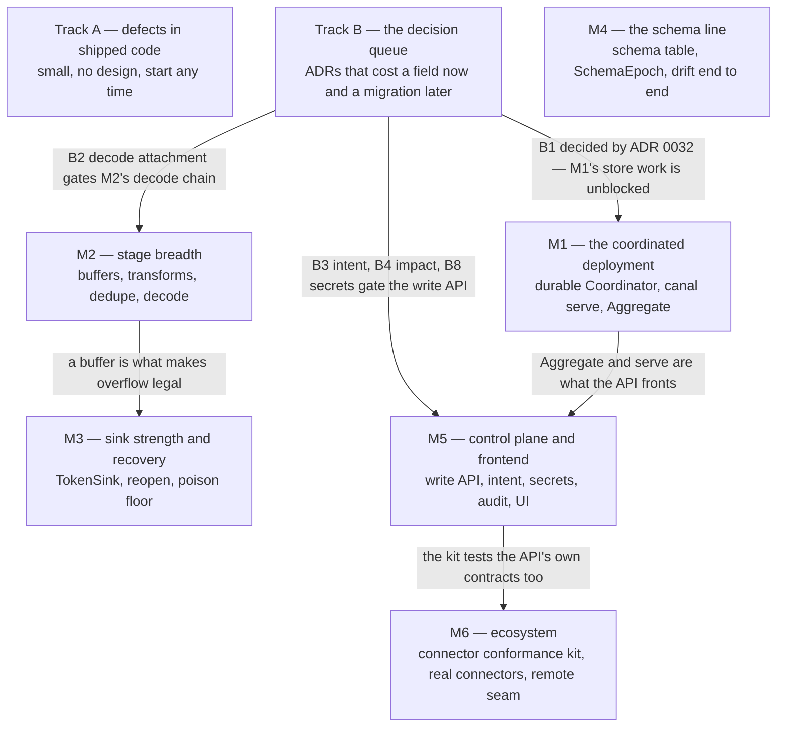

# canal — roadmap

**Status: A PLAN, NOT A CONTRACT.** Under design rule R12 nothing here is binding: an item becomes
normative only when it lands in [architecture.md](architecture.md) or a numbered ADR, and a decision
listed here is a door being held open, not a decision taken. This file exists so that "what is left"
has one answer instead of five — the goals in the [README](../README.md), §30 of the architecture,
the seventeen gaps in [the completeness audit](decisions/_completeness-audit.md), the defects this
repository's own guards have found, and the labelled scope markers in the engine were five partially
overlapping lists. This document reconciles them and says what order they happen in.

**The done-rule.** [ADR 0031](decisions/0031-declared-capabilities-need-writers.md) governs every
item below: a capability counts as delivered when a reachable writer feeds it and an end-to-end test
observes the behaviour, not when the type compiles. Nine of ten consecutive branches on this module
found machinery built correctly, tested in isolation, and wired to nothing — so each item here names
the machinery that **already exists** for it, because twice the right design was already present and
inert, and building it again would have been the defect.

**Where this stands.** One end-to-end path runs and survives `kill -9`. The engine-side multi-worker
machinery — leases, per-key epoch fencing, a revocation fence, multi-lane reading — is built and
test-exercised against in-memory scaffolding. What does not exist: a durable coordinator, transforms,
buffers, dedupe, a schema table, a write API, a frontend, and the out-of-process seam. The
[README status table](../README.md) is the authoritative current-state inventory.

Tracks A and B run alongside everything. The milestones are ordered by dependency, not by date, and
the order within a milestone is negotiable; the order between them mostly is not, for the reasons
given at each gate.

---

## Track A — known defects in shipped code

A standing track, not a one-time list: anything the guards, a review or ordinary work turns up
lands here and outranks features, because a wrong number or a wrong comment closes questions
falsely. No design needed; each is one function plus the injected-defect discipline (fix confirmed
by putting the defect back).

**The opening three are done** (PRs #52–#54, merged 2026-08-09), and the track stands empty:

| # | Was | Resolution |
|---|---|---|
| A1 | `Ledger.Committed` incremented `recordsCommitted` above the guards that suppress the acknowledgement itself, so the read model could advertise records the source was never told about — and count a discrete lane's records twice against `emitDiscrete`'s own increment | The counter moves only in the emit arm of both loops, by exactly `Ack.Records`, which also ended a divergence with `canal_records_committed_total` (always ack-coupled). The reachable violation was the discrete double count, via handle-less settlements; the fenced and finish-acked increments added zero in every sequence reachable through the public API and were shape fixes, pinned by tests anyway |
| A2 | A lane's `FinishedAt` was stamped the moment a source asked, before its admitted groups settled, and a `StartAfter` gate reads exactly that row — so a successor could open over records no sink had accepted | The durable half now waits for settlement: `Ledger.RequestRetire` / `Retirable` hand the row write to the flush loop once the last group drains, the pre-admission acknowledgement mark deliberately cannot trigger it, and until then the lane leaves the read set in memory only. `LaneCtl.Finish`'s contract — "a request, not an assertion" — had promised exactly this all along; the implementation caught up |
| A3 | Twelve comments across `pkg/` and the engine claimed, in the present tense, that a connector conformance kit enforces things; none exists | Each now names what actually owns the check today — mostly `pkg/registry`'s registration lint, at the author's own first `go test`, which is stronger than the CI the comments promised — or says plainly that nothing does, pointing at [ADR 0023](decisions/0023-conformance-and-chaos.md) for the half that waits on M6 |

## Track B — the decision queue

Each is small **now** — a field, a rule, a sentence — and a migration **later**, because it touches
durable or operator-visible contracts. Each needs an ADR (or an amendment to one) before its code;
most come straight from the completeness audit, which argues each case in full. Ordered by what they
block.

| # | Decision | The door it holds open | Source | Blocks |
|---|---|---|---|---|
| B1 | **Decided** — [ADR 0032](decisions/0032-wal-format-versioning.md): the WAL container is versioned, a build reads one step back and migrates by rewrite at Open; format version 2 — a delete record carrying its epoch — is the first exercise | the door is held: a format bump no longer strands every existing log | [wal.go](../pkg/store/wal/wal.go), [runtime.go](../internal/engine/runtime.go) | unblocked: M1's store work, and the delete-floor fix is now ordinary work (the V2 change, held to rule 5's upgrade test and fuzz targets) |
| B2 | **The decode attachment point**: `config.DecodeRef` + `Fields.Decode` + `SourceCaps.Structured`, and the rule that a byte source must not parse its own bytes | centralised decode before the first byte-source connector ships private `parse:` keys | audit G1 | M2's decode chain, M6's connectors |
| B3 | **Where operator intent lives**: `spec.Intent{DesiredState, Downgrades, Resets}`, and the rule that an intent change bumps `Revision` but not `Generation`. Moves `Downgrade` out of `telemetry` — the refusal table's only escape hatch currently reads a field that cannot exist | pause/resume/drain as durable state the reconciler converges toward, instead of a command protocol | audit G2 | M5 entirely; `PhasePaused` is unreachable until this |
| B4 | **`Node.ID` is immutable** + an `Impact` enum (`none/reload/restart/state_reset`) on the validate response and `config.Field` | a node rename today silently orphans every cursor — the loss precedes the discovery, which makes this the only *unrecoverable* item in the queue | audit G3 | M5's write API; worth deciding first for that reason |
| B5 | **The read model is declared additive-only** (ADR 0020's discipline applied to `PipelineStatus`), plus the per-group rollup the shape still lacks | changing a pinned wire contract with golden fixtures | audit G5's remainder | M1's Aggregate |
| B6 | **The dead-letter envelope**: versioned, field set stated, with the round-trip rule — a source reading it back reconstructs the record | it is written into customer warehouses; changing it later breaks schemas canal does not own | audit G8 | M6's kit asserts the round-trip |
| B7 | **The connector conformance kit may import `internal/engine` and a real store**, and its `Harness` (`Kill`/`Restart`/`Advance`) and `FaultInjector` names are fixed before the kit exists | the kit's `Driver` shape becomes a published contract the moment it ships | audit G6 | M6 |
| B8 | **Secrets**: a `Secret` type with redacting marshalers, the stored-spec-holds-a-reference rule, `isSet` in the API, the resolver interface. Two runtime methods (`SourceRuntime.Config`, `SinkRuntime.Config`) are already documented as re-resolving secret references, and no reference mechanism exists — the most urgent half | plaintext secrets at rest, and re-pasted secrets on every form edit | audit G7 | M5 |
| B9 | **The metrics SDK decision**: hand-rolled versus OpenTelemetry, and the naming strategy, written into §16.1 as normative | dashboards pin `/metrics` output; swapping the SDK later changes it | audit G10 | free-standing; decide before M5's dashboards |
| B10 | **Where the audit trail lives**: a structured log stream with a declared field set, or a reserved `StateStore` space. ADR 0017 rule 7 promises auditing and nothing provides it | whether §17's four-interfaces claim survives | audit G13 | M5's mutating endpoints |
| B11 | **`Pool string` on `store.LaneRow`** + a pool filter on `Claim`, defaulting `"default"` | placement later without re-planning the assignment protocol | audit G12 | cheap enough to fold into M1's Coordinator DDL |
| B12 | **The grace-period contract**: `GracePeriod` < the platform's termination grace, and what canal does when it is not | every rolling restart becoming a drain-timeout, which by canal's own definition means replays | audit G11 | one sentence; fold into M1 |
| B13 | Scope the i18n claim to enum tokens and diagnostic codes (one sentence in §2) | someone building a catalogue for prose connectors write | audit G14 | nothing |
| B14 | Name the external-schema-registry exclusion in §20's table | the second schema identity space staying a choice rather than an oversight | audit G15 | nothing |
| B15 | Disclose in §16 that `RecentEvents` is a ring, not a history | a UI presenting it as one | audit G16 | nothing |

Closed since the audit wrote its list: per-node scope (its G9) was decided by
[ADR 0029](decisions/0029-per-node-scope-in-spec.md) — what remains of it is implementation, held to
the 0031 done-rule per clause, not a decision.

---

## M1 — the coordinated deployment

**Goal:** two real workers on two processes divide one pipeline's lanes, one dies, nothing is lost
and nothing is told twice beyond the negotiated tier. The protocol half is done; this milestone is
the deployable half.

Already there: leases, epochs and revocation in [lease.go](../internal/engine/lease.go) and
[read.go](../internal/engine/read.go); per-key fencing enforced by
[pkg/store/wal](../pkg/store/wal); the full `Coordinator` protocol implemented in miniature by
[memstore](../internal/example/memstore) — including plan/gate re-evaluation — and driven end to end
by the engine's revocation tests; `pkg/storetest` to hold a new store to the contract;
`StatusStore.Report` working, `Aggregate` refusing with a named fault; a config watch loop
(`configLoop`) already consuming `ConfigStore.Watch`.

| Item | Notes |
|---|---|
| A durable `store.Coordinator` | Postgres per the sketch in architecture §23 (`pg_try_advisory_lock` planner, `SKIP LOCKED` claims); needs the store-schema versioning and migration story the audit's G11 flags, and B11's pool column from day one |
| A durable `ConfigStore` + `StatusStore` | same backing store; the file-projected `ConfigStore` in `cmd/canal` stays as the standalone shape |
| `StatusStore.Aggregate` | the cross-worker merge — per-field semantics (max for ages, sum for counts, `Complete`/`Missing` with `StaleAfterSeconds` as the threshold), gated on B5's additive-only declaration; the O(workers × lanes) cost needs the per-group rollup |
| `canal serve` | the long-running worker: joins membership, campaigns, claims, hosts **N pipelines** (the supervisor/reconciler §23.4 specifies and nothing implements), consumes the config watch it already has |
| The coordinated chaos suite | ADR 0023's second half: kill a worker mid-scan under a real coordinator, assert the revocation end-to-end test's properties across processes rather than goroutines |
| The mixed-version sentence | which binary versions may coexist against one store (audit G11); one paragraph in ADR 0020's orbit |

**Gate to exit:** the existing single-process revocation test passes with the processes real, plus a
benchmark number attached (audit G17: milestone gates get a number, not only a correctness test).

## M2 — stage breadth

**Goal:** the graph between source and sink stops being empty: buffers, transforms, dedupe, decode.

Already there: the interfaces and caps for every stage kind; codec resolution per node; `WhenFull`
routing implemented at admission (`whenFullFor`), with `overflow` refused at build precisely because
this milestone hasn't happened; `store.DedupeKey` and ADR 0002's decided scope;
`Checkpoint.TransformState` keyed per node; five of the six unproduced metrics waiting here.

| Item | Notes |
|---|---|
| `buffers/memory`, then `buffers/wal` | ADR 0001's durability model; makes `WhenFullOverflow` legal and produces `canal_buffer_depth_records` / `canal_buffer_refused_total`; the node-durable-buffer lane-affinity rule (§17) becomes load-bearing here |
| Transforms | `filter` / `route` / `redact` first — the three the config composites already anticipate; N-to-M contract per §7; `TransformState` restore |
| Engine-owned dedupe | ADR 0002; produces `canal_records_deduped_total`; keyed on `Origin.Key`, which is why `StableKeys` exists |
| The decode chain | after B2: `Decoder`/`Deframer`/`Decompressor` attached per source node, mirroring the encode side; makes the §15.3 `Decoder.Accepts` refusal row implementable |
| `canal_node_blocked_seconds_total`, `canal_node_utilization_ratio` | measured at the node loops, which only become interesting when graphs have middles |

## M3 — sink strength and recovery

**Goal:** the fourth durability point, and honest recovery behaviour under repeated failure.

Already there: `TokenSink` refused loudly by `engine.Executable` rather than under-delivered;
`fault.NotConnected` classified and routed; the run-loop comment pinning that nothing reopens;
`canal_restore_phase_seconds` declared.

| Item | Notes |
|---|---|
| `TokenSink` | the destination stores canal's token transactionally with the data; the strongest tier stops being refused |
| Reopen on `NotConnected` | the forced reconnect before the final attempt that `Backoff`'s doc promises and [run.go](../internal/engine/run.go) says plainly does not happen; interacts with secret re-resolution (B8) and G3's rotation-triggers-restart |
| The poison floor | after N restarts at the same position, dead-letter and advance — needs B6's envelope and a persisted attempt count (additive to the checkpoint under ADR 0020) |
| Restore instrumentation | produce `canal_restore_phase_seconds` for the open/restore/handback phases that already exist in [commit.go](../internal/engine/commit.go) |

## M4 — the schema line

**Goal:** `SchemaEpoch` stops being a hard-coded zero.

Already there: the whole `pkg/schema` type set; `SchemaLookup`'s contract; `SpaceSchema` reserved in
the store; `Checkpoint.SchemaEpoch` plumbed and committed atomically (at zero); the refusals in
[runtime.go](../internal/engine/runtime.go) saying exactly what is missing ("no schema table in the
single-worker runtime"); the schema-drift stress connector waiting to be a real test.

| Item | Notes |
|---|---|
| The schema table | fingerprint-keyed, in `StateStore` under `SpaceSchema`, epoch bumped on `Register`, committed with the cursor |
| Drift end to end | `DriftPolicy` enforced through the graph with the stress connector as the adversary; drift events and conditions already have names in `telemetry` |
| B14's exclusion row | external registries stay a codec's private business, stated |

## M5 — the control plane and the frontend

**Goal:** the read path gets its write half; an operator can create, change, pause, drain and fix a
pipeline without SSH.

Already there: the entire read path (§21d) — `Descriptor`, `config.Spec` as the form model, the
read model with paging and rollups, `?config=1`, conditions-as-metrics; the config watch loop;
`config.Diagnostics` as the validation shape; exit codes as a supervisor interface.

Gated on more B-decisions than any other milestone — B3 (intent), B4 (impact/immutability), B8
(secrets), B10 (audit), B5 (read-model discipline) — which is why those five lead the queue.

| Item | Notes |
|---|---|
| The write API | create/update/delete + validate with `Impact`, offsets edit (bumps `Generation`), pause/resume/drain via `Intent` (bumps `Revision` only); CAS conflicts as first-class outcomes; an error envelope beyond `Diagnostics`; OpenAPI artefact |
| The reconciler consumes intent | `PhasePaused` becomes reachable; sustained-backoff auto-pause becomes durable rather than a restart-forgotten flag |
| Secrets round-trip | B8 shipped: references at rest, `isSet` in forms, resolver with `env`/`file`, rotation-triggers-restart via `Impact` |
| The audit trail | B10's answer implemented for every mutating call |
| Status streaming | SSE or `StatusStore.Watch` — the polling contract stated either way |
| UI delivery | how `ui/` reaches a browser (`go:embed` vs served assets); the R11 boundary holds |

## M6 — ecosystem

**Goal:** third parties can build, verify and trust connectors without reading this repository.

Already there: `pkg/connectortest`'s embeddable runtimes; `pkg/storetest` as the in-house precedent
for a contract-owned kit (it found a live WAL corruption bug on arrival — the argument for the
connector kit in one sentence); ten in-repo connectors as the corpus; ADR 0015's fixed remote-seam
shape.

| Item | Notes |
|---|---|
| The connector conformance kit | after B7: crash-resume via the `Harness`, fault injection, the B6 envelope round-trip, capability-declaration checks — ADR 0023 made real for third parties |
| Fuzz targets | position decode, each blob kind, the WAL segment reader, each deframer, config validation — named in §24 so they are owned (there is not one `func Fuzz` in the module today) |
| Real connectors | the goals name the classes: streaming CDC, batch/full-scan, and the snapshot-then-stream hybrid — whose lane-gating machinery (ADR 0008, `StartAfter`) exists and is settlement-gated since Track A's A2, but has never run end to end against a real system |
| Connector migration | `StateAdopter.AdoptsStateOf` gets its caller (rename/rewrite adopts old cursors); generalises to B4's node-id escape hatch |
| `engine/remote` | the out-of-process seam, last, exactly as §30 has always said: by construction it touches no file above it |

---

## Cross-cutting, permanently

- **Benchmarks with teeth** (audit G17): each milestone gate carries a number; a 10× regression
  should fail something.
- **The 0031 done-rule** on every capability this roadmap adds.
- **Docs stay true**: the arch guards (links, mermaid, dependency direction, inert fields,
  unreachable functions) already run in CI; a milestone that changes a status claim updates the
  README and architecture.md in the same PR, because a stale doc here is a defect, not a chore.

## Explicitly not planned

Carried from §20 and the audit's minors, so absence reads as choice: a queryable DLQ archive inside
canal (ADR 0012 — the warehouse is the store), checkpoint history (ADR 0011), an expression language
(ADR 0016), secrets *backends* beyond the resolver seam (B8 defines the seam only), i18n beyond enum
tokens (B13), and read-model event persistence (B15 — disclosed, not built).
