# canal — architecture

**Status: NORMATIVE.** Per design rule R12 there is no draft tier. Everything in this document is
binding on the implementation. Where it disagrees with a proposal in `docs/decisions/proposals/`, this
document wins; those files are historical inputs and are not normative.

**Companion documents.** `docs/design-rules.md` (R1–R13) is normative and this document satisfies it.
`docs/decisions/NNNN-*.md` are the decision records; each closes one fork and records what was
rejected. `docs/research/` is evidence, not authority.

**Audience and use.** The next agent implements from this file. Every `go` block is a transcription
target, not an illustration. Where a signature here differs from anything in a proposal, the
difference is deliberate and the reason is in the defect ledger (§24) or an ADR.

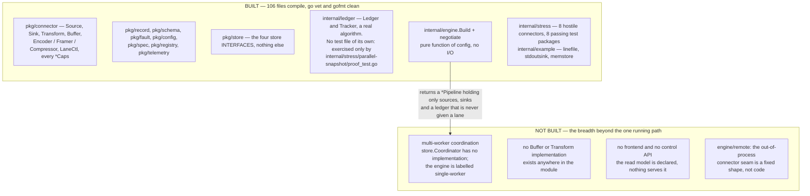

**Read this before anything else in the document.** The interface set is the deliverable of this
stage: everything below the fold describes a runtime that does not exist yet — `Pipeline.Run` is
`return fmt.Errorf(...)` at `internal/engine/build.go:322`, and `Build` in the same file constructs
only source and sink components, validating buffer, transform and codec config without instantiating
anything.

---

## 1. The spine, in one page

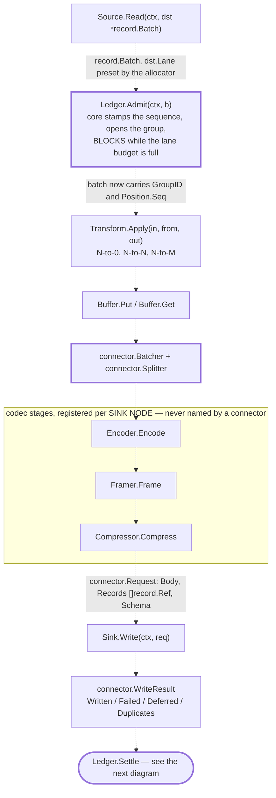

The data path, in stage order taken from `internal/engine/doc.go` (read, admit, transform, buffer,
batch, encode, write). **Every arrow is dotted because no arrow exists**: these are calls
`Pipeline.Run` would make and `Pipeline.Run` is unimplemented. Thick-bordered boxes are the only ones
backed by running code today — `internal/ledger/ledger.go` and `pkg/connector/batcher.go`; the rest
are interfaces in `pkg/connector` (`source.go`, `transform.go`, `buffer.go`, `codec.go`, `sink.go`)
with no caller and, for the three codec stages, no implementation either.

canal moves records from sources to sinks. Exactly one concept carries the weight:

> **The lane is the unit.** A lane is one independently-ordered, independently-resumable,
> independently-assignable progress domain inside a source. It is simultaneously the unit of
> parallelism, the unit of resume, the ordering scope, the assignment and lease subject, the
> in-flight accounting scope, and the progress-reporting scope.

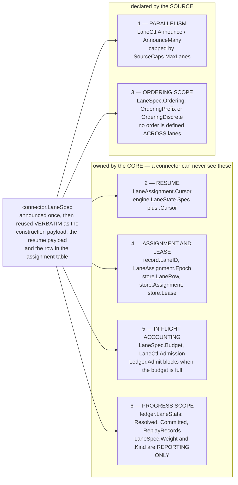

One `connector.LaneSpec` (`pkg/connector/lane.go`) does all six jobs at once, which is why there is
no separate task, partition or shard concept to keep in sync — the structural answer to R1's
dual-representation defect. The source declares only jobs 1 and 3; the other four are core-owned
(`pkg/connector/lanectl.go`, `pkg/store/coordinator.go`, `internal/ledger/ledger.go`,
`internal/engine/checkpoint.go`) and none of that machinery has a runtime driving it yet.

Everything the end-state goals list falls out of that one concept plus five rules.

| Goal | How it falls out |
|---|---|
| Multiple sources / sinks | a source is four methods; a sink is three; both registered at `init` |
| Multiple *types* of pipeline | a pipeline's type is the boundedness of its lanes. All bounded = batch. One unbounded = streaming. Both = hybrid. There is no `pipeline.type` field and nothing switches on a phase |
| Snapshot then stream | the source announces a gated stream lane and N bounded scan lanes. The gate is durable data the core enforces |
| Checkpointing | a lane's durable state is `(Spec, Cursor)` — two opaque connector blobs with different lifetimes — written atomically with the schema epoch and the sink's pending committables under one monotonic id |
| Serialization | encoder / framer / compressor are three separately registered stages attached per **sink node**, never named by a connector |
| Horizontal scale | a lane is a durable row claimed by lease. Distribution *is* restart with a different subset. There is no rebalance protocol |
| Standalone binary | four store interfaces have a single-node implementation. The connector-facing API is byte-identical |
| Frontend | five connector-authored **data** artefacts (`config.Spec`, `*Caps`, `Position.Label`, `LaneSpec.Label`, `config.Diagnostics`) plus one core-owned read model. Zero per-connector UI or core code |

The five rules:

**Rule 1 — the acknowledgement is the mechanism; the ledger is the observer.**
A sink returning `(res, nil)` with no failures means *durable*, and that is the sink's entire progress
vocabulary. The core owns a per-lane contiguous-prefix resolver over connector-authored opaque
positions, so the core — not the connector — knows the resolved prefix, the committed watermark, the
in-flight depth, the replay window and the oldest unsettled group. Benthos and Vector have the ack
graph and cannot answer "where are we"; Kafka Connect has an offset store and cannot report lag. canal
has both because the ack is a *method over bytes* and the resolver is *core-owned*.

**Rule 2 — commit is three-phase, and the third phase is fenced.**

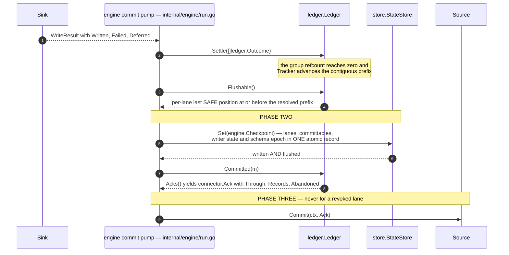

The ordering that makes a pruning upstream safe: `Ledger.Flushable` hands out positions and emits
nothing, and only `Ledger.Committed` — called after the store write is flushed — puts an ack on the
channel `Ledger.Acks` returns (`internal/ledger/ledger.go`, `Flushable` and `Committed`). The four
ledger calls here are implemented code; the participant that sequences them — the engine commit
pump — is the part that does not exist.

`sink durable` → `canal's own position write is durably flushed` → `only then is the source told it may
advance`. Conduit shipped the two-phase version and it was a confirmed sev-0: for a source whose
upstream *prunes* on commit (a Postgres replication slot advancing `confirmed_flush_lsn` frees WAL for
recycling), telling the source to advance before canal's record is durable is an unrecoverable gap. The
property that makes the difference is a property of the *upstream*, so it is a declared capability
(`SourceCaps.UpstreamRetention`) and the core refuses the unsafe combination at submit time. And the
third phase carries the assignment epoch: a worker whose lease lapsed never reaches phase three.

**Rule 3 — topology is a graph of nodes, and it is data.**
`spec.Spec{Graph []Node}`. A node is `{ID, Kind, Name, Label, Config, Inputs []Edge}`. Fan-out is two
sink nodes reading one source node. Fan-in is two source nodes feeding one sink node. A dead-letter
route is an edge with `Select: EdgeFailed`. There is no fixed stage count, no `stages[8]`, no nested
component-valued topology, and adding a node kind is not a contract change. R1 is satisfied
structurally.

**Rule 4 — behaviour is an optional exported interface; the *fact* of that behaviour is declared data.**
A type assertion cannot cross a process boundary; data can. So every capability exists twice: as an
exported optional interface the connector implements, and as a field in a serialisable `Caps` struct the
registry serves without instantiating anything. Registration cross-checks **one direction only**
(declared-without-implemented is a panic; implemented-without-declared is a recorded warning), which is
what lets a v2 core add an optional interface without retroactively breaking a v1 connector.

**Rule 5 — every unknown is typed as unknown.**
No zero stands in for "cannot tell you". Optional numbers in the read model are nil pointers; optional
capability answers are `(value, ok)`; an unmeasurable metric series is *omitted*, never emitted as 0. A
pinned fixture in which every optional field is absent asserts the UI renders no zeros.

### What canal promises and what it does not

The negotiated guarantee is `min(source, sink, buffer, requested)`, computed by a pure function of
config before anything starts, surfaced on the submit screen with per-factor reasons, and refused
outright when the request is impossible. Four tiers, and the tier *is* which interfaces the connector
implements:

| Sink implements | Tier | What the core does |
|---|---|---|
| `Sink` | `AtLeastOnce` | advance the prefix on a clean `WriteResult` |
| `+ WriterState` | `AtLeastOnce`, resumable in-progress work | restore writer state at open |
| `+ Committer` | `ExactlyOnce` (2PC) | subsuming-contract ready/pending sets inside the checkpoint |
| `+ TokenSink` | `ExactlyOnce`, one durability domain | recover canal's token from the destination |

`AtMostOnce` exists as an explicitly-chosen downgrade (settle on hand-over), never as a silent
degradation.

### Diagram index

Fifty-seven diagrams, every one drawn from the `.go` files rather than from the prose around it.
Dotted edges and "NOT BUILT" boxes are load-bearing: they mark the parts of this document that
describe behaviour the module does not have. The single-source-to-single-sink path is no longer among
them — it runs, and `cmd/canal/main_test.go` kills it three times to prove the position survives.

| Section | Diagrams |
|---|---|
| [preamble](#canal--architecture) | what is built, and what is not |
| [§1 The spine, in one page](#1-the-spine-in-one-page) | the data path, stage by stage · the six jobs of one `LaneSpec` · three-phase commit, fenced |
| [§3 Package layout and dependency direction](#3-package-layout-and-dependency-direction) | the real import graph · what a connector may import · real edges vs the four claimed-and-absent ones |
| [§4 The record model](#4-the-record-model-r2--decided-first) | the record envelope, as types · durable vs in-flight identifiers · `Origin`'s two writable layers · where each `Origin` field comes from · the carrier: `Batch`, `Position`, `Allocator` |
| [§5 `fault`](#5-fault--classification-and-the-failure-shape-written-with-the-success-shape-r7) | class to behaviour · `Terminal()` and `Counted()` · the per-record retry state machine |
| [§6 Lanes](#6-lanes--the-spine-as-a-type) | the lane lifecycle |
| [§7 `Source`](#7-source--four-methods-frozen) | four methods, two goroutines · `SourceRuntime` vs `SinkRuntime` · one lane per `Read` vs many per `ReadLanes` |
| [§8 `Sink`](#8-sink--three-methods-frozen-progress-blind) | the sink lifecycle, and `Write`'s three answers · the four quadrants of `Write` · checkpoint and recovery ordering · `WriteResult`'s four dispositions |
| [§10 Capabilities](#10-capabilities--declared-data-plus-optional-interfaces) | declared data vs optional interface · source optional interfaces · sink optional interfaces, and the guarantee ceiling · the runtimes, and where the core grows · registration's two cross-checks · `Resolve`, and negotiation |
| [§11 `spec`](#11-spec--topology-as-data-r1) | fan-in, fan-out, dead-letter edge · graph validation |
| [§12 `ledger`](#12-ledger--the-ack-graph-the-commit-protocol-and-the-answer-to-the-hard-question) | the ack graph · the tracker's contiguous prefix · the commit protocol, end to end · what must hold before `Source.Commit` |
| [§13 The checkpoint: one durable record, opaque payloads, a typed header](#13-the-checkpoint-one-durable-record-opaque-payloads-a-typed-header) | one durable checkpoint record |
| [§15 `config`](#15-config--one-declaration-five-consumers-and-the-frontend-contract) | one `config.Spec`, five consumers · two-tier validation, and `Build` |
| [§16 `telemetry`](#16-telemetry--metric-names-the-closed-label-set-and-the-read-model) | the `PipelineStatus` read model · which core field drives each widget |
| [§17 `store`](#17-store--the-standalone--enterprise-seam) | the four store interfaces · lease, epoch and fencing |
| [§18 Flow control and buffering](#18-flow-control-and-buffering) | bounded by construction · a push source's admission check · buffer refusal and `WhenFull` |
| [§19 The out-of-process seam](#19-the-out-of-process-seam--what-makes-constraint-3-free-later) | one `Source` interface, satisfied twice · what survives the wire, and what does not |
| [§21 Walkthroughs](#21-walkthroughs) | scan-then-stream, crashing mid-scan · why restart neither rescans nor loses |
| [§22 The connector-author guide](#22-the-connector-author-guide) | the two interfaces a minimal sink needs · the import boundary · four questions a source author answers · two questions a sink author answers · the six registration lints · the lifecycle you are writing against · optional source capabilities, and what each unlocks · optional sink capabilities, and what each unlocks |

---

## 2. Vocabulary (R9: one concept, one word, no cross-maps)

If a function maps between two representations of the same concept, that is a modelling error. The
following words each name exactly one thing, and no synonym is permitted anywhere in code, config, API
or UI copy.

| Word | Means | Never called |
|---|---|---|
| **lane** | one ordered, resumable, assignable progress domain | split, partition, task, shard, stream |
| **stream** | a source-declared logical object (table, topic, collection, endpoint) | dataset, entity, resource, table |
| **position** | a point in a lane's read order | offset, cursor, LSN, checkpoint, token |
| **cursor** | a lane's *durable* position, the one that was written | committed offset, watermark |
| **record** | one envelope in flight | event, message, row, document |
| **group** | the set of records admitted together that settle together | batch (a batch is a buffer; a group is an accounting unit) |
| **batch** | a reusable buffer of records | — |
| **node** | one vertex of a pipeline graph | stage, step, operator, processor |
| **fault** | a classified error | exception, failure (as a noun) |
| **class** | the ownership taxonomy of a fault | severity, type, code |
| **caps** | declared capability data | features, flags, options |
| **assignment** | a durable claim of a lane by a worker | task, partition assignment |
| **generation** | the pipeline's monotonic config revision counter as applied | version, revision (`revision` is the *stored* config revision) |
| **epoch** | a worker's lease fencing token | term, incarnation |

One wire enum plus one i18n key namespace per concept. Every closed enum in this document has exactly
one `String()` producing stable `snake_case` tokens; those tokens are the wire form, the metric label
value and the i18n key suffix. There is no second vocabulary and no display map.

---

## 3. Package layout and dependency direction

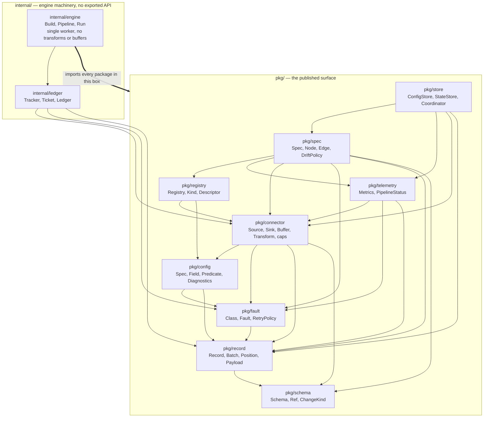

Every arrow is a direct import verified with `go list ./pkg/... ./internal/...`: `pkg/schema` is the
only leaf, nothing under `pkg/` imports anything under `internal/`, and `internal/engine` imports all
nine packages in the box plus `internal/ledger` — its `Pipeline.Run` is still a stub that returns an
error (`internal/engine/build.go:321`), so none of these edges have yet carried a record. `pkg/connectortest`
is the tenth `pkg/` package and is omitted here; it appears in the connector-boundary diagram below.

```
github.com/BernardoCSACarreira/canal
├── pkg/                 the published surface — everything a connector author may import
│   ├── schema/          Schema, Field, Type, Logical, Ref, Change, ChangeKind, Converter, fingerprinting
│   │                    imports: stdlib only. The only leaf package in the module.
│   ├── record/          Record, Batch, Allocator, Payload, Value, Meta, Change, Position, Origin, Blob,
│   │                    and the id types (TenantID, PipelineID, NodeID, StreamName, LaneID, GroupID)
│   │                    imports: schema
│   ├── fault/           Fault, Class, Blame, Op, RetryPolicy, Backoff, Terminal, Indeterminacy, RecordFault
│   │                    imports: record
│   ├── config/          Spec, Field, Variant, Predicate, Config, Diagnostics, and the composite
│   │                    extractors BatchPolicy, CodecRef, BufferRef
│   │                    imports: fault, record
│   ├── connector/       Source, Sink, Buffer, Transform, the codec interfaces (Encoder, Decoder, Framer,
│   │                    Deframer, Compressor), every *Caps, LaneSpec, LaneCtl, StateHandle, the five
│   │                    *Runtime interfaces, and the helpers AutoPersist, Batcher, Splitter
│   │                    imports: config, fault, record, schema
│   ├── registry/        Registry, Kind, Descriptor, the *Def structs, AddSource..AddCompressor, and
│   │                    ResolveSource / ResolveSink / ResolveTransform — the single type-assertion site
│   │                    imports: config, connector
│   ├── telemetry/       metric names, the closed label vocabulary, Metrics, PipelineStatus, NodeStatus,
│   │                    LaneStatus, Negotiated, Downgrade, Condition
│   │                    imports: connector, fault, record
│   ├── spec/            Spec, Node, Edge, DriftPolicy, ClockPolicy, StreamConfig, DedupeConfig — topology
│   │                    as data, the thing a config store holds and the engine builds from
│   │                    imports: connector, fault, record, registry, schema, telemetry
│   ├── store/           ConfigStore, StateStore, Coordinator, StatusStore, Space, Key, LaneRow, Lease —
│   │                    the standalone ↔ coordinated deployment seam.
│   │                    imports: connector, record, spec, telemetry
│   │   └── wal/         the durable StateStore: CRC32C-framed append log, fsync before Set returns,
│   │                    per-key CAS and epoch fencing, torn tail truncated. DurabilityNode.
│   │                    imports: connector, fault, record, store
│   └── connectortest/   Base, and inert embeddable stubs for the three runtimes, LaneCtl and StateHandle,
│                        so adding a runtime method does not break every connector's tests
│                        imports: config, connector, fault, record, schema
└── internal/            not importable from any other module (Go's internal rule)
    ├── ledger/          Tracker[P], Ticket, Ledger, Disposition, Outcome, LaneStats, Leak, the leak reaper
    │                    imports: connector, fault, record
    ├── engine/          Build, Deps, Pipeline, Run, codec resolution, Checkpoint, Header, LaneState.
    │                    Run drives read, admit, write, settle, flush and commit for one worker.
    │                    Checkpoint and Header are declared; nothing constructs one yet.
    │                    imports: internal/ledger, and every pkg/ package except connectortest
    ├── example/         linefile (a source), stdoutsink (a sink), memstore (an in-memory store.StateStore)
    └── stress/          eight deliberately hostile connectors kept as a regression suite:
                         enterprise-scale, fanout-pipeline, multi-stream-source, no-cursor-source,
                         parallel-snapshot, push-source, schema-drift, txn-sink
```

Plus `cmd/canal`: `run` and `check`, and nothing else — the composition root holds wiring, never
policy. There is no `api/`, no `ui/`, and no `buffers/`, `transforms/` or `connectors/` directory: the
HTTP surface and those two stage libraries are unwritten, and `store/` has no bbolt or Postgres
implementation for the coordinated shape. Everything above compiles, `go vet` is clean, and eighteen
test packages pass including a `kill -9` test that runs the real binary.

### The one statement that matters

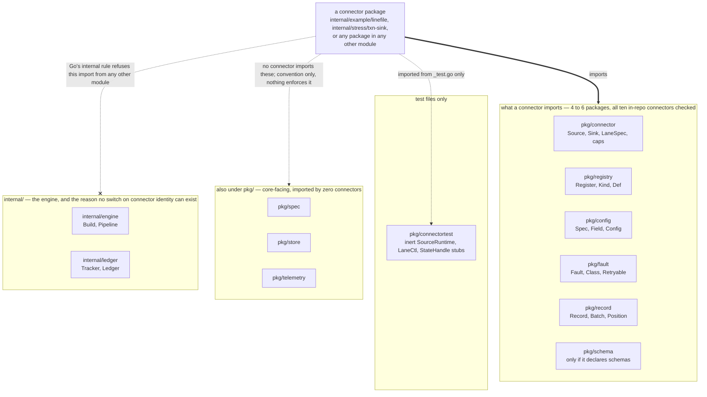

A connector imports four to six canal packages — `internal/example/stdoutsink` four, `internal/example/linefile`
five, the schema-declaring stress connectors six — and none of the ten in-repo connectors imports
`internal/`; symmetrically `go list -deps ./internal/engine` contains no connector package, which is
the structural reason the core cannot switch on connector identity. Only the `internal/` half of that
wall is enforced (by the Go compiler); `pkg/spec`, `pkg/store` and `pkg/telemetry` are public import
paths that a connector could import today, and the test that would forbid it is not written.

**A connector package imports four to six canal packages, all of them under `pkg/`:
`connector`, `registry`, `config` and `fault` always; `record` unless it never touches a record body;
`schema` when it declares a schema.** Measured across the ten connectors in the repo:
`internal/example/stdoutsink` imports four; `internal/example/linefile` and the stress connectors
`no-cursor-source`, `parallel-snapshot`, `push-source` and `txn-sink` import five; `enterprise-scale`,
`fanout-pipeline`, `multi-stream-source` and `schema-drift` import six.

A connector cannot import `internal/engine` or `internal/ledger` from another module — the Go compiler
refuses it, which needs no test and cannot be forgotten. The reverse direction is the one that actually
prevents special-casing: `go list -deps ./internal/engine` returns exactly `internal/ledger` plus nine
`pkg/` packages and no connector package at all, so the engine has no name for any connector and a
switch on connector identity is not expressible in it.

The rest of the boundary is enforced by a test rather than by the compiler. `pkg/spec`, `pkg/store` and
`pkg/telemetry` are public import paths, so a connector that imported one would still compile —
`internal/arch` is what refuses it. `TestDependencyDirection` there parses the real import graph out of
the real source and compares it against a declared table, failing in BOTH directions: an edge the code
has and the table does not, and an edge the table has and the code does not. Three siblings extend it —
no `pkg/` package may import `internal/`, no package may exist without a row in the table, and a
connector may reach only the six packages named above.

That table and this section are one fact written twice, which is exactly the shape that let this section
be wrong for the whole of the project's life so far. The test is what keeps them in agreement; change
one and the other fails.

`.github/workflows/ci.yml` runs it, along with `gofmt`, `go vet`, `go build`, `go test` and
`go test -race`, on Linux and macOS, plus a five-target cross-compile matrix and a check that the
module still has zero third-party dependencies. Still outstanding: there is no `go vet` analyser
specific to the connector boundary — the boundary is asserted by the test rather than by the tool.

### Direction is strictly downward, with no cycles

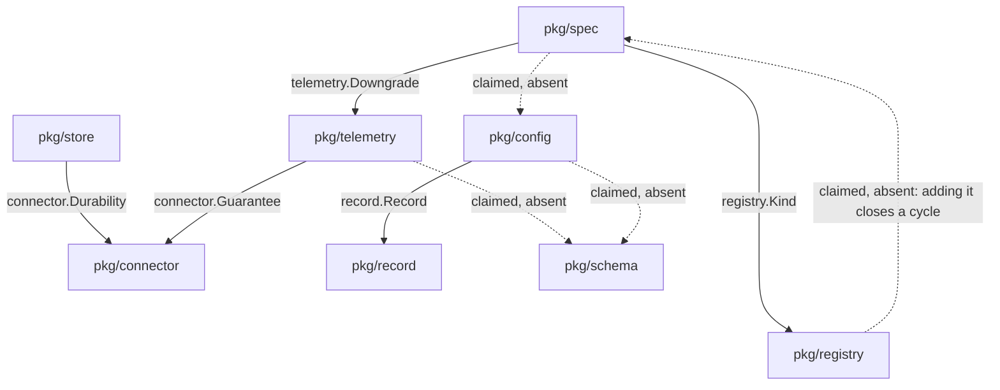

Solid arrows are real imports, labelled with the identifier that creates each one
(`pkg/spec/node.go:17`, `pkg/spec/spec.go:55`, `pkg/store/state_store.go:51`,
`pkg/telemetry/negotiated.go:20`, `pkg/config/predicate.go:87`); dotted arrows are four edges the
superseded §3 table declared that do not exist in the code. The `registry` → `spec` edge is the
dangerous one: the real edge runs the other way, so implementing the table as written would create an
import cycle.

The graph above is acyclic, and `go build ./...` proves it (Go rejects import cycles outright). What the
compiler does not tell you is *why* each edge points the way it does:

- **`pkg/schema` is the only leaf.** It imports stdlib alone, and every other package's dependency path
  bottoms out there.
- **`config` never returns a `connector` type.** The composite extractors return types owned by `config`
  (`config.BatchPolicy`, `config.CodecRef`, `config.BufferRef`) or by `fault` (`fault.RetryPolicy`).
  `config` imports `fault` and `record` — the latter because `Predicate.EvalRecord` walks a
  `*record.Record` (`pkg/config/predicate.go:87`) — and it imports neither `schema` nor `connector`.
- **`record` never names `fault.Fault`.** An attached fault is stored as a plain `error` in an unexported
  field and read through `Record.Failed() (error, bool)` (`pkg/record/record.go:105`), so the edge runs
  `fault` → `record` and only that way.
- **`spec` imports `registry`, never the reverse.** `spec.Node.Kind` is a `registry.Kind`
  (`pkg/spec/node.go:17`). `registry` imports `config` and `connector`, so an edge from `registry` to
  `spec` would close a cycle; do not add one.
- **`spec` imports `telemetry`.** `spec.Spec.Downgrades` is a `[]telemetry.Downgrade`
  (`pkg/spec/spec.go:55`), which is what makes a negotiated downgrade visible in the stored spec.
  `telemetry` in turn imports `connector` for `connector.Guarantee` (`pkg/telemetry/negotiated.go:20`)
  and does not import `ledger` or `spec`.
- **`store` never imports `engine`.** `ConfigStore` deals in `spec.Spec`; `Coordinator` deals in
  `store.LaneRow`, whose lane spec is a `record.Blob` — bytes in, bytes out. `store` does import
  `connector`, for `connector.Durability` and `connector.Guarantee` in `StoreCaps`
  (`pkg/store/state_store.go:51`).
- **`ledger` imports `connector`; `connector` cannot import `ledger`.** `connector` owns the vocabulary
  (`Ordering`, `Ack`), `ledger` implements the algorithm over it, and since `ledger` is under `internal/`
  the edge is structurally unable to reverse.
- **Nothing under `pkg/` imports anything under `internal/`.**

To check any of this, run:

```
go list -f '{{.ImportPath}} -> {{join .Imports " "}}' ./pkg/... ./internal/...
```

That command, not this list, is the authority; the list is a summary of what it printed.

---

## 4. The record model (R2 — decided first)

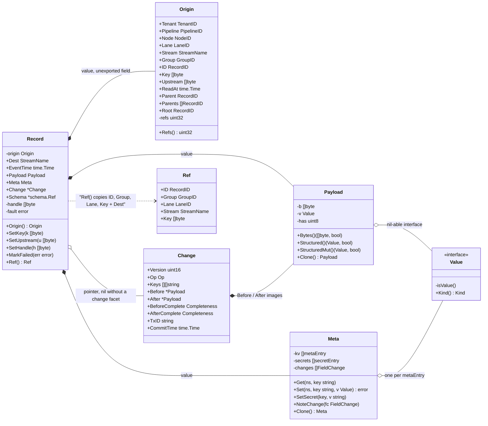

`-` is an unexported field, `+` an exported one; a filled diamond is held by value and a hollow one by
pointer. Everything is defined in `pkg/record/record.go`, `origin.go`, `payload.go`, `meta.go`,
`change.go` and `value.go` — note that `Record` carries five fields the section's ASCII tree omits
(`Dest`, `EventTime`, `Schema`, `handle`, `fault`) and that `Payload`, `Meta` and `Origin` expose *no*
exported fields you can reach without going through a method or through `Origin()`'s value copy.

The abandoned attempt named a stage `source_canonical_event_serializer` and never defined the canonical
form, so an HTTP DTO became the internal type by default. Here the envelope is decided first, is
independent of every transport, and is the only thing every other package agrees on.

Three separately-lifetimed layers plus core-owned provenance:

```
Record
├─ Payload   one body, two views (bytes / structured). Conversion is NEVER implicit.
├─ Meta      a separately addressable namespace. Not serialised to a sink by default.
├─ Change    OPTIONAL typed change facet: Op, Keys, Before, After, Completeness, TxID, CommitTime
└─ origin    UNEXPORTED provenance, stamped once by record.Allocator. No mutator exists.
```

### 4.1 Identifiers

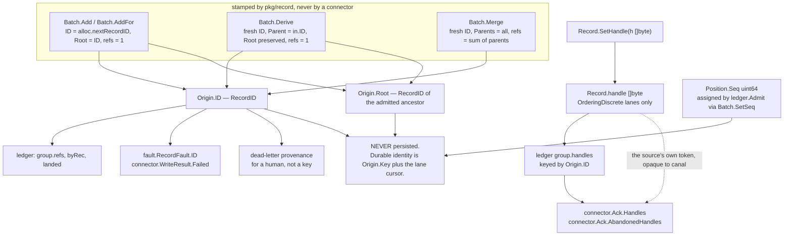

The in-flight identities — `RecordID`, `Root`, `Position.Seq` and the delivery handle — are
generation-local and appear in no persisted key; `pkg/record/ids.go:69-83` states the rule and
`internal/ledger/ledger.go:193-240` is the only code that reads them today. The handle is the source's
own token, set through `SetHandle` in `pkg/record/record.go:64` and handed straight back in
`connector.Ack`, so it is not an identity canal assigns at all.

```go
// Package record defines canal's canonical in-flight record model. It is the
// spine of the system: every other package agrees on these types and nothing
// else.
//
// Growth discipline: new capabilities are added as FIELDS ON CORE STRUCTS, never
// as methods on connector interfaces. A struct field is a source-compatible
// addition; an interface method is not. This one rule is what lets canal reach v3
// without breaking a v1 connector.
//
// The envelope is deliberately not generic. A type parameter on Record would
// propagate to Source, Sink, Buffer, Transform, Codec and the registry, and would
// then have to be erased at the registry boundary — which buys nothing. FLIP-191
// needed a whole new package because a plugin interface had type parameters.
package record

import (
	"iter"
	"time"

	"github.com/BernardoCSACarreira/canal/schema"
)

// TenantID scopes everything durable. It is present from the first commit, not
// retrofitted: R13 exists because "tenancy" was once realised as "single OS
// user". In a single-tenant deployment it is the constant "default", and every
// durable key still contains it, so enabling multi-tenancy later is a
// configuration change and not a migration.
type TenantID string

// PipelineID identifies a configured pipeline. Stable across restarts and across
// config revisions of the same pipeline.
type PipelineID string

// NodeID identifies one vertex of a pipeline graph. Assigned by the operator in
// the spec, stable across revisions, used as the metric label for the node and
// as the edge endpoint.
type NodeID string

// StreamName is a source-declared logical stream: a table, a topic, a
// collection, an endpoint, a file glob. The core never parses it and attaches no
// meaning to its shape. A source with exactly one stream uses "default".
type StreamName string

// LaneID is the core's handle for one lane. Derived deterministically from
// (tenant, pipeline, node, LaneSpec.Name) so the same announced name is the same
// lane across restarts and reuses its persisted state.
type LaneID string

// DeriveLaneID is the derivation, EXPORTED. A documented derivation whose
// implementation is unreachable is not a documented derivation: a lane that must
// refer to another lane had to smuggle an opaque LaneID through LaneSpec.Spec and
// hope the core's spelling never changed. Percent-escapes each component, so a
// pipeline id containing a separator cannot forge another pipeline's lane.
func DeriveLaneID(t TenantID, p PipelineID, n NodeID, name string) LaneID

// LaneGroup is a connector-authored label grouping lanes for the purpose of
// ordering constraints. It is opaque to the core: the core only ever tests two
// LaneGroups for equality. "scan", "tail", "chunk-set-3" are all legal.
type LaneGroup string

// GroupID identifies one settlement group: the set of records admitted to the
// ledger together, which resolve together. One source batch becomes one group.
type GroupID uint64

// RecordID is a stable, framework-assigned, generation-local identity for one
// in-flight record. It is assigned once at admission and never changes — not
// through a transform, not through rebatching, not through fan-out.
//
// Positional identity within a batch is a proven mistake: Benthos marks its own
// WalkMessages "// Deprecated: This method is harmful" for exactly this reason,
// and its Indexer/SortGroup machinery exists solely to recover positions after
// filtering and reordering. Every per-record outcome in canal — partial batch
// failure, retry targeting, dead-lettering, settlement, dedupe — is keyed on
// RecordID and never on an index.
//
// It is NOT durable and never appears in persisted state. Durable identity is
// Origin.Key plus the lane cursor. A RecordID in a DLQ record is provenance for
// a human, not a key.
type RecordID uint64

// Blob is the universal shape for anything that crosses a role boundary or hits
// disk: a connector-authored payload plus the version of the connector's own
// serialiser that wrote it.
//
// Flink's SimpleVersionedSerializer is forty lines and buys binary-upgrade
// compatibility and the future out-of-process boundary in one move. This is that,
// as a value.
type Blob struct {
	Version uint32 `json:"version"`
	Bytes   []byte `json:"bytes"`
}

func (b Blob) IsZero() bool { return b.Version == 0 && len(b.Bytes) == 0 }
```

### 4.2 Value — a sealed sum

```go
// Value is canal's field value type: a sealed sum with a closed member set.
//
// It is an interface with an unexported method rather than `any` plus a
// documented type set, because a third party widening the set would be a
// checkpoint-format break and a codec break simultaneously. It is not a type
// parameter because one record holds heterogeneous fields.
//
// Note what is absent: there is no stream/lazy member. A Value must be fully
// materialised, because a record must be encodable, bufferable, dead-letterable
// and wire-shippable at every instant of its life. A lazily-read nested stream
// inside a Value makes all four impossible.
type Value interface {
	isValue()
	Kind() Kind
}

// Kind enumerates the closed value set. Safe as a metric label.
type Kind uint8

const (
	KindNull Kind = iota
	KindBool
	KindInt
	KindUint
	KindFloat
	KindString
	KindBytes
	KindTime
	KindDecimal
	KindList
	KindMap
)

func (k Kind) String() string // stable snake_case

type (
	Null   struct{}
	Bool   bool
	Int    int64
	Uint   uint64
	Float  float64
	String string
	Bytes  []byte
	Time   time.Time

	// Decimal is arbitrary-precision and transport-neutral. Benthos's schema
	// package needs exactly this escape hatch for sources that cannot report
	// precision; Airbyte's untyped-JSON alternative became the worst part of that
	// product and was eventually deleted.
	Decimal struct {
		Unscaled []byte // two's-complement, big-endian
		Scale    int32
	}

	List []Value
	Map  map[string]Value
)

func (Null) isValue()    {}
func (Bool) isValue()    {}
func (Int) isValue()     {}
func (Uint) isValue()    {}
func (Float) isValue()   {}
func (String) isValue()  {}
func (Bytes) isValue()   {}
func (Time) isValue()    {}
func (Decimal) isValue() {}
func (List) isValue()    {}
func (Map) isValue()     {}

func (Null) Kind() Kind    { return KindNull }
func (Bool) Kind() Kind    { return KindBool }
func (Int) Kind() Kind     { return KindInt }
func (Uint) Kind() Kind    { return KindUint }
func (Float) Kind() Kind   { return KindFloat }
func (String) Kind() Kind  { return KindString }
func (Bytes) Kind() Kind   { return KindBytes }
func (Time) Kind() Kind    { return KindTime }
func (Decimal) Kind() Kind { return KindDecimal }
func (List) Kind() Kind    { return KindList }
func (Map) Kind() Kind     { return KindMap }

// Equal is a deep structural comparison. It exists as a function rather than as
// `==` because Map and List are not comparable and `a == b` on two Values panics
// at runtime — a trap this function's existence removes.
func Equal(a, b Value) bool

// Nil-vs-Null: a nil Value means "no value was supplied". Null{} means "the
// value is explicitly null". They are different facts and canal never collapses
// them; a codec that cannot express the distinction says so in its capabilities.
```

### 4.3 Position — the reason an ack pipeline can report progress

```go
// Position is a source's own notion of "where am I", in the only form the core
// will hold: opaque bytes it never parses, plus core-readable scalars and two
// optional facets that let the core reason about ordering WITHOUT interpreting
// the bytes.
//
// This is the type that makes an acknowledgement-based design observable, which
// is the property Benthos and Vector both lack and which their dossiers call
// disqualifying for canal.
type Position struct {
	// Seq is assigned by the CORE, monotonically increasing within a lane, at
	// admission. The connector must not set it; the core overwrites it. Because it
	// is core-assigned, the core computes records read, records committed,
	// in-flight depth and replay-window size for any source whatsoever without
	// understanding Token.
	//
	// It is generation-local and never persisted. Deriving order from a connector's
	// opaque bytes is exactly the mistake this field exists to avoid: Conduit's
	// engine mints its own nextAckSeq for the same reason and says so at the
	// enforcement site.
	Seq uint64 `json:"seq"`

	// Token is the connector's resume payload: a binlog coordinate, an LSN, a
	// resume token, a key-range boundary, a file+byte offset, a page cursor. The
	// core never parses, compares or truncates it. It is written to and read from
	// durable storage verbatim.
	//
	// INVARIANT THE CONNECTOR UPHOLDS: given Token, the source can resume such
	// that no record at or before this position is skipped. Duplicates are
	// permitted; gaps are not.
	Token Blob `json:"token"`

	// Order, when non-nil, is an order-preserving encoding of this position: for
	// any two positions a and b from the same connector for the same lane,
	// bytes.Compare(a.Order, b.Order) has the same sign as the connector's own
	// notion of a-before-b.
	//
	// Comparability is optional DATA, not an optional METHOD. Flink makes the
	// connector implement isBefore/isAfter, which works in-process and cannot
	// cross a process boundary — the exact trap that forces a capability to be
	// re-declared as a bool at every wire boundary. Order crosses a wire, reaches
	// a browser, and is comparable by a generic core with bytes.Compare.
	//
	// Supplying Order unlocks: mid-lane monotonicity assertions, min/max over
	// watermarks, position-fraction progress (with Scalar), and the key-range
	// filter a future concurrent-snapshot engine needs. Not supplying it costs
	// only those things.
	//
	// Order's encoding is part of Token.Version's contract. Changing it changes the
	// total order and therefore invalidates persisted ranges, so it MUST bump
	// Token.Version.
	Order []byte `json:"order,omitempty"`

	// Scalar, when non-nil, is a monotone numeric projection used ONLY for
	// progress arithmetic — (cur-lo)/(hi-lo). It need not be exact, dense or
	// meaningful in any unit; it must be monotone with Order.
	Scalar *float64 `json:"scalar,omitempty"`

	// Label is a short human-readable rendering, authored by the connector.
	// "binlog.000042:1273", "lsn 0/1A2B3C4", "id > 'acme-991'".
	//
	// The core renders it and NEVER parses it. This is how the frontend shows a
	// meaningful position for an arbitrary connector with zero connector-specific
	// UI code: the connector supplies the string, the UI supplies the box.
	Label string `json:"label,omitempty"`

	// Safe reports whether resuming from Token is gap-free. A source that emits
	// records mid-transaction sets Safe=false on those positions and Safe=true
	// only at a transaction boundary, because resuming mid-transaction can skip a
	// TABLE_MAP event or a partial commit.
	//
	// The ledger resolves the contiguous prefix over ALL positions but only ever
	// commits a position with Safe=true. "The committed position is the last safe
	// point at or before the resolved prefix" is therefore a CORE INVARIANT rather
	// than a per-connector convention that MySQL connectors get right and others
	// do not. A connector with no such distinction sets Safe:true everywhere and
	// pays nothing.
	Safe bool `json:"safe"`

	// At is when the source observed this position. Zero means unknown, and the
	// core reports unknown rather than zero.
	At time.Time `json:"at,omitempty"`
}

func (p Position) IsZero() bool     { return p.Seq == 0 && p.Token.IsZero() }
func (p Position) Comparable() bool { return p.Order != nil }

// Compare returns -1, 0 or +1 and true when both positions carry Order. It
// returns (0, false) otherwise, and EVERY core call site handles false by
// degrading rather than by guessing. That discipline is what keeps a
// non-comparable source a first-class citizen.
func (p Position) Compare(q Position) (int, bool)

// Fraction returns o's position within [lo, hi] in [0,1], and true only when all
// three carry Scalar and hi.Scalar > lo.Scalar. On false the caller OMITS the
// metric series entirely rather than emitting zero.
func Fraction(lo, o, hi Position) (float64, bool)
```

### 4.4 Origin — provenance that a transform structurally cannot corrupt

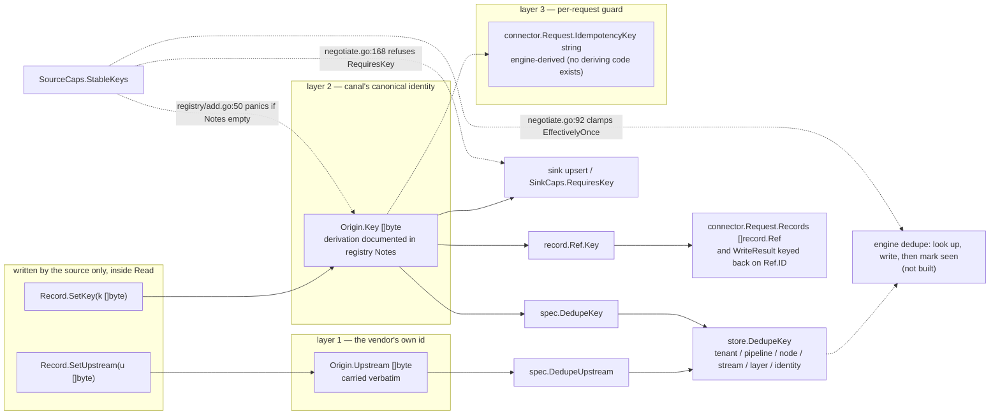

The two durable identity layers are the *only* writable part of `Origin` (ADR 0025; `SetKey` and
`SetUpstream` at `pkg/record/record.go:82,92`), and every consumer of identity reaches them through
those two setters — the layer names and their consumers live in `pkg/spec/spec.go:202-210`,
`pkg/store/key.go:87` and `pkg/connector/sink.go:189-193`. Dotted edges are declared but unbuilt: no
code derives `Request.IdempotencyKey` and no dedupe implementation exists, only the capability gates in
`internal/engine/negotiate.go`.

```go
// Origin is a record's immutable provenance. It is stamped once, by an
// Allocator, inside this package, and there is no exported mutator.
//
// This is a direct response to Kafka Connect's KIP-793 retrofit: its SMTs
// rewrite topic/partition while offset accounting needs the pre-transform
// coordinates, so originalTopic/originalKafkaPartition/originalKafkaOffset had to
// be bolted on plus prose warnings in two javadocs. Here a transform cannot
// corrupt settlement identity because it has no access to the fields settlement
// uses.
type Origin struct {
	Tenant   TenantID
	Pipeline PipelineID
	Node     NodeID // the source node that produced it
	Lane     LaneID
	Stream   StreamName
	Group    GroupID
	ID       RecordID

	// Key is the source-derived stable identity of the thing this record is
	// about, canonically encoded so that a sink knowing nothing about the source
	// can use it directly as an upsert or dedupe key. May be nil.
	//
	// A source with no natural upstream id MUST derive a deterministic one from
	// stable fields and document the derivation in its registered Notes. That
	// documentation obligation is asserted by the conformance kit: a source
	// declaring StableKeys with empty Notes fails registration lint.
	Key []byte

	// Upstream is the vendor's own id for this record, when it has one, carried
	// verbatim for the first of the three idempotency layers. Layer 1 is
	// Upstream, layer 2 is Key, layer 3 is the engine's in-flight submit guard.
	Upstream []byte

	ReadAt time.Time

	// Parent is non-zero when this record was derived from exactly one other
	// record. Parents is non-nil when it was merged from several. Both are
	// provenance for the DLQ and the tap; neither is used by settlement.
	Parent  RecordID
	Parents []RecordID

	// Root is the RecordID of the original admitted record this one descends
	// from. Preserved through any depth of derivation, and it is what dedupe and
	// the tap correlate on.
	Root RecordID

	// refs is how many group references this record's settlement discharges.
	// A record admitted from a source has refs 1. A 1-to-N expansion produces N
	// records with refs 1 each and adds N-1 references to the group. An N-to-1
	// merge produces one record whose refs is the sum of its parents'.
	//
	// This single unexported field is why fan-out, filtering, expansion and
	// regrouping need no core code path and cannot early-settle a group.
	refs uint32
}

// Refs reports how many group references settling this record discharges.
// Exported for the ledger and for tests; there is no setter.
func (o Origin) Refs() uint32 { return o.refs }
```

### 4.5 Payload — bytes are first-class, structure is a view, conversion is never implicit

```go
// Payload is a dual-view body: raw bytes and/or a structured value, whichever is
// currently materialised.
//
// CRITICAL PROPERTY: Payload holds no codec, no context and no engine handle, and
// its accessors never convert. Three of the four competing proposals specified a
// Payload whose Bytes() "materialises using the pipeline's configured encoder",
// which requires either global mutable codec state or an import cycle, and makes
// a Record untestable in isolation. Here conversion happens in the engine's
// decode and encode nodes, which write the other view back into the payload.
//
// A sink that needs bytes and is handed a payload with none is a pipeline the
// core refused at Build time: an encoder is required on every sink node unless
// the sink declares StructuredInput.
//
// Mutability is in the accessor name, following Benthos, because a Mutable() bool
// flag is a rule nobody reads.
type Payload struct {
	b   []byte
	v   Value
	has uint8 // bit 0: bytes valid, bit 1: structured valid
}

func BytesPayload(b []byte) Payload     { return Payload{b: b, has: 1} }
func StructPayload(v Value) Payload     { return Payload{v: v, has: 2} }

// Bytes returns the encoded body. ok is false when only a structured view
// exists. The caller must not retain or modify the returned slice.
func (p *Payload) Bytes() (b []byte, ok bool)

// BytesCopy returns an owned copy.
func (p *Payload) BytesCopy() ([]byte, bool)

// Structured returns a read-only structured view. Mutating it is a contract
// violation.
func (p *Payload) Structured() (Value, bool)

// StructuredMut returns a structured view the caller may mutate, deep-copying
// first if the value came from upstream. Invalidates the byte view.
func (p *Payload) StructuredMut() (Value, bool)

func (p *Payload) SetBytes(b []byte)
func (p *Payload) SetStructured(v Value)
func (p *Payload) HasBytes() bool
func (p *Payload) HasStructured() bool
func (p *Payload) Len() int      // encoded length if the byte view exists, else -1
func (p *Payload) IsEmpty() bool
func (p *Payload) Clone() Payload
```

### 4.6 Meta — a separate addressable namespace, and a lossiness log

```go
// Meta is a namespaced metadata sidecar, addressable separately from the payload
// so a transform touching metadata never rewrites the body and a codec encoding
// the body never has to decide what to do with metadata.
//
// It is backed by a SLICE of triples, not a map. Two reasons, both measured
// against the proposals: a typical record carries zero to five entries, so a
// slice is smaller and faster to deep-copy; and a map inside a value type that
// gets copied on fan-out is shared mutable state that produces a concurrent map
// write — an unrecoverable process-wide fatal error — on the first fan-out
// pipeline. Meta is deep-copied by Clone and by every derivation.
//
// Namespaces are RESERVED WITH A CHECK, not by convention. Conduit shipped six
// source-shaped keys (opencdc.file.*) into a connector-agnostic spec namespace
// precisely because nothing enforced it.
//
//	"canal"   core-owned, read-only to connectors. Set returns an error.
//	"source"  the source connector's.
//	"sink"    the sink connector's.
//	"user"    the operator's, set by transforms and config.
//
// Secrets live in a fifth, unlisted compartment that is never serialised, never
// logged, never exported to the read model, and never visible to a codec.
type Meta struct {
	kv      []metaEntry
	secrets []metaEntry
	changes []FieldChange
}

func (m *Meta) Get(ns, key string) (Value, bool)

// Set stores a value. Returns an error for ns == "canal" and for an unknown
// namespace. Note that setting the empty string stores the empty string: canal
// does NOT adopt Benthos's "empty string deletes the key", because "present but
// empty" must be representable.
func (m *Meta) Set(ns, key string, v Value) error

func (m *Meta) Delete(ns, key string)
func (m *Meta) All(ns string) iter.Seq2[string, Value]
func (m *Meta) Len() int
func (m *Meta) Clone() Meta

// SetSecret stores a value the core guarantees will not appear in any serialised
// form, log line, metric label or API response.
func (m *Meta) SetSecret(key, v string)
func (m *Meta) Secret(key string) (string, bool)

// NoteChange records that a field could not be carried faithfully. This turns a
// silent lossy conversion into a countable, per-field, testable fact, and it is
// the mechanism that makes "the sink rounded your decimals" visible instead of
// discovered in a reconciliation six months later.
func (m *Meta) NoteChange(fc FieldChange)
func (m *Meta) Changes() []FieldChange

type FieldChange struct {
	Path   string          `json:"path"`
	Kind   FieldChangeKind `json:"kind"`
	Detail string          `json:"detail,omitempty"`
}

type FieldChangeKind uint8

const (
	FieldNulled FieldChangeKind = iota + 1
	FieldTruncated
	FieldRounded
	FieldRedacted
	FieldUnavailable
)
```

### 4.7 Change — the optional typed facet

```go
// Change is the optional typed change-event facet.
//
// It exists because total genericity provably does not hold. Benthos's MySQL and
// Postgres CDC inputs invent DIFFERENT op vocabularies and DIFFERENT position
// keys and flatten both into metadata strings, so every CDC-aware sink ends up
// special-casing every source — which is constraint #1 violated by drift rather
// than by design. Kafka Connect's omission of an operation type is the documented
// reason every CDC connector reinvented the envelope incompatibly, and Airbyte
// and Singer independently reinvented magic prefixed columns for the same missing
// fields.
//
// It is OPTIONAL DATA, not a core-mandated shape, so the core still never
// switches on source type and the relational shape is never forced onto a
// webhook, a metrics scrape or a file tail.
type Change struct {
	// Version versions this facet's vocabulary. Core-owned, bumped by canal, and
	// carried so a persisted record from an older binary is readable.
	Version uint16 `json:"version"`

	Op Op `json:"op"`

	// Keys are the field paths forming the record key, in order. [][]string, not
	// []string, so composite and nested keys need no later breaking change.
	Keys [][]string `json:"keys,omitempty"`

	Before *Payload `json:"before,omitempty"`
	After  *Payload `json:"after,omitempty"`

	// BeforeComplete and AfterComplete answer the question Benthos's Postgres
	// input cannot: is this image whole? Postgres logical decoding with an
	// unchanged TOAST value and a REPLICA IDENTITY that is not FULL produces a
	// partial after-image, and a sink that upserts it writes nulls over live data.
	//
	// A sink that needs whole images declares RequiresCompleteImages and the
	// pipeline is REFUSED AT SUBMIT TIME against a source that cannot supply them.
	// This is the only defence in the study against that corruption class.
	BeforeComplete Completeness `json:"before_complete"`
	AfterComplete  Completeness `json:"after_complete"`

	// TxID groups records from one upstream transaction. Opaque; the core only
	// tests equality, and a batch policy may flush on a change of it.
	TxID       string    `json:"tx_id,omitempty"`
	CommitTime time.Time `json:"commit_time,omitempty"`
}

// Op is the change operation. Closed set: it is a metric label.
type Op uint8

const (
	OpUnknown Op = iota
	OpInsert
	OpUpdate
	OpDelete
	OpTruncate
	// OpScanRead marks a record produced by a scan lane rather than an
	// incremental one. It is INFORMATIONAL: no core code branches on it.
	OpScanRead
)

func (o Op) String() string // stable snake_case

// Completeness states how much of an image is present.
type Completeness uint8

const (
	CompletenessAbsent   Completeness = iota // not supplied at all
	CompletenessPartial                      // some fields present; absent != null
	CompletenessComplete                     // every field of the governing schema is present
)

func (c Completeness) String() string
```

### 4.8 Record, Batch and the Allocator

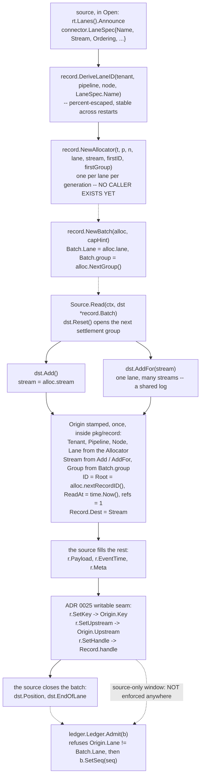

`Origin.Lane` and `Origin.Stream` come from the `Allocator` the engine built from the source's own
`LaneSpec`, never from a setter, while `Origin.Key` is set by the source inside `Read`
(`pkg/record/batch.go:36-46,164-210`, `pkg/record/record.go:82`). Dotted edges are unbuilt: nothing in
`internal/engine` calls `record.NewAllocator` or `record.NewBatch`, `Pipeline.Run` is a one-line error
(`internal/engine/build.go:321`), and the "engine rejects a key set later" rule has no enforcement site
in the module.

```go
// Record is the envelope.
type Record struct {
	origin Origin // stamped by Allocator; no exported mutator

	// Dest is the routing target a transform may rewrite. It starts equal to
	// origin.Stream. Two fields for two concepts: one is identity, one is
	// destination. This is the FIX for the conflation KIP-793 had to retrofit,
	// not a violation of R9 — they are genuinely different facts.
	Dest StreamName

	EventTime time.Time
	Payload   Payload
	Meta      Meta
	Change    *Change     // optional facet
	Schema    *schema.Ref // optional; resolved against the pipeline's schema table

	// handle is the source's own delivery handle for a discrete-ordering lane: an
	// SQS receipt handle, an AMQP delivery tag, a Pub/Sub ack id. Set by the
	// source through SetHandle, carried through derivations, and returned to the
	// source in Ack.Handles. Nil for prefix-ordering lanes.
	handle []byte

	fault error // set by MarkFailed; read by the engine's routing policy
}

func (r *Record) Origin() Origin { return r.origin }

// SetHandle attaches the source's delivery handle. Legal only from the source
// that produced the record, before it returns from Read; the engine rejects a
// handle set later. For an OrderingDiscrete lane it is REQUIRED on every record.
func (r *Record) SetHandle(h []byte)
func (r *Record) Handle() []byte

// SetKey attaches Origin.Key: the source-derived stable identity of the thing this
// record is about, canonically encoded so a sink knowing nothing about the source
// can use it directly as an upsert or dedupe key. SetUpstream attaches the vendor's
// own id, idempotency layer one.
//
// SAME SOURCE-ONLY WINDOW AS SetHandle: legal only from the source that produced
// the record, before that source returns from Read or ReadLanes. The engine rejects
// a key set later, and a transform that calls either gets PermanentContract.
//
// These two are the ONLY writable Origin fields. The settlement fields — Lane,
// Stream, Group, ID, Root, refs — remain unwritable, which is what keeps settlement
// identity uncorruptible by a transform while making StableKeys, RequiresKey, both
// dedupe layers, Request.IdempotencyKey and Ref.Key reachable at all. Six of the
// eight hostile connectors were blocked here, all six FATALLY; see §29.
func (r *Record) SetKey(k []byte)
func (r *Record) SetUpstream(u []byte)

// MarkFailed attaches a fault and lets the record continue. The engine's
// configured routing decides whether that means a Failed edge, a drop, or a
// pipeline stop. Carrying the error ON the record is what makes mark-and-route
// error handling need no extra interface vocabulary.
func (r *Record) MarkFailed(err error)
func (r *Record) Failed() (error, bool)

// Ref is the minimum a sink needs to report a per-record outcome: identity and
// enough provenance to build a useful message, and no payload.
type Ref struct {
	ID     RecordID   `json:"id"`
	Group  GroupID    `json:"group"`
	Lane   LaneID     `json:"lane"`
	Stream StreamName `json:"stream"`
	Key    []byte     `json:"key,omitempty"`
}

func (r *Record) Ref() Ref

// Allocator stamps identity. It is the ONLY way an Origin comes into existence,
// it lives in this package so there is no cross-package write to an unexported
// field, and a connector never holds one.
//
// The engine creates one Allocator per (lane, generation) and hands the source a
// Batch that already carries it. A source therefore cannot forge provenance, and
// there is no second Record constructor — the hole every "lend a slot" design in
// the proposals left open by also exporting a raw emitter.
type Allocator struct{ /* tenant, pipeline, node, lane, counters */ }

func NewAllocator(t TenantID, p PipelineID, n NodeID, l LaneID, stream StreamName, firstID RecordID, firstGroup GroupID) *Allocator

// NextGroup begins a new settlement group and returns its id.
func (a *Allocator) NextGroup() GroupID

// Batch is a caller-owned, reusable buffer. The engine allocates one per node and
// passes the same pointer every iteration, following driver.Rows.Next.
//
// A batch — not a record — is what a Position attaches to for a prefix lane.
// This matches what real connectors do and it means commit points align with
// source-meaningful boundaries rather than with a clock.
type Batch struct {
	// Records is the batch contents. Pointers, not values: a 500-byte value
	// record copied per range iteration is measurable, and a value type
	// containing a reference field is how fan-out branches end up sharing state.
	Records []*Record

	// Lane MUST equal the lane the allocator stamps, which is what NewBatch already
	// set it to. Retargeting it used to mislabel every record silently — measured at
	// 33350 of 33500 records attributed to the wrong lane; ledger.Admit now REFUSES
	// such a batch with PermanentContract naming both lanes. A source serving several
	// lanes implements connector.LaneReader and is handed one batch per lane.
	Lane LaneID

	// Position is the position AFTER the last record, for an OrderingPrefix lane.
	// Unset for OrderingDiscrete lanes, whose per-record handles carry progress.
	//
	// A batch with a Position and ZERO RECORDS is legal and meaningful: "the lane
	// advanced to here and produced nothing you need to deliver". A filtered tail, a
	// page of already-seen rows, a chunk planner, an idle poll. The ledger admits it
	// with ZERO references and resolves it at admission, still through the tracker so
	// it enters the prefix in order. Refusing it wedged those lanes forever.
	Position Position

	// EndOfLane is set by the source on the final batch of a lane it is RETIRING —
	// bounded or not. May be set with zero records, in which case it may still carry
	// the closing Position. The engine finishes the lane only once every group
	// admitted for it has settled, and the resulting Ack carries LaneFinished.
	EndOfLane bool

	alloc *Allocator
	group  GroupID
}

// NewBatch returns a batch bound to an allocator. Called by the engine.
func NewBatch(a *Allocator, capHint int) *Batch

// Add lends the source a zero-valued record slot with its identity and
// provenance ALREADY STAMPED, and appends it to the batch. This is the only way
// a source produces a record.
//
// It returns nil when the batch is at its hard cap; a source that ignores the nil
// and dereferences it gets a panic in its own code on its first test run, which
// is the correct place for that mistake to surface.
func (b *Batch) Add() *Record

// AddFor is Add for a record whose logical stream is not the lane's declared one.
// It stamps Origin.Stream — and therefore Dest — with the given name.
//
// One lane serving several streams is the NORMAL shape of a shared log: one binlog
// coordinate, one LSN, one change-stream resume token, one partition offset, each
// interleaving many tables under ONE cursor. Without it such a source must collapse
// every table into one dedupe scope (design rule R5's cross-stream collision) or
// invent a per-table cursor its upstream does not have.
//
// It is a PARAMETER at the one moment identity comes into existence, not a setter,
// so a transform still cannot retarget settlement identity. Rewriting the
// DESTINATION remains Record.Dest's job.
func (b *Batch) AddFor(stream StreamName) *Record

// Derive appends a new record in the SAME settlement group, derived from in, with
// a fresh RecordID, Parent and Root set, and refs 1. The caller must also call
// the engine-provided expansion accounting (ledger.Expand); the engine does this
// automatically for every transform, decoder and fan-out edge, so no connector
// ever calls it.
//
// There is deliberately NO Copy() that preserves a RecordID. Two branches of a
// fan-out sharing one RecordID makes "both branches settled" indistinguishable
// from "one branch double-settled", which is a group resolving early and a
// position committed past unwritten data. Every materialisation gets a fresh id.
func (b *Batch) Derive(in *Record) *Record

// Merge appends one record whose settlement discharges every parent's
// references. This is the N-to-1 shape — windowing, aggregation, regrouping —
// and without it an aggregating transform can never settle its extra inputs and
// the lane's prefix stalls forever.
func (b *Batch) Merge(parents ...*Record) *Record

func (b *Batch) Reset()
func (b *Batch) Len() int
func (b *Batch) Group() GroupID
func (b *Batch) Bytes() int64

// All is an ergonomic adapter for range-over-func. It is never the primary API:
// iter.Seq on a plugin surface inverts control away from the runtime, cannot
// carry a per-batch position, and cannot express "nothing available, come back
// when this channel closes".
func (b *Batch) All() iter.Seq[*Record]
```

**Why the record model looks like this — the four divergences from every surveyed system.**

1. **Stable framework-assigned in-flight identity** (`RecordID`), because positional identity within a
   batch is deprecated by its own author in the one system that shipped it.
2. **Provenance is unforgeable by construction**, because the only constructor stamps it.
3. **Conversion is never implicit.** The payload holds no codec. This deletes an entire defect class
   that all four proposals contained.
4. **`refs` on the origin.** One unexported counter makes fan-out, filter, 1→N and N→1 correct with
   zero core code paths per topology, and makes early settlement structurally impossible.

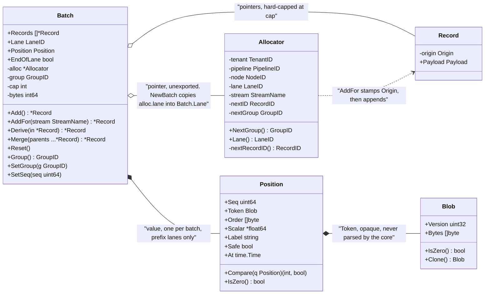

The carrier: a `Batch` holds record *pointers* but its `Position` by value, and the `Allocator` it
points at is the sole holder of the constant provenance (`pkg/record/batch.go:19-28,71-112`,
`position.go:15-85`, `ids.go:104-121`). Two exported methods absent from the Go listing above this
diagram are shown here because they exist and are reachable from a connector: `Batch.SetSeq` and
`Batch.SetGroup` (`batch.go:359,363`).

---

## 5. `fault` — classification, and the failure shape written with the success shape (R7)

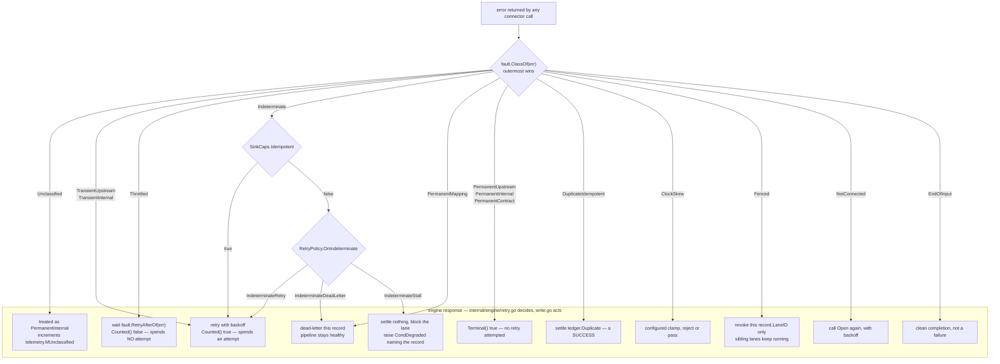

A connector states only the `Class`, a fact; every branch to the right of it is behaviour the engine
*computes* from `(class, capabilities, policy)` — the classes are defined in `pkg/fault/class.go` and
the dispositions in `pkg/fault/retry.go`. Everything inside the boxed region runs, in
`internal/engine/retry.go` — one pure `route(err, idempotent, policy, attempt, now)` whose entire
output is a disposition, a delay and a reason. `internal/engine/write.go` acts on it: retry
re-presents the records, dead-letter writes them on the failed edge BEFORE abandoning them, drop
abandons, stop ends the run, and stall refuses to guess about a write that may have landed.

The one arm narrower than the diagram is STALL, which is specified as blocking one lane while the
rest of the pipeline keeps running. With one lane per source and no control plane to unblock it,
that is indistinguishable from stopping, so it stops and says so rather than claiming a granularity
the engine does not have.

```go
// Package fault defines canal's closed error-classification set, the per-record
// failure shape, and the retry policy.
//
// The set is closed for three reasons: a closed set is a legitimate bounded
// metric label; a closed set makes "a hint the framework ignores" impossible
// (Benthos's ErrBackOff is honoured only on Connect, which is exactly that bug);
// and a closed set can be rendered by a UI with no connector-specific code.
package fault

import (
	"time"

	"github.com/BernardoCSACarreira/canal/record"
)

// Class is the OWNERSHIP taxonomy: whose problem is this? It is the question an
// operator UI actually needs answered — my config, their system, or a blip — and
// only the connector can answer it, so the connector classifies at the point of
// raise.
//
// Class names a FACT. It does not name a behaviour. Retryability, termination and
// dead-lettering are computed by the engine from (class, component capabilities,
// configured policy). Fusing fact and behaviour into one enum is why a timed-out
// write had no representable class in three of the four proposals.
type Class uint8

const (
	// Unclassified is the zero value and is always a defect. The engine treats it
	// as PermanentInternal, increments canal_unclassified_faults_total, and the
	// conformance kit asserts that counter stays at zero for a compliant connector.
	Unclassified Class = iota

	// TransientUpstream: the remote system is temporarily unable and the effect
	// definitely did not land. 503, connection refused, throttle, reset before
	// send.
	TransientUpstream

	// Throttled: the remote is RATE-LIMITING and told us to come back. A 429, a 503
	// with Retry-After, an SDK throttle signal. The effect definitely did not land,
	// exactly as with TransientUpstream.
	//
	// It is a separate member because it is FLOW CONTROL, not failure, and the
	// difference is whether it spends a retry attempt. Classified as
	// TransientUpstream, a source politely honouring a 429 for 90 seconds burned its
	// four attempts on an upstream that was working perfectly and reached
	// TerminalStop — and RetryPolicy has no unbounded option BY DESIGN, so no
	// configuration made honouring a rate limit safe. See Class.Counted.
	Throttled

	// TransientInternal: canal itself is temporarily unable. Buffer full, lease
	// contention, local disk pressure, store unreachable.
	TransientInternal

	// Indeterminate: the operation MAY have been applied and the connector cannot
	// tell. A write that timed out after the request was sent is the canonical
	// case, and before this member existed every sink had to lie: claiming
	// TransientUpstream violates the retry-safety obligation below, and claiming
	// PermanentUpstream stops a healthy pipeline.
	//
	// The engine's response is computed, never guessed:
	//   sink declares Idempotent          -> retry (a duplicate is absorbed)
	//   else RetryPolicy.OnIndeterminate  -> Retry | DeadLetter | Stall (default Stall)
	// Stall means: settle nothing, block the lane, raise CondDegraded naming the
	// record. Failing loud on an ambiguous write is the correct default for a
	// data-movement tool.
	Indeterminate

	// PermanentUpstream: the remote system refuses and will keep refusing. 401,
	// 403, table dropped, quota exhausted, credential revoked.
	PermanentUpstream

	// PermanentInternal: canal has a bug or an impossible internal state. Always
	// terminal, always logged with a stack, never dead-lettered as if it were the
	// record's fault.
	PermanentInternal

	// PermanentMapping: THIS RECORD cannot be represented for this destination.
	// Unencodable value, missing required field, type mismatch, oversized field.
	// Dead-letter the record; the pipeline is healthy.
	PermanentMapping

	// PermanentContract: the two ends disagree structurally. Unrecognised
	// Blob.Version, unsupported schema change, capability mismatch discovered at
	// runtime, a sink whose reported counts do not add up. Stop the pipeline:
	// retrying cannot help and continuing risks corruption.
	PermanentContract

	// DuplicateIdempotent: the write was refused because it already landed. This
	// is a SUCCESS for settlement and is counted separately so "we are
	// re-delivering a lot" is visible.
	DuplicateIdempotent

	// ClockSkew: a timestamp is implausible relative to the local clock. Behaviour
	// is configured (clamp or reject), never silently chosen. See ADR 0018.
	ClockSkew

	// Fenced: this worker no longer holds the lease for the lane it tried to write
	// progress for. It revokes the LANE, not the pipeline: the other lanes this
	// worker validly holds keep running. A stale CAS on one lane terminating a
	// whole worker was a major defect in the proposal this design is rooted in.
	Fenced

	// NotConnected: the component lost its connection and needs Open called again
	// before any further call. Control flow, not failure.
	NotConnected

	// EndOfInput: this component has nothing more to produce, ever. Control flow,
	// not failure; a bounded pipeline terminates cleanly this way.
	EndOfInput
)

func (c Class) String() string // stable snake_case; the metric label and i18n key

// Blames reports which side owns the problem, for the UI's grouping. Closed
// three-value answer: "your config", "their system", "canal".
func (c Class) Blames() Blame

type Blame uint8

const (
	BlameUnknown Blame = iota
	BlameConfig
	BlameUpstream
	BlameCanal
)

// Op is the pipeline operation at which a fault was raised. Closed set; a metric
// label. Classifying per operation is Kafka Connect's one good error idea.
type Op uint8

const (
	OpUnknown Op = iota
	OpOpen
	OpRead
	OpDecompress
	OpDeframe
	OpDecode
	OpTransform
	OpEncode
	OpFrame
	OpCompress
	OpWrite
	OpFlush
	OpPrepare
	OpCommitSink   // Committer.Commit
	OpCommitSource // Source.Commit
	OpPersist      // canal's own durable write
	OpBuffer
	OpDiscover
	OpValidate
	OpSchemaApply
	OpClose
)

func (o Op) String() string

// Fault is canal's error type. Connectors construct it; the engine reads it.
//
// The two message fields are deliberately separate: the operator sees User, the
// log carries Dev, and neither is a truncation of the other. One string cannot
// serve both audiences.
type Fault struct {
	Class Class
	Op    Op

	Stream record.StreamName
	Lane   record.LaneID
	Node   record.NodeID
	Record record.RecordID // zero when not record-scoped

	// RetryAfter is honoured verbatim by the engine's backoff when non-zero. This
	// is where a Retry-After header lands, and honouring it at EVERY call site
	// rather than only on connect is the fix for Benthos's ignored hint.
	RetryAfter time.Duration

	// User is shown to an operator. No stack traces, no Go types, no internal
	// identifiers. It should name the count, the component, an example, the fix
	// and the consequence.
	User string

	// Dev is for the log and the developer. Anything goes.
	Dev string

	Err error
}

func (f *Fault) Error() string
func (f *Fault) Unwrap() error

// Is makes errors.Is work against the package sentinels for any
// connector-constructed fault: a *Fault matches a target *Fault when their
// Classes are equal and the target carries no other distinguishing field.
// Without this, errors.Is(err, fault.ErrNotConnected) silently fails for every
// connector that wrapped it, which is a control-flow bug that looks like a data
// bug.
func (f *Fault) Is(target error) bool

// New constructs a Fault. Connector authors use this or a Class-named helper
// rather than fmt.Errorf, and the conformance kit fails a connector whose
// returned errors do not classify.
func New(c Class, op Op, err error) *Fault

func Transient(op Op, err error) *Fault     // TransientUpstream
func Throttle(op Op, after time.Duration, err error) *Fault // Throttled, + RetryAfter
func Unknown(op Op, err error) *Fault       // Indeterminate
func Permanent(op Op, err error) *Fault     // PermanentUpstream
func Mapping(op Op, err error) *Fault       // PermanentMapping
func Contract(op Op, err error) *Fault      // PermanentContract
func Duplicate(op Op, err error) *Fault     // DuplicateIdempotent

// Counted reports whether a fault of this class SPENDS a RetryPolicy attempt.
//
// Exactly three classes are uncounted, and all three are the remote or the component
// saying "not now" rather than anything being wrong: Throttled, NotConnected,
// EndOfInput. Everything else is counted, so a poison record still reaches a terminal
// disposition within MaxAttempts and "retry forever" stays inexpressible. An
// uncounted wait is bounded by Backoff.MaxElapsed and by nothing else.
//
// It is a METHOD ON THE CLASS rather than engine prose, because leaving it to prose is
// what made "does a Retry-After-bearing read fault consume an attempt" undiscoverable
// from the interface — a hostile REST source could not tell whether honouring a 429
// four times would stop its pipeline.
func (c Class) Counted() bool

// ClassOf walks the error chain with errors.As and returns the OUTERMOST declared
// class, or Unclassified.
//
// Outermost, not innermost: a wrapper that deliberately re-classifies — the
// engine's own "this transient read error has now failed four times, treat it as
// permanent" — must win over the original. Returning the innermost class makes
// deliberate re-classification by wrapping impossible, which was a major defect
// in the rooted proposal.
func ClassOf(err error) Class

// Sentinels. These are *Fault values so errors.Is works through connector
// wrapping, following driver.ErrBadConn's documented contract.
var (
	ErrNotConnected = New(NotConnected, OpUnknown, errNotConnected)
	ErrEndOfInput   = New(EndOfInput, OpRead, errEndOfInput)
	ErrFenced       = New(Fenced, OpPersist, errFenced)
)

// ErrDeclined declines a capability FOR THIS CONFIGURATION, and it is legal only
// from a method called during the negotiation window: Validate, Discover, and any
// capability method the engine calls inside Build. Returning it removes the
// capability from the resolved set BEFORE admission, with the error's message
// becoming the capability report's Reason.
//
// There is deliberately no per-call "skip this optional fast path" sentinel.
// database/sql's ErrSkip is silent, per-call and invisible, which is precisely
// the degradation this design exists to prevent, and a sentinel valid only on a
// prose allowlist that grows with every optional interface is the ignored-hint
// bug in a new costume.
var ErrDeclined = New(PermanentContract, OpValidate, errDeclined)
```

### 5.1 The retry-safety obligation

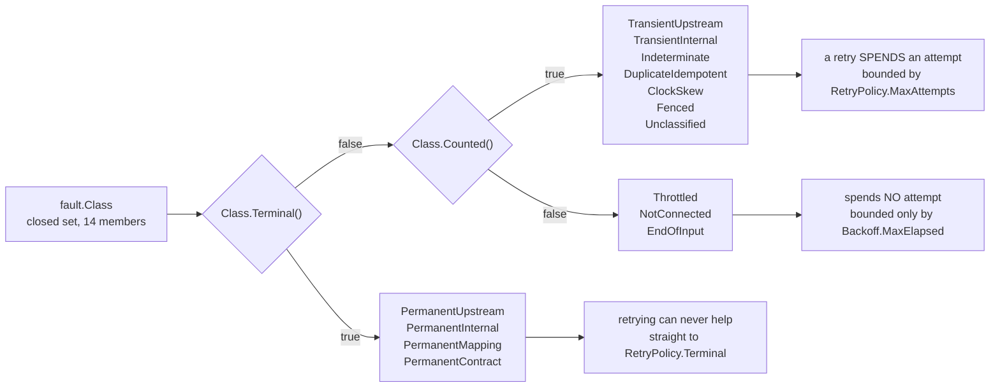

The obligation above decides *which* class an author picks; these two pure predicates —
`Class.Terminal()` and `Class.Counted()`, `pkg/fault/class.go:159` and `:181` — then decide behaviour
with no further input, which is what makes the retry subset derivable from a result alone. The
partition is coarser than the disposition: `EndOfInput` is uncounted because it is not a failure at
all rather than because it is a wait, and `Fenced`, `DuplicateIdempotent` and `Unclassified` land in
the counted-and-retryable cell even though the prose gives each of them a non-retry response.

```go
// RETRY-SAFETY OBLIGATION. Stated here because the compiler cannot enforce it and
// the conformance kit asserts it:
//
//	A connector may return TransientUpstream ONLY when it knows the effect did
//	not land. If the remote MAY have applied the write, the class is
//	Indeterminate, PermanentUpstream or DuplicateIdempotent — never
//	TransientUpstream.
//
// This is driver.ErrBadConn's rule ("should NOT be returned if there's a
// possibility that the database server might have performed the operation")
// generalised, and it is design rules R4 and R5 in one sentence. Indeterminate
// exists so that obeying this rule does not require lying.
```

### 5.2 Per-record outcomes — the failure shape, written with the success shape

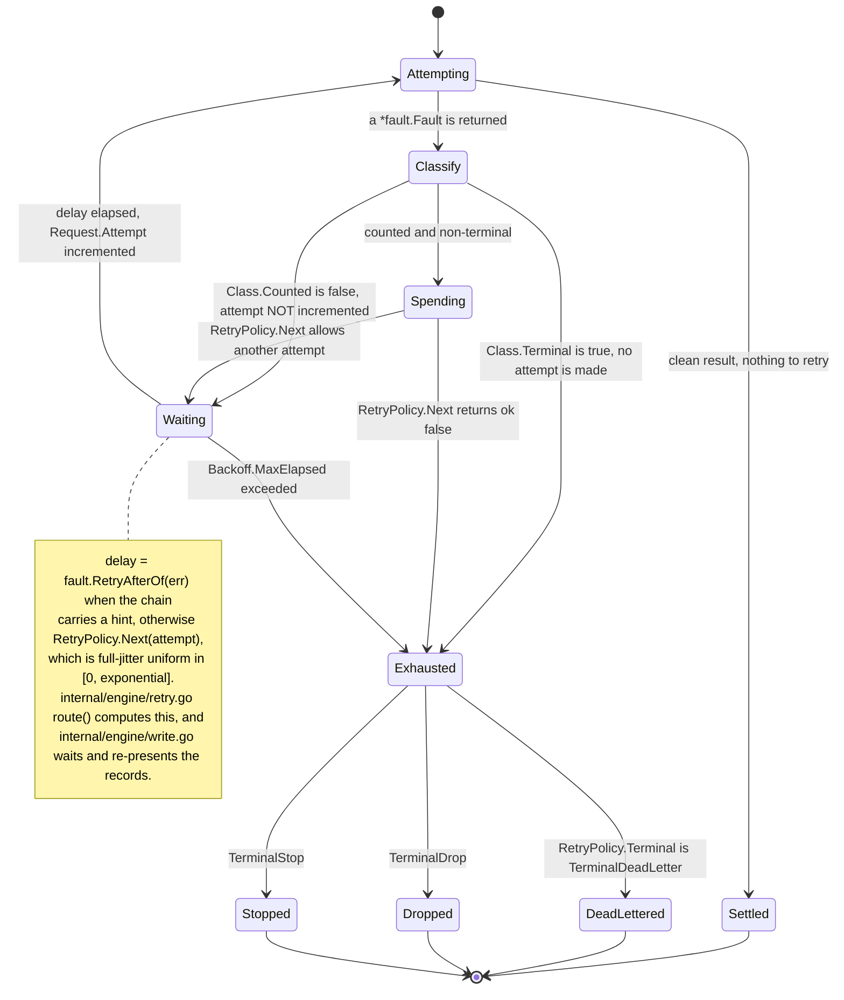

Every path out of `Exhausted` is terminal because `TerminalInvalid` is the zero value that `Validate`
rejects — that is the mechanism, in `pkg/fault/retry.go:47-58`, that makes "retry forever"
inexpressible rather than merely discouraged. Only the arithmetic on the transitions is real code
(`RetryPolicy.Next`, `RetryPolicy.Validate`, `fault.RetryAfterOf`); the loop that would drive these
transitions does not exist yet, and neither does the forced reconnect before the final attempt that
`Backoff`'s doc comment promises.

```go
// RecordFault is one record's outcome, classified by the connector at the point
// of raise, keyed on framework-assigned identity rather than on a batch index.
type RecordFault struct {
	Record record.RecordID `json:"record"`
	Class  Class           `json:"class"`
	Op     Op              `json:"op"`
	User   string          `json:"user"`
	Dev    string          `json:"dev,omitempty"`
}

// RetryPolicy is the complete retry contract. There is no "retry forever" value:
// Terminal has no valid zero, so a policy that never gives up cannot be
// constructed. Benthos livelocks on a poison record because its default was
// unbounded and the community-reported symptom is a pipeline making no progress.
// canal refuses the option.
type RetryPolicy struct {
	MaxAttempts int // >= 1; 1 means no retry
	Backoff     Backoff
	Terminal    Terminal // required; TerminalInvalid is rejected by Validate

	// OnIndeterminate decides what happens to a record whose write may or may not
	// have landed, when the sink is not Idempotent. Default Stall.
	OnIndeterminate Indeterminacy
}

type Terminal uint8

const (
	TerminalInvalid Terminal = iota // zero value; Validate rejects it
	TerminalDeadLetter              // route on the node's Failed edge; settle Abandoned
	TerminalDrop                    // discard and count; settle Abandoned
	TerminalStop                    // stop the pipeline; settle nothing
)

type Indeterminacy uint8

const (
	IndeterminateStall Indeterminacy = iota // default: block the lane loudly
	IndeterminateRetry                      // accept possible duplicates
	IndeterminateDeadLetter                 // accept possible duplicates in the DLQ
)

// Backoff is full-jitter exponential — the only strategy canal offers — plus an
// escalation. Following database/sql's retry(), the final attempt is preceded by
// a forced reconnect, because an escalation is more useful than one more
// identical try.
type Backoff struct {
	Initial    time.Duration
	Max        time.Duration
	MaxElapsed time.Duration // 0 means bounded only by MaxAttempts
	Multiplier float64
}

func (p RetryPolicy) Validate() error
func (p RetryPolicy) Next(attempt int) (time.Duration, bool)
```

---

## 6. Lanes — the spine, as a type

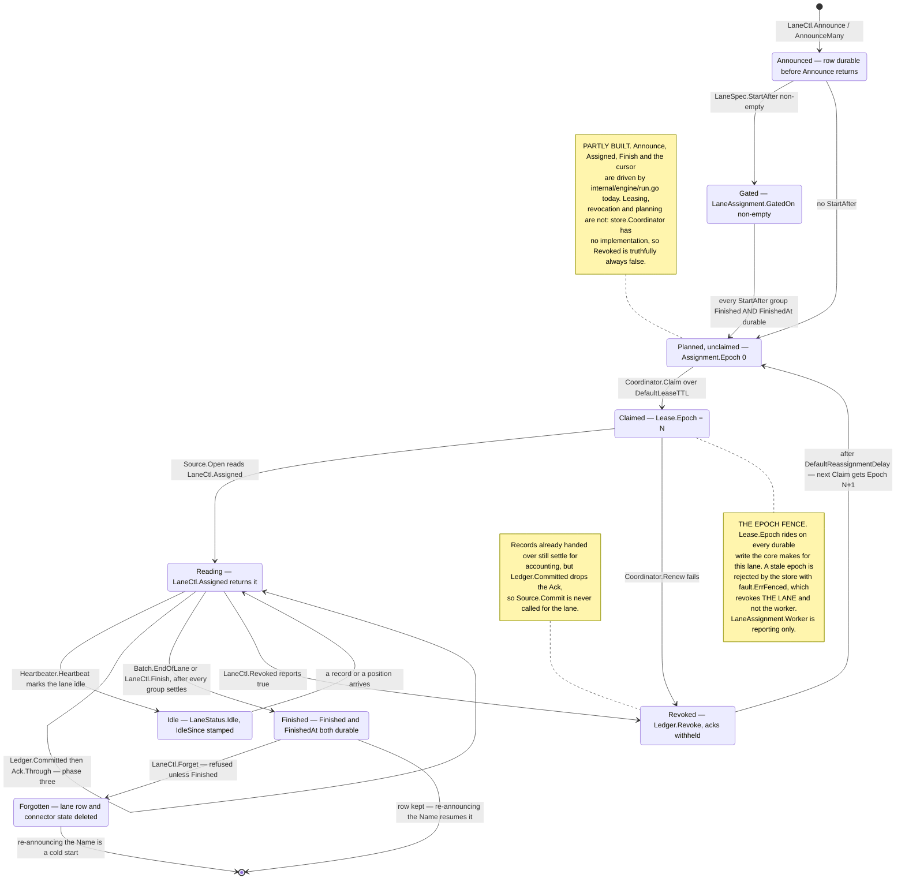

A lane's whole life, from a durable announcement to either a kept `Finished` row or a `Forget`: the states are `LaneAssignment` field combinations defined in `pkg/connector/lane.go`, the transitions are the methods in `pkg/connector/lanectl.go`, and the lease and epoch are `store.Lease` in `pkg/store/coordinator.go`. Read the `PARTLY BUILT` note literally. The announce-to-finish path runs today: `internal/engine/runtime.go` writes the durable lane row, `Finish` sets `FinishedAt`, and the cursor advances through `flushOnce`. Everything involving a LEASE does not: `store.Coordinator` has no implementation, so no lane has ever been claimed, revoked, planned or reassigned, and `Revoked` returns false because it is truthfully always false with one worker.

```go
// Package connector defines every interface a connector author implements and
// every handle the core injects.
//
// THE RULE FOR THIS WHOLE PACKAGE: behaviour is an optional exported interface;
// the FACT of that behaviour is declarative data in a Caps struct; registration
// cross-checks declared-against-implemented in one direction only; and the core
// type-asserts in exactly one place (Resolve).
//
// The reason for both halves: a type assertion cannot cross a process boundary,
// and a flag with no methods behind it is worthless. Data crosses the wire;
// interfaces do the work.
package connector

// Ordering declares how a lane's positions may be resolved.
type Ordering uint8

const (
	// OrderingPrefix: positions within the lane are totally ordered and a position
	// may be committed only when every earlier position has settled. A monotonic
	// cursor, an LSN, a binlog coordinate, a file byte offset.
	OrderingPrefix Ordering = iota

	// OrderingDiscrete: deliveries within the lane are independent and settle
	// individually, in any order. An SQS receipt handle, an AMQP delivery tag, a
	// Pub/Sub ack id. There is no cursor, so there is no prefix to resolve, and
	// every record MUST carry a handle.
	OrderingDiscrete
)

// Boundedness declares whether a lane ends.
type Boundedness uint8

const (
	Unbounded Boundedness = iota // tails forever
	Bounded                      // finishes; EndOfLane will arrive
)

// LaneKind is a REPORTING-ONLY classification. The core stores it, exports it to
// the read model, and uses it to compute scan-progress percentages.
//
// NOTHING IN THE CORE BRANCHES ON IT, and a CI grep asserts that. Debezium and
// Airbyte both smuggled a phase into their opaque checkpoint and both lost
// snapshot progress reporting, snapshot-specific parallelism and re-parallelised
// resume. Phase belongs in core as data, never as control flow.
type LaneKind uint8

const (
	LaneKindStream   LaneKind = iota // incremental, ongoing
	LaneKindScan                     // full read of existing state
	LaneKindBackfill                 // bounded historical catch-up that is not a full scan
)

// LaneSpec is what a source announces. It is simultaneously the lane's
// construction payload, its resume payload and its row in the assignment table.
// One type for all three, so they cannot drift — the structural defence against
// R1's dual-representation failure.
type LaneSpec struct {
	// Name is the source's own stable identifier. LaneID is derived from
	// (tenant, pipeline, node, Name), so the same Name across restarts is the same
	// lane and reuses its persisted state.
	//
	// It MUST be derived from stable content properties, not from an ephemeral
	// handle. Vector's file source needs content fingerprinting precisely because
	// inodes get reused, and a lane whose name changes on restart silently
	// re-reads everything.
	Name string

	Stream      record.StreamName
	Kind        LaneKind
	Ordering    Ordering
	Boundedness Boundedness

	// Group labels this lane for ordering constraints. Opaque to the core.
	Group record.LaneGroup

	// StartAfter names lane groups that must be FINISHED AND DURABLE before this
	// lane may be assigned or read. This is the snapshot-to-stream handoff, as
	// core-enforced data.
	//
	// The core enforces it from the durable lane table, which the planner reads,
	// so it holds cluster-wide: a worker that happens to hold only the tail lane
	// cannot start tailing while other workers are still scanning. That failure —
	// a handoff that is pure connector convention and unimplementable in a
	// cluster — was the second fatal defect of the proposal this design is rooted
	// in, and this field is the whole fix. See ADR 0008.
	StartAfter []record.LaneGroup

	// Spec is the write-once opaque payload the source needs to CONSTRUCT this
	// lane: a key range, a starting LSN, a shard id, a topic partition. Persisted
	// with the lane row and handed back verbatim. The core never parses it.
	Spec record.Blob

	// Weight is an estimated record count, for progress reporting. Zero means
	// unknown, and the core reports unknown rather than zero.
	Weight uint64

	// Label is a human-readable rendering shown verbatim in the UI.
	// "scan chunk 3/8: id in ['acme','beta')", "changelog tail".
	Label string

	// Budget overrides the pipeline's default in-flight budget for this lane. Zero
	// means the default. A scan lane usually wants a larger budget than a tail.
	Budget int

	// MidLaneResume overrides SourceCaps.MidLaneResume for THIS lane; nil means the
	// source-wide declaration.
	//
	// Mid-lane resumability is a PER-LANE property that was declared once per source.
	// A connector's atomic chunk lanes cannot resume halfway — the chunk is re-read
	// from its lower bound or not at all — while its tail lane resumes from any LSN.
	// Declaring one value made either choice wrong for half the lanes: false forces
	// all-or-nothing commits on a tail that never needed them, true tells the core it
	// may commit inside a chunk that cannot restart there.
	//
	// It is a RUNTIME override affecting only where the core commits. Submit-time
	// negotiation still reads the source-wide declaration, because lanes do not exist
	// at submit time.
	MidLaneResume *bool
}

// LaneAssignment is what the core hands back at Open: the spec, the durable
// cursor, and the epoch that fences writes for it.
type LaneAssignment struct {
	ID   record.LaneID
	Spec LaneSpec

	// Cursor is the last DURABLY COMMITTED position for this lane, or the zero
	// Position when there is none (start from the beginning of the lane).
	//
	// This is the write-many half of the lane's durable state, separate from
	// Spec's write-once half. Flink CDC maintains a parallel SplitState class
	// hierarchy with downcasts because it conflated the two; two differently
	// lifetimed fields on one value deletes that hierarchy.
	Cursor record.Position

	// Epoch is this worker's fencing token for this lane. Every durable write the
	// core makes on this lane's behalf carries it, and the store rejects a stale
	// one. A connector never uses it directly; it is here so the read model and
	// the log can show it.
	Epoch uint64

	// Finished is true for a lane the core already considers complete. A source never
	// receives a finished lane in Assigned; it does from LaneView.Table with
	// IncludeFinished, which is what a watermark protocol and a self-retiring
	// transform read.
	Finished bool

	// FinishedAt is when the finish became DURABLE, zero until it is. A gate that
	// fires on "finished" without knowing whether that fact survived a crash is a gate
	// that can open twice.
	FinishedAt time.Time

	// GatedOn names the lane groups this lane is still waiting for. Non-empty means
	// the lane exists, is planned, and may not be read yet — the state Assigned omits
	// and a cluster-wide watermark protocol must see.
	GatedOn []record.LaneGroup

	// Worker is the instance holding the lease, empty when unheld. REPORTING only:
	// holding is never trusted for correctness, the Epoch is.
	Worker string
}

// LaneCtl is how a running source announces and retires lanes. It is injected,
// not implemented.
//
// This is the planner/placer separation: the source declares how work divides —
// by announcing lanes, continuously, whenever it likes — and the runtime decides
// where each lane runs. Neither learns the other's algorithm.
//
// The difference from a Flink-style enumerator is that there is no separate
// enumerator ROLE and no assignment protocol in the required interface. A lane is
// "a progress domain the source told us about". That is what makes "scan with 20
// lanes then stream with 1" expressible without restarting anything, and it is
// what makes Kafka Connect's eight-year advisory-tasks.max problem structurally
// absent: MaxLanes is enforced on the first violation.
// LaneView is the READ-ONLY view of the durable lane table, separate from LaneCtl
// because a transform and the read model must SEE the plan without being able to
// change it. ADR 0008's prescribed shadow transform cannot be written without it.
type LaneView interface {
	// Table returns rows of the DURABLE, CLUSTER-WIDE lane table, including rows this
	// worker does not hold, rows that are gated, and rows that are finished.
	//
	// This is the enumeration Assigned deliberately does not provide. Assigned answers
	// "what am I responsible for right now"; Table answers "what does the plan look
	// like". A concurrent-snapshot watermark protocol needs the second: the tail lane's
	// emit-or-drop decision is a function of every chunk's range and finish state
	// CLUSTER-WIDE, and computing it from one worker's assignment is how a chunked scan
	// silently drops rows another worker had already emitted.
	//
	// PAGINATED, because the answer can be 10^5 rows. Pass the last returned id as
	// q.After; an empty result is the end. Not a snapshot across pages: a consumer that
	// needs a consistent plan re-reads until two consecutive passes agree, which is
	// cheaper and more honest than a core-held cursor whose lifetime nobody can bound.
	Table(ctx context.Context, q LaneQuery) ([]LaneAssignment, error)
}

// LaneQuery filters and pages Table. The zero value returns the first page of
// unfinished, ungated rows for every stream.
type LaneQuery struct {
	After           record.LaneID
	Limit           int
	Streams         []record.StreamName
	Kinds           []LaneKind
	Groups          []record.LaneGroup
	IncludeFinished bool
	IncludeGated    bool
}

// IT IS ALSO THE CHEAPEST PLACE IN CANAL TO ABSORB A NEW NEED, deliberately. Nothing
// outside the core implements LaneCtl, so a method added here costs connector authors
// nothing and costs the future out-of-process adapter one forwarder canal writes once.
// Six of the eight hostile connectors needed something from the lane table; all six are
// served from this one interface rather than from six new optional capabilities.
type LaneCtl interface {
	LaneView

	// Announce declares a lane. The core persists the row — atomically, together
	// with any state write in flight — BEFORE returning. On return the lane exists
	// durably, so a crash cannot lose the fact that it was planned.
	//
	// Announce is idempotent on Name: re-announcing an existing lane with an identical
	// Spec returns its id.
	//
	// RE-ANNOUNCING WITH A DIFFERENT SPEC is PermanentContract when the lane has a
	// durable cursor and is not finished, because silently rewriting the construction
	// payload under a live resume point is how a resume lands at the wrong place. It is
	// ACCEPTED, replacing the Spec, when the lane is finished or has no durable cursor:
	// a stream that disappeared and came back, a chunk re-planned before anything was
	// read from it, and a full-refresh pass re-deriving its range are all that case,
	// and refusing them stopped the pipeline for a re-announcement that was correct.
	// The acceptance emits EventLaneAnnounced with both Spec versions, so the rewrite is
	// visible rather than silent.
	//
	// It returns PermanentContract when announcing a NEW lane would exceed MaxLanes.
	// Re-announcing an existing lane NEVER fails on the cap, however low the running
	// binary's cap is — otherwise a rollback to a narrower binary cannot read the lane
	// plan it is holding, which is a self-inflicted outage on the recovery path.
	Announce(ctx context.Context, spec LaneSpec) (record.LaneID, error)

	// AnnounceMany announces every spec in ONE durable write, ids in the same order.
	//
	// A 900-stream cold start or a 32-way chunk plan is one transaction, not 900
	// serialised fsync round trips inside an Open the engine retries from the
	// beginning. StateHandle.SetMany already proves the store can write many keys
	// atomically; this is the lane table's use of the same guarantee. All-or-nothing.
	AnnounceMany(ctx context.Context, specs []LaneSpec) ([]record.LaneID, error)

	// Seed installs a lane's INITIAL cursor, for a lane whose resume point is knowable
	// only after the lane exists.
	//
	// LaneSpec.Spec is write-once construction state authored BEFORE StartAfter's gate
	// opens, but a tail lane's true starting position is the high watermark taken when
	// the scan it waits behind finished — which is after. Writing it through
	// StateHandle.Set instead is fenced on the TARGET lane's epoch, which the
	// announcing worker does not hold.
	//
	// PermanentContract when the lane already has a durable cursor: seeding establishes
	// a starting point and never rewinds a live one. Idempotent for an equal position.
	Seed(ctx context.Context, id record.LaneID, cursor record.Position) error

	// Finish requests retirement. The core does not consider the lane finished
	// until every group admitted for it has settled and that fact is durable, so
	// this is a request, not an assertion. Idempotent.
	//
	// LEGAL FOR AN UNBOUNDED LANE. The resulting Ack carries LaneFinished, so a source
	// retiring a revoked partition or a dropped stream learns the retirement became
	// durable instead of inferring it from silence.
	Finish(ctx context.Context, id record.LaneID) error

	// Forget removes a FINISHED lane's row and its connector state.
	//
	// Finish marks a lane complete and KEEPS the row, which is right for a bounded scan
	// whose completion is worth remembering and wrong for churn: a source whose streams
	// come and go accumulates the historical union of every stream it has ever seen plus
	// one row per reappearance, and the lane table becomes the largest thing in the
	// checkpoint (measured: 1800 to 1840 rows in one churn cycle over 900 streams).
	//
	// It is a source-initiated DECLARATION that this lane will never be resumed.
	// PermanentContract on a lane that is not finished, because forgetting a live lane
	// is a silent re-read of everything. Re-announcing the name afterwards is a cold
	// start, by definition.
	Forget(ctx context.Context, id record.LaneID) error

	// Assigned returns the lanes this source instance is responsible for right
	// now. In one-process mode that is every announced, unfinished, ungated lane.
	// In a cluster it is the subset this worker holds a lease on. The returned
	// slice is a snapshot.
	Assigned(ctx context.Context) ([]LaneAssignment, error)

	// Changes is closed and replaced whenever the assigned set changes. A source
	// that wants to react selects on it and calls Assigned again. A source that
	// does not care ignores it and will simply stop being asked for revoked lanes.
	Changes() <-chan struct{}

	// Revoked reports whether a lane is no longer this instance's to read. The
	// source must stop producing for it. Records already handed over settle for
	// accounting, but their acknowledgement is NEVER delivered to Commit — see
	// §12.4.
	Revoked(id record.LaneID) bool

	// Admission reports how much a lane can absorb RIGHT NOW, and gives an edge to
	// wait on.
	//
	// Blocking in Ledger.Admit is canal's whole source-side backpressure mechanism, and
	// for a PULL source it is sufficient: it observes nothing except that Read is not
	// called again yet. A PUSH source cannot use it. It holds a peer's open request
	// with a five-second deadline, and its only refusal path was to hand the batch over
	// and discover the pressure by TIMING OUT — measured at 601ms to produce a 503 that
	// was knowable at t=0.
	//
	// A snapshot: acting on it is a heuristic, never a guarantee, because the core still
	// enforces the budget by blocking. A source that ignores it stays correct.
	Admission(id record.LaneID) Admission
}

// Admission is the current in-flight allowance for one lane.
type Admission struct {
	// Budget is the CONFIGURED cap in records; Headroom is how many more may be
	// admitted before Admit blocks. Two numbers, because a lane at 0 of 1000 and a lane
	// at 0 of 10 are different diagnoses.
	Budget   int
	Headroom int

	// Known is false when the lane is not registered — revoked, forgotten, never
	// announced. Headroom is then meaningless and must not be read as zero headroom.
	Known bool

	// Blocked reports that an admission is waiting on this lane right now.
	Blocked bool

	// Ready is closed when headroom becomes available, and replaced. It is the edge a
	// push source selects on together with its peer's deadline, so a refusal is issued
	// when the answer is known rather than when the clock runs out. Nil when !Known.
	Ready <-chan struct{}
}
```

### 6.1 The optional durable-state helper

```go
// StateHandle is a byte-oriented, epoch-fenced durable store with TWO SCOPES: one
// slot per lane, and one slot per source NODE.
//
// A source that keeps its progress upstream — Kafka (the broker holds the
// offset), SQS (deleting the message IS the commit), a webhook (there is no
// position) — never touches it. A source whose progress is a cursor uses
// AutoPersist and writes no persistence code at all.
//
// THE NODE SCOPE EXISTS BECAUSE SOME STATE MUST PREDATE EVERY LANE. A stream-to-lane
// index, a full-refresh pass counter, the set of lane ids a planner has already
// announced: all read before the first lane is announced, none belonging to a lane. With
// only a lane scope they had nowhere durable to live, and the workaround — inventing a
// bookkeeping lane that produces no records — is a lane the ledger must budget, gate,
// fence, revoke and report on for no reason.
//
// Schema history is NOT what the node slot is for. It lives in the core's checkpoint,
// published through SourceRuntime.Declare, committed atomically with the cursors that
// decode against it. A source persisting its own schema history has two records of one
// fact that can diverge, which is the failure §13 exists to prevent.
//
// It is NOT optional for a source declaring UpstreamRetention: PrunesOnCommit.
// See §12.2 and ADR 0006: for that class of source, canal's own durable record
// must exist before the source is told to advance, so Build refuses such a
// source against a deployment with no usable StateStore.
type StateHandle interface {
	// Get returns the blob and its CAS version, or (zero, 0, nil) if absent.
	Get(ctx context.Context, lane record.LaneID) (record.Blob, uint64, error)

	// Set writes if the stored version matches ifVersion (0 means "must not
	// exist"), and if the caller still holds the lane's epoch.
	//
	// A version or epoch mismatch is fault.ErrFenced, NOT PermanentContract:
	// another worker holds this lane, so this LANE is revoked and the pipeline is
	// not. A stale CAS on one lane terminating a whole worker was a major defect
	// in the rooted proposal.
	Set(ctx context.Context, lane record.LaneID, b record.Blob, ifVersion uint64) (uint64, error)

	// Shared reads the NODE-scoped slot; SetShared writes it, CAS-fenced.
	//
	// SetShared is fenced on the NODE's assignment rather than on a lane's, because it
	// belongs to no lane. Where several workers run the same source node it is therefore
	// contended, and the loser gets ErrFenced and re-reads — which is correct: the slot
	// holds a PLAN, and two workers writing two plans is the thing to refuse.
	Shared(ctx context.Context) (record.Blob, uint64, error)
	SetShared(ctx context.Context, b record.Blob, ifVersion uint64) (uint64, error)

	// SetMany writes several lanes AND the node slot atomically — all or nothing across
	// the whole StateWrite. One SQL transaction, one bbolt transaction, one etcd Txn.
	// Kafka Connect's compacted-topic store cannot meet this and its own javadoc
	// documents the resulting unrecoverable state with "no obvious way to resolve the
	// issue".
	//
	// Atomicity here is not a nicety: a stream-to-lane index in the node slot and the
	// lane cursors it indexes must move together, or a restart reads one stream's
	// progress under another stream's name.
	SetMany(ctx context.Context, w StateWrite) error

	Delete(ctx context.Context, lane record.LaneID) error
}

// StateWrite is one atomic SetMany transaction.
type StateWrite struct {
	// Lanes is the per-lane slots, each fenced on its OWN lane's epoch.
	Lanes map[record.LaneID]Write

	// Shared is the node-scoped slot, in the same transaction. Nil leaves it untouched.
	Shared *Write
}

type Write struct {
	Blob      record.Blob
	IfVersion uint64

	// Epoch is the lease epoch this entry is fenced on. ZERO means the epoch the core
	// currently records for the entry's lane, which is every single-lane case and was
	// the only behaviour available.
	//
	// Each lane is its own assignment with its OWN lease epoch, while store.Batch
	// carried one epoch for the whole transaction. A worker holding 32 lanes at 32
	// epochs had one number to offer: too high and a fenced worker's write is accepted
	// for lanes it has lost, too low and a valid write is refused for lanes it holds. A
	// per-entry epoch makes the multi-lane atomic write SetMany exists for actually
	// fenceable.
	Epoch uint64
}

// AutoPersist wires the common case so the 90% source writes no persistence code:
// on every Commit, write the position's Token under the lane, epoch- and
// CAS-fenced; on Open, hand back the stored token.
//
// It is a HELPER OVER THE INTERFACE constructed by the connector, not a core
// behaviour — except that the core's own three-phase commit already persisted the
// lane cursor before Commit was called (§12.2). AutoPersist therefore exists for
// sources whose upstream needs a *second*, source-shaped write (a consumer-group
// commit, a slot advance) and for sources that want their own encoding.
//
// This is the reduction Benthos leaves out-of-tree, which is why every one of its
// CDC connectors re-wires it with its own key, its own format and its own bugs.
func AutoPersist(rt SourceRuntime) *Persister

type Persister struct{ /* ... */ }

func (p *Persister) Commit(ctx context.Context, a Ack) error
func (p *Persister) Restore(lane record.LaneID) (record.Blob, bool)
```

---

## 7. `Source` — four methods, frozen

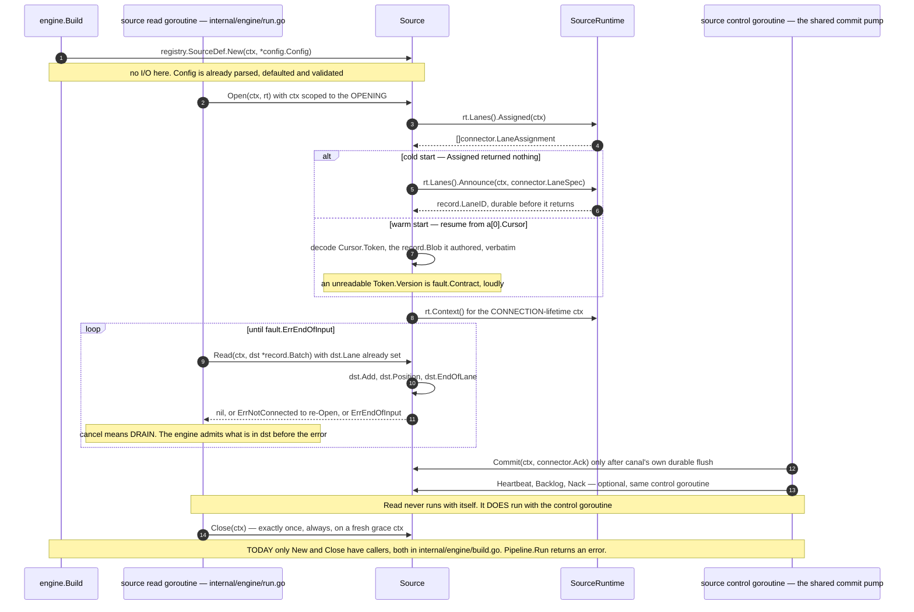

The four frozen methods and the two goroutines that call them, exactly as specified in
`pkg/connector/source.go` and `internal/engine/doc.go`; the cold/warm split is the one
`internal/example/linefile/source.go` actually implements, and the discriminator is whether
`Assigned` returned anything, never a nil test on a position. Everything on the two engine
lifelines is contract, not code — `internal/engine/build.go` calls only `New` and, through
`Pipeline.Close`, `Close`.

```go
// Source is the required source interface. Four methods. Frozen: no method will
// ever be added to it. New core capabilities arrive through the SourceRuntime
// interface (which the core implements, so growing it breaks nothing) or as new
// optional interfaces plus a Caps field.
//
// Kafka Connect added pluginMetrics() to a required interface and the official
// javadoc now instructs connector authors to write
// `catch (NoSuchMethodError | NoClassDefFoundError)`. Flink has five
// default-throwing UnsupportedOperationException methods and three Sink API
// rewrites. Both are the cost of not freezing.
type Source interface {
	// Open establishes whatever connection the source needs and reads its
	// assigned lanes. It may do I/O.
	//
	// It will be called again, with backoff, after any method returns
	// fault.ErrNotConnected, so it MUST be idempotent.
	//
	// CONTEXT LIFETIME: ctx is scoped to the OPENING and may be cancelled the
	// instant Open returns. A source needing a connection-lifetime context takes
	// rt.Context(). This is stated on the method because database/sql found it
	// necessary to narrow the same parameter in prose, and because a connector
	// holding connections tied to a dead context is the commonest first bug.
	Open(ctx context.Context, rt SourceRuntime) error

	// Read fills dst and sets dst.Position for a prefix lane. It blocks until at
	// least one record is available, A POSITION ADVANCES, the connection drops, or
	// ctx is done. dst is owned by the caller and reused; the source must not retain
	// it. Records are produced ONLY through dst.Add() or dst.AddFor().
	//
	// dst.Lane is ALREADY SET to the lane this batch's allocator stamps and a source
	// must not change it: the ledger refuses a batch whose records disagree with it. A
	// source serving more than one lane implements LaneReader (§10) and is handed one
	// batch per lane.
	//
	// RETURNING ZERO RECORDS WITH AN ADVANCED dst.Position IS LEGAL and is how a lane
	// makes progress without producing anything: a page of already-seen rows, a fully
	// filtered tail, a planner that only planned, a poll that only proved idleness. The
	// ledger admits it with zero references and resolves it at admission, so the
	// position enters the prefix in order. Zero records AND no position is a spin: the
	// core raises PermanentContract on the second consecutive one.
	//
	// A FAULT RETURNED FROM READ SPENDS A RETRY ATTEMPT, with two uncounted exceptions
	// that are flow control rather than failure: fault.NotConnected, which requests a
	// reconnect, and fault.Throttled, which requests a wait. Both are bounded by
	// RetryPolicy.Backoff.MaxElapsed and by nothing else, which is what lets a source
	// honour an upstream's Retry-After for as long as the upstream asks without burning
	// the four attempts a poison record needs. See fault.Class.Counted.
	//
	// CANCELLATION MEANS DRAIN, NOT ABORT. If ctx is cancelled, or is cancelled
	// while Read is running, the source stops retrieving new records from upstream
	// and returns whatever it has already buffered. When nothing is left it
	// returns ctx.Err(). Almost nobody gets this right by accident, which is why
	// it is stated here rather than assumed.
	//
	// Returns fault.ErrNotConnected to request a reconnect, or fault.ErrEndOfInput
	// when every lane it holds is finished and no more will be announced.
	//
	// CONCURRENCY: Read is never called concurrently with itself. It MAY run
	// concurrently with Commit, Heartbeat, Backlog and Nack, which the core calls
	// on one separate control goroutine and never concurrently with each other.
	// So a source needs at most one mutex, protecting only state shared between
	// its read path and its progress path — and a source using AutoPersist needs
	// none, because the Persister is already safe.
	//
	// The alternative — promising that Commit never runs concurrently with a
	// blocking Read — is unsatisfiable, and it was a fatal defect in two
	// proposals: an idle tail source either never commits or needs locks the
	// contract denies.
	Read(ctx context.Context, dst *record.Batch) error

	// Commit is called when a lane's progress has advanced: records this source
	// handed over are now durable downstream AND canal's own record of that
	// position is durably flushed.
	//
	// WHAT THIS MEANS IS ENTIRELY THE SOURCE'S DECISION. Advance a cursor. Delete
	// the queue messages. Commit a consumer-group offset. Advance a replication
	// slot. Do nothing. The core does not care and does not check.
	//
	// Commit is NEVER called for a lane whose lease this worker has lost. That is
	// the fence, and it is why an upstream can never be advanced past data the new
	// holder has not delivered.
	//
	// Returning an error is ESCALATED, not logged and dropped: the engine
	// classifies it, retries per policy, and raises CondDegraded with reason
	// commit_failed if it cannot succeed. "We delivered the data and silently lost
	// the progress record" — Benthos's actual behaviour, `_ = ackFn(...)` — is not
	// reachable here.
	Commit(ctx context.Context, a Ack) error

	// Close releases resources. It is called EXACTLY ONCE, ALWAYS, including after
	// a failed Open and including when Open was never called at all (config
	// validation calls the constructor and then Close). It receives a FRESH
	// context carrying the shutdown grace period, never the cancelled read
	// context. All network calls in Close must have a timeout.
	Close(ctx context.Context) error
}

// Ack is what the core tells a source about settled work. It is a plain
// serialisable struct: no closures, no channels, no interface fields, so it
// crosses a process boundary unchanged.
type Ack struct {
	Lane  record.LaneID `json:"lane"`
	Epoch uint64        `json:"epoch"`

	// Through is set for OrderingPrefix lanes: the highest position such that it
	// and everything before it in this lane has settled, its Safe flag is true,
	// and canal's own durable write of it has been flushed. Zero when Handles is
	// used instead.
	Through record.Position `json:"through,omitempty"`

	// Handles is set for OrderingDiscrete lanes: exactly the delivery handles that
	// LANDED, in no particular order. Nil for prefix lanes.
	//
	// Handles rather than positions, because a queue source must be able to settle
	// individual messages. One position per batch forced a queue source to delete
	// all ten or emit ten one-record batches with ten times the API calls, which
	// was a major defect in the rooted proposal.
	Handles [][]byte `json:"handles,omitempty"`

	// AbandonedHandles is the discrete-lane counterpart of Abandoned: exactly the
	// handles that reached a terminal disposition instead of landing.
	//
	// BOTH lists are populated for a PARTIALLY abandoned group. The ledger used to
	// withhold such a group's handles ENTIRELY — nine landed, one was dead-lettered, and
	// the source was told about none of the ten — so nine peers waited to their
	// deadlines for an answer that already existed. A count next to a list was the shape
	// of the bug: a source could see that something had been abandoned and never which.
	AbandonedHandles [][]byte `json:"abandoned_handles,omitempty"`

	// Records is how many records this ack covers.
	Records uint64 `json:"records"`

	// Abandoned is how many of those reached a terminal disposition (dead-letter
	// or drop) rather than landing at the sink.
	//
	// A source whose commit is DESTRUCTIVE — deleting a queue message — may refuse
	// to advance when this is non-zero, leaving the message for another consumer.
	// The core surfaces the number and the source chooses; the core never makes
	// that choice on a source's behalf.
	Abandoned uint64 `json:"abandoned"`

	// AbandonedBy attributes the abandonments to the sink nodes that caused them, so a
	// destructive-commit source can tell a BY-DESIGN load shed from a real dead-letter.
	//
	// In a fan-out to four sinks where one branch is a best-effort metrics feed declared
	// spec.Edge.BestEffort, a shed on that branch is expected and a shed on the warehouse
	// branch is not. One uint64 made them identical, so the only safe reading of any
	// non-zero Abandoned was "refuse to advance" — which turns a deliberate best-effort
	// branch into a permanent stall of the whole lane.
	//
	// A BestEffort edge contributes NO reference at all, so it never appears here; nodes
	// that do appear are nodes whose loss is real.
	AbandonedBy map[record.NodeID]uint64 `json:"abandoned_by,omitempty"`

	// LaneFinished is true on the final ack for a FINISHED lane, bounded or not. After
	// it, Commit is not called for the lane again.
	//
	// It covers retirement by LaneCtl.Finish and by Batch.EndOfLane on an unbounded lane
	// just as it covers a bounded lane running out, so a source retiring a revoked
	// partition or a dropped stream learns the retirement became durable rather than
	// inferring it from silence.
	LaneFinished bool `json:"lane_finished"`
}
```

**Partial acceptance of a commit.** `Commit` returns `error`, not a position, and that is deliberate:
the core already persisted the cursor in phase two, so there is nothing for the source to negotiate. A
source that declines to advance because `Abandoned > 0` returns `nil` and simply does not advance its own
upstream; the *core's* cursor is already correct, so the read model's `Committed` never reports progress
that was not persisted. This is the fix for the rooted proposal's "watermark reports progress that was
never persisted" defect: the watermark comes from canal's durable write, not from the resolver and not
from the source.

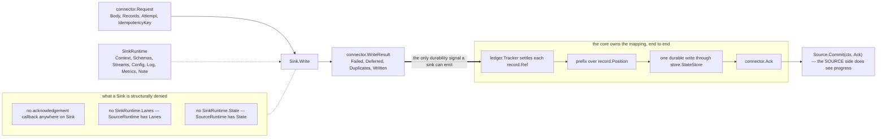

The asymmetry §8 is named after, verified against `pkg/connector/runtime.go`: `SourceRuntime`
declares `Lanes()` and `State()`, `SinkRuntime` declares neither, and `Sink` in
`pkg/connector/sink.go` has no callback — so a sink has no expressible way to claim progress
except by returning a clean `WriteResult`, which is what designs R4's exposure out at the type
level rather than in prose.

### 7.1 Optional source interfaces

Each is exported, each has exactly one corresponding `Caps` field, each is asserted in one place.

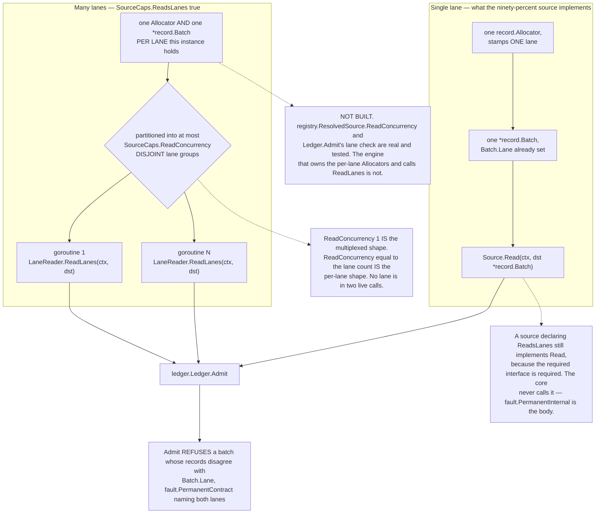

One lane per `Source.Read` versus many per `LaneReader.ReadLanes`, defined in `pkg/connector/source.go` and `pkg/connector/source_optional.go`; the concurrency bound is computed by `(*ResolvedSource).ReadConcurrency(parallelism)` in `pkg/registry/resolve.go:44`, which clamps to `spec.Spec.Parallelism` so the operator's number always wins downward. The one piece that is genuinely implemented is the guard at the bottom — `internal/ledger/ledger.go:216-223` rejects a batch whose records were stamped for a different lane than `Batch.Lane`, which is what turns ADR 0026's silent mislabelling into a loud contract fault.

```go
// LaneReader upgrades a source from "one lane per Read" to "MANY LANES PER CALL".
//
// THE PROBLEM IT SOLVES, which four of the eight hostile connectors hit independently and
// all four rated FATAL: Source.Read is handed ONE record.Batch, and a batch is bound to one
// Allocator, which stamps one lane. A worker holding 32 chunk lanes, a source with 900
// discovered streams, and a 32-way parallel scan running concurrently with a CDC tail
// therefore have no way to emit for more than one lane per call. Setting record.Batch.Lane
// looked like the escape and was worse than no escape: it mislabelled every record's
// Origin.Lane SILENTLY, measured at 33350 of 33500 records attributed to a lane they did
// not come from.
//
// THE SHAPE. The engine owns one Allocator and one Batch per lane this instance holds,
// hands the source a slice of them, and the source fills whichever it has data for. No
// Allocator is ever retargeted, so provenance stays unforgeable and generation-local ids
// stay unique per lane; no batch is touched by two goroutines, so the Allocator's
// single-goroutine rule survives; each batch carries its own Position, so per-lane cursors
// need no second vocabulary.
//
// ONE INTERFACE, NOT TWO, and the reason is worth stating because two shapes were proposed.
// A per-lane ReadLane(ctx, lane, dst) suits the 32 independent chunk readers and is
// UNUSABLE for the 900 multiplexed streams, where one upstream connection decides which
// lane the next record belongs to and 900 blocked goroutines is not an implementation. A
// batch-of-batches ReadLanes suits the multiplexed source and, with
// SourceCaps.ReadConcurrency, also suits the independent one: the engine partitions the
// held lanes into at most ReadConcurrency DISJOINT groups and calls ReadLanes once per
// group on its own goroutine, so declaring 32 with 32 lanes IS the per-lane shape and
// declaring 1 IS the multiplexed one.
//
// Source.Read stays FROZEN and stays what the ninety-percent source implements. A source
// declaring ReadsLanes still implements Read — the required interface is required — and the
// core never calls it; returning fault.PermanentInternal from it is the correct body.
type LaneReader interface {
	// ReadLanes fills any subset of dst and returns.
	//
	// Every batch in dst is PRE-BOUND: dst[i].Lane is set, its allocator stamps that lane,
	// and it has been Reset. The source sets dst[i].Position for a prefix lane and produces
	// records only through dst[i].Add or dst[i].AddFor. It must not retain dst or any batch
	// in it past the return, and must not reorder or re-slice dst.
	//
	// It BLOCKS until at least one record is available on at least one lane, a position
	// advanced on at least one lane, the connection drops, or ctx is done. Filling nothing
	// and returning nil is legal ONLY when at least one batch carries an advanced Position —
	// a return with no records and no position is a spin, and the core raises
	// PermanentContract on the second consecutive one rather than burning a core.
	//
	// CANCELLATION MEANS DRAIN, exactly as in Read. The engine admits what is in EVERY
	// batch BEFORE handling the error, so a source must never discard records it has
	// already produced.
	//
	// fault.ErrEndOfInput only when EVERY lane it holds is finished and no more will be
	// announced. A single finished lane is that batch's EndOfLane, not an error.
	//
	// CONCURRENCY: up to SourceCaps.ReadConcurrency calls at once, each with a DISJOINT set
	// of lanes, each on its own goroutine, and no lane in two live calls. A source declaring
	// 1 needs no locking between calls; one declaring more needs whatever its own upstream
	// client needs and nothing more, because the batches never overlap. The control
	// goroutine — Commit, Heartbeat, Backlog, Nack — still runs concurrently with all of
	// them.
	ReadLanes(ctx context.Context, dst []*record.Batch) error
}

// Discoverer enumerates what a source can read, before a pipeline runs. This is
// what populates a stream picker with zero frontend code and makes drift a diff
// against a stored catalog.
//
// A source with no catalog (webhook, socket, metrics scrape) simply does not
// implement it, and the UI shows "streams known only at runtime" rather than an
// empty table. That is the answer to "what is the minimum viable Discover": the
// minimum is not implementing it. Making Discover required would tax exactly the
// sources that can least afford it.
type Discoverer interface {
	Discover(ctx context.Context) (Catalog, error)
}

type Catalog struct {
	Streams   []StreamDesc `json:"streams"`
	Truncated bool         `json:"truncated"` // the source stopped early; there are more
	At        time.Time    `json:"at"`
}

type StreamDesc struct {
	Name record.StreamName `json:"name"`
	// Schema is nil when not knowable without reading.
	Schema *schema.Schema `json:"schema,omitempty"`
	// Keys are candidate identity field paths, in preference order.
	Keys [][]string `json:"keys,omitempty"`
	// KeysFixed means the source dictates the key and the operator may not choose
	// another. This is Airbyte's source_defined_primary_key as data, so a
	// connector constrains operator choices without any code in the core or the UI.
	KeysFixed bool `json:"keys_fixed"`
	// Supports declares which lane kinds this stream can produce, so the UI greys
	// out "initial scan" for a stream that cannot be scanned.
	Supports         []LaneKind `json:"supports"`
	EstimatedRecords uint64     `json:"estimated_records,omitempty"` // 0 means unknown
	EstimatedBytes   uint64     `json:"estimated_bytes,omitempty"`
	Label            string     `json:"label,omitempty"`
}

// Nackable lets a source observe terminal failures. Most sources do not want it —
// the core owns retry and dead-lettering — but a source that must park a message
// or notify upstream implements it.
//
// It is keyed on the source's OWN handle, never on a RecordID: a RecordID is
// assigned by the core after Read returned and the source has never seen it and
// cannot map it to a delivery.
type Nackable interface {
	Nack(ctx context.Context, lane record.LaneID, ns []Nack) error
}

type Nack struct {
	Handle   []byte      // for a discrete lane
	Position record.Position // for a prefix lane
	Class    fault.Class
	Reason   string
	Attempts int
}

// BacklogReporter answers "how much is left". Optional because for many sources
// it is unanswerable or expensive.
type BacklogReporter interface {
	Backlog(ctx context.Context, lane record.LaneID) (Backlog, error)
}

// EVERY QUANTITY IS A POINTER, for the reason EventTimeLag already documented on this
// same struct: nil means "I cannot answer", zero means "caught up", and a source that
// conflates them publishes a lie the UI cannot detect. A feed that knows its event-time
// lag but not its record count — a paged REST endpoint with no total — used to have to
// declare 0 records, which renders as "caught up" on a lane hours behind, or decline the
// whole capability and lose the lag it did know. connector.Count(n) is the one-line
// constructor.
type Backlog struct {
	Records *uint64 `json:"records,omitempty"`
	Bytes   *uint64 `json:"bytes,omitempty"`
	// Exact distinguishes a count from an estimate, and it is reported as its own
	// GAUGE, never as a label: a label would split the series whenever the source
	// changed strategy and break every graph. A SELECT COUNT(*) and a reltuples
	// estimate must not render identically.
	Exact bool `json:"exact"`
	// AsOf is when this was measured. A polled backlog with no AsOf implies a
	// liveness it does not have.
	AsOf time.Time `json:"as_of"`
	// EventTimeLag is how far behind the newest available record this lane is. Nil
	// when the source has no event time.
	EventTimeLag *time.Duration `json:"event_time_lag,omitempty"`
}

// Heartbeater lets a source be told "nothing has arrived for a while", so it can
// keep an upstream from pinning its own retention. Postgres logical replication
// needs exactly this: with no messages to acknowledge, the WAL is never reclaimed
// and the disk fills. Benthos ships this as a per-connector hack; it belongs in
// core.
//
// It is also what makes a GATED stream lane safe: a tail lane waiting behind a
// long scan is not being read, so only a heartbeat can hold its slot.
//
// IT STILL NEVER CARRIES A POSITION, and that is a decision rather than an omission: it
// runs concurrently with the read path, so a position arriving here has no defined order
// against records the read path has already produced, and committing it would advance
// the cursor past unsettled records. A source advances a cursor without producing a
// record through a ZERO-RECORD POSITIONED BATCH, which is ordered by construction.
//
// A heartbeat DOES mark the lane idle. The core stamps LaneStatus.Idle and IdleSince, so
// hundreds of healthy quiet streams stop reporting a forever-rising CheckpointAge —
// §16's primary alert signal — merely for having nothing to say.
type Heartbeater interface {
	Heartbeat(ctx context.Context, lane record.LaneID, idle time.Duration) error
}

// Validator is tier two of two-tier validation: it MAY do I/O and it returns
// per-field diagnostics, ALL of them, never a fail-fast throw and never one bool
// plus one string. Same interface for sources and sinks.
type Validator interface {
	Validate(ctx context.Context) config.Diagnostics
}

// Prober is a cheap liveness check, callable without initialising the component,
// returning a LIST of named results rather than a bool.
type Prober interface {
	Probe(ctx context.Context) ProbeResults
}

type ProbeResult struct {
	Label string   `json:"label"`
	Path  []string `json:"path,omitempty"`
	Err   error    `json:"-"`
	Error string   `json:"error,omitempty"`
}
type ProbeResults []ProbeResult

func ProbeOK(label string) ProbeResults
func ProbeFailed(label string, err error) ProbeResults

// ChoiceProvider backs config.Field.Choices: a NAMED HOOK returning valid values
// for a field given the partial config typed so far. "List the tables in this
// database", "list the topics", "list the buckets".
//
// A named hook rather than a live callback, because a callback cannot cross a
// process boundary. This is how a specialised connector UI is built with zero core
// knowledge: the core exposes GET /v1/connectors/{name}/choices/{hook} and
// forwards a string and a config tree.
type ChoiceProvider interface {
	Choices(ctx context.Context, hook string, partial *config.Config) ([]config.EnumValue, error)
}

// StateAdopter lets a connector declare which other connectors' persisted lane
// state it can read, so a rewrite or a rename is a declaration rather than an
// operator runbook.
type StateAdopter interface {
	AdoptsStateOf() []string
}
```

---

## 8. `Sink` — three methods, frozen, progress-blind

```mermaid
sequenceDiagram
    autonumber
    participant B as engine.Build
    participant E as sink node loop — internal/engine/run.go
    participant K as Sink
    participant RT as SinkRuntime

    B->>K: registry.SinkDef.New(ctx, *config.Config)
    E->>K: Open(ctx, rt, connector.Opening)
    Note over K: Opening carries Restored, Schemas, Streams, Guarantee — SHAPE, never progress
    K->>RT: rt.Streams(), rt.Schemas(), rt.Config(ctx)
    loop one connector.Request at a time, up to SinkCaps.MaxConcurrency in flight
        E->>K: Write(ctx, req) with req.Attempt = 1
        alt everything landed durably
            K-->>E: connector.AllWritten(req.Count), nil
        else the sink can name what failed
            K-->>E: WriteResult with Failed []fault.RecordFault, plus err
            Note over E: only the NAMED record.Ref values are re-requested, req.Attempt+1
        else the sink cannot know what landed
            K-->>E: empty WriteResult, err of class fault.Indeterminate
            Note over E: the WHOLE request is retried. Never partial-apply and report success
        end
        E->>E: res.Reconcile(req.Count) — a mismatch is fault.PermanentContract
    end
    Note over E,K: a Flusher sink is settled on Flush, NOT on Write's return
    E->>K: Close(ctx) — exactly once, always, even after a failed Open
    Note over B,RT: New and Close are called by Build; Open and Write by Run. The optional tiers below Flusher have no caller yet.
```

Three frozen methods and the three answers `Write` may give, from `pkg/connector/sink.go` — the
mid-batch failure is the middle branch, where only the records named in `WriteResult.Failed` come
back with a higher `Request.Attempt`, and the safe default is the bottom branch, where naming
nothing means nothing is claimed durable. `WriteResult.Reconcile` is real code
(`pkg/connector/sink.go`); the engine that would call it is not.

```mermaid
flowchart TD
    W["Sink.Write returns (res WriteResult, err error)"] --> E{"err == nil"}

    E -->|"yes"| A{"len(res.Failed) == 0"}
    E -->|"no"| B{"len(res.Failed) == 0"}

    A -->|"yes"| Q1["Q1 — every record in req.Records is DURABLE<br/>a sink returning this early has LIED"]
    A -->|"no"| Q2["Q2 — everything NOT named in res.Failed is durable<br/>each named record carries its own Class and reason"]
    B -->|"no"| Q3["Q3 — as Q2, and err is the headline for logs and status"]
    B -->|"yes"| Q4["Q4 — NOTHING claimed durable<br/>graceful degradation, the whole request is retried"]

    Q1 --> R{"res.Reconcile(req.Count)"}
    Q2 --> R
    Q3 --> R
    Q4 -.->|"see caption"| R
    R -->|"ok == false"| PC["fault.PermanentContract"]
```

The four quadrants of `Sink.Write` are a pure function of two booleans, and the unnamed-record default
is safe in each — defined in `pkg/connector/sink.go:30-58`, with `Reconcile` at `:250`. The Q4 edge is
dotted because the identity is **unsatisfiable there**: a verified probe of
`WriteResult{Written: 0}.Reconcile(500)` returns `ok=false, want=500`, so the documented
graceful-degradation shape fails the mandatory check unless the engine skips reconciliation when
`err != nil` — which no code and no prose currently says it does.

```go
// Sink is the required sink interface. Three methods. Frozen.
//
// A sink has NO acknowledgement callback and NO progress awareness whatsoever. It
// signals durability by returning a clean WriteResult. The core owns the mapping
// from "this request landed" to "that lane's cursor advanced".
//
// This asymmetry is the single most valuable property of the whole design: a new
// sink cannot get progress wrong, because it is never shown progress. Benthos's
// three-method output contract is the best thing in its API and it is preserved
// intact, while the core keeps the position mapping Benthos gives up.
type Sink interface {
	// Open connects and prepares. Same context narrowing and same re-callability
	// as Source.Open. It receives what it needs to create or alter the destination
	// BEFORE the first record that needs it — which is why Open exists rather than
	// folding into the constructor.
	Open(ctx context.Context, rt SinkRuntime, o Opening) error

	// Write delivers one request.
	//
	// SUCCESS AND FAILURE SHAPES, DECIDED TOGETHER (R7). All four quadrants are
	// specified, and the unnamed-record default is SAFE in every one:
	//
	//	(res, nil), res.Failed empty
	//	    every record in the request is DURABLE: it survives the loss of this
	//	    process and of the destination's process. The core will advance the
	//	    cursor past them. A sink returning this before durability has LIED, and
	//	    that is the only way to violate R4 in this design — which is the point.
	//
	//	(res, nil), res.Failed non-empty
	//	    every record NOT named in res.Failed is durable; the named ones are not,
	//	    each with its own class and reason.
	//
	//	(res, err), res.Failed non-empty
	//	    as above, and err is the headline for logs and status.
	//
	//	(res, err), res.Failed empty
	//	    NOTHING in the request is claimed durable. This is the graceful
	//	    degradation path for a sink that cannot report granularity, and it is
	//	    the correct default: the whole request is retried.
	//
	// A sink MUST NOT partially apply and report total success. If it cannot know
	// what landed it returns an error with Failed empty and Class Indeterminate.
	//
	// RECONCILIATION IS MANDATORY, not advisory: res.Written must equal
	// Count - len(res.Failed). The core checks it and raises PermanentContract on
	// a mismatch. A sink that miscounts is a sink whose durability claim cannot be
	// trusted, and this check is what stops "the sink reported only server-rejected
	// rows and the core committed past everything else".
	//
	// CONCURRENCY, EXHAUSTIVELY: up to Caps.MaxConcurrency Write calls may be in flight
	// on one Sink. EVERY OTHER METHOD THE CORE CALLS ON A SINK IS EXCLUSIVE WITH WRITE
	// AND WITH ITSELF — Open, Flush, Close, PrepareCommit, Commit, ResolveStale,
	// AbortStale, SnapshotState, RestoreState, WriteWithToken, LoadToken,
	// ApplySchemaChange and Prepare. The core quiesces the write path before each.
	//
	// The earlier version of this sentence named only Open, Flush and Close, and every
	// method it omitted is one that touches the same buffer Write appends to:
	// PrepareCommit seals it, SnapshotState reads it, RestoreState replaces it. A sink
	// cannot know that an unlisted method is exclusive, so the only safe reading was one
	// mutex over everything and MaxConcurrency 1 — a declared concurrency capability no
	// correct sink could use. The enumeration is CLOSED: a method added to a sink
	// capability in future is exclusive unless it says otherwise here.
	Write(ctx context.Context, req *Request) (WriteResult, error)

	// Close flushes and releases. Called exactly once, always, with a fresh
	// context carrying the grace period. Must not block indefinitely.
	Close(ctx context.Context) error
}

// Opening is what a sink is given at Open. A struct rather than parameters, so
// adding a field later is not a breaking change to every sink. This is the growth
// mechanism for the sink side, and it is why Sink itself can be frozen.
type Opening struct {
	// Restored is the id of the checkpoint being resumed from, absent on a cold
	// start. Data rather than two constructors, which is right on the sink side
	// because a writer's setup does not otherwise differ.
	Restored *uint64 `json:"restored,omitempty"`

	// Schemas are the schemas this sink will see, so it can create or alter the
	// destination before the first record needing it.
	Schemas []schema.Entry `json:"schemas"`

	// Streams names the logical streams that will be written, with the operator's
	// chosen destination mode per stream. Source-side mode and destination-side
	// mode are ORTHOGONAL: the source never learns whether the sink overwrites,
	// appends or upserts, which is what makes M x N combinations free.
	Streams []ConfiguredStream `json:"streams"`

	// Guarantee is the tier the core computed and validated. A sink may assert on
	// it: one requiring upsert semantics and handed DestAppend should fail Open
	// loudly rather than write wrong data.
	Guarantee Guarantee `json:"guarantee"`
}

type ConfiguredStream struct {
	Stream record.StreamName `json:"stream"`
	Mode   DestMode          `json:"mode"`
	Keys   [][]string        `json:"keys,omitempty"`
}

type DestMode uint8

const (
	DestAppend DestMode = iota
	DestUpsert
	DestOverwrite
	DestDelete
)

// Request is one already-encoded, already-framed, already-compressed unit of
// work. The sink implements TRANSPORT ONLY.
//
// This is the property that makes "add a sink: three methods, register, done"
// literally true, and it is constraint #4 applied to codecs as well as to
// connectors: N codecs times M connectors, with no multiplication. Add a codec
// and every sink gains it; add a sink and it gains every codec.
type Request struct {
	// Body is the encoded, framed, compressed payload. Empty only when Count is 0
	// or the sink declares StructuredInput.
	Body []byte

	// Records identifies what is in Body, in Body's order, without the payloads.
	// This is what a sink uses to build a WriteResult.
	Records []record.Ref

	// Rows is non-nil only for a sink declaring StructuredInput, and is then the
	// records themselves with no encoding applied. Exactly one of Body and Rows is
	// populated, decided at Build time, never at runtime — so there is no
	// per-request branch and no possibility of double-encoding.
	Rows []*record.Record

	// Partition is the key the engine's partitioner produced, if any. Every record
	// in this request shares it. This is how a generic sink gets per-table,
	// per-tenant or per-day batching without writing batching code.
	Partition string

	Count             int
	UncompressedBytes int

	ContentType     string // from the encoder
	ContentEncoding string // from the compressor; empty if none

	// Schema is the schema of these records. All records in one request share a
	// schema epoch: the engine never mixes epochs in one request, so a sink never
	// reconciles two shapes.
	Schema *schema.Ref

	// Attempt is 1 on first delivery, incrementing on retry. A sink may switch to
	// a safer, slower path on a late attempt.
	Attempt int

	// IdempotencyKey is a stable, engine-derived key for this exact request
	// content, present when the source declares StableKeys. A sink that supports
	// server-side idempotency forwards it; one that does not ignores it. This is
	// idempotency layer 3.
	IdempotencyKey string
}

// WriteResult reports what happened, per record where the sink can say.
type WriteResult struct {
	// Failed names records that did not land.
	Failed []fault.RecordFault `json:"failed,omitempty"`

	// Duplicates names records the destination recognised as already present. They
	// count as DURABLE — that is the whole point of an idempotent write — and are
	// reported separately so the rate is visible. A spike after restart is
	// expected; a sustained one is a symptom.
	//
	// Reporting a duplicate as SUCCESS is the direct fix for the R5 bug where an
	// event became permanently unresubmittable: "duplicate" must mean "already
	// durably stored", never "present in a RAM cache".
	Duplicates []record.RecordID `json:"duplicates,omitempty"`

	// Deferred names records that were ACCEPTED but are not yet durable, and that MUST
	// NOT be resent. It is the FOURTH answer a Flusher needs and the quadrant table did
	// not have.
	//
	// A sink whose durability cadence is coarser than the core's checkpoint cadence — a
	// 30-second warehouse batch inside a 1-second checkpoint — has to say something the
	// four quadrants cannot express: nothing new landed, nothing is lost, do not resend,
	// do not advance the cursor past these. Saying it as Failed resends data the sink is
	// still holding; saying it as durable is a lie.
	//
	// The core settles nothing for a deferred record and keeps it in flight against the
	// lane's budget, so the honest answer costs exactly the backpressure it deserves.
	// Meaningful only from Flush; from Write it is PermanentContract, because a Write
	// that defers everything is a Flusher that did not declare itself.
	//
	// Reconcile therefore checks Written == count - len(Failed) - len(Deferred).
	Deferred []record.RecordID `json:"deferred,omitempty"`

	// Written and Bytes feed the reconciliation pair (records in vs records out
	// per checkpoint) and are CHECKED, not merely reported.
	Written int64 `json:"written"`
	Bytes   int64 `json:"bytes"`

	// DestToken lets a sink hand back its own commit identity for display.
	// Opaque, rendered, never parsed.
	DestToken string `json:"dest_token,omitempty"`
}

func AllWritten(n int) WriteResult // convenience for the happy path
```

### 8.1 Optional sink interfaces

```mermaid
sequenceDiagram
    autonumber
    participant E as checkpoint pump — NOT BUILT: the flush loop writes lane cursors, not Checkpoints
    participant K as Sink — Committer plus WriterState
    participant ST as store.StateStore

    Note over E,ST: ONE CHECKPOINT, in this exact order
    E->>K: Flush(ctx, FlushCheckpoint)
    E->>K: PrepareCommit(ctx, CommitPoint) — SEALS
    K-->>E: []connector.Committable, each naming its Lanes and Cursors
    E->>K: SnapshotState(ctx, id) — RECORDS what is still OPEN
    K-->>E: []record.Blob
    Note over E,K: PrepareCommit BEFORE SnapshotState, or a sealed artifact lands twice
    E->>ST: ONE durable record under CommitPoint.ID — cursors, epoch, writer state, committables
    ST-->>E: flushed
    E->>K: Commit(ctx, cs) — only after that record is durable
    K--)E: answer lost. The commit LANDED and the confirmation timed out
    Note over E,ST: crash here. The committable survives inside the recovered checkpoint

    Note over E,ST: RECOVERY, in this exact order
    E->>K: Open(ctx, rt, Opening with Restored set to that id)
    E->>K: RestoreState(ctx, blobs) — RECOGNITION comes first
    E->>K: ResolveStale(ctx, cs) — preferred over AbortStale whenever declared
    K-->>E: []CommitOutcome — AlreadyCommitted for what landed, RetryLater for what is in doubt
    E->>K: Commit(ctx, recovered)
    E->>K: first Write(ctx, req)
```

The two orderings `pkg/connector/sink_optional.go` declares normative, drawn as one timeline: a
commit that succeeds and then loses its answer is exactly why `StaleResolver.ResolveStale` returns
a per-item `CommitOutcome` where `Committer.AbortStale` returns one naked error. Both orderings
exist only as doc comments and type signatures today — no checkpoint pump calls any of it, and
the only `store.StateStore` in the tree is in-memory.

```mermaid
flowchart LR
    REFS["req.Records []record.Ref<br/>req.Count entries, each Ref.ID a record.RecordID"] --> CALL["Sink.Write<br/>or Flusher.Flush"]
    CALL --> RES["connector.WriteResult"]

    RES --> WRIT["Written int64<br/>DURABLE — includes Duplicates"]
    RES --> DUPS["Duplicates []record.RecordID<br/>DURABLE — already landed"]
    RES --> DEFR["Deferred []record.RecordID<br/>NOT-ATTEMPTED-AGAIN — accepted, not yet durable,<br/>MUST NOT be resent; illegal from Write"]
    RES --> FAIL["Failed []fault.RecordFault<br/>FAILED — keyed on RecordFault.Record,<br/>never on a batch index"]

    FAIL --> SPLIT{"per entry:<br/>Class.Terminal()"}
    SPLIT -->|"false"| SUB["the RETRY SUBSET<br/>derivable from the result alone —<br/>no side table, no positional correlation"]
    SPLIT -->|"true"| TERM["RetryPolicy.Terminal<br/>dead-letter, drop or stop"]

    WRIT --> IDENT["res.Reconcile(count)<br/>Written == count - len(Failed) - len(Deferred)"]
    DEFR --> IDENT
    FAIL --> IDENT
    DUPS -.-> WRIT
```

This is R7 in one picture: a partial batch failure is reported per record by `RecordFault.Record`, a
framework-assigned `record.RecordID` that survives filtering and rebatching, and the retry subset then
falls straight out of `Class.Terminal()` with no side table — `pkg/connector/sink.go:196-257` and
`pkg/fault/record_fault.go`. `Deferred` is the fourth disposition and is meaningful only from
`Flusher.Flush`; the check is cardinality-only, so a `Failed` entry naming a record that was never in
the request still passes green.

```go
// Flusher declares that Write does NOT by itself make data durable and that
// durability is achieved by Flush.
//
// This is the honest form of buffered writing. The core does not settle records
// on Write for a Flusher sink; it settles them on the Flush that covers them.
// Making the ack point depend on which interface is present — rather than on a
// bool the sink sets — means weakening durability requires implementing a VISIBLE
// interface rather than being sloppy in prose.
//
// The core calls Flush before every checkpoint, on drain, on end of input and
// before applying a schema change, and it tracks exactly which requests each
// Flush covers, so a partial flush is representable.
type Flusher interface {
	// Flush makes every request written since the previous successful Flush
	// durable. reason lets a sink finalise differently at end-of-input (close the
	// file, write the manifest) than at a periodic checkpoint.
	//
	// A partial flush returns (res, err) naming what did not make it, exactly as
	// Write does, keyed on RecordID. Reporting an integer count here — as one
	// proposal did — makes the durable set uncomputable and the prefix
	// unresolvable.
	Flush(ctx context.Context, reason FlushReason) (WriteResult, error)
}

type FlushReason uint8

const (
	FlushCheckpoint FlushReason = iota + 1
	FlushEndOfInput
	FlushDrain
	FlushSchemaChange // the core is about to apply a DDL; quiesce first
)

// StructuredSink is the escape hatch for SDK-shaped destinations that must be
// given structured records rather than bytes: a warehouse streaming-insert API, a
// document driver, a vendor client that only accepts its own types.
//
// It is a DECLARED capability, not a runtime fallback: Request.Rows is populated
// and Request.Body is not, decided at Build time. The core refuses to attach an
// encoder to such a sink rather than silently double-encoding.
type StructuredSink interface {
	AcceptsStructured() bool // must return true; the method exists so the cross-check has a target
}

// Partitioner groups records into requests by a key the sink chooses. Usually a
// constant, sometimes a template over the record.
type Partitioner interface {
	Partition(r *record.Record) (string, error)
}

// SchemaApplier declares that this sink can act on schema changes. WHICH kinds it
// supports is DECLARED DATA on SinkCaps, not a method: a method would force Build
// to instantiate a sink in order to negotiate, which is exactly what "capabilities
// are queryable without instantiating anything" forbids.
type SchemaApplier interface {
	ApplySchemaChange(ctx context.Context, ch schema.Change) error
}

// Committer upgrades a sink to exactly-once via two-phase commit. THE ORDERING IS A
// NORMATIVE CONTRACT, not an implementation detail, and it is stated COMPLETELY here
// because every method the earlier version omitted is one that touches the very buffer
// the others are sealing.
//
// One checkpoint, in this exact order:
//
//	Flush(FlushCheckpoint)      make written data durable in the sink's own terms
//	  -> PrepareCommit(point)   SEALS: mints this checkpoint's committables
//	  -> SnapshotState(id)      RECORDS: WriterState's view of what is left OPEN
//	  -> [ lane cursors, schema epoch, writer state and committables are written
//	       as ONE durable record under point.ID ]
//	  -> Commit(committables)   called ONLY after that record is durable
//
// PrepareCommit BEFORE SnapshotState, and the order matters in one direction only: a
// sealed artifact must appear in the committables and must NOT also appear in the writer
// state, or recovery both commits it from the pending set and reopens it from the writer
// state and the file lands TWICE. Snapshotting after sealing makes that impossible; the
// reverse order makes it inevitable.
//
// Recovery, in this exact order:
//
//	Open(rt, Opening{Restored: &id})
//	  -> RestoreState(blobs)    RECOGNITION comes first
//	  -> ResolveStale / AbortStale
//	  -> Commit(recovered)
//	  -> first Write
//
// RestoreState BEFORE the stale resolution, because AbortStale's own job is to discard
// committables "this sink no longer recognises", and recognition IS the restored writer
// state. Aborting first asks the sink to disown artifacts it has not yet remembered
// owning, and a sink that answers honestly destroys its own committed data.
//
// THE CHECKPOINT SUBSUMING CONTRACT, verbatim and normative: confirmations are
// not guaranteed to arrive; ids strictly increase and a higher id SUBSUMES every
// lower one; an implementation must behave as if a non-confirmed checkpoint never
// happened. Abort means "as if never triggered; the next successful checkpoint
// covers a longer span" — it does NOT mean discard the artifacts.
//
// Commit MUST be idempotent and signals per item with DispositionAlreadyCommitted.
//
// CONCURRENCY: every method here is exclusive with Write and with itself; see §8's Write
// concurrency paragraph, which enumerates the full set.
type Committer interface {
	// PrepareCommit mints the committables for a checkpoint. Every committable names the
	// lanes and CURSORS it covers, so a failed commit can be dead-lettered with the
	// affected span named and the blast radius exact.
	//
	// It takes a CommitPoint rather than a bare id because the id alone cannot grow, and
	// the first thing it needed to carry was WHY. A staging sink must finalise
	// differently at end of input — seal the undersized file, write the manifest — than
	// at a periodic checkpoint, and with no reason on this call the only way to learn
	// end-of-input was to declare Flusher purely as a signal carrier, which MOVES THE
	// OPERATOR-VISIBLE ACKNOWLEDGEMENT POINT from commit to flush as a side effect of
	// needing one bool.
	PrepareCommit(ctx context.Context, p CommitPoint) ([]Committable, error)

	// Commit publishes everything up to and including the point that minted these.
	// Values in, values out — no mutable request callback, because a callback cannot
	// cross a wire and cannot be table-tested.
	Commit(ctx context.Context, cs []Committable) ([]CommitOutcome, error)

	// AbortStale discards committables the core found in a recovered checkpoint
	// that this sink no longer recognises, and committables whose Expires has
	// passed. Without it, a crash between PrepareCommit and checkpoint durability
	// orphans a staged artifact forever while the next checkpoint commits a cursor
	// past its records.
	//
	// ONE error for the whole batch, which suffices only for a sink whose abort cannot
	// partially succeed. A sink whose commit can time out AFTER landing implements
	// StaleResolver instead; the core prefers it whenever it is present.
	AbortStale(ctx context.Context, cs []Committable) error
}

// CommitPoint is the checkpoint a Committer is preparing for.
type CommitPoint struct {
	ID uint64 `json:"id"`

	// Reason is why this checkpoint is happening, in FlushReason's vocabulary — one enum
	// for one concept, not a second parallel one (R9). FlushEndOfInput is the one a
	// staging sink must see: the difference between "seal what is full" and "seal
	// everything, including the 4 MB file you hoped would reach 128 MB".
	Reason FlushReason `json:"reason"`

	// Deadline is when the core stops waiting; zero means none. A sink that cannot seal
	// everything in time returns what it sealed and leaves the rest for the next point,
	// which the subsuming contract makes safe.
	Deadline time.Time `json:"deadline,omitempty"`
}

// StaleResolver is AbortStale with a PER-ITEM answer, and it exists because a commit that
// can time out AFTER SUCCEEDING cannot be resolved with one naked error.
//
// For each recovered committable this sink knows one of three different things: the
// transaction PREPARED AND LANDED and must be committed rather than aborted; it is
// reclaimable and may be rolled back; or it is IN DOUBT and must be neither, because
// rolling back what landed loses data and committing what did not creates it. One error
// for a whole batch expresses none of them, so the only safe implementation was to
// attempt the COMMIT from inside the ABORT path — turning abort into a second commit path
// with no protocol behind it.
//
// It reuses the five existing Dispositions and invents nothing: Committed for one that
// landed, Aborted for one reclaimed, RetryLater for one still in doubt, DeadLetter for one
// whose covered span must be routed and whose prefix must NOT advance, AlreadyCommitted
// for one a previous attempt finished.
type StaleResolver interface {
	ResolveStale(ctx context.Context, cs []Committable) ([]CommitOutcome, error)
}

type Committable struct {
	Checkpoint uint64      `json:"checkpoint"`
	Handle     record.Blob `json:"handle"` // connector-authored, versioned

	// Node is the sink node that minted this committable, stamped by the ENGINE. A
	// fan-out graph has several Committer sinks and ONE pending set, so a recovered
	// committable with no author cannot be routed back to the sink that can commit it —
	// and Commit has no "not mine" answer, so the alternative was for every sink to
	// decode every other sink's opaque Handle and guess.
	Node record.NodeID `json:"node"`

	// Lanes and Cursors are the DURABLE identity and blast radius: which span of which
	// lanes is affected, after a restart, which is precisely when it matters.
	Lanes   []record.LaneID                   `json:"lanes"`
	Cursors map[record.LaneID]record.Position `json:"cursors,omitempty"`
	Records int64                             `json:"records"`

	// FirstRec and LastRec are IN-GENERATION provenance for a log line, and are
	// deliberately NOT PERSISTED.
	//
	// record.RecordID is documented as generation-local and never durable, so persisting
	// a pair of them inside a checkpoint produced two ids that name NOTHING after a
	// restart — which is exactly when a recovered committable is dead-lettered and
	// exactly when DispositionDeadLetter needs to know what it is withholding. Cursors is
	// the durable answer; these two live and die with the generation, which is the only
	// honest lifetime for them.
	FirstRec record.RecordID `json:"-"`
	LastRec  record.RecordID `json:"-"`

	// Attempt is 1 the first time this committable is presented to Commit, incrementing
	// on every re-presentation. Engine-populated. Without it a sink could not tell a
	// first commit from a re-presentation after a lost confirmation, so
	// DispositionAlreadyCommitted was either a guess or a probe of the destination on
	// every single commit. Request.Attempt already exists for the same reason.
	Attempt int `json:"attempt"`

	// Expires bounds how long a staged artifact may sit unpublished. On expiry the
	// core calls ResolveStale or AbortStale and raises CondDegraded. Flink's
	// silent-skip-with-a-warning-ratio is the honest treatment's opposite.
	Expires time.Time `json:"expires"`
}

type CommitOutcome struct {
	Handle      record.Blob `json:"handle"`
	Disposition Disposition `json:"disposition"`
	Fault       *fault.Fault `json:"fault,omitempty"`
}

// Disposition is the closed outcome set for a committable. FIVE values and NONE
// of them silently discards data: Flink's signalFailedWithKnownReason is
// documented as "only logs the error, discards the committable and continues",
// which canal must not copy. DispositionDeadLetter routes the covered records and
// does NOT advance the prefix past them.
type Disposition uint8

const (
	DispositionCommitted Disposition = iota + 1
	DispositionAlreadyCommitted
	DispositionRetryLater
	DispositionDeadLetter
	DispositionAborted
)

// WriterState lets a sink carry in-progress work across a restart (an open
// multipart upload, a staging table). Restored through Opening.Restored plus this
// interface's RestoreState.
//
// ORDERING against Committer is normative and stated there: SnapshotState runs AFTER
// PrepareCommit within a checkpoint, and RestoreState runs BEFORE the stale resolution at
// recovery. Either order reversed makes a Committer+WriterState sink double-commit a
// sealed file, so the two interfaces are documented as ONE PROTOCOL even though they stay
// two types.
//
// The state is keyed BY NODE in the checkpoint (§13), exactly as transform state already
// was. A single unkeyed slice meant a graph with two WriterState sinks handed each of them
// the OTHER's blobs at restore; the lucky case is a loud contract fault, the unlucky case
// is two nodes running the same connector, where the blobs decode perfectly and each sink
// adopts the other's open uploads.
type WriterState interface {
	SnapshotState(ctx context.Context, id uint64) ([]record.Blob, error)
	RestoreState(ctx context.Context, bs []record.Blob) error
}

// TokenSink is the strongest tier: the destination stores canal's checkpoint
// token transactionally with the data, so "the data landed but the state did not"
// is structurally impossible.
type TokenSink interface {
	// WriteWithToken writes the request and canal's token in ONE destination
	// transaction.
	WriteWithToken(ctx context.Context, req *Request, token record.Blob) (WriteResult, error)
	// LoadToken returns the token the destination holds, at Open.
	LoadToken(ctx context.Context) (record.Blob, bool, error)
}

// Preparer creates or verifies the destination before any data flows.
type Preparer interface {
	Prepare(ctx context.Context, streams []ConfiguredStream, ss []schema.Entry) error
}
```

---

## 9. Buffer, Transform, Codec

### 9.1 Buffer — the one place the ack chain may be shortened

```go
// Buffer is a pluggable node between the source side and the sink side.
//
// It is the ONLY component permitted to shorten the acknowledgement chain, and it
// may do so only by declaring a durability domain at least as wide as the lane's
// assignment domain — at which point the CORE, not the buffer, settles the group
// on a successful Put. A buffer cannot lie its way into early acknowledgement
// because it does not perform the settling.
//
// The interface documents when it weakens guarantees, following Benthos's
// exemplary doc comment: buffers are advanced components; if you are not certain
// you need one, you do not.
type Buffer interface {
	Open(ctx context.Context, rt BufferRuntime) error

	// Put offers a batch. Returns how many records were accepted and which were
	// refused. BOUNDED BY CONSTRUCTION: Put can always refuse, and a buffer with
	// no refusal path is not a buffer (R6).
	Put(ctx context.Context, b *record.Batch) (Accepted, error)

	// Get fills dst, blocking until something is available, until Drain has been
	// called and the buffer is empty (fault.ErrEndOfInput), or until ctx is done.
	//
	// Get is NON-DESTRUCTIVE: the records stay until Trim. One interface with a
	// destructive Pop and a separate non-destructive Trim is R6's
	// two-incompatible-models defect inside one type, and it makes a
	// popped-but-unsettled batch unrecoverable after a crash.
	Get(ctx context.Context, dst *record.Batch) error

	// Trim releases everything up to and including the given group, which the core
	// calls only after those records have settled downstream. For a durable
	// buffer this is what reclaims disk.
	Trim(ctx context.Context, through record.GroupID) error

	// Drain declares that no more Puts will come. Idempotent. This is how
	// end-of-input propagates through a stateful node.
	Drain(ctx context.Context) error

	// Depth reports occupancy for metrics and the read model.
	Depth() Depth

	Close(ctx context.Context) error
}

type Accepted struct {
	Records int
	// Refused is non-empty when the buffer took only part of the batch. The engine
	// applies the configured WhenFull policy to the remainder.
	Refused []record.RecordID
}

type Depth struct {
	Records, RecordCapacity int
	Bytes, ByteCapacity     int64
	OldestAge               time.Duration
}

// Durability is a buffer's durability DOMAIN, not a bool.
//
// A bool was a fatal defect: a WAL in one pod's data directory is process-durable
// and node-local, while the commit it authorises is global, so node loss or lane
// reassignment orphans the WAL after the source has already committed past it.
// A kill -9 conformance test proves process durability and says nothing about
// node loss.
type Durability uint8

const (
	DurabilityNone    Durability = iota // memory. Never shortens the ack chain.
	DurabilityProcess                   // survives a crash of this process only
	DurabilityNode                      // survives a process crash; lost with the node
	DurabilityCluster                   // survives node loss; readable by another worker
)

// WhenFull is the configured policy when a buffer refuses. There is no
// "unbounded" member: unbounded growth is inexpressible.
type WhenFull uint8

const (
	WhenFullBlock WhenFull = iota // apply backpressure. Default.
	// WhenFullDropNewest discards the incoming records and COUNTS them. Newest,
	// not oldest: dropping the oldest would discard data whose prefix the source
	// may already have been told is safe, breaking the cursor invariant.
	WhenFullDropNewest
	// WhenFullReject settles the group as Abandoned and lets the source see
	// Ack.Abandoned > 0. The rejection path R6 demands.
	WhenFullReject
	// WhenFullOverflow spills to the next buffer in the graph: a small memory
	// buffer in front of a large disk one, so the common case never touches disk
	// and a sustained sink outage still does not block.
	WhenFullOverflow
)
```

### 9.2 Transform — the full return vocabulary, no extra interfaces

```go
// Transform is the only node kind between source and sink. The full vocabulary
// lives in what the transform puts in out: N->0 filters, N->N maps, N->M expands
// or regroups. No extra vocabulary, no separate interfaces per case, no 1-to-1
// restriction — Kafka Connect's 1-to-1 SMT limitation is why its transform
// ecosystem is stunted and why conditional application needed its own KIP.
//
// Records placed in out MUST come from out.Derive(in-record) or
// out.Merge(in-records...). A freshly stamped record belongs to no group, and
// admitting one would break settlement. The core ENFORCES this: a record in out
// whose Group is not one of in's groups fails the conformance kit at build time
// and is fault.PermanentContract at runtime. Benthos states the same rule in a
// doc comment and cannot enforce it.
type Transform interface {
	Open(ctx context.Context, rt TransformRuntime) error

	// Apply reads in and writes out. If out fills, Apply returns
	// ErrOutputFull after placing what fits; the engine drains out and calls Apply
	// again with the SAME in and an Offset advanced past what was consumed.
	// Without a continuation, a 1-to-N expansion silently drops everything past
	// the cap.
	Apply(ctx context.Context, in *record.Batch, from int, out *record.Batch) (consumed int, err error)

	Close(ctx context.Context) error
}

var ErrOutputFull = fault.New(fault.TransientInternal, fault.OpTransform, errOutputFull)

// StatefulTransform is a SEPARATE interface, not an embedding. Nesting an
// interface inside another interface is what FLIP-372 names as having prevented
// TwoPhaseCommittingSink's evolution, and it is forbidden throughout canal.
type StatefulTransform interface {
	SnapshotState(ctx context.Context, id uint64) ([]record.Blob, error)
	RestoreState(ctx context.Context, bs []record.Blob) error
}
```

### 9.3 Codecs — four independent stages, each with a lifecycle

```go
// Encoder turns one record into bytes. Registered by name; a connector never
// names one, and a codec never names a connector.
//
// Every codec gets Open with a runtime, and every hot method takes a context.
// Without them a schema-registry-backed Avro or protobuf codec — the central
// justification for pluggable codecs existing at all — cannot be written, which
// was a major defect in the rooted proposal.
type Encoder interface {
	Open(ctx context.Context, rt CodecRuntime) error
	// Encode appends to dst and returns the extended slice, so the engine reuses
	// one buffer per node. Must not retain dst.
	Encode(ctx context.Context, dst []byte, r *record.Record) ([]byte, error)
	ContentType() string
	Close(ctx context.Context) error
}

// Decoder turns one frame into zero or more records. One frame to many records is
// in the signature, which correctly handles a JSON array in one frame, a
// multi-record WAL message, or a multiline log entry.
//
// It appends through dst.Derive(carrier), where carrier is the record that
// carried the frame, so settlement accounting for a 1-to-N deframing is the same
// mechanism as for a 1-to-N transform and needs no special case.
type Decoder interface {
	Open(ctx context.Context, rt CodecRuntime) error
	Decode(ctx context.Context, frame []byte, carrier *record.Record, dst *record.Batch) error
	Close(ctx context.Context) error
}

// Framer delimits an encoded payload.
type Framer interface {
	Frame(dst []byte, payload []byte) ([]byte, error)
	// Terminator is appended once per request, after the last frame. Nil for most
	// framers; needed for e.g. a JSON array's closing bracket.
	Terminator() []byte
}

// Deframer splits a byte stream into frames. The signature is deliberately
// bufio.SplitFunc's, so every existing Go splitter is a canal deframer and no
// author learns a new shape.
type Deframer interface {
	Split(data []byte, atEOF bool) (advance int, frame []byte, err error)
}

type Compressor interface {
	Compress(dst []byte, src []byte) ([]byte, error)
	ContentEncoding() string
}

type Decompressor interface {
	Decompress(dst []byte, src []byte) ([]byte, error)
}

// CodecCaps declares what a codec can carry, so an impossible pairing is refused
// at submit time rather than discovered on record 1. Every registered component
// kind has a Caps struct with an APIVersion — not only sources and sinks.
type CodecCaps struct {
	APIVersion int
	// Accepts and Produces are the value kinds this codec can round-trip. A codec
	// that cannot express the nil/Null distinction says so here.
	Accepts        []record.Kind
	CarriesMeta    bool
	CarriesChange  bool
	CarriesSchema  bool
	SelfDelimiting bool // needs no framer
	NeedsRuntime   bool // uses CodecRuntime for a schema registry
}
```
---

## 10. Capabilities — declared data plus optional interfaces

```mermaid
flowchart TB
    subgraph author["what the connector author writes"]
        IFACE["concrete type S<br/>optional method sets<br/>e.g. Nackable, Committer"]
        DATA["SourceCaps / SinkCaps / TransformCaps / BufferCaps<br/>plain values, JSON, no methods"]
    end

    IFACE -->|"implements[T](any(z)) on var z S"| CHECK
    DATA -->|"the matching bool field"| CHECK

    CHECK{"registry.capCheck<br/>declared vs implemented"}

    CHECK -->|"declared AND implemented"| PROBED["CapProbed<br/>handle kept by Resolve"]
    CHECK -->|"declared, NOT implemented"| PANIC["panic at init<br/>the dangerous lie"]
    CHECK -->|"implemented, NOT declared"| UNDECL["CapUndeclared<br/>Descriptor.Warnings, handle left nil"]
    CHECK -->|"name only, in Caps.Unknown"| UNKNOWN["CapUnknown<br/>ignored and reported"]

    PROBED --> REPORT["registry.CapReport<br/>Name, Present, Source, Reason, Unlocks, Iface"]
    UNDECL --> REPORT
    UNKNOWN --> REPORT
    REPORT --> DESC["registry.Descriptor.Capabilities<br/>served to the UI without instantiating anything"]
```

The cross-check runs in one direction only: declaring what you do not implement is fatal, implementing what you did not declare is a warning and leaves the capability switched off, because the declaration — not the method set — is what a wire can carry. Defined in `pkg/registry/crosscheck.go` (`capCheck`, `implements`, `report`) and `pkg/registry/descriptor.go` (`CapReport`, `CapSource`).

### 10.1 The rule, and the two halves

**Behaviour is an optional exported interface. The fact of that behaviour is declared data.**

```mermaid
flowchart LR
    subgraph optional["optional source interfaces — pkg/connector/source_optional.go, shared_optional.go"]
        VAL["Validator.Validate<br/>per-field diagnostics that needed a connection"]
        PRB["Prober.Probe<br/>a named liveness breakdown, not one bool"]
        CHO["ChoiceProvider.Choices<br/>'list the tables' with no core knowledge of tables"]
        DIS["Discoverer.Discover<br/>a stream picker with no frontend code"]
        LRD["LaneReader.ReadLanes<br/>many lanes per call, paired with ReadConcurrency"]
        HBT["Heartbeater.Heartbeat<br/>an idle lane stops pinning a pruning upstream"]
        BKL["BacklogReporter.Backlog<br/>records, bytes and event-time lag, or nil for unknown"]
        NCK["Nackable.Nack<br/>upstream is told when a record is dead-lettered"]
        ADP["StateAdopter.AdoptsStateOf<br/>a rename or rewrite adopts the old cursors"]
    end

    VAL -->|"Validates"| SUBMIT
    PRB -->|"Probes"| SUBMIT
    CHO -->|"Choices"| SUBMIT
    DIS -->|"Discoverable"| SUBMIT
    LRD -.->|"ReadsLanes"| RUN
    HBT -.->|"Heartbeats"| RUN
    BKL -.->|"ReportsBacklog"| RUN
    NCK -.->|"Nackable"| RUN
    ADP -.->|"AdoptsState"| RECOV

    SUBMIT["submit time and the control API<br/>reached today through registry.ResolvedSource"]
    RUN["the running read path<br/>Pipeline.Run — reads, admits and commits"]
    RECOV["restart and connector migration<br/>restart is real over pkg/store/wal;<br/>connector migration is not"]
```

Each edge label is the `SourceCaps` field that must also be set — the interface alone does nothing. `Source`, `LaneCtl` and `Commit` are driven by `internal/engine/run.go` today; the dotted edges above them lead to optional tiers the single-worker engine never reaches — nothing calls `Nack`, `AdoptsState`, `ReadLanes` or a `Prober`. Interfaces in `pkg/connector/source_optional.go` and `shared_optional.go`, flags in `pkg/connector/caps.go`, the "unlocks" wording in `pkg/registry/add.go`.

Data crosses a process boundary; a type assertion does not. A flag with no methods behind it is
worthless. So both exist, and registration cross-checks them.

```mermaid
flowchart LR
    subgraph dur["durability — which interface earns the acknowledgement"]
        W["Sink.Write<br/>required and frozen"]
        F["Flusher.Flush<br/>Write is not durable, the Flush that covers it is"]
        C["Committer<br/>PrepareCommit, Commit, AbortStale"]
        T["TokenSink<br/>WriteWithToken, LoadToken"]
    end

    W -->|"no optional interface"| AP
    F -->|"Flushes"| AP
    C -->|"Commits"| AP
    T -->|"StoresToken"| AP
    AP["ResolvedSink.AckPoint<br/>token wins, then commit, then flush, then write"]

    W --> AL["SinkCaps.MaxGuarantee = AtLeastOnce"]
    ID["SinkCaps.Idempotent<br/>declared data, no interface behind it"] --> EF["MaxGuarantee = EffectivelyOnce"]
    C --> XO["MaxGuarantee = ExactlyOnce"]
    T --> XO

    WS["WriterState<br/>SnapshotState, RestoreState"] -.->|"KeepsState — SnapshotState runs AFTER PrepareCommit"| C
    SR["StaleResolver.ResolveStale"] -.->|"ResolvesStale — a per-item answer, preferred over AbortStale"| C

    subgraph shape["shape and destination lifecycle — no effect on the tier"]
        SS["StructuredSink.AcceptsStructured<br/>Request.Rows instead of Request.Body"]
        PT["Partitioner.Partition<br/>per-tenant or per-table batching with no batching code"]
        SA["SchemaApplier.ApplySchemaChange<br/>WHICH kinds is data: SinkCaps.SchemaChanges"]
        PR["Preparer.Prepare<br/>the destination is created or verified before data flows"]
    end
```

On the sink side an implemented interface moves the acknowledgement point and raises the guarantee ceiling — `Idempotent` is the one rung that is pure data with no interface behind it. Ladder in `SinkCaps.MaxGuarantee` (`pkg/connector/caps.go:310`) and `ResolvedSink.AckPoint` (`pkg/registry/resolve.go:265`); interfaces in `pkg/connector/sink_optional.go`. `Validator`, `Prober` and `ChoiceProvider` are shared with the source side and behave identically.

```go
// Caps is embedded in every component kind's capability struct. It is the
// versioning and forward-compatibility contract, and every registered kind has
// one — transforms, buffers, codecs, framers and compressors included, not only
// sources and sinks.
type Caps struct {
	// APIVersion is the connector-surface contract version the component was
	// written against. The core declares a supported range and refuses a component
	// outside it at registration with a message naming both numbers.
	//
	// Its absence was a fatal defect in two proposals: without it, a semantic
	// change to a frozen interface is undetectable in-process and uncatchable
	// across a future RPC boundary.
	APIVersion int `json:"api_version"`

	// Unknown holds capability names the core did not recognise, populated only for
	// an out-of-process component that declared something newer than this core.
	// THE RULE: an unknown capability is IGNORED and REPORTED, never an error.
	// Anything else makes a newer connector unusable by an older core, which is the
	// downgrade path nobody tests.
	Unknown []string `json:"unknown,omitempty"`
}

// SourceCaps is the declarative half of a source's capability set. It serialises,
// crosses a process boundary, is queryable by the registry and the UI without
// instantiating anything, and is checkable at submit time.
type SourceCaps struct {
	Caps

	// DefaultOrdering applies to lanes that do not override it.
	DefaultOrdering Ordering `json:"default_ordering"`

	// Boundedness declares what this source can produce.
	Boundedness []Boundedness `json:"boundedness"`

	// LaneKinds declares which kinds this source can announce. A source that
	// cannot do a full scan omits LaneKindScan and the UI greys out the option
	// rather than failing at 3am.
	LaneKinds []LaneKind `json:"lane_kinds"`

	// MaxLanes caps announced lanes; 0 means unlimited. HARD-ENFORCED at announce
	// time FOR A NEW LANE: exceeding it fails the pipeline. Kafka Connect's tasks.max
	// was advisory for eight years and needed KIP-1004 to enforce against "buggy or
	// hostile connectors ... threatening cluster stability".
	//
	// It never fails a RE-announcement of a lane that already exists durably, however
	// low the running binary's cap. Enforcing the cap against a shared durable lane plan
	// means a rollback to a narrower binary cannot read the plan it is holding, which
	// turns a rollback into an outage. The cap governs GROWTH; the plan governs recovery.
	//
	// It answers "how many lanes can this source's ALGORITHM manage", not "how many
	// should run at once". A source whose chunk count is data-dependent and reaches 10^4
	// or 10^5 declares 0, and spec.Spec.Parallelism bounds concurrency — the knob an
	// operator can actually see and change.
	MaxLanes int `json:"max_lanes"`

	// UpstreamRetention is THE capability that makes canal's commit protocol safe,
	// and it is the single most important field in this struct.
	//
	// It answers: what happens upstream when this source acts on a Commit?
	//   PrunesOnCommit  — the upstream DISCARDS data (a Postgres slot advancing
	//                     confirmed_flush_lsn frees WAL for recycling). canal MUST
	//                     have durably flushed its own record of the position
	//                     before calling Commit, or a crash inside the window is
	//                     an unrecoverable gap. Conduit shipped the unsafe
	//                     ordering and it was a confirmed sev-0 that survived
	//                     years, because nothing in the interface distinguished
	//                     this class of source from the benign one.
	//   RetentionWindow — the upstream keeps data for a bounded time regardless
	//                     (Kafka, MySQL binlog, Mongo change streams). Commit
	//                     ordering is a latency question, not a correctness one.
	//   Unbounded       — the upstream never discards (a file, an object store, a
	//                     bounded table).
	//
	// If a guarantee depends on connector semantics, the interface must let the
	// connector declare those semantics. This field is that sentence made real.
	UpstreamRetention Retention `json:"upstream_retention"`

	// ReplayWindow is how far back this source can be resumed from, when it knows.
	// Zero means unknown. At restart the core compares it against the committed
	// cursor's age and REFUSES with "source guarantees 6h; this cursor is 9h old"
	// rather than silently starting a lossy stream.
	ReplayWindow time.Duration `json:"replay_window,omitempty"`

	// UnitAssignment declares who owns the division of work. A source whose
	// upstream already solves assignment (a Kafka consumer group) declares
	// External, and the core's planner then announces exactly one lane and lets
	// the broker rebalance. Without this, a planning core actively fights the
	// broker.
	UnitAssignment UnitAssignment `json:"unit_assignment"`

	// Interface-backed flags. Registration panics if a flag is set and the
	// interface is absent. The reverse is a WARNING recorded in the descriptor,
	// never a panic — see §10.3.
	Discoverable   bool `json:"discoverable"`    // Discoverer
	Nackable       bool `json:"nackable"`        // Nackable
	ReportsBacklog bool `json:"reports_backlog"` // BacklogReporter
	Heartbeats     bool `json:"heartbeats"`      // Heartbeater
	Validates      bool `json:"validates"`       // Validator
	Probes         bool `json:"probes"`          // Prober
	Choices        bool `json:"choices"`         // ChoiceProvider
	AdoptsState    bool `json:"adopts_state"`    // StateAdopter
	ReadsLanes     bool `json:"reads_lanes"`     // LaneReader

	// ReadConcurrency is how many ReadLanes calls the core may run at once, each over a
	// DISJOINT set of this instance's lanes. Meaningful only with ReadsLanes.
	//
	// Zero and one both mean ONE call carrying every held lane, which is what a source
	// multiplexing many streams over one connection wants. N means the core partitions
	// the held lanes into at most N groups and reads them concurrently, which is what a
	// source with N independent connections wants. Capped by spec.Spec.Parallelism, so
	// the operator's number always wins downward.
	ReadConcurrency int `json:"read_concurrency,omitempty"`

	// Pure declarations with no interface behind them.
	ProducesEventTime bool `json:"produces_event_time"`
	ProducesChange    bool `json:"produces_change"`
	ProducesSchema    bool `json:"produces_schema"`
	// CompleteImages means every Change this source emits has
	// AfterComplete == CompletenessComplete. A sink that requires whole images is
	// refused against a source that does not declare this.
	CompleteImages bool `json:"complete_images"`
	// ComparablePositions means every Position carries Order. Required for
	// mid-lane monotonicity assertions and for any future range filter.
	ComparablePositions bool `json:"comparable_positions"`
	// Replayable means the source can re-read from a committed position. False
	// means a lost in-flight window is lost data, and the core refuses AtLeastOnce —
	// UNLESS RedeliversUnacked is set.
	Replayable bool `json:"replayable"`

	// RedeliversUnacked means the source's PEER re-sends anything this source did not
	// acknowledge, so a lost in-flight window is not lost data even though the source
	// cannot re-read a committed position.
	//
	// This is the push source. An HTTP or gRPC ingress has no cursor and nothing to
	// rewind to, so it must declare Replayable false; the negotiation then clamped the
	// pipeline to AtMostOnce, which settles on HAND-OVER and therefore acknowledges the
	// peer BEFORE the data is durable — the one thing §18.2 forbids. The peer's own retry
	// IS the replay mechanism, and this field is how the source says so.
	//
	// A PROMISE with precise content: the source will not return success to its peer
	// until the core has settled the records, and the peer will re-send on any other
	// answer. A source declaring it and acknowledging early has lied in exactly the way a
	// sink returning a clean WriteResult before durability has lied, and it is the only
	// other way to violate R4 in this design.
	RedeliversUnacked bool `json:"redelivers_unacked"`
	// StableKeys means Origin.Key is populated and stable across re-reads.
	// Required for EffectivelyOnce, for dedupe, and for Request.IdempotencyKey.
	StableKeys bool `json:"stable_keys"`
	// MidLaneResume means a position that is not at a lane boundary is a legal
	// resume point. False forces the core to commit only at EndOfLane, which for a
	// bounded lane means all-or-nothing.
	//
	// This is the SOURCE-WIDE declaration, read at submit time when no lane exists yet. A
	// source whose lanes disagree — atomic chunks that cannot resume halfway alongside a
	// tail that can — declares the permissive value here and the restrictive one per lane
	// in LaneSpec.MidLaneResume, which is what the core's commit points consult.
	MidLaneResume bool `json:"mid_lane_resume"`

	// UpstreamRetention, Replayable, CompleteImages and StableKeys are declared ONCE PER
	// REGISTERED NAME and cannot be narrowed per configuration, because SourceCaps is
	// queryable without instantiating anything and a per-configuration answer requires
	// construction inside Build.
	//
	// A connector whose answer genuinely differs by configuration — the same driver used
	// once against a pruning replication slot and once against a bounded table —
	// REGISTERS TWO NAMES sharing one implementation. The registry keys capabilities by
	// name, so two names is two honest capability sets and zero duplicated code, and the
	// operator sees two entries whose difference is the thing that actually differs.
	// Over-declaring the strictest value across both uses is the alternative, and it
	// silently refuses pipelines that were safe.
}

type Retention uint8

const (
	RetentionUnknown Retention = iota // zero value; refused at registration
	PrunesOnCommit
	RetentionWindow
	RetentionUnbounded
)

type UnitAssignment uint8

const (
	// UnitsStatic: the lane set is fixed once the source has opened. The planner
	// plans once.
	UnitsStatic UnitAssignment = iota
	// UnitsDynamic: the lane set may change at runtime; the planner reconciles.
	UnitsDynamic
	// UnitsExternal: units exist but SOMEONE ELSE assigns them. canal announces one
	// lane per source instance and does not attempt to place work.
	UnitsExternal
)

// SinkCaps is the sink half.
type SinkCaps struct {
	Caps

	// MaxConcurrency is how many Write calls may be in flight. Required, >= 1.
	MaxConcurrency int `json:"max_concurrency"`
	// MaxRequestRecords / MaxRequestBytes are hard limits the engine's batcher and
	// splitter respect. Zero means no limit.
	MaxRequestRecords int   `json:"max_request_records,omitempty"`
	MaxRequestBytes   int64 `json:"max_request_bytes,omitempty"`

	// Idempotent means re-delivering an identical request is harmless. Required for
	// EffectivelyOnce, and it is what lets the engine retry an Indeterminate write.
	Idempotent bool `json:"idempotent"`
	// PartialFailure means Write may return a non-empty WriteResult.Failed. When
	// false the engine never attempts sub-batch retry and does not have to guess.
	PartialFailure bool `json:"partial_failure"`

	// Modes are the destination modes this sink can honour. Refused at submit time
	// against a configured mode it does not list — so upsert against an
	// append-only destination is a diagnostic, not a corruption.
	Modes []DestMode `json:"modes"`

	// RequiresCompleteImages means this sink writes whole rows and would null out
	// live columns given a partial after-image. Refused against a source that does
	// not declare CompleteImages. This is the only defence in the surveyed field
	// against that specific silent corruption.
	RequiresCompleteImages bool `json:"requires_complete_images"`

	// RequiresKey means every record must carry Origin.Key.
	RequiresKey bool `json:"requires_key"`

	// SchemaChanges declares which change kinds ApplySchemaChange can perform. Data,
	// not a method, so Build never instantiates a sink to negotiate.
	SchemaChanges []schema.ChangeKind `json:"schema_changes,omitempty"`

	// Interface-backed flags.
	Flushes      bool `json:"flushes"`       // Flusher
	Structured   bool `json:"structured"`    // StructuredSink
	Partitions   bool `json:"partitions"`    // Partitioner
	AppliesSchema bool `json:"applies_schema"` // SchemaApplier
	Commits      bool `json:"commits"`       // Committer
	KeepsState   bool `json:"keeps_state"`   // WriterState
	StoresToken  bool `json:"stores_token"`  // TokenSink
	Prepares     bool `json:"prepares"`      // Preparer
	Validates    bool `json:"validates"`     // Validator
	Probes       bool `json:"probes"`        // Prober
	Choices      bool `json:"choices"`       // ChoiceProvider
}

// BufferCaps.
type BufferCaps struct {
	Caps
	// Durability is the DOMAIN, not a bool. Only a buffer whose domain is at least
	// as wide as the lane's assignment domain may shorten the ack chain, and the
	// core — not the buffer — does the shortening.
	Durability Durability `json:"durability"`
	// Chains means this buffer can act as the overflow target of another.
	Chains bool `json:"chains"`
	// Bounded must be true. The field exists so the assertion is explicit and so a
	// future unbounded buffer is a registration failure rather than a surprise.
	Bounded bool `json:"bounded"`
}

// TransformCaps.
type TransformCaps struct {
	Caps
	// Cardinality declares the shapes this transform produces, so the engine knows
	// whether to reserve expansion accounting and whether ordering survives.
	Expands  bool `json:"expands"`  // 1 -> N
	Filters  bool `json:"filters"`  // 1 -> 0
	Regroups bool `json:"regroups"` // N -> M, uses Merge
	// PreservesOrder is false for a transform that reorders. The engine refuses to
	// place it on a lane whose Ordering is Prefix unless the pipeline declares it
	// accepts the consequence. Benthos's `threads: -1` silently destroys ordering
	// and does not say so at the knob; canal states it at the knob.
	PreservesOrder bool `json:"preserves_order"`
	KeepsState     bool `json:"keeps_state"` // StatefulTransform
	Validates      bool `json:"validates"`
}
```

### 10.2 The runtimes — how the core grows without breaking a connector

```mermaid
flowchart TB
    FROZEN["frozen required interfaces<br/>Source 4 methods, Sink 3, Transform 3, Buffer 7<br/>no method is ever added to any of them"]

    subgraph growth["where a new core capability may go instead — ADR 0013"]
        G1["a new optional interface plus a new Caps field<br/>the CONNECTOR implements it, cross-checked at registration"]
        G2["a new method on a *Runtime interface<br/>the CORE implements it, the connector only calls it"]
        G3["a new field on Opening, Request, Ack or WriteResult"]
    end

    FROZEN -.->|"never grows"| G1
    FROZEN -.->|"never grows"| G2
    FROZEN -.->|"never grows"| G3

    G2 --> SRT["SourceRuntime<br/>Lanes, State, Streams, Schemas, Declare, Instance, Config, Batcher, Note"]
    G2 --> TRT["TransformRuntime<br/>Lanes, Log, Metrics, Note, Node"]
    G2 --> SKRT["SinkRuntime<br/>deliberately NO Lanes and NO State"]

    SRT -->|"Lanes()"| LC["connector.LaneCtl<br/>Announce, AnnounceMany, Seed, Finish, Forget,<br/>Assigned, Changes, Revoked, Admission"]
    TRT -->|"Lanes()"| LV["connector.LaneView<br/>Table only — read-only view of the durable lane table"]
    LC -->|"embeds"| LV
```

`LaneCtl` and `LaneView` are the cheapest growth channel precisely because they are NOT capabilities: the core implements them and injects them, so they appear in no `Caps` struct, no `capCheck` table and no `Resolved*` struct, and adding a method to either costs a connector author nothing. Defined in `pkg/connector/runtime.go` and `pkg/connector/lanectl.go`.

```go
// SourceRuntime is the source's handle onto the core. Everything a connector needs
// from canal arrives here.
//
// It is an INTERFACE, not a struct, for three reasons: a connector can be unit
// tested against a fake; the conformance kit can build one; and an out-of-process
// adapter can implement it over a reverse RPC channel. A concrete struct with
// unexported state is untestable and un-wireable, which was a defect in the rooted
// proposal.
//
// THIS IS THE GROWTH PATH. Adding a method here does not break a single connector,
// because the core implements it and the connector only calls it. Every capability
// canal adds to the core in v2 and v3 arrives on a Runtime interface or as a field
// on a request struct. Nothing is ever added to Source, Sink, Buffer or Transform.
type SourceRuntime interface {
	// Context returns a context whose lifetime is the COMPONENT'S, not a single
	// call's. This is where a source takes the context it stores, and it exists so
	// no connector invents its own shutdown signaller — which every real Benthos
	// connector does, because its Connect context is call-scoped.
	Context() context.Context

	Lanes() LaneCtl
	State() StateHandle

	// Streams is the operator's per-stream choice for THIS source node, as configured and
	// validated. Its absence forced a source discovering 900 streams to duplicate the
	// operator's selection in its own connector config: spec.Spec.Streams reached the SINK
	// through Opening.Streams and never reached the source at all, so a source could not
	// learn which streams to read, with which lane kinds, or with which keys.
	Streams() []ConfiguredStream

	// Schemas resolves and registers schemas. A source that discovers structure needs the
	// same table a codec needs.
	Schemas() SchemaLookup

	// Declare publishes an ordered schema change AND its resulting schema, returning the
	// ref that records written after it carry.
	//
	// This is the drift subsystem's PRODUCER, and without it the subsystem had none: the
	// core tracked changes into the checkpoint, quiesced streams, negotiated sink
	// capabilities and applied changes, while NO interface let a source say a column had
	// appeared. connector.Event carried Message and Detail strings and nothing typed.
	//
	// Legal ONLY from inside Read or ReadLanes, on the read goroutine, so a change has a
	// defined position in the record order — the schema epoch is committed atomically with
	// the cursors of the records that follow it, which is what makes "encountered a change
	// event whose schema isn't known" structurally absent. From the control goroutine it is
	// PermanentContract. The core owns the epoch, the durable history and the quiesce; the
	// source owns only the observation.
	Declare(ctx context.Context, ch schema.Change, result *schema.Schema) (schema.Ref, error)

	// Instance identifies THIS process instance, matching the deployment's worker id.
	//
	// Without it, N replicas of a push source behind one load balancer all derived the SAME
	// LaneID — DeriveLaneID takes (tenant, pipeline, node, name) and every replica agrees on
	// all four — so exactly one replica held the lease and the others dropped everything
	// their peers sent them. UnitsExternal is unimplementable without per-instance identity.
	Instance() string

	// Config re-renders this node's configuration with secret references resolved AS OF NOW.
	//
	// New receives config once and Source is frozen, so a rotated credential used to require
	// a whole new pipeline generation per rotation. A source that reconnects calls this on
	// the reconnect path and gets the current secret. Non-secret values are the generation's,
	// unchanged: this is credential freshness, not live reconfiguration, which remains a new
	// generation.
	Config(ctx context.Context) (*config.Config, error)

	Log() *slog.Logger
	Metrics() Metrics
	Batcher(p BatchPolicy) *Batcher

	// Note publishes a pipeline event: a schema change, a lane note, a drift
	// observation, a derivation explanation. Events are ordered, bounded, and
	// appear in the read model's recent-events ring. Drift is an event, not a log
	// line and not a metric.
	Note(e Event)

	Tenant() record.TenantID
	Pipeline() record.PipelineID
	Node() record.NodeID
}

// Everything added to SinkRuntime is about SHAPE, never about progress, and that boundary
// is what keeps the asymmetry that makes a new sink unable to get progress wrong.
type SinkRuntime interface {
	Context() context.Context

	// Schemas resolves a schema.Ref, INCLUDING one minted after Open. Opening.Schemas is
	// the set known at Open, and a drifting pipeline mints refs later; without a lookup a
	// sink handed a later ref could only refuse the whole epoch, and ApplySchemaChange for
	// a CreateStream was unappliable because the change named a stream whose body the sink
	// could not fetch.
	Schemas() SchemaLookup

	// Streams is the LIVE set of configured streams, which Opening.Streams froze at Open. A
	// stream appearing mid-run — a new table, a renamed one — has a destination mode and a
	// key list the operator configured, and a sink applying a CreateStream needs both.
	Streams() []ConfiguredStream

	// Config re-renders this node's config with secrets resolved as of now; a destination's
	// credentials rotate too.
	Config(ctx context.Context) (*config.Config, error)

	Log() *slog.Logger
	Metrics() Metrics
	Note(e Event)
	Tenant() record.TenantID
	Pipeline() record.PipelineID
	Node() record.NodeID
	// A SinkRuntime deliberately has NO Lanes() and NO State(). A sink is
	// structurally incapable of holding progress.
}

type TransformRuntime interface {
	Context() context.Context

	// Lanes is the READ-ONLY lane table (LaneView, §6). A transform can SEE the plan and
	// cannot change it.
	//
	// ADR 0008's prescribed shadow transform — the one suppressing a tail record already
	// covered by a concurrent chunked scan — cannot be written without it: the transform
	// must know how many scan lanes exist and whether they have finished in order to
	// self-retire, and it must not be able to announce one. Its own durable state comes from
	// StatefulTransform, which the checkpoint already keys by node.
	Lanes() LaneView

	Log() *slog.Logger
	Metrics() Metrics
	Note(e Event)
	Node() record.NodeID
}

type BufferRuntime interface {
	Context() context.Context
	Log() *slog.Logger
	Metrics() Metrics
	Note(e Event)
	Node() record.NodeID
	// DataDir is a directory this buffer instance owns. Its durability DOMAIN is
	// declared in BufferCaps and validated against the deployment: a node-local
	// directory cannot back a cluster-durable claim.
	DataDir() string
}

type CodecRuntime interface {
	Context() context.Context
	Log() *slog.Logger
	Metrics() Metrics
	// Schemas resolves a schema reference, so a registry-backed codec can look up
	// what it is encoding. This is the method whose absence made a
	// schema-registry Avro codec unwritable in the rooted proposal.
	Schemas() SchemaLookup
}

type SchemaLookup interface {
	Get(ctx context.Context, ref schema.Ref) (*schema.Schema, error)
	// Register returns a ref for a schema, registering it if new. A codec that
	// mints a wire id (an Avro registry magic byte) uses this.
	Register(ctx context.Context, s *schema.Schema) (schema.Ref, error)
}

// Metrics is the connector's metric surface. THE CORE OWNS metric naming,
// tagging, cardinality and export; a connector registers through this handle and
// can never name a metric or invent a label.
//
// Names are namespaced under canal_connector_<component>_<metric> automatically
// and the label set is fixed by the core. A connector requesting an unbounded
// label gets an error, not a cardinality explosion.
type Metrics interface {
	Counter(name string, labels ...string) (Counter, error)
	Gauge(name string, labels ...string) (Gauge, error)
	Histogram(name string, buckets []float64, labels ...string) (Histogram, error)
}

type Counter interface{ Add(delta float64, labelValues ...string) }
type Gauge interface{ Set(v float64, labelValues ...string) }
type Histogram interface{ Observe(v float64, labelValues ...string) }

// Event is a bounded, ordered, operator-visible note.
type Event struct {
	At       time.Time `json:"at"`
	Kind     EventKind `json:"kind"`
	Severity fault.Class `json:"severity,omitempty"`
	Stream   record.StreamName `json:"stream,omitempty"`
	Lane     record.LaneID     `json:"lane,omitempty"`
	Message  string            `json:"message"`
	Detail   string            `json:"detail,omitempty"`
}

type EventKind uint8

const (
	EventNote EventKind = iota + 1
	EventSchemaChange
	EventDrift
	EventLaneAnnounced
	EventLaneFinished
	EventLaneRevoked
	EventDegraded
	EventRecovered
	EventDowngrade
)
```

### 10.3 Registration — data plus a compile-time-shaped cross-check

```mermaid
sequenceDiagram
    autonumber
    participant Init as connector package init
    participant Add as registry.AddSource
    participant Build as engine.Build
    participant Res as registry.ResolveSource

    Note over Init,Add: process start — no connector code is instantiated
    Init->>Add: SourceDef with Caps and New
    Add->>Add: checkCommon — Caps.APIVersion inside MinAPIVersion..APIVersion
    Add->>Add: UpstreamRetention set, Boundedness and LaneKinds non-empty, StableKeys needs Notes
    Add->>Add: capCheck table of 8 rows against implements on var z S
    alt declared and not implemented
        Add-->>Init: panic — declares capabilities it does not implement
    else implemented and not declared
        Add->>Add: one line into Descriptor.Warnings, capability stays OFF
    end
    Add-->>Init: Descriptor carrying Capabilities as CapReport values

    Note over Build,Res: submit time — one Build per pipeline
    Build->>Res: ResolveSource with name, instance and declared Caps
    Res->>Res: the single type-assertion site, 9 rows, handle kept only if DECLARED
    Res-->>Build: ResolvedSource of nilable handles, plus Report

    Note over Add,Res: DRIFT — add.go has 8 rows and resolve.go has 9. reads_lanes and resolves_stale live only in resolve.go, so over-declaring either does NOT panic.
```

The cross-check happens twice at two different times, from two hand-maintained tables — `pkg/registry/add.go:60` and `pkg/registry/resolve.go:67` for sources, `add.go:149` and `resolve.go:169` for sinks — and the tables have drifted, so the panic contract stated above does not hold for `ReadsLanes` or `ResolvesStale`.

```go
// Package registry holds component definitions keyed by kind and name.
//
// The global registry is a DEFAULT INSTANCE OF A VALUE TYPE with Clone/With/
// Without, so a test or a sandbox gets an isolated registry instead of mutating
// process-global state. Benthos reached this shape after starting with a global;
// canal starts there.
package registry

// Kind is the component kind. It is a STRING, not an iota, and it is open.
//
// Deliberately: a closed iota used as a metric label and as a persisted config
// discriminator means adding a component kind is a contract change plus a
// coordinated frontend edit, which is R1 violated one level up. The registry
// validates a kind against its registered set, so an unknown kind is still a
// diagnostic — but it is a data problem, not a compile problem.
type Kind string

const (
	KindSource      Kind = "source"
	KindSink        Kind = "sink"
	KindTransform   Kind = "transform"
	KindBuffer      Kind = "buffer"
	KindEncoder     Kind = "encoder"
	KindDecoder     Kind = "decoder"
	KindFramer      Kind = "framer"
	KindDeframer    Kind = "deframer"
	KindCompressor  Kind = "compressor"
)

// SourceDef is what a connector package registers. New receives PRE-PARSED,
// PRE-VALIDATED, PRE-DEFAULTED config — there is no Configure callback and no map
// re-parsed inside the connector — and New must NOT do I/O. I/O belongs in Open,
// which the engine retries with backoff.
//
// The type parameter S exists for exactly one reason: it lets Register verify at
// registration time that the declared capabilities match the concrete type that
// will implement them, without instantiating anything and without reflection.
// `var z S; _, ok := any(z).(Discoverer)` works because method sets belong to
// types. S is the RETURN TYPE OF New, so it is inferred from the func literal and
// is never a phantom — a phantom type parameter that named a type nobody returned
// was a fatal defect in one proposal.
type SourceDef[S connector.Source] struct {
	Name    string // registry key and wire identifier. Immutable forever.
	Version string // the connector's own semver, recorded in every checkpoint header
	Title, Summary, Docs string
	// Notes is where a source deriving Origin.Key documents the derivation (R5).
	// Declaring StableKeys with empty Notes fails registration lint.
	Notes   string
	Support Support

	Spec *config.Spec
	Caps connector.SourceCaps

	New func(ctx context.Context, cfg *config.Config) (S, error)
}

type SinkDef[K connector.Sink] struct {
	Name, Version, Title, Summary, Docs, Notes string
	Support Support
	Spec *config.Spec
	Caps connector.SinkCaps
	New  func(ctx context.Context, cfg *config.Config) (K, error)
}

// TransformDef, BufferDef, EncoderDef, DecoderDef, FramerDef, DeframerDef and
// CompressorDef follow the identical shape, each with its own Caps type. Every
// kind has a Caps struct with an APIVersion; none is exempt.

type Support uint8

const (
	SupportCommunity Support = iota
	SupportBeta
	SupportCertified
	SupportDeprecated
)

type Registry struct{ /* unexported immutable maps */ }

func New() *Registry

// Default is the process registry. Connector packages call
// registry.AddSource(registry.Default, def) from an init function.
var Default = New()

// AddSource registers a source and cross-checks Caps against the method set of S.
//
// IT PANICS at init time when:
//   - the name is already registered in this registry;
//   - a DECLARED capability has no corresponding interface on S;
//   - UpstreamRetention is RetentionUnknown, or Boundedness or LaneKinds is empty;
//   - StableKeys is declared with empty Notes;
//   - Caps.APIVersion is outside the range this core supports;
//   - the config spec fails its own lint (unknown composite, duplicate path, a
//     predicate referencing a nonexistent field).
//
// IT DOES NOT PANIC, and instead records a warning on the Descriptor, when an
// optional interface is IMPLEMENTED BUT NOT DECLARED.
//
// That asymmetry is load-bearing and it is a deliberate correction. Panicking in
// both directions means a v2 core that adds an optional interface retroactively
// panics every unchanged v1 connector that happens to satisfy it by coincidence —
// a fatal defect in two proposals. One direction catches the dangerous mistake
// (declaring a capability you do not have) at the author's first `go test`; the
// other is surfaced as CapUndeclared in the capability report, visible in the UI,
// and never fatal.
//
// Panicking at init is the right severity for the first list. Kafka Connect is
// still on plugin.discovery=HYBRID_WARN years into migrating off classpath
// scanning, and its capability tri-states are nullable enums checked at runtime.
func AddSource[S connector.Source](r *Registry, d SourceDef[S])
func AddSink[K connector.Sink](r *Registry, d SinkDef[K])
// ... one per kind

func (r *Registry) Source(name string) (SourceEntry, bool)
func (r *Registry) Sink(name string) (SinkEntry, bool)

// Clone, With and Without derive a modified registry without touching the
// original — for tests, for a sandboxed tenant, for a deployment that must not
// offer a shell-exec sink.
func (r *Registry) Clone() *Registry
func (r *Registry) With(other *Registry) *Registry
func (r *Registry) Without(k Kind, names ...string) *Registry

// Descriptor is the cached, INSTANTIATION-FREE projection the control API serves
// and the UI renders. Producing it runs no connector code, which is what makes the
// connector-list endpoint fast and unbreakable by a panicking constructor.
type Descriptor struct {
	Kind    Kind    `json:"kind"`
	Name    string  `json:"name"`
	Version string  `json:"version"`
	Title   string  `json:"title"`
	Summary string  `json:"summary"`
	Docs    string  `json:"docs"`
	Notes   string  `json:"notes,omitempty"`
	Support Support `json:"support"`

	Config     *config.Spec    `json:"config"`
	Caps       json.RawMessage `json:"caps"`
	JSONSchema json.RawMessage `json:"json_schema"` // generated from Config, never hand-maintained

	// Capabilities is the operator-facing capability REPORT: every capability the
	// core knows about, present or absent, with a reason when absent and the
	// consequences of its presence. This is the only mechanism in the surveyed
	// field that EXPLAINS a missing capability instead of rendering a blank.
	Capabilities []CapReport `json:"capabilities"`
}

type CapReport struct {
	Name    string   `json:"name"`  // stable machine token, e.g. "chunked_scan"
	Title   string   `json:"title"` // i18n key, not a sentence
	Present bool     `json:"present"`
	Source  CapSource `json:"source"`
	// Reason is REQUIRED when Present is false and MUST be empty when Present is
	// true. A core test walks every entry of every fixture and fails on a
	// violation: R8 applied to the capability report.
	Reason string `json:"reason,omitempty"`
	// Unlocks is the operator-facing consequence list, rendered next to the
	// absence reason, so "Comparable positions: absent — the connector supplies no
	// order encoding" is immediately followed by "would enable: mid-lane resume
	// assertions, position-fraction progress".
	Unlocks []string `json:"unlocks,omitempty"`
	// Iface names the exact Go interface to implement, which turns "impossible
	// pipeline" into a connector-authoring task list.
	Iface string `json:"iface,omitempty"`
}

type CapSource uint8

const (
	CapProbed CapSource = iota + 1 // the Go type implements the interface
	CapAbsent                      // the Go type does not
	CapDeclined                    // implemented, but declined for this config via ErrDeclined
	CapRemote                      // an out-of-process component declared it over the wire
	CapUndeclared                  // implemented but not declared: a warning, not an error
	CapUnknown                     // declared by name, unrecognised by this core
)

func (r *Registry) Descriptors() []Descriptor
func (r *Registry) Descriptor(k Kind, name string) (Descriptor, bool)
```

### 10.4 `Resolve` — the single type-assertion site

```mermaid
flowchart TB
    REQ["requested tier<br/>spec.Spec.Guarantee, overridden per node by spec.Node.Guarantee"]
    SC["SourceCaps<br/>Replayable, RedeliversUnacked, StableKeys,<br/>UpstreamRetention, LaneKinds, MaxLanes"]
    KC["SinkCaps<br/>MaxGuarantee, Idempotent, Modes,<br/>RequiresKey, RequiresCompleteImages, SchemaChanges"]
    ST["store.StoreCaps.Supports<br/>FlushIsDurable, CAS, EpochFencing, AtomicMultiKey"]

    SC --> SCEIL["sourceCeiling<br/>AtMostOnce if neither Replayable nor RedeliversUnacked<br/>AtLeastOnce if no StableKeys"]
    ST --> STCEIL["storeCeiling<br/>strongest tier this deployment's store supports"]

    SCEIL --> BR["per sink node<br/>branch = sourceCeiling.Min(sink.MaxGuarantee()).Min(storeCeiling)"]
    KC --> BR
    STCEIL --> BR

    REQ --> NC["telemetry.NodeContract<br/>Guarantee = requested.Min(branch)<br/>AckPoint from ResolvedSink.AckPoint()<br/>DurabilityEdge = 'sink:' + node id"]
    BR --> NC

    NC --> NEG["telemetry.Negotiated<br/>Guarantee = weakest progress-bearing branch<br/>Nodes, Why, AckPoint, DurabilityEdge, Downgrades"]
    NC --> DG["config.Diagnostics<br/>one error per impossible combination, all returned together"]

    DG --> WV["applyWaivers over spec.Downgrades<br/>DEFECTIVE — do not rely on this edge"]
    WV --> Q{"any SeverityError left?"}
    Q -->|"yes"| NO["Build refuses at submit time"]
    Q -->|"no"| YES["Pipeline is built, and Run moves records through it"]
```

Negotiation is a pure function of the resolved capability set and it runs today, in `internal/engine/negotiate.go`; the `applyWaivers` node is marked defective because it downgrades every capability and guarantee error on a match of node, signer and reason alone, never reading `Downgrade.Requested`, `Effective` or `Missing`, so one signature disables the data-loss refusals as well as the tier refusal it was written for.

```go
// ResolvedSource is a source with every optional capability snapshotted into a
// plain struct of nilable handles at one well-defined moment.
//
// This is database/sql's ColumnType idiom, and it answers "an optional interface
// is hostile to a UI and to a wire". A UI cannot type-assert; a gRPC adapter
// cannot either. So the core collapses the capability set into a struct, once, and
// everything downstream — the engine, the API, the frontend, the conformance kit —
// reads only fields.
//
// Resolve is called in EXACTLY ONE PLACE in the whole codebase. Benthos pays nine
// hand-written forwarders per capability because it type-asserts at every wrapper;
// canal pays one function. And the engine calls a nil check on a field rather than
// re-asserting, so adding a capability touches one file.
type ResolvedSource struct {
	Source connector.Source
	Name   string
	Caps   connector.SourceCaps

	Discoverer connector.Discoverer // nil if absent
	Nackable   connector.Nackable
	Backlog    connector.BacklogReporter
	Heartbeat  connector.Heartbeater
	Validator  connector.Validator
	Prober     connector.Prober
	Choices    connector.ChoiceProvider
	Adopter    connector.StateAdopter

	Report []CapReport
}

func ResolveSource(name string, s connector.Source, c connector.SourceCaps) (*ResolvedSource, error)

type ResolvedSink struct {
	Sink connector.Sink
	Name string
	Caps connector.SinkCaps

	Flusher    connector.Flusher
	Structured connector.StructuredSink
	Partition  connector.Partitioner
	SchemaApp  connector.SchemaApplier
	Committer  connector.Committer
	State      connector.WriterState
	Token      connector.TokenSink
	Preparer   connector.Preparer
	Validator  connector.Validator
	Prober     connector.Prober
	Choices    connector.ChoiceProvider

	Report []CapReport
}

func ResolveSink(name string, k connector.Sink, c connector.SinkCaps) (*ResolvedSink, error)
```

---

## 11. `spec` — topology as data (R1)

```mermaid
flowchart LR
    subgraph G["spec.Spec.Graph — one []spec.Node, no ordinal, no stage count"]
        direction LR
        O["orders<br/>registry.KindSource"]
        R["returns<br/>registry.KindSource"]
        M["merge<br/>registry.KindTransform<br/>TransformCaps.Regroups"]
        W["warehouse<br/>registry.KindSink"]
        Q["queue<br/>registry.KindSink"]
        X["metrics<br/>registry.KindSink"]
        D["dlq<br/>registry.KindSink"]
    end

    O -->|"Node.Inputs: From=orders Select=EdgeMain"| M
    R -->|"Node.Inputs: From=returns Select=EdgeMain"| M
    M -->|"Select=EdgeMain"| W
    M -->|"Select=EdgeMain"| Q
    M -.->|"Select=EdgeMain BestEffort=true"| X
    W -->|"Select=EdgeFailed"| D
```

Fan-in is one node listing two `spec.Edge` values in `Node.Inputs`; fan-out is two nodes listing the
same `Edge.From`; dead-lettering is an edge whose `Select` is `EdgeFailed`; a by-design lossy branch is
`Edge.BestEffort` (dotted). There is no ordinal, no position and no stage count in `spec.Spec` — the
whole topology is `Graph []Node` plus each node's `Inputs []Edge`, which is the structural answer to the
frozen eight-stage schema R1 was written against; defined in `pkg/spec/spec.go` and `pkg/spec/node.go`.

```go
// Package spec is a pipeline's declarative definition: the thing the ConfigStore
// holds, the API accepts, and the engine builds from.
//
// It is a GRAPH, not a fixed stage list. The abandoned first attempt froze eight
// stages into its OpenAPI schema as `stages` with minItems: 8, maxItems: 8 and
// ordinal constrained 1..8, so adding a transform was a breaking contract change,
// and it modelled buffers twice — as stages 3/5/7 and again as segments keyed by
// followsStageOrdinal. R1 exists because of that document.
package spec

type Spec struct {
	Tenant   record.TenantID  `json:"tenant"`
	ID       record.PipelineID `json:"id"`
	Revision uint64            `json:"revision"`
	Title    string            `json:"title,omitempty"`

	// Graph is the topology. Exactly one representation of exactly one entity.
	Graph []Node `json:"graph"`

	// Guarantee is the REQUESTED tier. Build returns the negotiated one and
	// refuses if the request is impossible.
	Guarantee Guarantee `json:"guarantee"`

	// Retry, WhenFull, LaneBudget, Drift and Clock are pipeline-wide policy. A node
	// may override Retry and WhenFull through its own stage-standard fields.
	Retry      fault.RetryPolicy `json:"retry"`
	WhenFull   connector.WhenFull `json:"when_full"`
	LaneBudget int               `json:"lane_budget"`
	Drift      DriftPolicy       `json:"drift"`
	Clock      ClockPolicy       `json:"clock"`

	// Parallelism is the max number of lanes one worker reads concurrently.
	Parallelism int `json:"parallelism"`

	// Streams is the operator's per-stream, optionally per-NODE choice, validated against
	// the source's discovered catalog and against the sink's declared modes. Source-side
	// and destination-side modes are ORTHOGONAL — the single cleanest thing in the Airbyte
	// protocol, and what makes M x N combinations free.
	Streams []StreamConfig `json:"streams,omitempty"`

	// Downgrades are the OPERATOR-SIGNED waivers in force. ADR 0024 names a waiver as the
	// only sanctioned way to run below the requested tier, and this is where one is
	// written down.
	//
	// Without this field telemetry.Negotiated.Downgrades was always nil and the mechanism
	// the guarantee ADR rests on was unreachable: negotiate had nothing to read, so the
	// only choices were refuse-outright and degrade-silently — the two outcomes a waiver
	// exists to avoid. Build matches each waiver against the diagnostics it claims to
	// cover and downgrades those from error to warning; a waiver covering nothing is
	// itself a warning, so a stale one is visible rather than load-bearing, and an
	// unsigned or unexplained one waives nothing at all.
	Downgrades []telemetry.Downgrade `json:"downgrades,omitempty"`
}

// Node is one vertex. Adding a node KIND is not a contract change: Kind is a
// registry kind string, and the validator checks it against the registry.
type Node struct {
	ID     record.NodeID  `json:"id"`
	Kind   registry.Kind  `json:"kind"`
	Name   string         `json:"name"`  // registered component name
	Label  string         `json:"label,omitempty"` // display; namespaces this node's metrics
	Config map[string]any `json:"config,omitempty"`

	// Inputs are the edges feeding this node. A node with no inputs is a source
	// node. A node with no outgoing edge is a terminal node.
	Inputs []Edge `json:"inputs,omitempty"`

	// Guarantee overrides Spec.Guarantee FOR THIS BRANCH; nil means the pipeline's request.
	//
	// One requested tier per pipeline, folded with Min over every sink, made a
	// mixed-guarantee fan-out inexpressible in BOTH directions. Requesting exactly-once
	// for the warehouse branch is a hard error on each of the other three, which implement
	// neither Committer nor TokenSink. Requesting at-least-once so the graph would build
	// MIS-REPORTS the warehouse, which really is exactly-once, to the operator who asked
	// for it.
	//
	// The negotiated tier is still a fold of Min, PER BRANCH, over that branch's own
	// factors. A branch may never exceed what the deployment's store supports, so an
	// override cannot route around the store-capability refusal.
	Guarantee *connector.Guarantee `json:"guarantee,omitempty"`

	// Cadence overrides the deployment's durability cadence for this node; nil means the
	// deployment's.
	//
	// engine.Deps.FlushInterval drives both Flusher.Flush and Committer.PrepareCommit and
	// was pipeline-wide. A graph holding a 30-second-batch warehouse and a 1-millisecond
	// queue has two correct cadences and one field: the warehouse cadence starves the queue
	// of latency, the queue cadence asks the warehouse to seal 30000 tiny files. Whichever
	// is chosen, one branch is wrong and neither can say so.
	Cadence *Cadence `json:"cadence,omitempty"`
}

// Cadence is one node's durability cadence: how far phase three may lag phase one for it.
// Zero on a bound means the deployment's value for that bound, never "no bound" — a node
// disabling both would hold data forever and never be flushed.
type Cadence struct {
	Interval time.Duration `json:"interval,omitempty"`
	Records  int           `json:"records,omitempty"`
}

// Edge is a directed connection with a selector. This is the entire routing
// vocabulary: fan-out is two nodes naming one input; fan-in is one node naming two
// inputs; dead-lettering is an edge with EdgeFailed; a fallback is a sink node
// whose only input is another sink node's EdgeFailed edge.
//
// One mechanism, not two. Recursive component-valued composition — a sink whose
// config contains N child sinks — is deliberately NOT used for topology: it needs
// a child-resolution accessor the config layer cannot have without a cycle, it
// makes per-branch metric labels and per-branch settlement invisible, and it is
// two representations of one concept (R9). Component-valued config fields survive
// only for non-topological policy.
type Edge struct {
	From   record.NodeID `json:"from"`
	Select EdgeSelect    `json:"select"`

	// BestEffort declares that this branch DOES NOT BEAR PROGRESS: the engine adds no
	// settlement reference for it, so a record lost on this branch never holds the
	// source's cursor and never appears in Ack.Abandoned.
	//
	// It is the OPERATOR declaring intent, which nothing else in the graph could express.
	// A fan-out to a warehouse, a queue, a metrics feed and a dead-letter sink has one
	// branch whose loss is a data-loss incident and three whose loss is a Tuesday; without
	// a way to say which, every branch contributed a reference, so a shed metrics record
	// held the prefix of the warehouse's source, and a source with a DESTRUCTIVE commit —
	// one that deletes the queue message it read — had to refuse to advance on it.
	//
	// Deliberately NOT a per-sink capability. A sink cannot know whether the operator
	// considers it load-bearing; the same metrics sink is best-effort in one graph and the
	// whole point of another. Faults on a best-effort branch are still counted, still
	// classified and still visible as EventDegraded: unobserved is not unimportant.
	BestEffort bool `json:"best_effort,omitempty"`
}

type EdgeSelect uint8

const (
	// EdgeMain carries records with no attached fault.
	EdgeMain EdgeSelect = iota
	// EdgeFailed carries records that reached a terminal disposition, with their
	// fault, provenance, attempt count and the redacted config revision attached.
	// It works for SOURCE-side failures too, which Kafka Connect's sink-only
	// ErrantRecordReporter does not.
	EdgeFailed
	// EdgeAll carries both. Used by a tap or an audit sink.
	EdgeAll
)

type Guarantee uint8

const (
	// AtMostOnce: settle on hand-over. Fast, lossy on crash, EXPLICITLY chosen and
	// never a silent downgrade.
	AtMostOnce Guarantee = iota
	// AtLeastOnce: settle on sink durability. Duplicates bounded by the lane
	// budget on crash.
	AtLeastOnce
	// EffectivelyOnce: AtLeastOnce plus an idempotent sink plus stable keys, so
	// duplicates are absorbed at the destination.
	EffectivelyOnce
	// ExactlyOnce: requires Committer or TokenSink.
	ExactlyOnce
)

func (g Guarantee) String() string

// DriftPolicy is the five-mode set, adopted wholesale from Flink CDC because it is
// the only complete shipped answer to drift in the surveyed field, with
// never-destructive Lenient as the default.
//
// It is CORE config, not a per-sink decision, because "should I ALTER TABLE?" is
// an unanswerable question to land on every sink author. A sink declares which
// change kinds it can perform and nothing more.
type DriftPolicy uint8

const (
	// DriftLenient applies additive changes and NEVER destructive ones: an
	// alter-column-type becomes a rename plus an add, keeping the old column, so no
	// data is lost. Default.
	DriftLenient DriftPolicy = iota
	DriftEvolve                // apply everything the sink supports, destructive included
	DriftTryEvolve             // apply what is supported; emit an event for the rest
	DriftIgnore                // never apply; keep writing the old shape
	DriftFail                  // stop the pipeline on any change
)

type ClockPolicy struct {
	// MaxSkew is how far a source timestamp may lead the local clock before the
	// Behaviour applies. Zero disables the check.
	MaxSkew  time.Duration `json:"max_skew"`
	Behaviour ClockBehaviour `json:"behaviour"`
}

type ClockBehaviour uint8

const (
	ClockClamp  ClockBehaviour = iota // clamp to now, NoteChange the field, count it
	ClockReject                       // fault.ClockSkew, route on EdgeFailed
	ClockPass                         // accept verbatim; count it
)

type StreamConfig struct {
	Stream record.StreamName `json:"stream"`

	// Node scopes this entry to ONE graph node. EMPTY MEANS EVERY NODE, which is the
	// two-node pipeline's answer and stays the default.
	//
	// Its absence made two whole classes of graph unbuildable. A FAN-OUT to a warehouse
	// that must upsert plus an append-only queue, a metrics feed and a dead-letter sink was
	// refused at Build, because one Write mode per stream was checked against every sink in
	// turn and at most one of four could match. A FAN-IN of two sources with different lane
	// kinds was refused for the mirror reason: Read was cross-multiplied against every
	// source, and record.DefaultStream makes the name collision the DEFAULT case for two
	// single-stream sources.
	//
	// With a node scope, negotiate stops cross-multiplying and becomes a lookup:
	// Spec.StreamFor(node, stream), where a node-scoped entry beats the unscoped one.
	Node record.NodeID `json:"node,omitempty"`

	// Read is the source-side mode: which lane kinds the operator wants for this
	// stream, at the node this entry scopes to. Validated against the catalog's Supports.
	Read []connector.LaneKind `json:"read"`
	// Write is the destination-side mode. Validated against SinkCaps.Modes.
	Write connector.DestMode `json:"write"`
	Keys  [][]string         `json:"keys,omitempty"`
	// Dedupe enables the engine's keyed dedupe for this stream (see §13.4).
	Dedupe *DedupeConfig `json:"dedupe,omitempty"`
}

// StreamFor resolves the choice for one stream at one node: the node-scoped entry, else the
// unscoped one, else false. StreamsFor returns every entry applying to a node. Both are
// METHODS rather than inline loops, because "specific beats general" must have exactly one
// implementation — two call sites resolving it independently is how a fan-out branch ends up
// validated against another branch's mode.
func (s *Spec) StreamFor(node record.NodeID, stream record.StreamName) (StreamConfig, bool)
func (s *Spec) StreamsFor(node record.NodeID) []StreamConfig
```

**Graph validation, run by `engine.Build`.** All checks produce diagnostics anchored to a node id, all

```mermaid
flowchart TD
    S["spec.Spec"] --> V["engine.validateGraph"]
    REG["registry.Registry<br/>Has / Kind.Produces / Kind.Consumes"] -.->|"asked, never switched on"| V

    V --> C1["node ids present and unique"]
    V --> C2["Node.Kind + Node.Name is registered"]
    V --> C3["Edge.From exists; no self-edge"]
    V --> C4["no Inputs implies Kind.Produces"]
    V --> C5["buffer node has exactly one Input"]
    V --> C6["transform with 2+ Inputs declares Regroups"]
    V --> C7["EdgeFailed only from canFailPerRecord"]
    V --> C8["Spec.Terminals all Kind.Consumes"]
    V --> C9["checkAcyclic"]
    V --> C10["checkReachable"]

    C1 --> DG
    C2 --> DG
    C3 --> DG
    C4 --> DG
    C5 --> DG
    C6 --> DG
    C7 --> DG
    C8 --> DG
    C9 --> DG
    C10 --> DG

    DG["config.Diagnostics<br/>every problem at once<br/>each Diagnostic.Node anchored"]
```

Every check runs and every failure is appended, so one call returns the complete problem list rather
than the first one; the producer/consumer questions are put to `registry.Kind` rather than to a `switch`
on node names, which is what keeps "add a node kind" a data change. This validator is fully implemented
in `internal/engine/graph.go`, unlike `Pipeline.Run`.

at once:

- exactly one node per `ID`; every `Edge.From` names an existing node; the graph is acyclic;
- every node with no inputs is of a kind the registry classifies as a producer (`source`);
- every terminal node is of a kind the registry classifies as a consumer (`sink`);
- a `buffer` node has exactly one input;
- a `transform` node has exactly one input unless its `TransformCaps.Regroups` is set;
- no `EdgeFailed` edge originates from a node whose kind cannot fail per-record;
- the graph is connected: an unreachable node is a diagnostic, not silently ignored.

---

## 12. `ledger` — the ack graph, the commit protocol, and the answer to the hard question

```mermaid
flowchart TB
    B["record.Batch — Lane, Position, N records"]
    A["Ledger.Admit(ctx, b)"]
    G["group — refs = sum of Origin.Refs(), records = b.Len()"]
    TK["Tracker.Track(ctx, pos, weight, refs) — blocks on budget"]
    BY["l.byRec — RecordID to GroupID"]

    B --> A
    A -->|"stamps Position.Seq, opens l.groups[b.Group()]"| G
    A --> TK
    A -->|"one entry per admitted record"| BY

    subgraph descend["fan-out and derivation — engine calls, never a connector"]
        EX["Ledger.Expand(gid, n)"]
        RG["Ledger.Register(id, gid)"]
    end

    G -.->|"1 to N, or fan-out to n sink nodes"| EX
    EX -->|"gr.refs += n and ticket.n.refs += n"| G
    BY -.->|"Batch.Derive / Batch.Merge produce new RecordIDs"| RG
    RG -->|"derived id points at the SAME group"| BY

    subgraph back["settlement, propagating back from the sinks"]
        OU["ledger.Outcome — Record, Disposition, Node, Fault"]
        SE["Ledger.Settle(outs)"]
    end

    OU --> SE
    SE -->|"g.settled++, delete byRec entry"| G
    SE -->|"Release(ticket, 1) per outcome; Abandon(ticket) if the closing outcome is Abandoned"| TK
    G -->|"settled >= refs: drain handles, delete the group"| CNT["laneState ack counters — ackRecords, ackAbandoned, ackAbandonedBy"]

    DEF>"KNOWN DEFECT, not design — Admit overwrites the map entry when a batch reuses an already-open GroupID, orphaning the first ticket. ledger.go:304. See docs/decisions/_rule-compliance.md"]
    A -.-> DEF
```

The ack graph is one counter and one map: a batch admitted to `Ledger.Admit` opens a `group` whose `refs` is the sum of `Origin.Refs()`, and every descendant the engine derives is pointed back at that same group through `Ledger.Register`, or adds to it through `Ledger.Expand` — so fan-out, filtering and expansion need no core code path per topology. Defined in `internal/ledger/ledger.go` (`Admit`, `Expand`, `Register`, `Settle`) and `internal/ledger/disposition.go` (`Outcome`).

### 12.1 The tracker

```mermaid
flowchart LR
    TR["Tracker.TrackResolved(pos) — zero-record batch, zero weight, enters ALREADY resolved"]

    subgraph list["Tracker ordered list, head to tail — one node per admitted group"]
        n1["seq 1<br/>resolved"]
        n2["seq 2<br/>resolved<br/>Safe=true"]
        n3["seq 3<br/>refs &gt; 0<br/>OUTSTANDING"]
        n4["seq 4<br/>resolved<br/>Safe=true"]
        n5["seq 5<br/>resolved"]
    end

    n1 --> n2 --> n3 --> n4 --> n5
    TR -.->|"appended in ORDER, so it cannot jump the prefix"| n5

    n2 ==>|"advanceLocked retires 1 and 2, then STOPS at the first unresolved node"| P["laneState.resolved = position of seq 2"]
    n3 -.->|"a gap is structurally unrepresentable: 4 and 5 stay pending"| P

    P --> Q{"advanced position .Safe?"}
    Q -->|yes| F["laneState.pendingFlush — the only thing Flushable() will offer"]
    Q -->|no| H["nothing offered; the lane waits for a later Safe prefix"]
```

The tracker resolves out of order and commits in order: `advanceLocked` walks the contiguous resolved prefix from the head and stops at the first outstanding node, so a gap is structurally unrepresentable, and only a resolved position with `Safe` set is offered to `Flushable`. Defined in `internal/ledger/tracker.go`; note that the position offered is the LAST node retired by one advance, not the last `Safe` one — see NOTES.

```go
// Package ledger owns canal's acknowledgement graph.
//
// Benthos and Vector both leave this to connectors and both pay the same two
// prices: the framework cannot report progress, and every source reimplements a
// non-trivial algorithm out of tree. Benthos's reusable version lives OUTSIDE both
// of its repositories, so each connector re-wires it with its own key, its own
// serialisation and its own bugs.
//
// Here it is core, generic over the payload, and no connector ever sees it.
package ledger

// Tracker receives an ordered feed of tracked payloads and an unordered feed of
// resolutions, and reports the highest payload that may safely be committed: the
// last payload in the contiguous resolved prefix.
//
// This is one of only two places generics genuinely help in canal. There is
// exactly one type parameter, it is used with record.Position in production and
// with ints in its own tests, and nothing erases it at a registry boundary.
//
// Safe for concurrent use.
type Tracker[P any] struct{ /* doubly-linked list + a token channel */ }

// NewTracker creates a tracker whose pending weight is capped at budget. Track
// blocks when admitting more would exceed it, and THAT BLOCKING IS canal's
// backpressure at the source edge — one mechanism, not Benthos's five overlapping
// knobs.
//
// The bound is enforced with a buffered token channel and a select on ctx, not
// with sync.Cond: a Cond cannot be woken by the ctx in Track's own signature, so a
// graceful shutdown hangs on a full tracker. That was a major defect in one
// proposal and it is a two-line difference.
func NewTracker[P any](budget uint64) *Tracker[P]

// Track admits a payload with a logical weight (a record count) and a reference
// count (how many settlements must arrive). It blocks while
// pending+weight > budget, returning ctx.Err() if the wait is cancelled.
func (t *Tracker[P]) Track(ctx context.Context, payload P, weight uint64, refs uint32) (Ticket, error)

// Ticket identifies one tracked node. It is a comparable STRUCT holding an
// unexported pointer, not a func value: funcs are neither comparable nor usable as
// map keys, so a design that identified a pending node by a returned closure could
// not implement the poison-record escape that was its own answer to its hard
// question.
type Ticket struct{ n *node }

func (t Ticket) IsZero() bool

// Release discharges n references from a ticket. When the count reaches zero the
// node resolves. The return reports whether the contiguous prefix ADVANCED and, if
// so, to which payload — so "resolved, but commit nothing" is a typed answer.
func (t *Tracker[P]) Release(k Ticket, n uint32) (P, bool)

// Abandon resolves a node as terminally not-delivered. It advances the prefix
// exactly as a release does, but records the abandonment so the Ack carries a
// non-zero Abandoned count.
//
// This is what makes a poison record unable to livelock the pipeline: the terminal
// disposition abandons, the prefix moves, the source unblocks. Benthos has no such
// move, which is why its unbounded default deadlocks on a poison record.
func (t *Tracker[P]) Abandon(k Ticket) (P, bool)

// Resolved returns the current contiguous-prefix payload.
func (t *Tracker[P]) Resolved() (P, bool)

// Pending reports outstanding weight, node count, and the age and payload of the
// oldest outstanding node. These four numbers are the whole diagnostic story for
// "why is progress not advancing", and no ack-based system in the surveyed field
// exposes them.
func (t *Tracker[P]) Pending() (weight uint64, nodes int, oldest time.Duration, oldestPayload P)

func (t *Tracker[P]) Budget() uint64
func (t *Tracker[P]) Close()
```

### 12.2 The commit protocol, end to end — three phases, fenced

```mermaid
sequenceDiagram
    autonumber
    participant Src as Source
    participant Eng as engine.Pipeline
    participant Led as ledger.Ledger
    participant Snk as Sink
    participant St as store.StateStore
    participant Up as the source's own upstream

    Note over Eng: internal/engine/run.go implements every Eng step below.<br/>The epoch on the phase-three Ack has only one worker to fence.

    Eng->>Src: Read(ctx, b)
    Eng->>Led: Admit(ctx, b)
    Note right of Led: stamps Position.Seq, opens the group,<br/>Tracker.Track BLOCKS when over budget

    Eng->>Snk: Write(ctx, req)
    Snk-->>Eng: connector.WriteResult
    Note over Snk,Eng: PHASE ONE — the SINK's write is durable

    Eng->>Led: Settle(outs)
    Led-->>Led: Release or Abandon, prefix advances,<br/>pendingFlush set only if the new position is Safe

    Eng->>Led: Flushable()
    Led-->>Eng: map of LaneID to Position, one per lane that advanced to a NEW Safe position
    Eng->>St: Set(ctx, w) — ONE atomic store.Batch carrying the lane cursors, the schema epoch, the pending committables and the dedupe additions, per-key CAS and epoch fenced
    St-->>Eng: returns only once the bytes are durable
    Note over Eng,St: PHASE TWO — canal's OWN record is now on disk

    Eng->>Led: Committed(m)
    Note right of Led: revoked lane — counters updated, Ack DISCARDED.<br/>That is the epoch fence. Otherwise Ack carries laneState.epoch.
    Led-->>Eng: Acks() yields connector.Ack with Through and Epoch
    Eng->>Src: Commit(ctx, ack) on a DEDICATED pump goroutine
    Note over Src,Up: PHASE THREE — only now. Moving this above the flush is the<br/>two-phase data-loss bug ADR 0006 exists to prevent.
    Src->>Up: advance the slot, delete the messages, commit the group offset — or nothing
    Note over Src,Up: DEFECTS, NOT DESIGN — the shipped code around this protocol has three known fatal defects<br/>(applyWaivers disabling the phase-two guard, a Ledger.send/Close race, group-id reuse at<br/>ledger.go:304). Read docs/decisions/_rule-compliance.md before trusting this as implemented.
```

Three phases in one fixed order: the sink's write is durable, THEN canal's own record is flushed through `store.StateStore.Set`, and only THEN is the source told it may advance — with the acknowledgement carrying the lane's lease epoch and suppressed entirely for a revoked lane. Specified in `docs/decisions/0006-three-phase-commit.md` and `internal/ledger/ledger.go` (`Flushable`, `Committed`, `Acks`); the engine side is `internal/engine/run.go`, where `flushOnce` writes the cursors before calling `Committed` and `commitPump` delivers phase three from the acknowledgements that follow. Reversing those two lines is the violation the ordering exists to prevent, and the comment above them says so.

This is the most important section in the document. Read it as normative sequence.

```
 1  Source.Read fills a batch through Batch.Add(). Records carry stamped Origin.
 2  Ledger.Admit assigns Position.Seq, the GroupID, and calls Tracker.Track with
    weight = len(records) and refs = sum of Origin.refs. BLOCKING HERE IS THE
    ENTIRE SOURCE-SIDE BACKPRESSURE MECHANISM: no credit protocol, no separate
    in-flight semaphore, no checkpoint-limit knob.
 3  The graph runs. Decode, transforms, buffer, batching, encode. Expansion adds
    refs; filtering releases them; merging transfers them. No topology has a core
    code path.
 4  Sink.Write returns a clean WriteResult (or Flusher.Flush covers the request).
    The engine calls Ledger.Settle for each record with a terminal Disposition.
 5  A group's refcount reaches zero -> Tracker.Release -> the prefix may advance.
    The ledger computes the LAST Safe POSITION AT OR BEFORE the resolved prefix.
    If that is not greater than the lane's already-durable cursor, stop here.
 6  PHASE TWO. The engine writes ONE durable record through store.StateStore.Set:
    { lane cursors for every lane that advanced, the schema epoch, the sink's
      pending committables, the dedupe additions }
    atomically, under the pipeline's monotonic checkpoint id, epoch-fenced per
    lane. A rejected epoch yields fault.ErrFenced for THAT LANE only.
 7  The write is FLUSHED. For bbolt that is one transaction; for Postgres one
    transaction; neither returns before durability.
 8  PHASE THREE. Only now does the commit pump call Source.Commit(ctx, Ack) —
    and only for lanes this worker still holds. Ack.Through is the position just
    persisted. Ack.Epoch is the lease token.
 9  Source.Commit does whatever the source's upstream needs: advance a slot,
    delete queue messages, commit a group offset, or nothing.
10  If Committer is present, Commit(committables) runs after step 7, and its
    outcomes are recorded in the NEXT durable record. The subsuming contract makes
    a lost confirmation self-repairing.
```

**Why three phases and not two.** Conduit shipped the two-phase version — tell the source, then
persist — and it was a confirmed sev-0 that survived to 2026. For a source whose upstream prunes on
commit, a crash inside that window resumes from a durably-persisted position that is now *behind* data
the upstream has already discarded: a structural, unrecoverable gap. The enforcement comment belongs at
the call site, verbatim in spirit:

```go
// Invariant 1: a source's own upstream commit — e.g. a replication slot's
// confirmed_flush_lsn advance, which frees WAL for recycling — must NEVER be
// triggered before canal's own crash-recoverable record of that position exists on
// disk. Do not move this call above the flush. See docs/decisions/0006-*.md.
```

**The cost, named.** Phase three lags phase one by up to one flush interval, so a pruning upstream's
retention release is delayed by that much. Bounded and tunable
(`state.flush_interval`, default 1s, and `state.flush_records`, default 10000, whichever comes first).
The deferred `Commit` runs on a **dedicated per-source goroutine**, never inline from the persister
callback, because a slow connector would otherwise block the process-wide flush cycle — and with a
bounded retry policy plus a teardown flag that suppresses escalation during shutdown. Conduit's fix for
its sev-0 created a deadlock six days later on exactly this seam; the mechanism is designed in here
rather than retrofitted.

**Where the boundary comes from.** Never a wall clock alone. A flush is triggered by: the prefix
advancing to a new `Safe` position, a record or byte threshold, an idle interval, `EndOfLane`, a
schema change, a graceful drain, or a **sink request** (`SinkRuntime` has no such method — instead the
engine derives it from `SinkCaps.MaxRequestRecords`, and a sink that wants a boundary flushes and
returns, which the engine treats as a checkpoint request). Kafka Connect's
`offset.flush.interval.ms=60000` decoupled from batches is why a fully-acked snapshot chunk is re-emitted
after a crash and why KAFKA-4942 is the ecosystem's most misdiagnosed log line.

### 12.3 The Ledger

```mermaid
flowchart TB
    S["Ledger.Settle(outs) — a sink reported terminal dispositions"]
    S --> ORD{"laneState.ordering"}

    ORD -->|"OrderingPrefix"| C1{"ticket refs discharged AND every earlier position in the lane resolved?"}
    C1 -->|no| W1["prefix holds. Tracker.Pending() names the oldest outstanding node and its age"]
    C1 -->|yes| C2{"the advanced position has Safe set?"}
    C2 -->|no| W1
    C2 -->|yes| C3{"strictly ahead of laneState.committed? — checked in Flushable()"}
    C3 -->|no| W2["a cursor is never moved backwards"]
    C3 -->|yes| P2["PHASE TWO — store.StateStore.Set, atomic, CAS and epoch fenced, returns only when DURABLE"]
    P2 --> CM["Ledger.Committed(m) sets laneState.committed"]
    CM --> C4{"laneState.revoked?"}
    C4 -->|"yes — this worker is fenced"| DR["counters updated, NO Ack is ever delivered for the lane"]
    C4 -->|no| AK["connector.Ack — Lane, Epoch, Through, Records, Abandoned, AbandonedBy, LaneFinished"]
    AK --> PUMP["commit pump calls Source.Commit(ctx, ack) — the source may NOW tell its upstream to advance"]

    ORD -->|"OrderingDiscrete"| D1{"group settled >= refs, handles split into landed and abandoned?"}
    D1 -->|no| W1
    D1 -->|yes| D2["Ledger.emitDiscrete — Ack carries Handles and AbandonedHandles; revoked lanes are still dropped"]
    D2 -.->|"emitted straight out of Settle — there is no canal-side cursor, so phase two is SKIPPED"| PUMP

    DEF>"KNOWN DEFECTS, not design — applyWaivers disables the phase-two data-loss guard on any signed waiver, and Build accepts a PrunesOnCommit source against memstore. See docs/decisions/_rule-compliance.md"]
    P2 -.-> DEF
```

Everything that must be true before `Source.Commit` is called, in the order the `Ledger` checks it: refs discharged, prefix contiguous, position `Safe`, strictly ahead of the durable cursor, flushed, and the lane not revoked. Read off `internal/ledger/ledger.go` `Settle`, `Flushable`, `Committed`, `emitDiscrete` and `Revoke` — note the discrete branch, which has no canal-side cursor and therefore emits from `Settle` without a phase two.

```go
// Ledger is the per-pipeline settlement graph. One Ledger holds one Tracker per
// prefix-ordered lane and one pending set per discrete-ordered lane.
type Ledger struct{ /* ... */ }

type Config struct {
	Tenant        record.TenantID
	Pipeline      record.PipelineID
	DefaultBudget int
	// GroupTTL bounds how long a group may stay unsettled before the ledger
	// declares it LEAKED — named, not silently resolved.
	//
	// Vector gets safety from Rust's Drop: dropping an unsettled finalizer resolves
	// the batch as not-delivered, the safe direction. Go has no Drop, so canal uses
	// a reaper — and the reaper is strictly better, because it turns "someone forgot
	// to settle" from a silent stall into a named condition with the offending node,
	// lane and group.
	GroupTTL time.Duration
}

func New(cfg Config) *Ledger

// Lane registers a lane. Called by the engine when a source announces one.
func (l *Ledger) Lane(id record.LaneID, ord connector.Ordering, budget int) error

// Admit stamps Position.Seq, opens a settlement group, and returns once admission
// is within budget.
func (l *Ledger) Admit(ctx context.Context, b *record.Batch) error

// Expand adds n references to a group, for a 1->N expansion or a fan-out to n
// sink nodes. Called by the engine, never by a connector.
func (l *Ledger) Expand(g record.GroupID, n uint32) error

// Settle records terminal dispositions, in BATCH. A per-record-only API costs 488
// locked map operations for one 500-record request; batch is the primitive and
// single-record is n=1.
func (l *Ledger) Settle(outs []Outcome)

type Outcome struct {
	Record      record.RecordID
	Disposition Disposition
	Fault       *fault.Fault
}

// Disposition is TERMINAL ONLY. There is deliberately no non-terminal "Failed"
// member: a retryable failure is not a settlement, it is a retry, tracked by the
// engine's retry loop and invisible to the ledger. Including a non-terminal
// disposition made settlement admit both a deadlock reading and a loss reading
// simultaneously, which was a major defect in the rooted proposal.
type Disposition uint8

const (
	Delivered  Disposition = iota + 1 // durable at the sink, or in an ack-shortening buffer
	Duplicate                         // the sink already had it; counts as delivered
	Abandoned                         // terminal: dead-lettered or dropped
)

// Flushable returns the lanes whose prefix has advanced to a new Safe position
// since the last call, with the positions to persist. The engine calls this,
// writes them durably, and then calls Committed.
func (l *Ledger) Flushable() map[record.LaneID]record.Position

// Committed tells the ledger which positions are now DURABLE. Only after this
// does Acks() yield an Ack for them.
//
// Two separate concepts, two separate fields, and this is the fix for a metric
// that reported progress never persisted: LaneStats.Resolved is the delivered
// prefix; LaneStats.Committed is the durable cursor; canal_checkpoint_age_seconds
// derives from Committed alone.
func (l *Ledger) Committed(m map[record.LaneID]record.Position)

// Acks is the stream the engine pumps into Source.Commit. A channel is fine: it is
// core-internal and never crosses the plugin boundary.
func (l *Ledger) Acks() <-chan connector.Ack

// Revoke stops emitting acks for a lane. In-flight records still settle so that
// buffers drain and metrics are correct, but NO Ack for the lane is ever delivered
// after Revoke. That is the fence.
func (l *Ledger) Revoke(lane record.LaneID)

func (l *Ledger) Stats(lane record.LaneID) LaneStats

type LaneStats struct {
	// Resolved is the contiguous delivered prefix. Committed is the durable
	// cursor. Committed <= Resolved always.
	Resolved    record.Position
	ResolvedOK  bool
	Committed   record.Position
	CommittedOK bool

	Admitted       uint64
	Settled        uint64
	AbandonedTotal uint64
	InFlight       uint64
	PendingGroups  int

	OldestPendingAge      time.Duration
	OldestPendingPosition record.Position

	// InFlightBudget is the configured cap: the maximum in-flight weight.
	InFlightBudget uint64
	// ReplayRecords is the ACTUAL worst-case re-read on crash: records admitted
	// since the last DURABLE Safe position. It is computed, not assumed.
	//
	// Exporting the budget as "the replay window" is wrong whenever Safe gating is
	// doing work — a lane that has not seen a Safe position in 50k records replays
	// 50k, not its budget. That conflation was a major defect in the rooted
	// proposal and the fix is to export both numbers under honest names.
	ReplayRecords uint64

	Blocked    bool
	BlockedFor time.Duration
}

// Drain waits for everything outstanding to settle, up to ctx. Acks CONTINUE to be
// delivered during a drain: a graceful stop must not throw away a commit that is
// one millisecond from safe.
func (l *Ledger) Drain(ctx context.Context) error

// Leaks returns groups that exceeded GroupTTL, with the node that last held them.
// Non-empty means a bug, and the engine raises it as a condition rather than
// logging it.
func (l *Ledger) Leaks() []Leak

type Leak struct {
	Group   record.GroupID
	Lane    record.LaneID
	Node    record.NodeID
	Age     time.Duration
	Records int
}

// Close stops the reaper and the commit pump and releases the trackers. Its
// absence leaked a goroutine, a map and a pump per pipeline generation in the
// rooted proposal.
func (l *Ledger) Close() error
```

### 12.4 The hard question, answered

> *How do you get restart-safety and gap-free resume for a source whose progress is a single monotonic
> cursor, when acknowledgements complete out of order — and how does that survive a cluster?*

Seven mechanisms, all core-owned, none visible to a connector.

**(1) The core assigns sequence, not the connector.** `Admit` stamps `Position.Seq` monotonically per
lane. The source never sees it and cannot get it wrong. Order is never imputed to the connector's opaque
bytes.

**(2) Out-of-order resolution, in-order commit.** If deliveries 1..7 are handed out and 2, 5, 6, 7
settle, the resolved prefix is 1's. When 2, 3, 4 settle it jumps to 7's in one step. **A gap is
structurally unrepresentable**: to resolve position *N* the tracker must have observed every position
below *N* resolve.

**(3) `Position.Safe` handles the sub-batch hazard.** The commit rule is *the last `Safe` position at or
before the resolved prefix*. A connector with no such distinction sets `Safe: true` everywhere and pays
nothing. A CDC connector that only sets it at transaction boundaries gets transaction-boundary resume for
free, instead of every CDC connector rediscovering it.

**(4) The replay window is computed and exported honestly.** Two series:
`canal_lane_inflight_records` (bounded by budget) and `canal_lane_replay_records` (records since the last
durable `Safe` position). "How much will I re-read after `kill -9`?" has an exact answer, and it is not a
config value dressed up as a measurement.

**(5) Head-of-line blocking cannot become a livelock.** If delivery 5 fails permanently, the prefix
stalls at 4 and pending climbs to the budget, at which point `Admit` blocks and the source stops reading.
`RetryPolicy.Terminal` has no valid zero value, so every pipeline has a terminal disposition; on
exhaustion the engine calls `Abandon`, the prefix advances past 5, and the source resumes with
`Ack.Abandoned == 1`. **Unbounded retry is not a badly-chosen default — it is inexpressible.**

**(6) Sources with no cursor use the other resolver.** A lane declared `OrderingDiscrete` gets no
tracker: each delivery resolves individually and `Ack.Handles` carries exactly the settled handles. SQS,
AMQP and Pub/Sub take this path; a binlog and a file tail take the prefix path. One declared enum, two
core-owned strategies, zero connector algorithms.

**(7) The cluster case is fenced, not trusted.** `k8s.io/client-go`'s own leader-election documentation
states its implementation *"does not guarantee that only one client is acting as a leader"* and that
clients infer leadership from locally captured timestamps. So leadership is never trusted for
correctness. The lease epoch is the fencing token; `StateStore`'s per-key CAS is the second fence; and
**a revoked lane's acknowledgement is discarded rather than delivered**. Concretely, on revocation the
engine:

1. stops admitting for the lane;
2. lets in-flight records settle, so buffers drain and counters are correct;
3. calls `Ledger.Revoke(lane)`, so **no `Ack` is ever delivered to `Commit` for it**;
4. increments `canal_lane_revoked_unsettled_records` and emits `EventLaneRevoked`.

The new holder resumes from the last durable cursor and re-delivers whatever was in flight. **The cost is
named: up to one in-flight window of duplicates per reassignment, disclosed in the read model.** The
alternative — letting a fenced worker tell the upstream to advance — is specified data loss, and it was
the first fatal defect found in the proposal this design is rooted in. Upstream systems cannot validate
canal's lease, so nothing else can fence it.

**Residual honest cost.** At `AtLeastOnce` and `EffectivelyOnce` the duplicate window is real, bounded,
counted and disclosed. `ExactlyOnce` requires a `Committer` or `TokenSink`; the core refuses to name
anything else exactly-once.
---

## 13. The checkpoint: one durable record, opaque payloads, a typed header

### 13.1 The record

```mermaid
classDiagram
    direction LR

    class Checkpoint {
        +Header Header
        +Lanes Map~LaneID, LaneState~
        +Committables Map~uint64, Committable~
        +WriterState Map~NodeID, Blob~
        +TransformState Map~NodeID, Blob~
        +SchemaEpoch uint64
        +Stamp()
        +WrittenByNewerBuild() bool
    }

    class Header {
        TYPED, CORE-READABLE, CLOSED VOCABULARY
        +Format uint32
        +ID uint64
        +Tenant TenantID
        +Pipeline PipelineID
        +Generation uint64
        +Epoch uint64
        +Worker string
        +CanalVersion string
        +Connectors Map~string, string~
        +CommittedAt time.Time
        +RecordsIn int64
        +RecordsOut int64
        +BytesOut int64
    }

    class LaneState {
        +Spec Blob
        +Cursor Position
        +Group LaneGroup
        +After LaneGroup[]
        +Kind LaneKind
        +Ordering Ordering
        +Bounded bool
        +Finished bool
        +FinishedAt time.Time
        +Label string
        +Weight uint64
        +Version uint64
    }

    class Blob {
        OPAQUE PAYLOAD - connector-authored bytes
        +Version uint32
        +Bytes []byte
    }

    class Committable {
        typed frame around an OPAQUE Handle
        +Checkpoint uint64
        +Node NodeID
        +Handle Blob
        +Lanes LaneID[]
        +Cursors Map~LaneID, Position~
        +Records int64
    }

    Checkpoint *-- Header : exactly one
    Checkpoint *-- "0..n" LaneState : keyed by record.LaneID
    Checkpoint *-- "0..n" Committable : keyed by the checkpoint ID that minted it
    Checkpoint *-- "0..n" Blob : WriterState and TransformState, keyed by record.NodeID
    LaneState *-- Blob : Spec is write-once
    LaneState o-- Position : Cursor is write-many

    class Position {
        +Seq uint64 - core-assigned, NEVER persisted
        +Token Blob - the connector's resume payload
        +Order []byte
        +Label string
        +Safe bool
        +At time.Time
    }

    note for Checkpoint "ONE record, ONE atomic write. Serialised and written through store.StateStore in a single operation, so the schema epoch cannot diverge from the cursors that decode against it. Declared in internal/engine/checkpoint.go; NOTHING constructs it yet."
```

One durable record: a typed, closed-vocabulary `Header` the core can read and render, wrapped around payloads (`record.Blob`, `connector.Committable.Handle`, `LaneState.Spec`) that are opaque, connector-authored and independently versioned. Declared in `internal/engine/checkpoint.go`, `pkg/record/ids.go` and `pkg/connector/sink_optional.go`; nothing in the module constructs a `Checkpoint` yet, so this is the specified shape, not a serialiser that runs.

There is **exactly one** snapshot format, always self-contained and relocatable. Flink's
canonical/native × aligned/unaligned matrix is an operator tax whose sharp edges ("aligned checkpoints
are not relocatable", "you cannot upgrade minor versions from an unaligned checkpoint") are avoidable by
never creating the matrix.

```go
// Checkpoint is one durable record under one monotonic id. It is assembled by the
// engine, serialised to bytes, and written through store.StateStore in ONE
// atomic operation — which is why the schema epoch cannot diverge from the
// positions it decodes, and why a committable cannot be orphaned by a cursor that
// advanced without it.
//
// Debezium's two independently-committed stores (offsets plus schema history) are
// the counter-example, whose canonical failure is "Encountered a change event
// whose schema isn't known". One record, one commit.
type Checkpoint struct {
	// ---- Header: core-readable, small, CLOSED vocabulary --------------------
	// Opacity is why Kafka Connect has no source-side lag metric and why its
	// offsets API can only show an operator a blob. The header is the minimum the
	// core needs to serve the frontend goal, and nothing more.
	Header Header `json:"header"`

	// ---- Payloads: opaque, connector-authored, versioned -------------------
	// Lanes carries each lane's construction Spec (write-once) and Cursor
	// (write-many) plus its finish state. This is the two-level checkpoint
	// collapsed into one representation: a source with one shared log position has
	// one lane; a source with independent per-stream progress has many. Airbyte
	// shipped per-stream state, suffered, then retrofitted a global tier plus a
	// legacy path; a lane-shaped model needs neither because a lane IS the
	// granularity of independent commitment.
	Lanes map[record.LaneID]LaneState `json:"lanes"`

	// Committables is the subsuming-contract PENDING SET: staged artifacts by the
	// checkpoint id that minted them, published on confirm up to and including that
	// id. Persisted INSIDE the checkpoint, which is what makes a lost confirmation
	// self-repairing.
	Committables map[uint64][]connector.Committable `json:"committables,omitempty"`

	// WriterState is the sink's own in-progress work (an open multipart upload, a
	// staging table name).
	// WriterState is each sink node's own in-progress work: an open multipart upload, a
	// staging table name. KEYED BY NODE, exactly as TransformState always was.
	//
	// It was one unkeyed slice for the whole pipeline, so a graph with two WriterState
	// sinks handed each of them the OTHER's blobs at RestoreState. The blobs are opaque
	// and versioned, so the lucky case is a loud contract fault; the unlucky case is two
	// nodes running the same connector, where the blobs decode perfectly and each sink
	// adopts the other's open uploads. That the transform side of this same struct was
	// already keyed by node is the strongest available evidence that the unkeyed sink side
	// was an oversight rather than a decision.
	WriterState map[record.NodeID][]record.Blob `json:"writer_state,omitempty"`

	// TransformState is per-node state for stateful transforms.
	TransformState map[record.NodeID][]record.Blob `json:"transform_state,omitempty"`

	// SchemaEpoch is the schema-table generation these cursors decode against.
	// Committed ATOMICALLY with the positions.
	SchemaEpoch uint64 `json:"schema_epoch"`
}

type Header struct {
	// Format is canal's own checkpoint envelope version. See §13.2.
	Format uint32 `json:"format"`

	ID       uint64            `json:"id"` // monotonic, framework-assigned
	Tenant   record.TenantID   `json:"tenant"`
	Pipeline record.PipelineID `json:"pipeline"`
	// Generation is the applied config revision. Answers "did my config change
	// take effect?", which Kafka Connect's status API structurally cannot.
	Generation uint64 `json:"generation"`
	// Epoch is the writing worker's lease token. The store REJECTS a write whose
	// epoch is stale for any lane it touches.
	Epoch  uint64 `json:"epoch"`
	Worker string `json:"worker"`

	// CanalVersion and Connectors record which builds wrote this state, so an
	// operator can see what to roll back to.
	CanalVersion string            `json:"canal_version"`
	Connectors   map[string]string `json:"connectors"` // node id -> connector version

	CommittedAt time.Time `json:"committed_at"` // -> canal_checkpoint_age_seconds

	// RecordsIn and RecordsOut are the per-checkpoint reconciliation pair. A
	// persistent divergence is the only cheap way to notice a sink that silently
	// drops, and it is checked, not merely recorded.
	RecordsIn  int64 `json:"records_in"`
	RecordsOut int64 `json:"records_out"`
	BytesOut   int64 `json:"bytes_out"`
}

type LaneState struct {
	Spec     record.Blob     `json:"spec"`    // write-once construction payload
	Cursor   record.Position `json:"cursor"`  // write-many durable position
	Group    record.LaneGroup `json:"group,omitempty"`
	After    []record.LaneGroup `json:"after,omitempty"`
	Kind     connector.LaneKind `json:"kind"`
	Ordering connector.Ordering `json:"ordering"`
	Bounded  bool            `json:"bounded"`
	Finished bool            `json:"finished"`
	// FinishedAt records WHEN the finish became durable, not merely that it
	// happened. A gate that fires on "finished" without knowing whether that fact
	// survived a crash is a gate that can open twice.
	FinishedAt time.Time `json:"finished_at,omitempty"`
	Label      string    `json:"label,omitempty"`
	Weight     uint64    `json:"weight,omitempty"`
	Version    uint64    `json:"version"` // CAS version
}
```

### 13.2 Format compatibility across binary upgrades — the four-part contract

This closes design-rules open decision 9, which every proposal raised and none answered. It applies at
**two levels**: canal's own `Checkpoint` envelope (`Header.Format`), and every connector-authored
`record.Blob.Version` inside it. Both obey the same four rules.

1. **Additive-only encoding.** Every new field is `omitempty`, so state written by a newer build stays
   structurally readable by an older one, which ignores unknown keys. The wire form is JSON for the
   envelope; a connector may use anything inside its own blob provided it obeys rules 2–4.
2. **Absent or zero version means legacy**, and legacy is treated as *"none of the newer fields were
   recorded — behave exactly as the previous version did"* until a later event naturally populates them.
   Never "reject" and never "assume the default is correct".
3. **Never reject state whose version is GREATER than the current one.** The format is additive-only, so
   a newer record stays structurally readable, and rejecting it breaks the readable-by-N+1 rule that
   makes a **binary downgrade** survivable. A field the reader does not understand is ignored and
   **reported** as `CondDegraded{reason: state_written_by_newer_build}` so the operator knows a rollback
   is running on forward state.
4. **Stamp the version at serialise time, not at construction time**, so a parsed legacy record is
   silently upgraded on its first write.

Plus the enforcement that makes it real: **every change to a persisted format ships with an upgrade
test** that writes with build N, reads with build N+1, writes with N+1, reads with N, and asserts a
lossless round trip of everything both understand. A format change with no upgrade test does not merge.

The one exception, stated because silence here is dangerous: a connector may declare a blob version
*unreadable* by returning `fault.Contract` from its own decode. That is a **loud** failure with a message
naming both versions, and the operator's remedy is to reset the lane through the offsets API. This is the
only legal way to break compatibility, and it is visible.

### 13.3 Checkpoint edit is a first-class operation

```go
// Offsets edit, exposed over the API and the CLI, because "reset this one lane"
// and "skip this poison position" are operational realities and doing them by
// hand-editing a store is how people lose data. Kafka Connect needed KIP-875 to
// retrofit this; canal has it at commit one.
//
//   GET    /v1/pipelines/{id}/offsets            -> lanes with Position.Label rendered
//   PATCH  /v1/pipelines/{id}/offsets            -> set a lane's cursor from a
//                                                   connector-supplied token, only
//                                                   while the pipeline is stopped
//   DELETE /v1/pipelines/{id}/offsets/{lane}     -> reset one lane
//   DELETE /v1/pipelines/{id}/offsets            -> reset every lane
//
// The header is what makes the response renderable; Position.Label is what makes it
// meaningful for a connector the UI has never heard of. Every edit is recorded as
// an audit event with the actor, and every edit bumps Generation.
```

### 13.4 Dedupe (R5) — scoped, durable, committed after the write

R5 names two distinct bugs from the abandoned attempt: a seen-set keyed on a bare event id, and the id
recorded as seen *before* the append. Both are closed structurally.

**Dedupe is not a transform.** A transform returns immediately and has no channel through which to
observe settlement, so a transform-based dedupe *cannot* mark a key seen after the write — a defect the
rooted proposal's own component list contained. Dedupe is a **property of a sink node**, configured per
stream, implemented by the engine, which owns settlement.

```go
type DedupeConfig struct {
	// Scope is the KEY SCOPE and it is not configurable below tenant+pipeline+
	// source+stream. The abandoned attempt keyed on the bare event id, so two
	// connectors or two tenants emitting 1, 2, 3 silently discarded each other's
	// events.
	//
	// The full durable key is:
	//   (tenant, pipeline, source-node, stream, layer, identity)
	// where layer is Upstream (the vendor's own id) or Key (Origin.Key), chosen by
	// Layer below, and identity is the corresponding bytes.
	Layer DedupeLayer `json:"layer"`

	// Window is the retention over which "duplicate" is meaningful. It is
	// REQUIRED and has no default, because a process-lifetime FIFO described in
	// docs as "the platform retention window" is exactly R5's third bug: after a
	// restart the same retry is accepted and re-appended, so the observable
	// behaviour matches neither documented semantics.
	//
	// The engine trims entries older than Window in the same durable write that
	// advances the cursor, so the store never grows without bound and the trim
	// cannot diverge from the progress it protects.
	Window time.Duration `json:"window"`
}

type DedupeLayer uint8

const (
	DedupeUpstream DedupeLayer = iota + 1 // Origin.Upstream: the vendor's own id
	DedupeKey                             // Origin.Key: canal's canonical identity
)
```

**Ordering, which is the whole point.** The engine (a) looks up the key, (b) drops and counts the record
if present, (c) writes the record to the sink, (d) **only after the sink confirms durability and only in
the same atomic durable write that advances the lane cursor**, records the key as seen. So a failure
anywhere between (b) and (d) leaves the key unseen and the record resubmittable. "Duplicate" means
"already durably stored", never "present in a RAM cache that may have evicted it".

**Backing store.** `store.StateStore` under the reserved key prefix
`dedupe/<tenant>/<pipeline>/<node>/<stream>/<layer>/`, with strict per-key CAS. **Not a cache
interface**: Benthos's `Cache.Add` documents that *"it is okay for caches to return nil on duplicates if
it isn't possible to implement"*, so the one primitive that could underpin exactly-once is explicitly
optional there. A fifth store interface is not introduced; the same `StateStore` with a reserved prefix
gives atomicity with the checkpoint for free, which is the property that makes ordering (d) possible at
all.

**Three layers of idempotency, and where each lives.**

| Layer | Identity | Where |
|---|---|---|
| 1 | `Origin.Upstream` — the vendor's own id | source-populated; `DedupeUpstream` |
| 2 | `Origin.Key` — canal's canonical identity, deterministically derived and documented | source-populated; `DedupeKey`; also the sink's upsert key |
| 3 | `Request.IdempotencyKey` — engine-derived per-request guard | engine; forwarded by sinks that support server-side idempotency |

---

## 14. `schema` — one home for the type set, the reference, and drift

```go
// Package schema owns canal's canonical type set, schema identity, and the
// change-event vocabulary. It imports nothing but the standard library, so a
// record can carry a schema reference without importing anything.
package schema

// Ref names a schema by CONTENT FINGERPRINT plus an epoch that orders schema
// changes within a stream. The body lives in the pipeline's schema table,
// deduplicated, so a record carries 32 bytes rather than a schema.
//
// A schema carried on every record was Kafka Connect's choice and it is a real
// per-record cost; a schema carried on every lane was Flink CDC's, and it needed a
// SchemalessSnapshotSplit variant plus a rehydration step because thousands of
// chunk splits blew up the checkpoint. A content-addressed reference plus one
// table is both systems' fix, applied first.
type Ref struct {
	Fingerprint [16]byte   `json:"fp"`
	Epoch       uint64     `json:"epoch"`
	Stream      string     `json:"stream"`
}

// Schema is a structural description. Identity is the STRUCTURAL FINGERPRINT of
// the normalised form, so two independently-discovered identical schemas are the
// same schema and the table deduplicates them.
type Schema struct {
	Fields []Field `json:"fields"`
	Keys   [][]string `json:"keys,omitempty"`
	// Open means additional undeclared fields may appear. A closed schema plus an
	// undeclared field is a drift event; an open one is not.
	Open bool `json:"open"`
}

type Field struct {
	Name     string  `json:"name"`
	Type     Type    `json:"type"`
	Nullable bool    `json:"nullable"`
	Fields   []Field `json:"fields,omitempty"` // Struct
	Item     *Field  `json:"item,omitempty"`   // List, Map value

	// Variants is the alternative shapes a PER-RECORD UNION field may take, in no
	// particular order. Non-empty only when Type is TypeAny.
	//
	// A genuine union — a payload column that is an int for one record and a struct for the
	// next — was expressible only two ways, both bad. TypeAny alone ERASES the variant set,
	// so a sink that could handle {int64, string} but not {int64, struct} could not be
	// refused at submit time and discovered the struct at 3am. Logical.Name is the
	// magic-name convention this package's own documentation condemns two fields below.
	//
	// Declaring the set keeps the refusal where every other capability mismatch lives: at
	// submit time, as a diagnostic naming both sides.
	Variants []Field `json:"variants,omitempty"`

	// Logical carries parameterised type detail in a SEPARATE struct, so adding a
	// parameterised type does not widen Type.
	//
	// Deliberately NOT Kafka Connect's convention of a magic name string plus a
	// parameters map, which is its documented source of silent disagreement between
	// bad connectors and bad converters.
	Logical *Logical `json:"logical,omitempty"`
	Doc     string   `json:"doc,omitempty"`
}

// Type is the CANONICAL TYPE SET: the lossless intersection of the formats canal
// intends to support. It is closed, it is a metric label, and it is versioned by
// Ref.
type Type uint8

const (
	TypeUnknown Type = iota
	TypeBool
	TypeInt64
	TypeUint64
	TypeFloat64
	TypeString
	TypeBytes
	TypeTimestamp
	TypeDate
	TypeTime
	TypeDecimal
	TypeStruct
	TypeList
	TypeMap
	// TypeAny is the explicit escape hatch for a source that genuinely cannot
	// report a type. It is LABELLED as such and a sink may refuse it, rather than
	// being silently coerced to string.
	TypeAny
)

type Logical struct {
	// Precision and Scale for TypeDecimal. UnknownPrecision is the explicit escape
	// hatch for a source that cannot report precision — an arbitrary-precision
	// decimal — rather than a silent zero.
	Precision, Scale int  `json:"precision,omitempty"`
	UnknownPrecision bool `json:"unknown_precision,omitempty"`
	TimeUnit         TimeUnit `json:"time_unit,omitempty"`
	TimeZone         string   `json:"time_zone,omitempty"`
	Name             string   `json:"name,omitempty"` // e.g. "uuid", "json", "geography"
}

// Fingerprint is the SHA-256 of the normalised structural encoding, truncated to
// 16 bytes. Normalisation sorts nothing (field order is semantic) but canonicalises
// whitespace, optional fields and logical defaults.
func Fingerprint(s *Schema) [16]byte

// Change is an ordered, in-band schema change event. A SOURCE publishes one through
// SourceRuntime.Declare, which is the producer this subsystem previously lacked entirely.
type Change struct {
	Kind   ChangeKind `json:"kind"`
	Stream string     `json:"stream"`
	Field  []string   `json:"field,omitempty"`
	From   *Field     `json:"from,omitempty"`
	To     *Field     `json:"to,omitempty"`

	// Rename carries the NEW stream name for a RenameStream; Stream carries the old one.
	Rename string `json:"rename,omitempty"`

	// Result is the WHOLE schema as it stands after this change is applied. Nil only for a
	// DropStream, which leaves no schema behind.
	//
	// A sink applying a change needs the resulting shape, and From/To described ONE FIELD.
	// ApplySchemaChange for a CreateStream was therefore unappliable — the change named a
	// stream and gave no columns to create it with — so a drifting pipeline's new stream
	// could only be refused wholesale. Carrying the result also lets a sink that prefers to
	// reconcile rather than alter (CREATE OR REPLACE, a MERGE into a new table) do so from
	// one value.
	Result *Schema `json:"result,omitempty"`

	// Epoch is this change's position in the stream's schema history. It is
	// committed atomically with the lane cursors that follow it.
	Epoch uint64 `json:"epoch"`
	At    time.Time `json:"at"`
}

// ChangeKind is the closed change vocabulary. It is both the sink's declared
// capability set and the drift policy's include/exclude vocabulary — one enum, not
// two, and no cross-map (R9).
type ChangeKind uint8

const (
	CreateStream ChangeKind = iota + 1
	AddField
	DropField
	RenameField
	AlterFieldType
	AlterNullability
	AlterKeys
	TruncateStream
	DropStream

	// RenameStream is a stream that changed name and kept its data. Change.Stream is the
	// old name, Change.Rename the new one.
	//
	// Without it a table rename encoded as DropStream plus CreateStream — a DESTRUCTIVE
	// pair the default DriftLenient refuses and DriftEvolve executes by dropping the
	// destination table and its history. The upstream operation lost nothing; the ENCODING
	// lost everything. It is NOT destructive: a sink that cannot rename atomically may
	// implement it as create-copy-drop, which is its choice and not the vocabulary's.
	RenameStream
)

func (k ChangeKind) String() string // stable snake_case

// Entry is one schema in the pipeline's table, as handed to a sink at Open.
type Entry struct {
	Ref    Ref     `json:"ref"`
	Schema *Schema `json:"schema"`
}

// Converter is the per-sink conversion function, memoised. N formats times M sinks
// becomes N+M and is cached: Benthos's Cache[T] plus one ConvertFunc[T] per sink,
// which is the only place in the surveyed field where this multiplication was
// actually solved.
type Converter interface {
	Convert(f Field, v any) (any, []FieldNote, error)
}
```

### 14.1 The drift rules

1. **Discovery is optional, and its output is persisted.** `Discoverer.Discover` returns a `Catalog`; the
   pipeline spec's `Streams` embeds the operator's choices against it. Drift is then a **diff** against
   the persisted catalog rather than a runtime surprise, and the UI gets a stream picker for free.
2. **Schema rides by reference on the record; the table is the body.** The table lives in `StateStore`
   under `schema/<tenant>/<pipeline>/`, keyed by fingerprint, and its epoch is committed with the
   cursors. After a restart, a record referencing a fingerprint always resolves — the "schema isn't
   known" failure is structurally absent.
3. **Schema changes are ordered in-band events with a schema-before-data rule.** A change is tracked into
   the checkpoint whether or not it is emitted downstream, and emission is opt-in per pipeline. Control
   records bypass dedupe and the drift filter unconditionally.
4. **Quiesce before DDL.** Before calling `SchemaApplier.ApplySchemaChange`, the engine (a) stops
   admitting, (b) drains every in-flight record for the affected stream, (c) calls
   `Flusher.Flush(FlushSchemaChange)`, (d) applies the change, (e) writes a checkpoint, (f) resumes.
   Without the quiesce, records written under the old schema race the `ALTER`.
5. **The drift policy is core config with per-kind include/exclude.** `DriftLenient` is the default and is
   *never destructive*: an `AlterFieldType` becomes `RenameField` + `AddField`, keeping the old column, so
   no data is lost. `TruncateStream` and `DropStream` are excluded by default and must be opted into
   explicitly. `Build` refuses `DriftEvolve` against a sink whose `SchemaChanges` does not cover the kinds
   the configured streams can produce.
6. **No global mutable schema singleton.** Vector's `log_schema` is a documented regret with a migration
   already underway; canal does not create it.

---

## 15. `config` — one declaration, five consumers, and the frontend contract

```mermaid
flowchart LR
    A["connector author, once, at init<br/>config.NewSpec.Field.Lint.Example"] --> S

    S["config.Spec<br/>frozen data, nothing on it is a callback"]

    S --> C1["1 · validation<br/>Spec.Validate raw → config.Diagnostics<br/>structure, types, ranges, enums, unknown fields, Lints"]
    S --> C2["2 · defaulting<br/>Field.Default resolved by Config.defaultFor<br/>read through config.Get / config.Must"]
    S --> C3["3 · UI form model<br/>registry.Descriptor.Config, serialised verbatim<br/>Field.ShowIf, Field.RequiredIf, Field.Choices"]
    S --> C4["4 · JSON Schema export<br/>Spec.JSONSchema → Descriptor.JSONSchema<br/>generated at registration, never hand-written"]
    S --> C5["5 · reference docs<br/>Spec.Docs → Markdown"]
    S -.-> C6["CLI — not built<br/>no main package exists"]

    S --> R["Field.Secret drives Config.Redacted<br/>the only config form that leaves the process"]
    R --> T["telemetry.PipelineStatus.Config"]
```

One `config.Spec` per component, built at init and never mutated, is the single artefact all five
consumers read — which is why a specialised connector UI needs no core change. Solid edges are code that
exists (`pkg/config/validate.go`, `config.go`, `render.go`, and `pkg/registry/add.go`, which calls
`Spec.JSONSchema` at registration); the dotted edge is not built, and `Spec.Docs` currently has no caller
in the module.

The frontend goal is satisfied *only* if capabilities and config are declarative data. If any capability
is a Go callback the UI must instantiate a connector to learn about it; if any config metadata lives in
code the UI needs per-connector knowledge. Break that and the frontend becomes N frontends.

One `config.Spec` per component is simultaneously the validator, the defaulter, the docs source, the JSON
Schema for editors, and the UI form model.

```go
// Spec is a component's config declaration. Built once at init, frozen thereafter,
// exported as DATA. Nothing on it is a callback.
type Spec struct {
	Summary     string   `json:"summary"`
	Description string   `json:"description"`
	Version     string   `json:"version"`
	Deprecated  string   `json:"deprecated,omitempty"`
	Fields      []Field  `json:"fields"`
	// Examples are COMPLETE, VALID configs. The conformance kit parses and
	// validates every one, so a stale example fails CI (R10).
	Examples []Example `json:"examples,omitempty"`
	// Lints are declarative cross-field rules, evaluated offline with no I/O.
	Lints []Lint `json:"lints,omitempty"`
}

func NewSpec() *Spec
func (s *Spec) Field(f Field) *Spec
func (s *Spec) Lint(l Lint) *Spec

type FieldType string // open-ended STRING for the same reason registry.Kind is

const (
	TypeString   FieldType = "string"
	TypeInt      FieldType = "int"
	TypeFloat    FieldType = "float"
	TypeBool     FieldType = "bool"
	TypeDuration FieldType = "duration"
	TypeSize     FieldType = "size" // "64MiB"
	TypeEnum     FieldType = "enum"
	TypeObject   FieldType = "object"
	TypeArray    FieldType = "array"
	TypeMap      FieldType = "map"
	TypeUnion    FieldType = "union"    // discriminated
	TypeMapping  FieldType = "mapping"  // sink field mapping; see §15.2
)

// Field is one declared field. It is DATA: it serialises to JSON, so the frontend,
// the docs generator, the linter and the validator consume the identical artefact
// and cannot drift.
type Field struct {
	Name        string    `json:"name"` // wire name, snake_case
	Title       string    `json:"title,omitempty"`
	Description string    `json:"description"`
	// Short is inline help for a form UI, distinct from Description which is
	// reference prose.
	Short string    `json:"short,omitempty"`
	Type  FieldType `json:"type"`

	Default  any  `json:"default,omitempty"`
	Optional bool `json:"optional,omitempty"`
	Advanced bool `json:"advanced,omitempty"`

	// Secret means the core redacts this value EVERYWHERE: logs, metrics, the read
	// model, error messages, config round-trips, the API. Zero connector
	// involvement.
	//
	// The absence of this one boolean turned into a security bug class in Conduit:
	// redaction became a per-call-site discipline, a second redaction pass was
	// added at the API boundary, and then one endpoint was missed and returned
	// connector settings unredacted. Discipline failed; a flag does not.
	Secret bool `json:"secret,omitempty"`

	Deprecated string      `json:"deprecated,omitempty"` // the replacement, or "no replacement"
	Examples   []any       `json:"examples,omitempty"`
	Enum       []EnumValue `json:"enum,omitempty"`
	Fields     []Field     `json:"fields,omitempty"` // object
	Item       *Field      `json:"item,omitempty"`   // array, map value
	Variants   []Variant   `json:"variants,omitempty"`

	Min, Max *float64 `json:"min,omitempty"`
	Pattern  string   `json:"pattern,omitempty"`
	// PatternHint is the human explanation of Pattern. A regex is not a message.
	PatternHint string `json:"pattern_hint,omitempty"`

	// ShowIf hides the field unless the predicate holds. RequiredIf makes it
	// conditionally required. DECLARATIVE, so the browser evaluates them without a
	// round trip — which is what Kafka Connect's Recommender callback cannot do and
	// what Segment's predicate-required proved a specialised sink UI actually needs.
	ShowIf     *Predicate `json:"show_if,omitempty"`
	RequiredIf *Predicate `json:"required_if,omitempty"`

	// Choices names a dynamic-choice hook the connector implements. The frontend
	// calls GET /v1/connectors/{name}/choices/{hook} with the partial config. This
	// is how "pick a table from this database" works with no core knowledge that
	// tables exist.
	Choices string `json:"choices,omitempty"`
}

type EnumValue struct {
	Value       string `json:"value"`
	Title       string `json:"title"`
	Description string `json:"description,omitempty"`
	Deprecated  bool   `json:"deprecated,omitempty"`
}

// Variant is one arm of a tagged union: a discriminator constant plus its fields.
// This is what Kafka Connect's ConfigDef cannot express and fakes with dotted
// prefixes, and what Airbyte gets from JSON Schema oneOf plus const.
type Variant struct {
	Tag         string  `json:"tag"`
	Title       string  `json:"title"`
	Description string  `json:"description,omitempty"`
	Fields      []Field `json:"fields"`
}

// Predicate is a declarative, side-effect-free condition over the config being
// edited. CLOSED operator set, so it is trivially evaluable in Go and in the
// browser and cannot become an embedded language by accident.
type Predicate struct {
	Path  []string    `json:"path,omitempty"` // segments, never a dotted string
	Op    PredOp      `json:"op"`
	Value any         `json:"value,omitempty"`
	All   []Predicate `json:"all,omitempty"`
	Any   []Predicate `json:"any,omitempty"`
	Not   *Predicate  `json:"not,omitempty"`
}

type PredOp string

const (
	PredEquals     PredOp = "equals"
	PredNotEquals  PredOp = "not_equals"
	PredIn         PredOp = "in"
	PredPresent    PredOp = "present"
	PredTruthy     PredOp = "truthy"
	PredGreaterThan PredOp = "gt"
	PredLessThan   PredOp = "lt"
	PredMatches    PredOp = "matches"
)

func (p *Predicate) Eval(c *Config) bool
```

### 15.1 Parsed config, accessors, diagnostics

```go
// Config is a parsed, defaulted, validated config tree handed to a constructor.
// There is no Configure() callback and no map re-parsed inside the connector: by
// the time a connector exists, its config is correct.
type Config struct{ /* ... */ }

// Get is the single generic accessor. One function, not an eighteen-constructor
// error ladder: Benthos's FieldX(path...) (T, error) pattern produces a 20-line
// error ladder per constructor for errors the spec already made impossible, and it
// is the single biggest ergonomic tax in its API.
//
// It is named Get, not Field, because Field is the declaration TYPE in this same
// package. Declaring both `type Field struct` and `func Field[T any](...)` is a
// redeclaration error, and one proposal shipped both spellings eleven lines apart.
//
// It returns (value, error) rather than panicking, and errors accumulate on the
// Config so a constructor can check once at the end. A path that does not exist in
// the spec is a PROGRAMMING error caught by the spec cross-check below; a path that
// exists but is absent from the config returns the declared default.
func Get[T any](c *Config, path ...string) (T, error)

// Err returns the first accumulated accessor error, so a constructor reads:
//
//	s := &src{
//	    path:  config.Must[string](c, "path"),
//	    limit: config.Must[int](c, "limit"),
//	}
//	return s, c.Err()
func Must[T any](c *Config, path ...string) T
func (c *Config) Err() error

func (c *Config) Has(path ...string) bool
func (c *Config) Object(path ...string) (*Config, error)
func (c *Config) List(path ...string) ([]*Config, error)
func (c *Config) Union(path ...string) (tag string, cfg *Config, err error)

// Secret is a DISTINCT accessor so a code review can grep every place a secret is
// read and so the core can count reads.
func (c *Config) Secret(path ...string) (string, error)

// Redacted returns a JSON-serialisable tree with secrets replaced by a marker. The
// read model and every log line use this and nothing else.
func (c *Config) Redacted() map[string]any

// A CORE TEST asserts that every path any registered component reads exists in
// that component's own spec, by running each constructor against each declared
// Example under a recording Config. That is how "Get[T] silently returns the zero
// value for a mistyped path in production" is prevented — a defect one proposal
// shipped knowingly.

type Severity uint8

const (
	SeverityError Severity = iota
	SeverityWarning
	SeverityInfo
)

// Code is the closed diagnostic vocabulary: both a metric label and an i18n key
// namespace (R9).
type Code string

const (
	CodeUnknownField    Code = "unknown_field" // the one that catches typo'd YAML
	CodeMissingField    Code = "missing_field"
	CodeWrongType       Code = "wrong_type"
	CodeOutOfRange      Code = "out_of_range"
	CodeInvalidEnum     Code = "invalid_enum"
	CodeInvalidPattern  Code = "invalid_pattern"
	CodeDeprecated      Code = "deprecated"
	CodeUnknownComponent Code = "unknown_component"
	CodeGraphInvalid    Code = "graph_invalid"
	CodeCapability      Code = "capability"
	CodeGuarantee       Code = "guarantee"
	CodeUnreachable     Code = "unreachable"       // tier 2: could not connect
	CodeAuthFailed      Code = "auth_failed"       // tier 2
	CodeNotFound        Code = "not_found"         // tier 2
	CodePermission      Code = "permission_denied" // tier 2
	CodeCustom          Code = "custom"
)

// Diagnostic is one problem, anchored to a field path so a form renders it inline.
type Diagnostic struct {
	Path     []string `json:"path"`
	Node     record.NodeID `json:"node,omitempty"`
	Severity Severity `json:"severity"`
	Code     Code     `json:"code"`
	Message  string   `json:"message"`
	Hint     string   `json:"hint,omitempty"` // what to do about it
	// Iface names the Go interface to implement, when the diagnostic is a
	// capability refusal. That turns "impossible pipeline" into a task list.
	Iface string `json:"iface,omitempty"`
	Line, Column int `json:"line,omitempty"`
}

// Diagnostics is the return of every validation entry point. ALL problems at once,
// never fail-fast: a form that shows one error at a time is a form operators fight.
type Diagnostics []Diagnostic

func (d Diagnostics) HasErrors() bool
func (d Diagnostics) Error() string

func (s *Spec) Validate(raw map[string]any) (*Config, Diagnostics)
func (s *Spec) JSONSchema() ([]byte, error)
func (s *Spec) Docs() ([]byte, error)
```

### 15.2 Composite and stage-standard fields — why every `retry:` block looks the same

```go
// Fields provides pre-built, reusable field fragments with matching extractors.
// This pairing is the single most transplantable idea in Benthos's config model:
// every component's retry, batching, TLS and codec block looks identical, documents
// itself identically and renders identically, with zero coordination between
// connector authors and zero switches in the core.
var Fields fields

type fields struct{}

func (fields) Retry(name string) Field
func (fields) Batching(name string) Field
func (fields) Codec(name string) Field // encoder + framer + compression
func (fields) TLS(name string) Field
func (fields) BasicAuth(name string) Field
func (fields) OAuth2(name string) Field
func (fields) HTTPClient(name string) Field
func (fields) RateLimit(name string) Field
func (fields) LaneBudget(name string) Field
func (fields) MetaFilter(name string) Field

// Matching extractors, one per composite, always named for the constructor, always
// returning a type owned by config or fault — never a connector type, which is what
// keeps config out of a dependency cycle.
func (c *Config) Retry(path ...string) (fault.RetryPolicy, error)
func (c *Config) Batching(path ...string) (BatchPolicy, error)
func (c *Config) Codec(path ...string) (CodecRef, error)
func (c *Config) TLS(path ...string) (*tls.Config, error)
```

**Stage-standard fields.** The registry **appends** a fixed set of composite fields to every registered
component's spec, by kind, unless the component already declares a field of that name:

| Kind | Appended by the registry |
|---|---|
| every kind | `retry`, `when_full` |
| `sink` | `codec` (unless `SinkCaps.Structured`), `batching`, `max_in_flight`, `dedupe` |
| `source` | `lane_budget`, `heartbeat_interval` (if `Heartbeats`) |
| `buffer` | `capacity`, `when_full` |

The connector author writes none of them; the operator configures them per node; the **engine** reads
them. This is what makes a per-sink wire format expressible — fan-out to two sinks in two formats is two
sink nodes with two `codec:` blocks — and it is the fix for "one pipeline-wide encoder makes per-sink
formats inexpressible", which was a major defect in the rooted proposal. It is also the answer to "the
codec stages have no caller", which was fatal in another.

```go
// Mapping is a declarative field mapping over the generic record, used by
// TypeMapping. It is how a SPECIALISED sink UI ("map these record fields onto these
// destination columns") is expressed as DATA and therefore needs no core change when
// a new sink wants it. This is constraint #1's "specialised UI/UX later must not
// require core changes", satisfied structurally.
type Mapping struct {
	Target   string `json:"target"`
	Source   Source `json:"source"`
	Required bool   `json:"required"`
	Default  any    `json:"default,omitempty"`
}

// Source is the CLOSED set of places a mapped value may come from. Closed
// deliberately: an embedded expression language is a real dependency with real
// reach, and this design declines it. Ninety percent of sink mappings are one of
// these six.
type Source struct {
	Kind      SourceKind `json:"kind"`
	Path      []string   `json:"path,omitempty"`      // PayloadField
	Namespace string     `json:"namespace,omitempty"` // MetaField
	Key       string     `json:"key,omitempty"`       // MetaField
	Literal   any        `json:"literal,omitempty"`
}

type SourceKind string

const (
	SourcePayloadField SourceKind = "payload_field"
	SourceWholePayload SourceKind = "payload"
	SourceMetaField    SourceKind = "meta_field"
	SourceOriginKey    SourceKind = "origin_key"
	SourceEventTime    SourceKind = "event_time"
	SourceLiteral      SourceKind = "literal"
)
```

### 15.3 Two-tier validation, and `Build` as a pure function

```mermaid
sequenceDiagram
    autonumber
    participant UI as generic form
    participant REG as registry.Registry
    participant SP as config.Spec
    participant CV as connector.Validator
    participant EB as engine.Build

    Note over UI: no HTTP API and no UI exist in this repo yet
    UI->>REG: Descriptors
    REG-->>UI: Descriptor carrying Config, JSONSchema, Capabilities
    Note over UI: Field.ShowIf and Field.RequiredIf are data,<br/>so the browser evaluates them with no round trip

    UI->>SP: tier 1 - Validate raw
    SP-->>UI: Config plus Diagnostics, all at once, no I O

    opt only if the component implements it - absence never blocks a build
        UI->>CV: tier 2 - Validate ctx
        CV-->>UI: Diagnostics using CodeUnreachable, CodeAuthFailed, CodeNotFound
    end

    UI->>EB: tier 3 - Build ctx, registry, spec, deps
    EB->>EB: validateGraph, per-node Spec.Validate, ResolveSource, ResolveSink, negotiate
    EB-->>UI: Pipeline, telemetry.Negotiated, Diagnostics
    Note over EB: Run is tier four: it executes what Build negotiated.<br/>Everything on this diagram is real, compiling, running code.
```

The three tiers are separated by what each is allowed to do: tier one is pure and therefore runs in the
browser as well as in Go, tier two is the only one permitted I/O, and tier three negotiates capabilities
as a pure function of config and returns `telemetry.Negotiated` before anything connects. Signatures in
`pkg/config/validate.go`, `pkg/connector/shared_optional.go` and `internal/engine/build.go`; the caller
drawn here as "generic form" does not exist yet.

```go
// Build assembles a pipeline. Capability negotiation happens here, as a PURE
// FUNCTION OF CONFIG, before anything starts. Nothing in Build does I/O except the
// optional Validator tier, which is called separately and whose absence never
// blocks a build.
//
// An impossible pipeline is REFUSED HERE, at submit time, with per-field
// diagnostics — not at 3am with a quieter delivery guarantee. This is the fix for
// the surveyed field's most dangerous silent degradation and it turns R4 from prose
// into a type.
func Build(ctx context.Context, r *registry.Registry, s spec.Spec, d Deps) (*Pipeline, Negotiated, config.Diagnostics)

// Negotiated is the resolved, honest answer, surfaced in the read model so an
// operator sees what they GOT rather than what they asked for.
type Negotiated struct {
	// Guarantee is the PIPELINE-WIDE summary: the weakest PROGRESS-BEARING branch's tier,
	// derived from Nodes so the headline and the detail cannot disagree. A best-effort
	// branch never lowers it, because it bears no progress.
	Guarantee spec.Guarantee `json:"guarantee"`

	// Nodes is the PER-BRANCH contract, and it is the honest answer for any graph that is
	// not a straight line. A fan-out to an exactly-once warehouse plus an at-least-once
	// queue has TWO true answers and one summary; reporting only the summary told the
	// operator who asked for exactly-once that they had not got it, on the branch where
	// they had.
	Nodes map[record.NodeID]NodeContract `json:"nodes,omitempty"`

	// Why is one sentence per factor: "sink stdout is not idempotent",
	// "node warehouse: min(requested=exactly_once, achievable=exactly_once)".
	Why []string `json:"why"`
	// DurabilityEdge names where an acknowledgement is earned: "sink:s3" or
	// "buffer:wal" — so the operator can see that a buffer moved the boundary. It and
	// AckPoint summarise the WEAKEST branch; the per-node values are in Nodes.
	//
	// They were single-valued strings assigned inside a map-range loop over the sinks, so
	// the disclosed answer depended on Go's map iteration order: 200 identical Builds of
	// one graph produced four durability_edge values and two ack_point values. Deriving
	// them from a NAMED branch makes them deterministic.
	DurabilityEdge string `json:"durabilityEdge"`
	// AckPoint is which sink interface earns the ack: "write" or "flush" or
	// "commit" or "token".
	AckPoint string `json:"ackPoint"`
	// ReplayBudget is the configured in-flight bound, labelled as the configured
	// worst case rather than as a measurement.
	ReplayBudget int `json:"replayBudget"`
	// Defaults labels every value the core supplied rather than the operator (R10).
	Defaults []DefaultNote `json:"defaults"`
	// Downgrades lists operator-acknowledged waivers in force.
	Downgrades []Downgrade `json:"downgrades,omitempty"`
}

// NodeContract is one branch's negotiated answer.
type NodeContract struct {
	Guarantee      spec.Guarantee `json:"guarantee"`
	AckPoint       string         `json:"ackPoint"`
	DurabilityEdge string         `json:"durabilityEdge"`

	// BestEffort is true when every inbound edge of this node is spec.Edge.BestEffort, so
	// the branch bears no progress and cannot lower the pipeline's guarantee. Disclosed,
	// because "this branch may silently drop BY DESIGN" is exactly the fact an operator
	// must be able to see.
	BestEffort bool `json:"bestEffort,omitempty"`
}

type DefaultNote struct {
	Path  []string `json:"path"`
	Value any      `json:"value"`
	From  string   `json:"from"` // "core default" | "sink declared" | "connector spec"
}

// Downgrade is an OPERATOR-SIGNED, DURABLE, CONFIG-DECLARED waiver that lets a
// pipeline run at a weaker guarantee than requested. The core can never mint one
// itself, it is recorded with actor and time, and it raises
// Condition{Degraded, True} for the pipeline's whole life.
//
// This is the correct alternative to silent capability degradation: the operator
// says "yes, I know, run it anyway", once, visibly, and the UI never stops saying so.
type Downgrade struct {
	Requested      string    `json:"requested"`
	Effective      string    `json:"effective"`
	Missing        []string  `json:"missing"` // capability names
	Node           record.NodeID `json:"node"`
	AcknowledgedBy string    `json:"acknowledgedBy"`
	AcknowledgedAt time.Time `json:"acknowledgedAt"`
	Reason         string    `json:"reason"`
}
```

**The submit-time refusal table.** Each row names the prior-art failure it prevents. All are evaluated;
all diagnostics are returned together.

| Check | Prevents |
|---|---|
| requested guarantee ≤ `min(source, sink, buffer)` unless a signed `Downgrade` exists | silent acknowledgement degradation |
| `ExactlyOnce` ⇒ sink implements `Committer` or `TokenSink` | naming something exactly-once that is not |
| `EffectivelyOnce` ⇒ `SinkCaps.Idempotent` ∧ `SourceCaps.StableKeys` | duplicates that nothing absorbs |
| `AtLeastOnce` ⇒ `SourceCaps.Replayable` | a lost in-flight window being lost data |
| `SourceCaps.UpstreamRetention == PrunesOnCommit` ⇒ deployment has a durable `StateStore` | Conduit's ack-before-persist sev-0 |
| `PrunesOnCommit` ∧ a gated lane ⇒ `SourceCaps.Heartbeats` | a tail lane's slot pinning WAL for the whole scan |
| `!SourceCaps.MidLaneResume` ⇒ no ack-shortening buffer | a cursor committed at a position the source cannot resume from |
| ack-shortening buffer ⇒ `BufferCaps.Durability` ≥ the lane's assignment domain | a node-local WAL authorising a global commit |
| a `codec` node attached ⇔ `!SinkCaps.Structured` | silent double-encoding, or an encoder with no consumer |
| `Decoder.Accepts` ⊇ the source's produced kinds | a codec pair that cannot compose, discovered on record 1 |
| `SinkCaps.RequiresCompleteImages` ⇒ `SourceCaps.CompleteImages` | an upsert sink writing nulls over live data |
| `SinkCaps.RequiresKey` ⇒ `SourceCaps.StableKeys` | a keyed destination fed unkeyed records |
| per-stream read modes ⊆ discovered `Supports` | a configured-vs-supported mismatch |
| per-stream write mode ∈ `SinkCaps.Modes` | upsert configured against an append-only destination |
| drift policy's kinds ⊆ `SinkCaps.SchemaChanges` — **WARNING, never an error** | a schema change nobody can apply, at 3am — while refusing here punished the sink that declared honestly and rewarded the one that withheld `AppliesSchema` |
| per-stream read/write modes resolved by `Spec.StreamFor(node, stream)`, not cross-multiplied | a fan-out branch validated against another branch's mode; a fan-in source blamed for the other source's stream |
| `AtLeastOnce` ⇒ `SourceCaps.Replayable` **∨** `RedeliversUnacked` | a push ingress clamped to at-most-once and therefore acknowledging its peer before durability |
| every `Downgrade` names an actor and a reason, and covers at least one refusal | an anonymous waiver, which is a silent degradation with extra steps; and a stale waiver outliving its reason |
| `Retry.Terminal != TerminalInvalid`; `TerminalDeadLetter` ⇒ an `EdgeFailed` route exists | unbounded retry; a dead letter with nowhere to go |
| `Parallelism` ≤ `SourceCaps.MaxLanes` | eight years of advisory `tasks.max` |
| `Dedupe.Window != 0` | a process-lifetime FIFO described as a retention window |
| the graph is a connected DAG with valid kinds | an unreachable node silently doing nothing |
| the deployment's `StateStore` supports atomic multi-key `Set` when tier > `AtLeastOnce` | a documented unrecoverable partial-write state |
| every `Predicate` path exists in the enclosing spec | a form whose conditional fields never appear |
| every `Caps.APIVersion` is in the core's supported range | a semantic contract change nobody noticed |

The last-but-one is worth naming: **the deployment's own stores are part of what is validated.**

---

## 16. `telemetry` — metric names, the closed label set, and the read model

```mermaid
classDiagram
    direction LR

    class PipelineStatus {
        +Generation uint64
        +ObservedGeneration uint64
        +Version uint64
        +Complete bool
        +Missing worker ids
        +Phase Phase
        +LaneCount int
        +LanesTruncated bool
        +Config redacted tree
    }

    class Negotiated {
        +Guarantee
        +DurabilityEdge
        +AckPoint
        +Why
    }
    class NodeContract
    class Downgrade
    class Throughput
    class Condition
    class NodeStatus
    class LaneStatus
    class Backlog
    class BufferStatus
    class WorkerStatus
    class ScanProgress
    class Event
    class FaultInfo

    PipelineStatus *-- Negotiated
    PipelineStatus *-- Throughput
    PipelineStatus *-- "0..n" Condition
    PipelineStatus *-- "0..n" NodeStatus
    PipelineStatus *-- "0..n" LaneStatus
    PipelineStatus *-- "0..n" BufferStatus
    PipelineStatus *-- "0..n" WorkerStatus
    PipelineStatus *-- "0..1" ScanProgress
    PipelineStatus *-- "0..n" Event
    PipelineStatus *-- "0..1" FaultInfo
    LaneStatus *-- "0..1" Backlog
    Negotiated *-- "0..n" NodeContract
    Negotiated *-- "0..n" Downgrade
```

`PipelineStatus` is one value type with everything inlined — there are no references to fetch and no
second document; defined in `pkg/telemetry/readmodel.go`, with `Negotiated` in `negotiated.go` and
`Condition` in `status.go`. Note `LaneCount` and `LanesTruncated`, which the code block below this
diagram omits.

`engine.Pipeline.Status` constructs it (`internal/engine/status.go`), from live runner state, at any
point in a pipeline's life including before `Run` and after it returns. `cmd/canal run --metrics`
serves it at `GET /status` alongside `/metrics`. The two are one observation in two serialisations:
`refreshGauges` and the document are built from the same pass over the lanes, so a scrape and a status
read cannot disagree about the pipeline at a given moment.

The declared producers `store.StatusStore.Report` and `.Aggregate` still have no implementation, which
is what a second worker would need; a single worker reports on itself and sets `Complete: true` because
it has heard from every worker there is.

**What the engine cannot fill, and why** — the omissions are load-bearing, because the document's rule
is that every unknown is a nil pointer and never a zero:

| Absent | Because |
| --- | --- |
| `PipelineStatus.Config` | The redacted tree needs each component's declared `config.Spec`, and `Build` does not keep the redaction it computes. It is the one field that can carry a secret, so absent is the safe direction |
| `Backlog` | No source declares `BacklogReporter` |
| `LaneStatus.Progress` | `record.Fraction` needs a lane's scalar bounds, and a lane declares only its current `Scalar` |
| `Idle`, `IdleSince` | No source declares `Heartbeater`, so no lane has REPORTED itself quiet |
| `NodeStatus.Utilization`, `.BlockedForSeconds` | Not measured anywhere in the engine |
| `Buffers` | There is no buffer node type |
| `WorkerStatus.LeaseExpires` | There are no leases until `store.Coordinator` exists |

`LaneStatus.Position` and `.Resolved` are **present**: `record.Position.Label` is connector-authored
and rendered verbatim, which is how the UI shows a meaningful position for an arbitrary connector with
no connector-specific code, and `EventTimeLag` differences `Position.At` against now. A connector that
supplies neither leaves both nil, which renders as unknown rather than as a position of zero.

`Generation` and `ObservedGeneration` are both the running spec's `Revision`, because in a standalone
run the spec canal loaded *is* the stored spec and there is no second copy to diverge from. The
comparison behind `CondSpecApplied` is real and tested with divergent revisions
(`engine.specApplied`); it starts reporting something the day a control plane can hold a revision this
process has not applied.

```go
// Package telemetry owns metric naming, the closed label vocabulary, and the single
// read-model document. The core owns naming and export; a connector registers
// through connector.Metrics and can never name a metric or invent a label.
package telemetry

// Phase is the pipeline's coarse state. Kubernetes-shaped: one phase plus
// ORTHOGONAL conditions, because one enum provably cannot describe "running,
// healthy connection, forty minutes behind, sink returning 429s" and a product of
// enums is a combinatorial nightmare.
type Phase string

const (
	PhasePending  Phase = "pending"
	PhaseStarting Phase = "starting"
	PhaseRunning  Phase = "running"
	PhasePaused   Phase = "paused"
	PhaseDraining Phase = "draining"
	PhaseStopped  Phase = "stopped"
	PhaseFailed   Phase = "failed"
	// PhaseCompleted is the terminal success of a bounded pipeline. Kafka Connect
	// lacks it, so a finished batch job looks identical to a stalled stream.
	PhaseCompleted Phase = "completed"
)

// ConditionType is the closed set. Nine types times three statuses is 27 bounded
// series per pipeline, which is why conditions are metrics as well as read-model
// fields — so "my config change silently did not apply" becomes an alert instead of
// a mystery.
type ConditionType string

const (
	CondConfigured   ConditionType = "configured"
	CondAssigned     ConditionType = "assigned"
	CondSourceReady  ConditionType = "source_connected"
	CondSinkReady    ConditionType = "sink_connected"
	CondProgressing  ConditionType = "progressing"  // the DURABLE cursor is advancing
	CondCaughtUp     ConditionType = "caught_up"
	CondBackpressured ConditionType = "backpressured"
	CondDegraded     ConditionType = "degraded"
	CondSpecApplied  ConditionType = "spec_applied" // observedGeneration == generation
)

type Status string

const (
	StatusUnknown Status = "unknown"
	StatusTrue    Status = "true"
	StatusFalse   Status = "false"
)

type Condition struct {
	Type    ConditionType `json:"type"`
	Status  Status        `json:"status"`
	Reason  string        `json:"reason"` // CLOSED vocabulary; also the i18n key
	Message string        `json:"message"`
	LastTransitionTime time.Time `json:"lastTransitionTime"`
	ObservedGeneration uint64    `json:"observedGeneration"`
}
```

**The honesty invariant, and it is asserted by a test** —
`TestConnectedNeverImpliesProgressing` in `internal/engine/status_test.go`, which drives a real
pipeline into exactly the state described rather than constructing the document by hand.
`CondSourceReady: True` **must never be able to imply** `CondProgressing: True`. A fixture in which the
source and sink are connected and the durable cursor has not moved for an hour must render as
unhealthy. A metrics UI that cannot distinguish *the endpoint answered* from *your data arrived* is
actively misleading, and this separation is the machine-readable form of that rule.

The engine keeps it structurally rather than by care: readiness is computed from whether `Open`
returned and progressing from `runner.lastCheckpoint` — the times canal's own durable cursor moved —
with no input in common, so no amount of connection health can raise `Progressing`.

```mermaid
flowchart LR
    subgraph RM["telemetry read model — core-owned; two connector-authored strings in total"]
        L1["LaneStatus.Stream and LaneStatus.Label"]
        L2["LaneStatus.Progress"]
        L3["LaneStatus.Backlog"]
        L4["LaneStatus.CheckpointAge, Idle, IdleSince"]
        L5["LaneStatus.Blocked, GatedOn, InFlight, InFlightBudget"]
        S1["ScanProgress.Fraction, LanesTotal, LanesFinished"]
        C1["Phase and Condition"]
        P1["LaneCount and LanesTruncated"]
    end

    subgraph UI["generic renderer — not built; no connector-specific code by construction"]
        W1["per-stream grouping and row title"]
        W2["per-lane progress bar"]
        W3["backlog readout"]
        W4["stall alert, suppressed while Idle"]
        W5["why is nothing happening panel"]
        W6["one scan bar for the whole pipeline"]
        W7["health banner"]
        W8["shows that lanes were cut — but nothing can fetch the rest"]
    end

    N["any nil pointer renders through one shared unknown renderer, never as zero"]

    L1 --> W1
    L2 --> W2
    L3 --> W3
    L4 --> W4
    L5 --> W5
    S1 --> W6
    C1 --> W7
    P1 --> W8

    L2 -.-> N
    L3 -.-> N
    L4 -.-> N
    S1 -.-> N
```

Every widget is driven by a core-computed field, so a UI that has never heard of the connector still
renders per-lane and per-stream progress; `LaneStatus.Label` and `LaneStatus.Stream` are the only two
connector-authored strings and are rendered verbatim (`pkg/telemetry/readmodel.go`). Two honest gaps:
the renderer does not exist, and `LanesTruncated` announces a cut list that no API can page through —
`store.StatusStore.Aggregate` takes no cursor, offset or limit.

The legacy operator vocabulary `healthy → degraded → paused → terminal` maps onto this without a second
enum (R9): `healthy` = `PhaseRunning` with no `Degraded: True`; `degraded` = `PhaseRunning` with
`Degraded: True` plus a reason and `LastFault`; `paused` = `PhasePaused` (operator-initiated or a
sustained-backoff auto-pause); `terminal` = `PhaseFailed`. There is no fifth state and no cross-map
function.

```go
// PipelineStatus is THE read model. One canonical struct, one source of truth,
// three serialisations (HTTP snapshot, SSE stream, CLI).
//
// The rule that makes it a contract rather than a struct: EVERY UNKNOWN IS A NIL
// POINTER, never a zero. The frontend has one shared "unknown" renderer, and a
// pinned fixture in which every optional field is absent asserts the UI renders no
// zeros.
type PipelineStatus struct {
	Tenant   record.TenantID   `json:"tenant"`
	Pipeline record.PipelineID `json:"pipeline"`
	Generation         uint64 `json:"generation"`
	ObservedGeneration uint64 `json:"observedGeneration"`
	AsOf    time.Time `json:"asOf"`
	Version uint64    `json:"version"` // monotonic: the SSE cursor and the ETag

	// Complete is false when the aggregator did not hear from every worker. A status
	// document that silently omits a worker is the same lie as a health check
	// returning 200 for a broken pipeline.
	Complete bool     `json:"complete"`
	Missing  []string `json:"missing,omitempty"` // worker ids not heard from

	Phase      Phase       `json:"phase"`
	Conditions []Condition `json:"conditions"`

	// StoppingSince and DrainDeadline are present only in PhaseDraining. DRAINED
	// and DRAIN-TIMEOUT are DISTINCT events, because the second means records may
	// replay.
	StoppingSince *time.Time `json:"stoppingSince,omitempty"`
	DrainDeadline *time.Time `json:"drainDeadline,omitempty"`

	// Negotiated is a value type defined in telemetry (the engine constructs the
	// identical shape and telemetry owns the JSON contract), so telemetry does not
	// import engine and the read model's wire form is not constrained by the
	// engine's internals.
	Negotiated Negotiated `json:"negotiated"`

	Throughput Throughput     `json:"throughput"`
	Nodes      []NodeStatus   `json:"nodes"`
	Lanes      []LaneStatus   `json:"lanes"`
	Buffers    []BufferStatus `json:"buffers"`
	Workers    []WorkerStatus `json:"workers"`
	// Scan is nil when no scan lane exists, so the UI stops showing a scan bar
	// without anything switching on a phase.
	Scan         *ScanProgress `json:"scan"`
	RecentEvents []Event       `json:"recentEvents"`
	LastFault    *FaultInfo    `json:"lastFault"`
	Config       map[string]any `json:"config"` // REDACTED
}

// LaneStatus is the per-lane view, and it is why this design's observability is not
// a compromise: every field is derived from core-owned ledger and store state plus
// TWO connector-authored display strings.
type LaneStatus struct {
	ID     record.LaneID `json:"id"`
	Name   string        `json:"name"`
	Stream string        `json:"stream"`
	Kind   string        `json:"kind"`  // reporting only
	Group  string        `json:"group,omitempty"`
	Label  string        `json:"label"` // LaneSpec.Label, verbatim
	Worker string        `json:"worker"`
	Epoch  uint64        `json:"epoch"`
	// GatedOn is non-empty while this lane is waiting on a lane group, so "why is
	// nothing happening" answers itself.
	GatedOn []string `json:"gatedOn,omitempty"`

	// Position is the DURABLE cursor's Position.Label, verbatim. Resolved is the
	// delivered prefix's. Two fields for two facts.
	Position *string `json:"position"`
	Resolved *string `json:"resolved"`
	CommittedAt   *time.Time `json:"committedAt"`
	CheckpointAge *float64   `json:"checkpointAgeSeconds"` // the primary alert signal

	// Idle and IdleSince say the source has REPORTED this lane quiet through
	// Heartbeater, as distinct from the lane being stuck. Without them, hundreds of
	// healthy quiet streams each reported a forever-rising CheckpointAge — this
	// document's own primary alert signal — for the sole offence of having nothing to
	// say, and the only way to keep the signal usable was to stop believing it. An idle
	// lane's CheckpointAge is still reported truthfully; Idle is what tells the alert
	// rule to ignore it.
	Idle      bool       `json:"idle"`
	IdleSince *time.Time `json:"idleSince,omitempty"`

	RecordsRead      uint64 `json:"recordsRead"`
	RecordsCommitted uint64 `json:"recordsCommitted"`
	RecordsAbandoned uint64 `json:"recordsAbandoned"`
	InFlight         uint64 `json:"inFlight"`
	InFlightBudget   uint64 `json:"inFlightBudget"`
	ReplayRecords    uint64 `json:"replayRecords"`

	Blocked          bool     `json:"blocked"`
	BlockedFor       *float64 `json:"blockedForSeconds"`
	OldestPendingAge *float64 `json:"oldestPendingAgeSeconds"`

	// Backlog is nil when the source cannot report it. Nil renders as "unknown",
	// never as zero.
	Backlog      *Backlog `json:"backlog"`
	EventTimeLag *float64 `json:"eventTimeLagSeconds"`
	Progress     *float64 `json:"progress"` // from Position.Scalar, when available
	Finished     bool     `json:"finished"`
}

type ScanProgress struct {
	LanesTotal    int `json:"lanesTotal"`
	LanesFinished int `json:"lanesFinished"`
	// Fraction is nil unless enough lanes declared a Weight.
	Fraction  *float64   `json:"fraction"`
	StartedAt time.Time  `json:"startedAt"`
	ETA       *time.Time `json:"eta"`
}
```

### 16.1 Metric names — closed, pinned, and never called `lag`

```go
// The closed metric-name set, pinned by a golden-file test against real /metrics
// output. The LABEL vocabulary is closed too and enforced at registration:
//   tenant, pipeline, node, lane, connector, kind, class, op, blame, outcome,
//   reason, phase, condition, status, worker
// Nothing per-record-key, no error message, no upstream error code, no unbounded
// stream label at pipeline granularity. Per-stream detail is served from the read
// model, not from labels.
const (
	MRecordsRead      = "canal_records_read_total"          // {pipeline,lane,connector}
	MRecordsWritten   = "canal_records_written_total"        // {pipeline,node,connector}
	MRecordsCommitted = "canal_records_committed_total"      // {pipeline,lane}
	MRecordsAbandoned = "canal_records_abandoned_total"      // {pipeline,lane,reason}
	MRecordsDuplicate = "canal_records_duplicate_total"      // {pipeline,node}
	MRecordsDeduped   = "canal_records_deduped_total"        // {pipeline,node,layer}
	MFaults           = "canal_faults_total"                 // {pipeline,node,op,class,blame}
	MCheckpointAge    = "canal_checkpoint_age_seconds"       // {pipeline,lane} PRIMARY ALERT
	MInFlight         = "canal_lane_inflight_records"        // {pipeline,lane}
	MInFlightBudget   = "canal_lane_inflight_budget_records" // {pipeline,lane}
	MReplayRecords    = "canal_lane_replay_records"          // {pipeline,lane}
	MOldestPending    = "canal_oldest_pending_age_seconds"   // {pipeline,lane}
	MBlocked          = "canal_node_blocked_seconds_total"   // {pipeline,node}
	MUtilization      = "canal_node_utilization_ratio"       // {pipeline,node} the bottleneck finder
	MBackoff          = "canal_backoff_seconds_total"        // {pipeline,node,class} cumulative TIME
	MBufferDepth      = "canal_buffer_depth_records"         // {pipeline,node}
	MBufferRefused    = "canal_buffer_refused_total"         // {pipeline,node,reason}
	MRevokedUnsettled = "canal_lane_revoked_unsettled_records" // {pipeline,lane}
	MStateStaleness   = "canal_state_persist_staleness_seconds" // {pipeline}
	MCommitLatency    = "canal_commit_latency_seconds"       // {pipeline,phase}
	MRestorePhase     = "canal_restore_phase_seconds"        // {pipeline,phase}
	MLedgerLeaks      = "canal_ledger_leaks_total"           // {pipeline,node} MUST stay 0
	MUnclassified     = "canal_unclassified_faults_total"    // {pipeline,node} MUST stay 0
	MReconcileDelta   = "canal_reconcile_delta_records"      // {pipeline} in minus out
)
```

**Never ship a metric called `lag`.** Ship the four separately-named quantities, each documented as an
explicit subtraction: event-time lag per node, backlog records and bytes, position fraction, and buffer
depth. **When a quantity is unmeasurable, omit the series entirely — never emit 0.** A fully stalled
pipeline must *alarm*, and `canal_checkpoint_age_seconds` is the one always-available, unfakeable metric
that catches every stall mode; a design where a stall produces *no samples* fails silently.

**Backoff is measured in seconds, not attempts.** A retry count says retries happened; retry seconds says
the pipeline spends 80% of its life backing off.

**Restart is instrumented in phases** — state load, restore, connect, first record — because if
restart-and-resume is a headline feature, restart time is a metric and not an assumption.
---

## 17. `store` — the standalone ↔ enterprise seam

```mermaid
flowchart TB
  subgraph above["Above the seam: byte-identical in both deployment shapes"]
    CONN["connector.Source / connector.Sink / connector.Buffer"]
    DEPS["engine.Deps: Config, State, Coordinator, Status, Worker"]
  end

  subgraph seam["pkg/store: four interfaces. Swapping these four is the ENTIRE difference"]
    CS["store.ConfigStore<br/>Get / List / Put / Delete / Watch"]
    SS["store.StateStore<br/>Get / Range / Set / Delete / Capabilities"]
    CO["store.Coordinator<br/>Join / Campaign / Plan / Claim / Renew / Release"]
    ST["store.StatusStore<br/>Report / Aggregate"]
  end

  subgraph laptop["canal run, one process: NO implementation in the repo"]
    L1["bbolt file (not built)"]
    L2["bbolt file, one Set is one transaction (not built)"]
    L3["single: always leader, every lane local, epoch 1 (not built)"]
    L4["in-process status (not built)"]
  end

  subgraph cluster["canal serve, N workers: NO implementation in the repo"]
    C1["Postgres spec rows, LISTEN/NOTIFY watch (not built)"]
    C2["Postgres rows, version column plus epoch column (not built)"]
    C3["pg_try_advisory_lock, leases table, SKIP LOCKED (not built)"]
    C4["worker_status rows with a TTL (not built)"]
  end

  MEM["internal/example/memstore.StateStore<br/>the ONLY store implementation that exists<br/>Durability is connector.DurabilityNone"]

  CONN --> DEPS
  DEPS --> CS
  DEPS --> SS
  DEPS --> CO
  DEPS --> ST

  L1 -.-> CS
  L2 -.-> SS
  L3 -.-> CO
  L4 -.-> ST

  CS -.-> C1
  SS -.-> C2
  CO -.-> C3
  ST -.-> C4

  MEM ==> SS
```

The four interfaces are defined in `pkg/store/config_store.go`, `state_store.go`, `coordinator.go` and
`status_store.go`, and they reach the engine as the first four fields of `engine.Deps`
(`internal/engine/build.go:25`) — that struct is the whole seam. Three of the four are still design and
not code: the module contains no implementation of `ConfigStore`, `Coordinator` or `StatusStore`. The
`StateStore` is real — `pkg/store/wal` declares `connector.DurabilityNode` and fsyncs before `Set`
returns, alongside the in-memory `internal/example/memstore` that labels itself as scaffolding — and
`cmd/canal` runs a pipeline from a spec file. There is no `canal serve`: the control API is unwritten.

**Four interfaces. If a fifth appears, the abstraction is wrong.** This is the only thing that differs
between a laptop and a cluster.

```go
// Package store is the deployment seam. Every interface here is bytes-in/bytes-out
// or deals in leaf types, and NONE sees a live domain object — which is precisely
// what makes the standalone/coordinated swap free. Kafka Connect's
// OffsetBackingStore (ByteBuffer in, ByteBuffer out) is the single best idea in its
// design and this is that idea generalised.
package store

// ConfigStore holds pipeline specs. Revisioned CAS plus a watch.
type ConfigStore interface {
	Get(ctx context.Context, t record.TenantID, id record.PipelineID) (spec.Spec, uint64, error)
	List(ctx context.Context, t record.TenantID) ([]spec.Summary, error)
	Put(ctx context.Context, s spec.Spec, ifRevision uint64) (uint64, error)
	Delete(ctx context.Context, t record.TenantID, id record.PipelineID, ifRevision uint64) error
	Watch(ctx context.Context, fromRevision uint64) (<-chan ConfigEvent, error)
}

// StateStore is the durability substrate. BYTES IN, BYTES OUT.
//
// It backs: lane cursors and specs, checkpoints, the schema table, the dedupe set,
// writer state, and connector.StateHandle. One interface, reserved key prefixes,
// one atomicity guarantee.
type StateStore interface {
	Get(ctx context.Context, keys []Key) (map[string]Versioned, error)
	Range(ctx context.Context, prefix Key) (iter.Seq2[Key, Versioned], error)

	// Set MUST be atomic across the whole map, with per-key CAS AND per-key epoch
	// fencing. One SQL transaction, one bbolt transaction, one etcd Txn.
	//
	// Kafka Connect's compacted topic cannot meet this: its KafkaConfigBackingStore
	// needs seven record types and a commit- marker to fake set-atomicity, and its
	// own javadoc documents a state where compaction plus a partial write leaves
	// "no obvious way to resolve the issue". Reproducing that in 2026 with a
	// transactional database available would be perverse, so KAFKA AS THE
	// COORDINATION STORE IS EXPLICITLY REJECTED.
	Set(ctx context.Context, w Batch) error

	Delete(ctx context.Context, keys []Key) error

	// Capabilities lets Build refuse a tier the deployment's store cannot support,
	// rather than corrupting it at recovery time.
	Capabilities() StoreCaps
}

// Key is structured, never a concatenated string, so a tenant can never be spoofed
// by a pipeline id containing a separator.
type Key struct {
	Tenant record.TenantID
	Space  Space // "lane" | "checkpoint" | "schema" | "dedupe" | "connector"
	Parts  []string
}

type Batch struct {
	// Epoch fences every write in this batch. The store rejects the WHOLE batch if
	// the epoch is stale for any lane it touches, and reports which.
	Epoch  uint64
	Writes map[string]Versioned
	Deletes []Key
}

type Versioned struct {
	Key       Key
	Value     []byte
	IfVersion uint64 // 0 means "must not exist"
	Version   uint64 // returned
}

type StoreCaps struct {
	AtomicMultiKey bool
	CAS            bool
	EpochFencing   bool
	Durability     connector.Durability
	// FlushIsDurable must be true: a Set that returns before the bytes are durable
	// breaks the three-phase commit protocol at phase two, and no amount of
	// downstream care recovers from it.
	FlushIsDurable bool
}

// Coordinator provides membership, leader election and assignment leases.
//
// LEADERSHIP IS FOR PLANNING ONLY AND IS NEVER TRUSTED FOR CORRECTNESS.
// k8s.io/client-go's leaderelection package documents that its implementation "does
// not guarantee that only one client is acting as a leader", and clients infer
// leadership from LOCALLY CAPTURED TIMESTAMPS. So anything whose correctness depends
// on single-leadership is broken by construction. THE LEASE EPOCH IS THE FENCING
// TOKEN and StateStore's per-key CAS is the second fence.
type Coordinator interface {
	Join(ctx context.Context, w WorkerInfo) (Membership, error)
	Campaign(ctx context.Context) (Leadership, error)

	// Plan writes the assignment rows for a pipeline's announced lanes. Called only
	// by the leader. THE PLAN IS DURABLE STATE, not a leader's in-memory result, so
	// a leader crash loses nothing and a worker holding a valid lease needs nothing
	// from anyone.
	//
	// Note the parameter type: LaneRow, whose spec is a record.Blob. No store
	// implementation ever serialises a connector domain type, so LaneSpec's encoding
	// stays versioned by the engine and a store cannot silently change it.
	Plan(ctx context.Context, t record.TenantID, id record.PipelineID, gen uint64, rows []LaneRow) error

	// Claim/Renew/Release are the ENTIRE placement protocol. There is no
	// stop-the-world rebalance, because there is nothing global to agree on:
	// assignment is per-lane and the plan is durable.
	Claim(ctx context.Context, a AssignmentID, w WorkerID, ttl time.Duration) (Lease, error)
	Renew(ctx context.Context, l Lease) (Lease, error)
	Release(ctx context.Context, l Lease) error
	Assignments(ctx context.Context, t record.TenantID, id record.PipelineID) ([]Assignment, error)
}

type LaneRow struct {
	ID      record.LaneID
	Name    string
	Group   record.LaneGroup
	After   []record.LaneGroup
	Spec    record.Blob // opaque; the engine owns its codec
	Bounded bool
	Finished bool
	FinishedAt time.Time
	Weight  uint64
}

// Lease carries the epoch. Every durable write on a lane's behalf carries it, and a
// worker whose Renew fails treats every lane in that lease as revoked.
type Lease struct {
	Assignment AssignmentID
	Worker     WorkerID
	Epoch      uint64
	Expires    time.Time
}

// StatusStore collects per-worker status into one document.
type StatusStore interface {
	Report(ctx context.Context, w WorkerID, s telemetry.PipelineStatus) error
	Aggregate(ctx context.Context, t record.TenantID, id record.PipelineID) (telemetry.PipelineStatus, error)
}
```

| Interface | `canal run` (laptop) | `canal serve` (coordinated) |
|---|---|---|
| `ConfigStore` | bbolt file, or `-f pipelines.yaml` projected in read-only | Postgres; etcd and a k8s CRD as conformance targets |
| `StateStore` | bbolt file — one `Set` is one transaction, so atomic and durable | Postgres table with per-key CAS and an epoch column |
| `Coordinator` | `single{}`: always leader, every lane local, leases no-ops with epoch 1 | `pg_try_advisory_lock` for election, a leases table, `SELECT … FOR UPDATE SKIP LOCKED` for claiming |
| `StatusStore` | in-process | `worker_status` rows with a TTL column |

**Postgres first, etcd second, and etcd stays a conformance target rather than a shipped dependency.** One
dependency delivers every primitive: revisioned CAS (`UPDATE … WHERE version = $2`), atomic multi-key
writes (one transaction), leader election (`pg_try_advisory_lock`, released on session loss), leases (a
table plus a conditional update), work claiming with no leader (`SKIP LOCKED`), `Watch`
(`LISTEN`/`NOTIFY` with a `max(revision)` poll fallback), and status aggregation (a table with a TTL
column). etcd is a *better semantic* fit — `ModRevision` CAS and `Watch(fromRevision)` are literally the
interface — so it exists as a second implementation whose purpose is to stop the interface acquiring
Postgres-isms.

```mermaid
sequenceDiagram
  autonumber
  participant LD as leader worker (plans only)
  participant CO as store.Coordinator
  participant W as worker holding the lane
  participant SS as store.StateStore

  Note over LD,SS: NOT BUILT. No Coordinator implementation exists in the repo.<br/>The types below are declared in pkg/store and called by nothing.

  LD->>CO: Campaign(ctx) returns Leadership
  LD->>CO: Plan(ctx, tenant, pipeline, gen, []LaneRow)
  Note right of CO: LaneRow.Spec is a record.Blob.<br/>The plan is durable rows, not the leader's memory.

  W->>CO: Claim(ctx, AssignmentID, WorkerID, ttl)
  CO-->>W: Lease{Assignment, Worker, Epoch, Expires}
  W->>SS: Set(ctx, Batch{Epoch, Writes, Deletes})
  SS-->>W: accepted. Per-key CAS and per-key epoch both pass

  Note over LD,CO: the entire control plane goes down here

  W->>SS: Set(ctx, Batch{Epoch}) keeps checkpointing
  SS-->>W: accepted. The data plane needs nothing from the leader

  W->>CO: Renew(ctx, Lease) fails, so the lane is treated as revoked
  W->>SS: Set(ctx, Batch{stale Epoch})
  SS-->>W: fault.ErrFenced naming the lane, not the pipeline
```

This is the shape the types in `pkg/store/coordinator.go` and `pkg/store/key.go` describe: the leader
only writes durable `LaneRow`s, and the `Lease.Epoch` — not the leader's belief — fences every
`StateStore.Set`, per key via `Versioned.Epoch` and `Batch.EpochFor`. None of it runs: there is no
`Coordinator` implementation, and `Ledger.SetEpoch` and `Ledger.Revoke`
(`internal/ledger/ledger.go:179` and `:599`), which would carry the epoch into settlement, have no
callers outside their own package.

**Non-negotiables.**

- **The connector-facing API is byte-identical in both modes.** Kafka Connect and Flink converged on this
  independently. Anything that differs is a defect, and a test builds the same `Spec` against both
  assemblies and asserts identical `Negotiated` output.
- **The leader only plans.** It writes assignment rows. It does not route data, proxy status, hold a
  checkpoint, or own anything the data path reads. **Therefore the data plane keeps running and keeps
  checkpointing with the entire control plane down**, because a worker holding a valid lease needs nothing
  from anyone until it expires. This is the single most important deployment property in the design and it
  is worth sacrificing elegance for.
- **`canal run` with no arguments produces a working pipeline with a durable checkpoint on a laptop with
  nothing installed.** That is R3's first milestone and canal's biggest adoption lever.
  `canal run --source file --sink stdout --path x.jsonl` uses the same registry, the same interfaces and
  the same checkpoint format as coordinated mode.
- **Root-config / pipeline-config split.** Service-wide observability, stores and auth in one file; N
  pipeline documents managed as data over HTTP.
- **Disk buffers are worker-affine state**, and that is decided here rather than discovered: a buffer whose
  `Durability` is `Node` may not shorten the ack chain in coordinated mode, and a lane whose node has a
  node-durable buffer is not reassigned until that buffer drains or the operator forces it. Both are
  diagnostics at submit time.
- **Separate "where state lives while running" from "where it is durably written".** The ledger is the
  former; `StateStore` is the latter. Flink needed several releases to untangle these.
- **Reassignment is deliberately delayed.** Lease TTL 30s, reassignment delay 120s, both configurable,
  with exponential backoff on consecutive revoking rounds so a bouncing worker reclaims its own lanes
  instead of triggering a cluster-wide reshuffle. Kafka Connect's stop-the-world rebalance produced
  documented rebalance storms and its incremental replacement shipped its own imbalance bug; canal has
  neither, because there is no rebalance.

### 17.1 Tenancy and authentication at every ingress

This closes design-rules open decision 6, and it is decided **before** the first multi-tenant field, not
after. The abandoned attempt had no authentication, no authorization and no tenant scoping, and realised
"tenancy" as "single OS user".

- **`record.TenantID` is on every durable key, every API path, every metric label and every log line.** In
  a single-tenant deployment it is the constant `"default"`. Enabling multi-tenancy is configuration, never
  a migration, because the column already exists.
- **Every ingress authenticates.** Three modes, chosen in the root config, no fourth:
  `none` (only bindable to loopback, and the binary refuses `--listen 0.0.0.0` with `auth: none`),
  `token` (static bearer tokens mapped to a tenant and a role), and `oidc` (JWT with issuer validation,
  the tenant read from a configured claim).
- **Authorization is three roles**, closed: `viewer` (read status, read redacted config), `operator`
  (create/update/pause/resume pipelines, edit offsets), `admin` (manage tenants, tokens, stores). A
  reserved fourth, `system`, is for worker-to-worker status reporting and is not grantable to a human.
- **Every tenant-scoped handler resolves the tenant from the credential, never from the path.** A path
  segment that disagrees with the credential is a 403, not a redirect.
- **Secrets never leave.** `config.Field.Secret` drives redaction in one place. The API returns
  `Config.Redacted()` and nothing else, and a fixture test round-trips a spec containing a secret through
  every endpoint asserting the value never appears.
- **Every mutating call is audited** with actor, tenant, generation and a diff of the redacted spec.
- **A pipeline's `StateStore` keys are tenant-prefixed structurally**, via `store.Key{Tenant, Space,
  Parts}` rather than a concatenated string, so a pipeline id containing a separator cannot escape its
  tenant.

---

## 18. Flow control and buffering

### 18.1 Bounded by construction

```mermaid
flowchart TD
  READ["Source.Read(ctx, dst)"] --> ENG["engine node loop<br/>internal/engine/run.go readLoop"]
  ENG --> ADMIT["ledger.Ledger.Admit(ctx, b)"]
  ADMIT --> CHK{"lane registered, not revoked,<br/>and every record stamped for b.Lane?"}
  CHK -- "no" --> F1["fault.Contract(OpBuffer, ...) or fault.ErrFenced"]
  CHK -- "yes" --> ZERO{"b.Len() is zero?"}
  ZERO -- "a position carrying no records" --> TR["Tracker.TrackResolved(pos)<br/>never blocks, contributes no weight<br/>and its node list has NO cap (audit probe: 5,000,001 nodes)"]
  ZERO -- "records present" --> ORD{"lane Ordering"}
  ORD -- "OrderingDiscrete" --> NOTRACK["no Tracker is constructed for this lane<br/>so Admit NEVER blocks (audit probe: 200,000 admitted at budget 8)"]
  ORD -- "OrderingPrefix" --> TRACK["Tracker.Track(ctx, pos, weight, refs)"]
  TRACK --> BUD{"pending plus weight within budget?"}
  BUD -- "yes" --> OK["Ticket issued, group opened, Read is called again"]
  BUD -- "no" --> BLOCK["park on the wake channel<br/>select on wake or ctx.Done()"]
  BLOCK -- "ctx cancelled" --> CTXERR["returns ctx.Err(): a bare context error,<br/>not a classified fault and no RetryAfter"]
  BLOCK -- "a settlement arrives" --> WAKE["Tracker.Release closes and replaces wake"]
  WAKE --> BUD
```

The one backpressure mechanism is `Tracker.Track` parking on the `wake` channel inside `Ledger.Admit`
(`internal/ledger/ledger.go:193`, `internal/ledger/tracker.go:99`), and it is a channel rather than a
`sync.Cond` precisely so `ctx.Done()` can win. Two shipped paths route around it — a discrete-ordered
lane gets no `Tracker` at all (`ledger.go:169-171`) and `TrackResolved` appends with no cap
(`tracker.go:140-161`) — so this section's "nothing in a graph can grow without limit" is not yet true
of the backpressure mechanism itself.

1. **Every edge is bounded.** Nothing in a graph can grow without limit. This is R6 generalised from the
   buffer to every edge, and it is the base mechanism: slowness is transitive by construction.
2. **One bounded hand-off channel between a node and the next, capacity measured in BATCHES**, defaulting
   to 2. Flink's `source.reader.element.queue.capacity` default is 2 *batches* and it needed ~400 lines to
   express what a buffered Go channel does natively. Flink then spent two major features — unaligned
   checkpoints and buffer debloating — undoing an early deep-buffering default. **Choosing small bounded
   buffers now removes an entire subsystem later.**
3. **One in-flight accounting concept: the lane budget**, enforced by `Ledger.Admit` blocking. It replaces
   the five overlapping mechanisms Benthos accumulated (`checkpoint_limit`, output `max_in_flight`, input
   `max_in_flight`, `Capped`, buffer `limit`) with one operator-set number that is simultaneously the
   backpressure trigger, the in-flight bound and an input to the exported replay window.
4. **Batching is policy the operator configures and the engine enforces**, declared as a struct, never a
   growing constructor tuple. Four orthogonal triggers: count, byte size, period, and a declarative
   predicate over the record (which is how "close the batch at a transaction boundary" is expressed).
5. **The inverse exists too.** `Splitter` breaks a batch that exceeds `SinkCaps.MaxRequestRecords` or
   `MaxRequestBytes`. Benthos documents the absence of this as a real gap; sinks almost always have a hard
   maximum request size.
6. **Partitioned batching is an engine combinator.** The sink supplies a `Partitioner`; the engine keeps
   one open batch per key with its own limits. Per-tenant or per-table batching with no batching code in
   the sink.
7. **`Batcher` is pure policy with no goroutine.** Inverted control that drops into any `select` loop, so a
   source owns its own loop and the batcher never fights it.

```go
type BatchPolicy struct {
	MaxRecords int
	MaxBytes   int64
	MaxAge     time.Duration
	// FlushOn forces a flush when the predicate holds for an incoming record.
	// Closed operator set, same vocabulary as config.Predicate — no second language.
	FlushOn *config.Predicate
}

// Batcher is goroutine-free inverted control.
type Batcher struct{ /* ... */ }

func (b *Batcher) Add(r *record.Record) bool          // true means "flush now"
func (b *Batcher) UntilNext() (time.Duration, bool)   // ok=false: no timed component
func (b *Batcher) Flush(dst *record.Batch)
func (b *Batcher) Len() int

type Splitter struct{ /* ... */ }

func NewSplitter(maxRecords int, maxBytes int64) *Splitter
func (s *Splitter) Split(in *record.Batch, out []*record.Batch) []*record.Batch
```

### 18.2 Backpressure signalling — what a sender is told

This closes design-rules open decision 3. Three cases, three answers, no silence:

**A pull source** (a file, a query, a log tail) is *blocked inside `Ledger.Admit`*. It observes nothing
except that `Read` is not called again yet. `LaneStats.Blocked` becomes true, `BlockedFor` climbs,
`canal_node_blocked_seconds_total` accrues, and `Condition{Backpressured, True}` is raised with the
blocking node named. The source is told nothing because there is nothing useful to tell it — and
`LaneCtl.Budget` is available if it wants to size its own reads.

**A push source** (an HTTP ingress, a socket receiver) *must be able to refuse*, and the refusal is a
typed fault, not a dropped connection. `Ledger.Admit` returns `fault.New(TransientInternal, OpBuffer, …)`
with `RetryAfter` set from the configured `WhenFull` policy's backoff. The built-in HTTP source maps that
to `503` plus a `Retry-After` header. **The one thing that never happens is a `202` for data that is not
yet durable** — that is R4's original violation and the reason this whole rule exists.

```mermaid
sequenceDiagram
  autonumber
  participant P as HTTP peer
  participant PS as push source (internal/stress/push-source)
  participant LC as connector.LaneCtl (core-implemented, injected)
  participant EN as engine node loop (internal/engine/run.go)
  participant LG as ledger.Ledger

  P->>PS: POST, holding an open request
  PS->>LC: Admission(laneID)
  LC-->>PS: Admission{Budget, Headroom, Known, Blocked, Ready}

  alt no headroom
    PS-->>P: 429 or 503 plus Retry-After, at once
    Note right of PS: Before Admission existed the only refusal<br/>was a timeout: measured at 601 ms for an answer<br/>knowable at t=0. Ready is the edge to select on.
  else headroom, or Known is false
    PS->>PS: park the request on the rendezvous
    EN->>PS: Read(ctx, dst) collects the batch
    EN->>LG: Admit(ctx, b)
    LG-->>EN: nil, ctx.Err(), fault.ErrFenced or fault.Contract(OpBuffer, ...)
    Note over EN,LG: Admit's error goes to the ENGINE. Read has no out-parameter<br/>and SourceRuntime has no callback, so no fault from Admit<br/>ever reaches the source.
    PS-->>P: 202 only after settlement, else 503 on ack_timeout
  end
```

The refusal path a push source actually has is `LaneCtl.Admission` (`pkg/connector/lanectl.go:198`),
which returns `{Budget, Headroom, Known, Blocked, Ready}` and exists because
`internal/stress/push-source` measured a 601 ms refusal for an answer knowable at t=0. Note the two
things the paragraph above gets wrong against the code: `Ledger.Admit`'s error is returned to its
caller — the engine — and reaches no connector, and `Admission.Blocked` is never set true by the
shipped ledger (`internal/ledger/ledger.go:281,310` assign `false`, nothing assigns `true`).

**A buffer** returns `Accepted{Records, Refused}` and the engine applies `WhenFull`:
`Block` (default) applies backpressure upstream; `DropNewest` discards and **counts**
(`canal_buffer_refused_total{reason="drop_newest"}`); `Reject` settles the group `Abandoned` so the source
sees `Ack.Abandoned > 0` and decides; `Overflow` spills to the chained buffer. **Silent loss is
unconfigurable.**

```mermaid
flowchart TD
  PUT["Buffer.Put(ctx, b) offers a batch"] --> ACC["Accepted{Records int, Refused []record.RecordID}<br/>partial refusal is representable, so success-for-records-not-taken is not"]
  ACC --> POL{"the remainder meets connector.WhenFull<br/>from spec.Spec.WhenFull.<br/>NO code in internal/engine reads it: NOT BUILT"}
  POL -- "WhenFullBlock: zero value and default" --> BLK["backpressure upstream: the source parks in Ledger.Admit"]
  POL -- "WhenFullDropNewest" --> DROP["discard the INCOMING records and count them<br/>canal_buffer_refused_total with reason drop_newest"]
  POL -- "WhenFullReject" --> REJ["settle the affected group Abandoned"]
  POL -- "WhenFullOverflow" --> OVF["spill to the chained buffer<br/>BufferCaps.Chains has zero readers in internal/engine"]
  REJ --> ACK["Source.Commit sees a non-zero Ack.Abandoned<br/>plus Ack.AbandonedBy naming the node, and decides for itself"]
  DEP["Buffer.Depth() reports Records, Bytes, Capacity and OldestAge:<br/>soft pressure, a different diagnosis from hard blocking"] -.-> POL
```

Refusal is typed data rather than an error: `Accepted{Records, Refused}` at
`pkg/connector/buffer.go:57`, with the four `WhenFull` members at `:115-141` and deliberately no
unbounded one. Everything below the decision node is declared and unexecuted — `spec.Spec.WhenFull`
(`pkg/spec/spec.go:30`) and `ParseWhenFull` exist, but no file in `internal/engine` reads either, and
the module registers no `Buffer` implementation at all.

**The soft/hard distinction is preserved in the metrics**, because "waiting for a buffer" and "blocked on
the downstream" are different diagnoses: `canal_node_blocked_seconds_total` is hard blocking;
`canal_buffer_depth_records` approaching capacity is soft.

**The tension canal inherits, stated rather than discovered.** A source that stops reading may cause the
*source system* to accumulate WAL or retain a replication slot. Backpressure and upstream resource
retention trade off directly. `Heartbeater` is part of the answer; the other part is that
`canal_checkpoint_age_seconds` alarms before the upstream fills, and the docs say so at the
`lane_budget` knob.

### 18.3 The buffer durability model

This closes design-rules open decision 1.

**Segments per lane, not a single shared WAL.** The `wal` buffer writes one append-only segment directory
per lane: `<DataDir>/<pipeline>/<lane>/<segment>.log`, each record length-prefixed with a CRC32C, each
segment capped by size and age, with a small separate `INDEX` file recording the highest fully-durable
group per segment. Per-lane segmentation is what makes `Trim(through GroupID)` an unlink rather than a
compaction, and it is what makes a lane's buffer reassignable in principle (the directory is the unit).

**The checkpoint does NOT share the buffer's WAL, and that is a decision, not an omission.** Reasons:

- The two have different durability domains. A buffer is worker-affine by construction; the checkpoint
  must be reassignable, so it lives in `StateStore`.
- Sharing them would make the checkpoint's atomicity depend on the buffer implementation, so swapping the
  buffer would change the correctness of the commit protocol.
- **Crash consistency is achieved by ordering instead**, and the ordering is explicit: for a buffer that
  shortens the ack chain, the buffer's `Put` must be durable *before* the group is settled, and the
  checkpoint write in phase two is *strictly downstream* of that settlement. So the checkpoint can never
  reference data the buffer does not hold. This is the property Vector gets by making the disk buffer take
  ownership of the finalizers, and it is why two independent stores need no shared WAL.
- `CanDecode(version) bool` is checked **before** decoding a segment, so an upgrade that changed the
  segment format fails loudly at startup rather than misparsing bytes.

**The memory buffer declares `DurabilityNone` and never shortens the ack chain.** The WAL buffer declares
`DurabilityProcess` or `DurabilityNode` depending on whether its `DataDir` is on a volume the operator
declares node-durable. **No shipped buffer declares `DurabilityCluster`**; a cluster-durable buffer would
be a distributed log and is explicitly out of scope (§20). The consequence, checked at submit time: in
coordinated mode no shipped buffer may shorten the ack chain, so the durability edge is the sink. That is
honest, and it is disclosed in `Negotiated.DurabilityEdge`.

---

## 19. The out-of-process seam — what makes constraint #3 free later

```mermaid
classDiagram
  direction LR

  class Source {
    <<interface>>
    Open(ctx, rt SourceRuntime) error
    Read(ctx, dst Batch) error
    Commit(ctx, a Ack) error
    Close(ctx) error
  }

  class SourceRuntime {
    <<interface>>
    Lanes() LaneCtl
    State() StateHandle
    Schemas() SchemaLookup
    Declare(ctx, ch, result) Ref
    Metrics() Metrics
    Note(e Event)
  }

  class linefile["internal/example/linefile.Source — real, in-process"]
  class stress["internal/stress push-source, txn-sink and six more — real, in-process"]
  class remote["engine/remote.remoteSource — NOT BUILT"]
  class Dispenser["engine/remote.Dispenser — NOT BUILT"]
  class engineBuild["internal/engine.Build — the only type-assertion site,<br/>via registry.ResolveSource(name, iface, caps)"]

  Source <|.. linefile : implements
  Source <|.. stress : implements
  Source <|.. remote : would implement, no core change
  Dispenser ..> Source : NewSource(ctx) returns Source plus SourceCaps
  SourceRuntime <.. Source : the REVERSE channel, served by canal
  engineBuild ..> Source : holds it as an interface and cannot tell local from remote
```

One interface, satisfied twice: the four frozen methods of `pkg/connector/source.go` are implemented
in-process today by `internal/example/linefile` and the eight `internal/stress` connectors, and would be
implemented later by an `engine/remote` type that does not exist (zero occurrences of `Dispenser` in the
Go). What keeps the second implementation cheap is visible here: `registry.ResolveSource`
(`pkg/registry/resolve.go:64`) is exported and performs the only type assertion, on canal's side, and
`SourceRuntime` (`pkg/connector/runtime.go:24`) is already an interface, so the reverse channel a
subprocess needs is declared rather than retrofitted.

canal ships **one** binary with **in-process** connectors. But the following choices, all of them made
here and now, are exactly what lets a gRPC or subprocess implementation satisfy the **same** interfaces
later with **no core change**. Each is listed with what would break without it.

1. **Every plugin method is `(ctx, serialisable) → (serialisable, error)`.** No `Class` handles, no
   futures, no callbacks in a request or response, no behavioural schema objects, no interface-typed
   fields, no channels. Kafka Connect fails this on five counts and that is precisely why no
   out-of-process Connect exists and cannot.
2. **No closures anywhere in the plugin surface.** The one progress primitive is `Source.Commit(ctx, Ack)`
   — a method over a plain struct. Benthos's `AckFunc` closure survives its own gRPC boundary only because
   it carries no state and becomes an opaque `uint64`; a richer ack would have needed a schema. canal skips
   that constraint entirely by never having a closure.
3. **Everything durable or boundary-crossing is `record.Blob{Version, Bytes}`.** Cursors, lane specs,
   committables, writer state, transform state. No live mutating context object is ever persisted or
   shipped, which is what makes a structured framework-readable state model (Debezium's `OffsetContext`)
   unshippable and this one shippable.
4. **Every request and response is a struct, even when empty.** Adding a field to `Opening`,
   `Request` or `Ack` is a source-compatible change for every implementation and generates the same proto
   shape. This is the growth mechanism, and it is why the required interfaces can be frozen.
5. **Capabilities are declared data, and the type assertion happens once, on canal's side.** A remote
   adapter fills a `SourceCaps` from the wire and a `ResolvedSource` from the declared flags. A type
   assertion never crosses the boundary; the declaration does. Benthos's gRPC path had to demote
   `AutoRetryNacks` to a bool in the init response for exactly this reason.
6. **The runtimes are interfaces.** `SourceRuntime`, `SinkRuntime`, `CodecRuntime` are the *reverse*
   channel: `Lanes()`, `State()`, `Metrics()`, `Note()`, `Schemas()`. A subprocess connector needs canal to
   serve it, and every method on those interfaces is already `(ctx, serialisable) → (serialisable, error)`
   shaped. Retrofitting a reverse seam into a one-way boundary is expensive; declaring it now costs
   nothing.
7. **`engine/remote` will contain implementations of `connector.Source`, `connector.Sink` and
   `connector.Buffer` — not a `Transport` interface.** There is no `WorkerClient`, no `PluginProxy`, no
   second plugin vocabulary. The engine cannot tell a remote source from a local one:

```go
// engine/remote (NOT BUILT IN v1; the shape is fixed here so building it is
// mechanical and touches no core file).
type remoteSource struct{ c canalv1.SourceClient; inst string }

func (r *remoteSource) Open(ctx context.Context, rt connector.SourceRuntime) error
func (r *remoteSource) Read(ctx context.Context, dst *record.Batch) error
func (r *remoteSource) Commit(ctx context.Context, a connector.Ack) error
func (r *remoteSource) Close(ctx context.Context) error

// A dead subprocess or a broken connection is reported as fault.ErrNotConnected, so
// PROCESS SUPERVISION REUSES THE CONNECTION STATE MACHINE and needs no new states.
//
// The single seam is a transport factory, and it is the ONLY thing that differs
// between builtin and standalone:
type Dispenser interface {
	NewSource(ctx context.Context) (connector.Source, connector.SourceCaps, error)
	NewSink(ctx context.Context) (connector.Sink, connector.SinkCaps, error)
}
```

8. **The proto could be generated from the Go interfaces**, and a CI check asserts it: a generator walks
   the `connector` package and fails if any exported method's parameters or returns are not JSON-round-
   trippable. That check runs from commit one, before any RPC exists, so the property cannot rot.
9. **`error` degrades to a string at the boundary, and the in-process path pays that cost too** — the
   `Fault` that crosses is reconstructed from `{Class, Op, Stream, Lane, Node, Record, RetryAfter, User,
   Dev}` and its wrap chain is *not* preserved. Deliberately: if only the remote path lost fidelity the two
   transports would diverge semantically. `Fault.Err` is a local-only convenience.
10. **In-process calls are sandboxed so the two boundaries fail alike.** A subprocess gives panic
    containment and hang abandonment for free; an in-process boundary that gives neither is not
    *behaviourally* the same boundary, and two adapters that differ on "a connector panic kills the host"
    are not interchangeable no matter how identical their signatures. So every plugin call goes through:

```go
// engine.sandbox runs one plugin call in a goroutine with recover() and selects on
// ctx.Done(). A panic becomes fault.PermanentInternal naming the component; a hang
// lets the host ABANDON the call and keep running.
//
// THE HONEST COST: the goroutine leaks until the wedged call returns, and every call
// costs one goroutine. Both are accepted, measured in a benchmark, and the leak is
// counted as canal_abandoned_plugin_calls.
func sandbox[Req, Res any](ctx context.Context, name string, req Req,
	fn func(context.Context, Req) (Res, error)) (Res, error)
```

11. **In-process gets no zero-copy advantage where a semantic depends on it.** A `record.Batch` handed to
    a sink is not retained by the engine past `Write`'s return, and a buffer's `Put` deep-copies. A builtin
    connector mutating a record the engine still holds would be impossible over gRPC and must therefore be
    impossible in-process too.

**Subprocess, not sandbox.** The out-of-process future is a **subprocess speaking gRPC**, not a WASM
sandbox. Stated now because the costs are not comparable: a sandboxed plugin that needs the network needs
an entire capability-granting system (egress policy, IP guards, secret brokering) on top of the
serialisation cost, and Conduit's WASM path forked the plugin interface entirely and then deferred the
component model by ADR. If a sandbox is ever wanted it is a *second* `Dispenser`, not a redesign.

```mermaid
flowchart LR
  subgraph ok["Already crosses a process boundary: verified by reading the types"]
    A1["record.Blob with Version and Bytes, JSON-tagged<br/>cursors, lane specs, committables, writer state"]
    A2["connector.Ack: round-trips through encoding/json verbatim"]
    A3["record.Position: fully exported and JSON-tagged"]
    A4["store.Key, Versioned and Batch: bytes and scalars only"]
    A5["SourceCaps and SinkCaps are declared data, and<br/>registry.ResolveSource is exported, so no type assertion crosses"]
  end

  subgraph broken["Has NO wire form: zero MarshalJSON implementations in the module"]
    B1["record.Payload: fields b, v and has are unexported<br/>json.Marshal returns an empty object"]
    B2["record.Value: an interface with an unexported isValue method<br/>Kind is discarded, Bytes is indistinguishable from String"]
    B3["record.Meta: kv, secrets and changes are unexported"]
    B4["connector.Admission.Ready and LaneCtl.Changes are channels"]
  end

  C0["TRUE for the source side and the control plane:<br/>an audit probe built an out-of-process connector.Source<br/>against these types with no core change"]
  C1["FALSE for every record-bearing method:<br/>Source.Read, Sink.Write, Buffer.Put and Transform<br/>lose the payload silently over a wire"]
  G1["ADR 0015 point 8's CI wire-shippability generator DOES NOT EXIST,<br/>so nothing stops this from rotting further"]

  A5 --> C0
  A1 --> C0
  B1 --> C1
  B2 --> C1
  B3 --> C1
  B4 -.-> C1
  G1 -.-> C1
```

The eleven choices above hold for the control plane and the source side and fail for anything carrying a
record: `record.Payload` (`pkg/record/payload.go:24`), `record.Value` (`pkg/record/value.go:23`) and
`record.Meta` (`pkg/record/meta.go:48`) are entirely unexported fields and the module contains zero
`MarshalJSON` implementations, so `Source.Read`, `Sink.Write` and `Buffer.Put` would lose their payloads
silently over a wire. The CI generator named in point 8 as the guard against exactly this does not
exist.

---

## 20. What is deliberately NOT in the core

A big core is a design failure. Each of the following was considered, is expressible on top of what is
here, and is excluded with a stated reason and a stated cost.

| Excluded | Why | Cost, and how it is paid |
|---|---|---|
| **The chunked-snapshot watermark engine** (per-chunk LOW/HIGH, backfill-merge, self-retiring range filter) | it is the single largest piece of machinery in the surveyed field, its own reference implementation shipped two documented scars, and the version in one competing proposal had a fatal mid-chunk-resume flaw. Lane gating (§21b) is correct, simple, and works for every source | concurrent scan-and-stream is unavailable in v1: a gated tail lane waits for the scan. A source wanting concurrency plans its own key-range lanes with the `canal/scan` helper and the operator adds the `shadow` transform. **All the data the engine would need is already in v1** — `Position.Order`, `Position.Scalar`, `LaneSpec.Spec` carrying a key range, `LaneState.FinishedAt` — so adding it later changes no connector interface. ADR 0008 |
| **An expression language** | Bloblang-class embedded evaluation is a real dependency with reach into lint rules, batch predicates, partition templates and sink mappings, and it must also be evaluable in a browser | `config.Predicate` is a closed operator set and `config.Mapping` a closed source set. About 10% of mappings will need code; those are a transform. ADR 0016 |
| **Recursive component-valued topology** (a sink whose config holds N child sinks) | it needs a child-resolution accessor `config` cannot have without a cycle, it hides per-branch metrics and per-branch settlement, and it is a second representation of the graph (R9) | wrappers like `retry`, `fallback` and `broker` do not exist as components. Their behaviour is: `retry` is a stage-standard field; `fallback` is a sink node fed by another sink's `EdgeFailed` edge; `broker` is two sink nodes. ADR 0009 |
| **A general DAG scheduler / barrier-based distributed snapshots** | canal's graph is a pipeline, not a shuffled dataflow. Aligned/unaligned checkpoints, in-flight persistence and a compatibility matrix all exist to serve multi-input consistency at 1000-subtask scale | fan-in with *shared state* across lanes is not expressible. Quiesce-then-snapshot is adequate at canal's scale, and `Snapshot(ctx, id)` exists on every stateful node so a barrier protocol could be inserted later with zero connector changes. ADR 0010 |
| **A cluster-durable buffer** | it is a distributed log; canal would be reimplementing Kafka | in coordinated mode no shipped buffer may shorten the ack chain. Disclosed in `Negotiated.DurabilityEdge`. ADR 0001 |
| **Checkpoint history / replay-from-checkpoint-N-minus-3** | exactly one cursor per lane is what Conduit ships and it names precisely what that forbids; retaining history implies a compaction policy, a retention policy and a restore UI, none of which the goals ask for | "replay the last hour" is not a feature. Re-reading is done by editing the offset through the API. The `Committables` map is the one exception and it is bounded by the subsuming contract. ADR 0011 |
| **A queryable DLQ store** | the frontend goal says "what failed and why", which the read model's `RecentEvents`, `LastFault` and the fault metrics answer. A *searchable* dead-letter archive is a database | dead-lettered records go to an ordinary sink on an `EdgeFailed` edge, so the operator's existing warehouse is the DLQ store. ADR 0012 |
| **Key-range planning helpers in core** | "split this key space into N ranges" is source-specific arithmetic dressed as a generic utility | `canal/scan` is a *library* a connector imports, not a core stage. It is versioned separately and a connector may ignore it |
| **A transform library beyond six primitives** | every transform in core is a component the core must keep working forever | `transforms/` ships filter, map, route, expand, flatten and redact. Everything else is a third-party component |
| **Secrets backends** (Vault, KMS, cloud secret managers) | `config.Field.Secret` plus secret-reference indirection is the whole core obligation | a `secret://` reference resolver is a root-config plugin, not part of the connector surface |
| **Anything named `iter.Seq` on a plugin interface** | it inverts control away from the runtime, cannot carry a per-batch position, cannot express "nothing available yet", and cannot cross a wire | `Batch.All()` exists as a range adapter inside a stage, and the conformance kit offers `ReadFromSeq` sugar for scan-shaped sources |

---

## 21. Walkthroughs

### (a) One record, from a trivial source to a trivial sink

The complete connector code is in §22; this is the trace.

```
 1  Build resolves both components, snapshots their capabilities into
    ResolvedSource/ResolvedSink, validates the graph (two nodes, one edge),
    appends the stage-standard fields (the sink node gets codec=raw+newline),
    negotiates AtLeastOnce (source Replayable; sink not Idempotent so not
    EffectivelyOnce; no Committer so not ExactlyOnce) and returns
    Negotiated{Guarantee: at_least_once, DurabilityEdge: "sink:out",
    AckPoint: "write", Why: ["sink out is not idempotent"], ReplayBudget: 1000}.

 2  Pipeline.Run calls Source.Open with a SourceRuntime. The source calls
    Lanes().Assigned() -> empty, so it calls Lanes().Announce(LaneSpec{
    Name: "data.txt", Stream: "lines", Kind: Scan, Ordering: Prefix,
    Boundedness: Bounded, Label: "reading data.txt"}).
    The core derives LaneID, writes the lane row through StateStore.Set with
    epoch 1 BEFORE RETURNING, and registers the lane with the ledger
    (OrderingPrefix, budget 1000).

 3  The read loop creates record.NewBatch(alloc, 500) and calls
    Read(ctx, batch). The source calls batch.Add() once — getting a slot whose
    Origin is already stamped {tenant, pipeline, node, lane, stream, group 1,
    id 1, refs 1} — sets Payload, and sets
    batch.Position = {Token: {1, 0x2A}, Safe: true, Label: "byte 42"}.

 4  Ledger.Admit: budget has room, so no block. Position.Seq = 1.
    Tracker.Track(position, weight 1, refs 1) returns a Ticket held against
    group 1. canal_records_read_total{lane}=1.

 5  No decoder (the source produced bytes, the encoder is raw), no transforms,
    no buffer. The batcher's Add returns true at MaxRecords 1.

 6  Encode: raw.Encode appends the payload; newline.Frame appends \n; no
    compressor. The engine builds Request{Body: "hello\n",
    Records: [{ID:1, Group:1, Lane, Stream:"lines"}], Count: 1,
    ContentType: "application/octet-stream", Attempt: 1}.

 7  Sink.Write returns (WriteResult{Written: 1, Bytes: 6}, nil). The engine
    checks Written + len(Failed) == Count. OK. It calls
    Ledger.Settle([{Record: 1, Disposition: Delivered}]).
    canal_records_written_total{node}=1.

 8  Group 1's refcount reaches zero. Tracker.Release advances the prefix and
    returns (position, true). position.Safe is true, so the ledger lists the
    lane in Flushable().

 9  PHASE TWO. The engine writes ONE StateStore.Set{Epoch: 1, Writes: {
    lane/…/data.txt: LaneState{Spec, Cursor: position, Version: 1}}} and it
    is flushed — one bbolt transaction.

10  PHASE THREE. Ledger.Committed(...) is called; only now does Acks() yield
    Ack{Lane, Epoch: 1, Through: position, Records: 1, Abandoned: 0}. The
    commit pump calls Source.Commit on the control goroutine. The file source
    does nothing (its cursor is canal's). canal_records_committed_total=1,
    canal_checkpoint_age_seconds resets, LaneStatus.Position = "byte 42".

11  The next Read returns fault.ErrEndOfInput. The engine drains (nothing
    outstanding), marks the lane finished durably, moves to PhaseCompleted,
    closes the sink then the source with a fresh grace-period context, reports
    Ledger.Leaks() (empty), and Run returns nil.
```

The sink saw no offset, no position, no lane and no callback. The source saw no sink. Nothing in the core
mentioned files or standard output.

### (b) Full initial scan, then incremental stream, crashing at 40% of the scan

```mermaid
sequenceDiagram
    autonumber
    participant S as Source
    participant LC as LaneCtl
    participant PL as store.Coordinator planner
    participant LG as ledger.Ledger
    participant ST as store.StateStore

    Note over S,ST: PARTLY BUILT. Announce, the durable lane row and Finish run today.<br/>No implementation computes GatedOn from StartAfter, so the handoff<br/>this diagram shows has never been driven end to end.
    Note over S: low = the upstream log position,<br/>captured BEFORE any scan lane exists
    S->>LC: Announce LaneSpec Name tail, Group tail,<br/>StartAfter scan, Spec = low, Unbounded
    LC->>ST: lane row written durably
    LC-->>S: record.LaneID — the row exists before Announce returns
    S->>LC: AnnounceMany eight LaneSpec Group scan, Bounded
    LC->>ST: ONE atomic write for all eight rows

    PL->>ST: read the durable, cluster-wide lane table
    Note over PL: tail names an unfinished StartAfter group,<br/>so it is not assignable — GatedOn = scan
    S->>LC: Assigned
    LC-->>S: the scan lanes only. The tail is never returned.

    loop every scan lane, until Batch.EndOfLane
        S->>LG: engine admits the batch Source.Read filled — Ledger.Admit
        LG->>ST: phase two — the lane cursor is flushed
        LG-->>S: phase three — Ack.Through, then Source.Commit
    end

    S->>LC: Finish, or Batch.EndOfLane on the last batch
    LC->>ST: Finished AND FinishedAt in the same atomic write
    LG-->>S: Ack.LaneFinished true
    Note over PL,ST: the gate opens only when EVERY scan-group lane<br/>has a DURABLE FinishedAt. A finish that has not<br/>survived a crash is a gate that can open twice.
    PL->>ST: re-plan — the tail row is no longer Gated
    S->>LC: Assigned
    LC-->>S: tail, reconstructed from LaneSpec.Spec = low
    Note over S: reads the changelog from low, so changes made<br/>DURING the scan replay. No phase, no if-snapshotting.
```

The handoff in full: the tail lane is announced *first*, carrying the pre-scan log position in its write-once `LaneSpec.Spec` and gated by `StartAfter` (`pkg/connector/lane.go:118-139`), so the fact that the tail must resume from that position is durable before one scan row moves; the gate is then enforced by the planner from the durable table (`store.Coordinator.Plan`, `pkg/store/coordinator.go:66-78`), which is what makes it hold cluster-wide instead of being connector convention. Nothing on this diagram runs yet — no code computes `GatedOn` from `StartAfter` and no code assigns `FinishedAt`, so the durability half of the gate has no writer at all.

A generic "keyed store with a change log" source, configured `read: [scan, stream]`, `scan_lanes: 8`.

**Cold start.**

1. `Open` calls `Assigned` → empty. Cold start. (Two separate paths — announce versus restore — and the
   discriminator is data, never `pos == nil`.)
2. The source captures the change-log position **first**: `low = tx.CurrentLogPosition()`.
3. It announces the **tail lane before any scan lane**, gated on the scan group:

```go
tail, err := rt.Lanes().Announce(ctx, connector.LaneSpec{
    Name: "tail", Stream: "orders", Kind: connector.LaneKindStream,
    Ordering: connector.OrderingPrefix, Boundedness: connector.Unbounded,
    Group:      "tail",
    StartAfter: []record.LaneGroup{"scan"},   // <- the handoff, as core-enforced data
    Spec:       record.Blob{Version: 3, Bytes: encodeLogPos(low)},
    Label:      "changelog from " + low.String(),
})
```

`Announce` persists the row through `StateStore.Set` **before returning**. That single call plus
`StartAfter` is the entire handoff invariant, and it is enforced by the core from the durable lane table:
**the planner will not assign, and no worker will read, a lane whose `StartAfter` group still contains an
unfinished lane.** So a worker that happens to hold only the tail cannot start tailing while other workers
scan — the failure that made this handoff a pure connector convention, and unimplementable in a cluster,
in the proposal this design is rooted in.

4. The source splits the key space into eight ranges using the `canal/scan` **helper library** — not a core
   stage — and announces eight bounded scan lanes with `Group: "scan"`,
   `Spec: encodeRange(lo, hi)`, `Weight: estimate`, `Label: "chunk 3/8: id in ['acme','beta')"`.
   `MaxLanes` is checked on every `Announce`; a ninth would fail the pipeline immediately.
5. `Read` serves the eight scan lanes round-robin up to `Parallelism`. It never reads the tail: `Assigned`
   does not return it. **There is no phase, no state machine and no `if snapshotting`.**
6. Scan records carry `Change{Op: OpScanRead, After: …, AfterComplete: CompletenessComplete}` and
   `Origin.Key` from the primary key. `Position.Token` is the last key read in the range, `Safe: true` (a
   key boundary is always a legal resume point for a range scan), `Order` the canonical key encoding, and
   `Scalar` its numeric projection so the UI gets a per-lane percentage.
7. Each scan lane has its own tracker, its own budget and its own cursor. `ScanProgress` reports
   `lanesTotal: 8, lanesFinished: 2, fraction: 0.41` — computed by the core from lane weights, for any
   source, with no connector code.

**`kill -9` at 40%.**

Durable state at that instant: nine lane rows (the gated `tail@low`, `scan/0..7` with their ranges), each
with its cursor; lanes 0 and 1 marked finished **with `FinishedAt`**; lanes 2 and 3 holding mid-range
cursors; lanes 4–7 with no cursor. In-flight records — at most `budget` per lane — are lost and will be
re-read.

**Restart.**

```mermaid
flowchart LR
    subgraph D["Durable lane table at kill -9, 40% into the scan"]
        direction TB
        T1["tail<br/>GatedOn = scan, Spec = low, no Cursor"]
        F1["scan/0 and scan/1<br/>Finished, FinishedAt set"]
        C2["scan/2<br/>Cursor.Token = last key read"]
        C3["scan/3<br/>Cursor.Token = last key read"]
        N4["scan/4 .. scan/7<br/>announced, no Cursor"]
    end

    subgraph A["Restart — LaneCtl.Assigned returns SIX rows"]
        direction TB
        R2["scan/2 resumes AT its cursor"]
        R3["scan/3 resumes AT its cursor"]
        R4["scan/4 .. scan/7 at their range lower bounds"]
    end

    X(["Not assigned"])

    F1 -->|"a finished chunk is never rescanned"| X
    T1 -->|"the gate is still shut, so no worker tails early"| X
    C2 --> R2
    C3 --> R3
    N4 --> R4

    R2 --> Y["Each lane is reconstructed from LaneSpec.Spec plus<br/>Cursor.Token — the same bytes the source authored,<br/>handed back verbatim. It does not re-Announce."]
    R3 --> Y
    R4 --> Y
    Y --> Z["Six independent rows, so a cluster may claim each on a<br/>DIFFERENT worker. Lost work is at most one lane Budget<br/>of in-flight records, which are re-read, never skipped."]
    Z -.-> NB["PARTLY BUILT. The lane row and its cursor are written to<br/>pkg/store/wal and survive a real kill -9 — cmd/canal proves it.<br/>Claiming one lane per worker is not built: no Coordinator exists."]
```

Why a crash at 40% neither rescans nor loses: finished chunks are excluded from `Assigned` by `Finished`, the gated tail is excluded by `GatedOn`, and the six survivors each carry their own `Cursor` next to their own write-once `Spec` — the two differently-lifetimed halves that `pkg/connector/lane.go:174-211` keeps as separate fields, which is exactly what lets the resume re-parallelise onto more workers than it started with. The `Assigned` filter is implemented in `internal/engine/runtime.go` over `pkg/store/wal`, so the lane rows and their cursors genuinely survive a crash — `cmd/canal/main_test.go` kills the binary three times to prove it. What is still missing is the part this diagram is really about: no `store.Coordinator` exists, so the six survivors cannot be claimed by six different workers.

8. `Open` → `Assigned` returns **six** assignments: `scan/2` at `key > 'acme-991'`, `scan/3` at
   `key > 'zeta-2'`, and `scan/4..7` at their range starts. Lanes 0 and 1 are absent because they finished.
   **The tail is absent because its gate is not yet satisfied.** Nothing re-scans a finished range and
   nothing restarts a partial range from zero — the exact failure that makes Benthos restart a 500M-row
   snapshot from scratch and that cost Airbyte a protocol change.
9. The source reconstructs each lane from `Spec.Spec` plus `Cursor.Token` — the same bytes it authored,
   handed back verbatim. It does not re-announce and does not need to know it crashed.
10. **Re-parallelisation is free**: the six unfinished lanes are six independent rows, so in a cluster a
    different worker may claim each, and the scan can resume with *more* workers than it started with.
    That is what one-shot planning makes inexpressible.
11. Scan lanes finish. Each final batch carries `EndOfLane: true`. The core finishes a lane only once every
    group admitted for it has settled **and that finish is durable** (`FinishedAt` set in the same write),
    then emits `Ack{LaneFinished: true}`.
12. When the last `scan`-group lane is durably finished, the gate opens. The planner assigns the tail; a
    worker claims it; `Assigned` now returns it; the source reads the changelog from `low` — captured before
    the scan and durable since step 3. Changes that occurred *during* the scan replay.
13. **Duplicate handling at the handoff is explicit, configured and visible.**
    - *Keyed upsert sink (the common case):* nothing to do. The replayed changes upsert over the scan rows,
      and `Negotiated.Guarantee` is `EffectivelyOnce` if the source declares `StableKeys`.
    - *Append-only sink:* the operator adds the `shadow` transform, which drops an `OpScanRead` record whose
      `Origin.Key` has already been seen from a stream lane in this run, and self-retires when the last scan
      lane closes. Its index is a hash set from day one; Flink CDC's equivalent shipped as an O(chunks) linear
      scan and needed a sorted-range binary-search retrofit.
    - The core **refuses at `Build`** to run a mutable-state scan into an append-only, non-idempotent sink
      with no `shadow` transform when `EffectivelyOnce` is requested — a diagnostic at submit time, not an
      anomaly at 3am.
14. While the tail lane was gated, `Heartbeater.Heartbeat(ctx, tail, idle)` was called every
    `heartbeat_interval`, so the upstream's slot did not pin its log for the whole scan. `Build` refuses the
    combination `PrunesOnCommit` + gated lane + no `Heartbeats`, so this cannot be discovered as a full
    disk.
15. `LaneStatus` for the tail now shows `kind: "stream"`, `label: "changelog from …"`,
    `position: "lsn 0/1A2B3C4"`, `checkpointAgeSeconds: 0.4`. `ScanProgress` is nil, so the UI stops showing
    a scan bar. **Nothing switched on a phase**; the scan section is nil because no scan lane exists.

### (c) A sink failing mid-batch, recovering without loss

Configured `retry{max_attempts: 4, backoff: 100ms→5s, terminal: dead_letter}`,
`batching{max_records: 500}`, sink declares `PartialFailure: true`, an `EdgeFailed` edge routes to a
`file` DLQ node.

```
 1  Group 77 admitted: 500 records, Position{Seq: 41000, Token: lsn-9,
    Safe: true}. Groups 78 and 79 are also in flight; out-of-order settlement
    is normal and expected.
 2  Encode -> one Request with 500 record.Refs.
 3  Write returns:
       res := connector.WriteResult{Written: 488, Bytes: 91234}
       for _, id := range serverRejected {           // 3 records
           res.Failed = append(res.Failed, fault.RecordFault{
               Record: id, Class: fault.PermanentMapping, Op: fault.OpWrite,
               User: "column `qty` expects an integer; got \"n/a\"",
               Dev:  "…"})
       }
       for _, id := range throttled {                // 9 records
           res.Failed = append(res.Failed, fault.RecordFault{
               Record: id, Class: fault.TransientUpstream, Op: fault.OpWrite,
               User: "destination returned 429", Dev: "…"})
       }
       return res, fault.Transient(fault.OpWrite, errServerBusy)
 4  The engine checks Written + len(Failed) == Count: 488 + 12 == 500. OK.
    (A mismatch here would be fault.PermanentContract and stop the pipeline:
    a sink that miscounts is a sink whose durability claim is untrustworthy.)
    It settles the 488 as Delivered. Group 77's refcount drops to 12 and the
    group STAYS PENDING. NO PREFIX MOVEMENT, so no premature commit — and
    nothing here is on a timer, so Kafka Connect's re-emit-after-crash class of
    bug is unreachable.
 5  The engine rebuilds a retry request from EXACTLY the 12 failed RecordIDs.
    No positional correlation, no sort-group side table, and no fallback to
    retrying the whole batch, which is what Benthos does when its correlation
    fails, amplifying duplicates.
 6  The 3 PermanentMapping records skip retry entirely and go straight to
    terminal disposition. The 9 TransientUpstream records retry with
    Attempt: 2; 7 land; Attempt: 3 lands the last 2. Zero remaining.
 7  Terminal disposition for the 3: the engine routes them on the EdgeFailed
    edge with a DLQ envelope carrying Origin (tenant, pipeline, node, lane,
    stream, key, upstream id, read time), the fault class and blame, both
    messages, the attempt count, the node id and the redacted config revision.
    The DLQ node's Write returns clean, so the engine settles the 3 as
    Abandoned. THE ORIGINAL RECORD IS CARRIED IN AN ENVELOPE, never re-nested
    inside a payload field: Conduit shipped three `unwrap` processors whose only
    job is to undo that nesting.
 8  Group 77 reaches zero. Tracker.Release fires, but group 76 is still
    pending, so it returns (_, false): RESOLVED, COMMIT NOTHING.
 9  Group 76 settles. The prefix advances through 76 and 77 in one step, to the
    highest Safe position at or before 77 — 77's own. Phase two writes lsn-9
    durably; phase three emits ONE ack:
    Ack{Through: {Seq: 41000, Token: lsn-9}, Records: 1000,
        Abandoned: 3, Epoch: 1}.
10  canal_records_committed_total += 1000;
    canal_records_abandoned_total{reason="dead_letter"} += 3.
```

**The loss-free property, stated exactly.** If the DLQ write in step 7 fails, **the settle does not
happen**. Group 77 stays pending. The prefix stays at 76. `canal_oldest_pending_age_seconds` climbs; at
`GroupTTL` the ledger raises `Condition{Degraded, True}` naming the group, lane and node. The lane's
pending weight reaches its budget, `Admit` blocks, the source stops reading, and upstream feels the
backpressure. **Nothing is acknowledged, nothing is committed, and nothing is lost.** The pipeline stalls
loudly instead of losing data quietly — the exact inversion of R4's original violation.

If the process is killed at any point in this sequence, the source resumes from `lsn-9`'s predecessor and
re-delivers everything after it. The 488 already-written records are re-written: absorbed by an idempotent
sink, and otherwise duplicates that are bounded, counted and disclosed as `replayRecords`.

**And the indeterminate case.** Had the sink instead returned
`(WriteResult{}, fault.Unknown(fault.OpWrite, errTimeout))`, nothing would be claimed durable, and because
this sink is not `Idempotent` and `OnIndeterminate` defaults to `Stall`, the lane blocks with
`Condition{Degraded, True, reason: indeterminate_write}` naming the request. That is the only honest
response to "the write may or may not have landed", and it is a *decision the operator can change* rather
than a guess the framework makes.

### (d) Serving the frontend with zero connector-specific code anywhere

Everything the UI needs comes from **five connector-authored artefacts, all of them data**:
`config.Spec`, the `*Caps` structs, `Position.Label`, `LaneSpec.Label`, and `config.Diagnostics`. There is
no type assertion above `Resolve` and no connector name anywhere in `api/` or `ui/`.

```
GET /v1/connectors
  -> registry.Descriptors(): kind, name, version, title, summary, support,
     caps, and the capability REPORT with a reason for every absence.
     Nothing is instantiated, so a panicking constructor cannot break the page.
     The UI groups by kind and greys out what is impossible: a source whose
     LaneKinds omits Scan gets no "initial scan" toggle.

GET /v1/connectors/mystore/spec
  -> the config.Spec verbatim as JSON: fields, types, titles, descriptions,
     short help, defaults, optional/advanced/secret flags, enums with per-value
     descriptions, nesting, tagged-union variants with discriminators, show-if
     and required-if predicates, pattern hints, and choice hook names.
     The form is a fold over a closed FieldType vocabulary: about 200 lines of
     TypeScript, once, for every connector that will ever exist.

GET /v1/connectors/mystore/choices/list_streams?config=<partial>
  -> ChoiceProvider.Choices(ctx, "list_streams", partial) -> []EnumValue.
     This is how "pick a table" works. The core forwards a hook NAME and a
     config tree; it has no idea that tables exist.

POST /v1/pipelines:validate
  tier 1  Spec.Validate — structure, types, ranges, enums, UNKNOWN FIELDS
          (CodeUnknownField is what catches typo'd YAML, the classic silent
          failure of every config-driven tool), declared lints.
  tier 2  Validator.Validate — may do I/O: connect, authenticate, check the
          stream exists, check write permission. Returns per-field diagnostics,
          ALL of them.
  tier 3  engine.Build — graph validation and capability negotiation. Every
          impossible combination becomes a Diagnostic anchored to the field
          that caused it, with Iface naming the Go interface that would fix it.
  -> 200 { diagnostics: [...], negotiated: {guarantee, why, durabilityEdge,
           ackPoint, replayBudget, defaults} }
     ALL problems at once, each with a path, a code, a message and a hint.
     Never fail-fast: a form that surfaces one error at a time is a form
     operators fight.

GET /v1/pipelines/{id}/status         -> telemetry.PipelineStatus, ETag=Version
GET /v1/pipelines/{id}/status/watch   -> SSE; id: = Version; a FULL document
                                         every N events so a reconnect needs no
                                         replay
GET /v1/pipelines/{id}/offsets        -> lanes with Position.Label rendered
GET /v1/pipelines/{id}/tap?edge=…     -> a sampled live event stream, WITH A
                                         DROP COUNTER FROM DAY ONE. A tap that
                                         can lie about completeness is worse
                                         than no tap.
GET /metrics                          -> Prometheus, the closed name/label set
GET /readyz                           -> a status code AND a JSON status tree
```

The `negotiated` block is the honesty mechanism. An operator who asked for `ExactlyOnce` and got
`AtLeastOnce` sees the downgrade **and its per-factor reason** on the submit screen, before saving, and if
they proceed they sign a `Downgrade` that keeps `Degraded: True` for the pipeline's life.

| UI element | Derived from | Connector code required |
|---|---|---|
| connector list, capability report | `registry.Descriptor` | none beyond `Caps` |
| the config form | `config.Spec` | the spec |
| lane list, kinds, gates, labels | lane rows | the `Label` string |
| "position: lsn 0/1A2B3C4" | `Position.Label` | the `Label` string |
| checkpoint age (the primary alert) | durable cursor's `At` | none |
| records read / committed / abandoned / deduped | ledger counters | none |
| in-flight, budget, replay window | `LaneStats` | none |
| scan progress bar and ETA | lane weights plus finished count | `Weight`, optional |
| per-lane percentage | `Position.Scalar` | optional |
| "this node is the bottleneck" | `canal_node_utilization_ratio` | none |
| backlog / event-time lag | `BacklogReporter` | optional; nil renders "unknown" |
| phase, conditions, `observedGeneration` | engine state | none |
| last error, class, blame, what to do | `Fault.Class`, `Blame`, `User` | the two strings |
| lossy-conversion notes | `Meta.Changes()` | `NoteChange` calls |

**Two disciplines that keep it honest.** Every unknown is a nil pointer with one shared "unknown"
renderer, and a pinned fixture in which every optional field is absent asserts the UI renders no zeros —
so "the connector cannot tell you the lag" never displays as "the lag is zero". And `Complete: false` plus
`Missing: [worker-3]` when the aggregator has not heard from every worker, so a partial document says
"partial" instead of quietly under-reporting.

**Adding a connector adds:** one row to `GET /v1/connectors`, one spec document, and lanes in the status
page. **Zero lines of core or frontend code.**

### (e) The same pipeline standalone, then horizontally scaled

**`canal run -f pipeline.yaml` on a laptop, nothing installed.**
`Deps = {single.Coordinator{}, bbolt.ConfigStore, bbolt.StateStore, single.StatusStore}`.
`Coordinator.Plan` writes lane rows to bbolt; `Claim` always succeeds with epoch 1; leases never expire;
`Campaign` returns leadership immediately. `LaneCtl.Assigned` returns every announced, unfinished,
ungated lane. One process runs the planner role, the worker role, the API and the pipeline.

**`canal serve` against Postgres, three workers.**
`Deps` swaps to `{postgres.Coordinator, postgres.ConfigStore, postgres.StateStore, postgres.StatusStore}`.

What differs:

- One worker wins `pg_try_advisory_lock` and becomes planner. It watches announced lane rows and writes
  `assignments(tenant, pipeline, assignment_id, generation, lane_spec, worker_id, epoch,
  lease_expires_at)`. It **only plans**. It does not route data, does not proxy status, and holds nothing
  the data path needs.
- The planner enforces the gates: a lane whose `StartAfter` group still has an unfinished member is left
  `Unassigned` and is not offered to any worker.
- Each worker claims unclaimed rows with `SELECT … FOR UPDATE SKIP LOCKED`, takes a 30s lease with a fresh
  epoch, and renews at 10s. It constructs its own `Source` whose `LaneCtl.Assigned` returns exactly its
  claimed subset. **The connector code is byte-identical** — it was already written to read `Assigned` and
  reconstruct from `Spec` plus `Cursor`, because that is what restart requires. **Distribution is restart
  with a different subset.**
- A worker's lease lapsing makes `LaneCtl.Revoked(lane)` true; the source stops producing for it;
  in-flight records settle for accounting; `Ledger.Revoke` guarantees **no ack for that lane ever reaches
  `Commit`**. Another worker claims the row after expiry with a **higher epoch**, and the old worker's
  `StateStore.Set` for that lane now fails with `fault.ErrFenced`, which revokes the lane locally and
  leaves its other lanes running.
- Reassignment is delayed 120s against a 30s TTL, so a bouncing worker reclaims its own lanes.
- `MaxLanes` is enforced at announce time and a violation fails the pipeline loudly.

What must never differ, and does not: `Source`, `Sink`, `Buffer`, `Transform`, every codec, `Record`,
`Position`, `Ack`, `LaneSpec`, every `Caps`, `config.Spec`, and the checkpoint format.

**The property this design buys.** *Kill the planner, kill the config store, kill the API.* Every worker
holding a valid lease keeps reading, transforming, writing, settling, **persisting** and **committing**,
because phase two writes to `StateStore` (which is a separate connection from the config store and the
coordinator) and phase three consults nothing but the lease it already holds. If `StateStore` itself
becomes unreachable, phase two fails: the ack chain keeps working so nothing is lost and nothing is
falsely acknowledged, the replay window grows, and the core **discloses it** —
`canal_state_persist_staleness_seconds` climbs and `Condition{Degraded, True, reason:
state_store_unreachable}` is raised. Honest degradation, visible and bounded.

**The rebalance that never happens.** There is no stop-the-world rebalance protocol, because there is
nothing global to agree on: assignment is per-lane, claimed by lease, and the plan is durable state rather
than a leader's in-memory computation. Kafka Connect's stop-the-world rebalance and its buggy incremental
replacement are both **absent — not solved, absent.**
---

## 22. The connector-author guide

Every Go snippet in this section was extracted into a module outside this repository, compiled with
`go build`, vetted with `go vet` and formatted with `gofmt`. Where a snippet's behaviour is asserted,
the assertion is a test that runs. The scratch module is kept alongside this document so the check is
repeatable.

### 22.1 The minimal source, in full

This is the whole thing. It compiles, it registers, and it is 50 lines as written — 43 non-blank, of
which 10 are the import block.

```go
// Package minsource is the smallest source that registers and runs.
package minsource

import (
	"context"

	"github.com/BernardoCSACarreira/canal/pkg/config"
	"github.com/BernardoCSACarreira/canal/pkg/connector"
	"github.com/BernardoCSACarreira/canal/pkg/fault"
	"github.com/BernardoCSACarreira/canal/pkg/record"
	"github.com/BernardoCSACarreira/canal/pkg/registry"
)

func init() {
	registry.AddSource(registry.Default, registry.SourceDef[*src]{
		Meta: registry.Meta{Name: "min_source", Version: "1.0.0", Title: "Minimal source",
			Summary: "Emits one record, then ends."},
		Spec: config.NewSpec(),
		Caps: connector.SourceCaps{
			Caps:              connector.Caps{APIVersion: connector.APIVersion},
			Boundedness:       []connector.Boundedness{connector.Bounded},
			LaneKinds:         []connector.LaneKind{connector.LaneKindScan},
			UpstreamRetention: connector.RetentionUnbounded,
		},
		New: func(context.Context, *config.Config) (*src, error) { return &src{}, nil },
	})
}

type src struct{ done bool }

func (s *src) Open(ctx context.Context, rt connector.SourceRuntime) error {
	_, err := rt.Lanes().Announce(ctx, connector.LaneSpec{
		Name: "only", Stream: "rows", Kind: connector.LaneKindScan, Boundedness: connector.Bounded})
	return err
}

func (s *src) Read(_ context.Context, dst *record.Batch) error {
	if s.done {
		return fault.ErrEndOfInput
	}
	dst.Reset()
	if r := dst.Add(); r != nil {
		r.Payload = record.BytesPayload([]byte("hello"))
	}
	dst.EndOfLane, s.done = true, true
	return nil
}

func (s *src) Commit(context.Context, connector.Ack) error { return nil }
func (s *src) Close(context.Context) error                 { return nil }
```

Four things in that file are not optional and the registry will not let you omit them:
`Caps.APIVersion`, `UpstreamRetention`, a non-empty `Boundedness` and a non-empty `LaneKinds`.
Everything else on `SourceCaps` defaults to the conservative answer. `Meta.Support` defaults to
`SupportCommunity`, which is its zero value.

`Spec: config.NewSpec()` is an empty spec, not a nil one. A nil spec panics at init naming the fix,
because the registry appends stage-standard fields to it and a nil spec has nowhere to put them
(`pkg/registry/lint.go:14-19`).

### 22.2 The minimal sink, in full

39 lines as written, 32 non-blank, of which 10 are the import block. A sink is one method shorter and
one concept lighter: it never sees a lane, a position or an acknowledgement.

```go
// Package minsink is the smallest sink that registers and runs.
package minsink

import (
	"context"
	"os"

	"github.com/BernardoCSACarreira/canal/pkg/config"
	"github.com/BernardoCSACarreira/canal/pkg/connector"
	"github.com/BernardoCSACarreira/canal/pkg/fault"
	"github.com/BernardoCSACarreira/canal/pkg/registry"
)

func init() {
	registry.AddSink(registry.Default, registry.SinkDef[*sink]{
		Meta: registry.Meta{Name: "min_sink", Version: "1.0.0", Title: "Minimal sink",
			Summary: "Writes request bodies to stderr."},
		Spec: config.NewSpec(),
		Caps: connector.SinkCaps{
			Caps:           connector.Caps{APIVersion: connector.APIVersion},
			MaxConcurrency: 1,
			Modes:          []connector.DestMode{connector.DestAppend},
		},
		New: func(context.Context, *config.Config) (*sink, error) { return &sink{}, nil },
	})
}

type sink struct{}

func (k *sink) Open(context.Context, connector.SinkRuntime, connector.Opening) error { return nil }

func (k *sink) Write(_ context.Context, req *connector.Request) (connector.WriteResult, error) {
	if _, err := os.Stderr.Write(req.Body); err != nil {
		return connector.WriteResult{}, fault.Transient(fault.OpWrite, err)
	}
	return connector.AllWritten(req.Count), nil
}

func (k *sink) Close(context.Context) error { return nil }
```

`os.Stderr.Write` is an unbuffered syscall, so a clean return really does mean durable and this sink
is not lying. **The moment you put a buffer in front of that write, the clean return becomes a lie**
and you must implement `connector.Flusher` — see §22.12.

```mermaid
classDiagram
    direction LR

    class Source {
        <<interface>>
        Open(ctx, rt SourceRuntime) error
        Read(ctx, dst Batch) error
        Commit(ctx, a Ack) error
        Close(ctx) error
    }

    class Sink {
        <<interface>>
        Open(ctx, rt SinkRuntime, o Opening) error
        Write(ctx, req Request) WriteResult, error
        Close(ctx) error
    }

    class SourceRuntime {
        <<interface>>
        Lanes() LaneCtl
        State() StateHandle
        Schemas() SchemaLookup
        Declare(ctx, ch, result) Ref, error
    }

    class SinkRuntime {
        <<interface>>
        Schemas() SchemaLookup
        Streams() ConfiguredStream
        no Lanes
        no State
    }

    Source ..> SourceRuntime : handed at Open
    Sink ..> SinkRuntime : handed at Open
```

The two required interfaces and the two runtimes they are handed. `SinkRuntime` has no `Lanes()` and
no `State()` — that absence is the design, not an oversight: a sink is structurally incapable of
holding progress, so a new sink cannot get progress wrong. Defined in `pkg/connector/source.go`,
`pkg/connector/sink.go` and `pkg/connector/runtime.go:115-144`.

### 22.3 Registering from a module outside this repository

This is the actual test of "zero core edits", and it passes. The connector above lives in its own Go
module with its own `go.mod`, on its own release cadence, and canal learns about it through `init()`
and nothing else.

```
module example.com/canalconn

go 1.23.6

require github.com/BernardoCSACarreira/canal v0.0.0

replace github.com/BernardoCSACarreira/canal => /path/to/canal
```

The `replace` line is there only because canal has no published module version yet. Once it is
tagged, the `require` line alone is the whole integration.

A host binary composes connectors by blank-importing them, exactly as `database/sql` drivers are
composed:

```go
package main

import (
	_ "example.com/canalconn/minsink"
	_ "example.com/canalconn/minsource"
)

func main() {}
```

Verified: with only those two blank imports, `registry.Default.Names(registry.KindSource)` returns
`[min_source]` and `registry.Default.Names(registry.KindSink)` returns `[min_sink]`, and
`git status --porcelain` in the canal repo is empty. Nothing in `pkg/` and nothing in `internal/`
mentions either connector.

The empty `config.NewSpec()` on `min_sink` resolves to a real form. The registry appended six
stage-standard fields the author did not write and the operator configures per node:

```
retry  when_full  codec  batching  max_in_flight  dedupe
```

and `Descriptor.Config.JSONSchema()` returns a 5.5 KB generated JSON Schema for those fields, with no
hand-maintained schema anywhere (`pkg/config/render.go:15`).

### 22.4 The import boundary

A connector imports **five packages, or six if it declares schemas**. `go list -deps` on the minimal
source above returns exactly:

```
pkg/schema  pkg/record  pkg/fault  pkg/config  pkg/connector  pkg/registry
```

```mermaid
flowchart TD
    subgraph AUTHOR["your module, anywhere on disk"]
        Y["your connector package"]
    end

    subgraph OPEN["the six packages a connector may import"]
        SCH["pkg/schema"]
        REC["pkg/record"]
        FLT["pkg/fault"]
        CFG["pkg/config"]
        CON["pkg/connector"]
        REG["pkg/registry"]
    end

    subgraph CLOSED["internal/ — unreachable from any other module"]
        ENG["internal/engine"]
        LED["internal/ledger"]
    end

    Y --> CON
    Y --> REG
    Y --> CFG
    Y --> FLT
    Y --> REC
    Y -.->|"only if it declares schemas"| SCH

    REC --> SCH
    FLT --> REC
    CFG --> FLT
    CFG --> REC
    CON --> CFG
    CON --> FLT
    CON --> REC
    CON --> SCH
    REG --> CFG
    REG --> CON

    ENG --> LED
    ENG --> CON
    LED --> CON

    Y x--x|"compile error"| ENG
```

Every edge above was read from the `import` blocks of the `.go` files, not from prose. The reason a
connector cannot reach the engine is not documentation and not review discipline: it is Go's
`internal/` rule. A probe importing `internal/engine` from an external module fails to build with

```
use of internal package github.com/BernardoCSACarreira/canal/internal/engine not allowed
```

The dependency arrow between `pkg/registry` and `pkg/connector` runs **registry → connector**
(`pkg/registry/def.go` constrains its type parameters on `connector.Source` and `connector.Sink`).
`pkg/spec` imports `pkg/registry`, never the reverse; adding the reverse edge creates an import cycle.
Note that §3's dependency table disagrees with this diagram in several rows; where they disagree, the
`.go` files are correct and §3 is the defect.

### 22.5 What you must decide before you write a line — sources

```mermaid
flowchart TD
    A["I am writing a Source"] --> B{"What does my upstream do<br/>when I act on Commit?"}
    B -->|"discards the data"| B1["UpstreamRetention = PrunesOnCommit"]
    B -->|"keeps a bounded window"| B2["UpstreamRetention = RetentionWindow"]
    B -->|"never discards"| B3["UpstreamRetention = RetentionUnbounded"]

    B1 --> C
    B2 --> C
    B3 --> C
    C{"Does the read finish?"}
    C -->|"yes"| C1["Boundedness = Bounded<br/>LaneKinds includes LaneKindScan"]
    C -->|"no, it tails"| C2["Boundedness = Unbounded<br/>LaneKinds includes LaneKindStream"]

    C1 --> D
    C2 --> D
    D{"Can I re-read from a<br/>committed position?"}
    D -->|"yes"| D1["Replayable = true"]
    D -->|"no, but my peer re-sends<br/>anything I do not acknowledge"| D2["RedeliversUnacked = true"]
    D -->|"neither"| D3["both false<br/>the core refuses AtLeastOnce"]

    D1 --> E
    D2 --> E
    D3 --> E
    E{"Does every record have a stable<br/>identity I can put in Origin.Key?"}
    E -->|"yes"| E1["StableKeys = true<br/>AND Meta.Notes explains the derivation"]
    E -->|"no"| E2["leave Origin.Key unset"]

    E1 --> F["Implement Open, Read, Commit, Close"]
    E2 --> F
```

Four questions, four `SourceCaps` fields, and then the same four methods regardless of the answers.
`UpstreamRetention` is the one the registry refuses to let you skip, because it is what makes the
commit protocol safe: a source whose upstream prunes on commit needs canal's own position flushed
first, and a source that has not answered the question has not thought about correctness. Fields
defined in `pkg/connector/caps.go:40-183`; the refusals in `pkg/registry/add.go:41-55`.

### 22.6 What you must decide before you write a line — sinks

```mermaid
flowchart TD
    A["I am writing a Sink"] --> B{"How many Write calls may<br/>run at once on one instance?"}
    B --> B1["MaxConcurrency = N, at least 1"]

    B1 --> C{"Which destination modes<br/>can I honour?"}
    C --> C1["Modes = append / upsert /<br/>overwrite / delete"]

    C1 --> D{"Is re-delivering an identical<br/>request harmless?"}
    D -->|"yes"| D1["Idempotent = true"]
    D -->|"no"| D2["Idempotent = false<br/>an indeterminate write stalls the lane"]

    D1 --> E
    D2 --> E
    E{"Can I say WHICH records<br/>of a request failed?"}
    E -->|"yes"| E1["PartialFailure = true<br/>fill WriteResult.Failed"]
    E -->|"no"| E2["PartialFailure = false<br/>return err with Failed empty"]

    E1 --> F
    E2 --> F
    F{"Is the data durable when<br/>Write returns cleanly?"}
    F -->|"yes"| F1["Implement Open, Write, Close"]
    F -->|"no, I buffer"| F2["Also implement connector.Flusher<br/>and set Flushes = true"]
```

`MaxConcurrency` and `Modes` are the two the registry refuses to default on your behalf.
`SinkCaps` is defined at `pkg/connector/caps.go:256-306`; the refusals at
`pkg/registry/add.go:136-141`. The last question is the whole sink contract in one line, and §22.12
is what to do when the answer is "no".

### 22.7 The registration lints: six ways to be told exactly what to fix

`AddSource` and `AddSink` panic at `init`. That is the right severity, and it is deliberate: the
panic fires on the author's first `go test`, in the author's own package, before anything is
deployed. Every message names the field or the Go interface that fixes it.

```mermaid
flowchart TD
    I["init calls registry.AddSource(registry.Default, def)"] --> G1{"1. Name set, and Caps.APIVersion<br/>inside MinAPIVersion..APIVersion?"}
    G1 -->|"no"| P
    G1 -->|"yes"| G2{"2. Name not already registered<br/>in this Registry?"}
    G2 -->|"no"| P
    G2 -->|"yes"| G3{"3. UpstreamRetention set, and<br/>Boundedness and LaneKinds non-empty?"}
    G3 -->|"no"| P
    G3 -->|"yes"| G4{"4. If StableKeys, is Meta.Notes<br/>non-empty?"}
    G4 -->|"no"| P
    G4 -->|"yes"| G5{"5. Does config.Spec pass lint?<br/>named, documented, no dangling predicate"}
    G5 -->|"no"| P
    G5 -->|"yes"| G6{"6. Is every DECLARED capability<br/>backed by a method on the Go type?"}
    G6 -->|"no"| P
    G6 -->|"yes"| OK["registered, plus a Descriptor<br/>the control API can serve"]

    G6 -.->|"implemented but NOT declared"| W["not a panic: a Warning on the Descriptor,<br/>and the capability stays OFF"]
    W --> OK

    P["panic at init, naming the exact field<br/>or Go interface that fixes it"]
```

The gauntlet in `pkg/registry/add.go:28-89`, in the order the code runs it. The dotted edge is the
deliberate asymmetry: declared-without-implemented is fatal because it is a lie the engine would act
on; implemented-without-declared is a warning, because a v2 core adding an optional interface must
not retroactively break a v1 connector that satisfies it by coincidence
(`pkg/registry/crosscheck.go:36-40`).

These are the messages, reproduced verbatim from a probe that triggers each one:

| you did this | it says |
| --- | --- |
| registered the same name twice | `canal/registry: source "probe" is already registered` |
| left `UpstreamRetention` at its zero value | `canal/registry: source "probe" must declare UpstreamRetention; it is what makes the commit protocol safe` |
| left `Boundedness` empty | `canal/registry: source "probe" declares no Boundedness` |
| left `LaneKinds` empty | `canal/registry: source "probe" declares no LaneKinds` |
| set `StableKeys` and left `Meta.Notes` empty | `canal/registry: source "probe" declares StableKeys with empty Notes; document how Origin.Key is derived` |
| set `Discoverable` without implementing the interface | `canal/registry: source "probe" declares capabilities it does not implement: [discoverable (needs connector.Discoverer)]` |
| declared an API version this core does not support | `canal/registry: source "probe" declares connector API version 7; this build of canal supports 1 to 1` |
| passed a nil `New` | `canal/registry: source "probe" has no New` |
| passed a nil `Spec` | `canal/registry: source "probe" has a nil config.Spec; use config.NewSpec()` |
| declared a config field with no `Title` and no `Description` | `canal/registry: source "probe": field [path] has neither Title nor Description; the UI would render a bare key` |
| left `Meta.Name` empty | `canal/registry: source: Name is required and is immutable once published` |
| left `MaxConcurrency` at zero on a sink | `canal/registry: sink "ks" must declare MaxConcurrency of at least 1` |
| left `Modes` empty on a sink | `canal/registry: sink "ks" declares no destination Modes` |

Read the sixth row again. `[discoverable (needs connector.Discoverer)]` is the whole point: the
capability report is not a boolean, it is a task list. The same machinery renders the *absence* of a
capability to an operator with a reason and a consequence, rather than a blank.

### 22.8 Testing your connector

There is **no conformance kit**. `pkg/connectortest` is what exists, and it is real: embeddable,
inert implementations of every core-implemented interface a connector is handed — the three runtimes,
`LaneCtl` and `StateHandle`. Its `LaneCtl` is good enough to drive a real source through a cold
start, a warm start and a revocation, and its `StateHandle` implements real compare-and-swap so the
fenced-write path is genuinely exercised.

Embed it rather than hand-writing a fake, so that a method added to a runtime in v2 costs your test
suite nothing:

```go
package minsource

import (
	"context"
	"testing"

	"github.com/BernardoCSACarreira/canal/pkg/connectortest"
	"github.com/BernardoCSACarreira/canal/pkg/record"
)

func TestReadsOneRecordThenEnds(t *testing.T) {
	ctx := context.Background()
	rt := &connectortest.SourceRuntime{}
	s := &src{}

	if err := s.Open(ctx, rt); err != nil {
		t.Fatal(err)
	}
	lanes, _ := rt.Lanes().Assigned(ctx)
	if len(lanes) != 1 {
		t.Fatalf("want 1 announced lane, got %d", len(lanes))
	}

	alloc := record.NewAllocator("t", "p", "n", lanes[0].ID, "rows", 1, 1)
	b := record.NewBatch(alloc, 16)
	if err := s.Read(ctx, b); err != nil {
		t.Fatal(err)
	}
	if b.Len() != 1 || !b.EndOfLane {
		t.Fatalf("want 1 record and EndOfLane, got %d %v", b.Len(), b.EndOfLane)
	}
	if err := s.Close(ctx); err != nil {
		t.Fatal(err)
	}
}
```

That test passes. Note that in a test you construct the `record.Allocator` and `record.Batch`
yourself; in a running pipeline the engine owns both and hands you a batch that is already stamped.

### 22.9 The lifecycle you are writing against

```mermaid
sequenceDiagram
    autonumber
    participant B as engine.Build
    participant R as read goroutine
    participant C as control goroutine
    participant S as your Source

    Note over B,S: Read, Commit and Close below run today.<br/>Heartbeat and the assignment refresh have no caller.

    B->>S: New with a parsed config, and NO I/O here
    B->>S: Open with a runtime. The ctx dies when Open returns, so keep rt.Context
    S-->>B: nil, or fault.Transient to be retried with backoff

    loop until fault.ErrEndOfInput
        R->>S: Read into dst. Never concurrent with itself
        S-->>R: fills dst via dst.Add, sets dst.Position
    end

    par Commit may run WHILE Read is blocked
        C->>S: Commit with an Ack. Settled downstream AND durably flushed
    and the control calls never overlap each other
        C->>S: Heartbeat, Backlog, Nack, if declared
    end

    B->>S: Close exactly once, always, with a fresh grace-period ctx
```

**Most of this ordering is now observed rather than only specified.** `Open`, `Read`, `Commit` and
`Close` are called in exactly this order by `internal/engine/run.go`, and the concurrency claim —
`Commit` running while `Read` is blocked — is what the separate commit pump exists to make true.
Write against the contract regardless: `Heartbeat`, `Backlog`, `Nack` and the assignment refresh have
no caller yet, so the parts of this diagram that involve them are still specification. The
interfaces are in `pkg/connector/source.go:15-98` and the enforcement is in `internal/ledger`.

The two consequences that catch every first-time author:

- **`Open`'s `ctx` is scoped to the opening** and may be cancelled the instant `Open` returns. A
  connection-lifetime context comes from `rt.Context()`.
- **`Read` and `Commit` can run at the same time.** A source therefore needs at most one mutex, and
  only over state shared between the read path and the progress path. The alternative — promising
  that `Commit` never runs concurrently with a blocking `Read` — is unsatisfiable, because an idle
  tail source would either never commit or need locks the contract denies.

### 22.10 Growing step one: taking configuration

Config is data. You declare fields; the core parses, defaults, validates and renders them; `New`
receives the finished result. There is no `Configure` callback and no map to re-parse. Both excerpts
below sit inside the same `registry.SourceDef` literal as §22.1's, at the same indentation:

```go
		Spec: config.NewSpec().
			Field(config.Field{
				Name:        "path",
				Type:        config.TypeString,
				Description: "File to read, line by line.",
				Short:       "Absolute or relative path.",
				Examples:    []any{"/var/log/app.log"},
			}),
```

and the constructor reads the finished result:

```go
		// New does NO I/O. Config is already parsed, defaulted and validated.
		New: func(_ context.Context, c *config.Config) (*cfgSrc, error) {
			s := &cfgSrc{path: config.Must[string](c, "path")}
			return s, c.Err()
		},
```

A field is **required by default**; set `Optional: true` to make it optional. `config.Must[T]`
records a diagnostic rather than panicking, which is why `New` returns `c.Err()` — one error check
for any number of fields. Setting `Secret: true` makes the core redact the value in logs, metrics,
the read model, error messages and the API, with zero connector involvement.

### 22.11 Growing step two: optional source capabilities

Every optional capability is **an interface you implement plus a flag you set**. Both, or the
registry panics. Nothing else changes: `Source` stays four methods and is frozen.

```mermaid
flowchart LR
    subgraph IMPL["implement the interface AND set the SourceCaps flag"]
        I1["connector.Discoverer<br/>Discoverable"]
        I2["connector.BacklogReporter<br/>ReportsBacklog"]
        I3["connector.Heartbeater<br/>Heartbeats"]
        I4["connector.Nackable<br/>Nackable"]
        I5["connector.Validator<br/>Validates"]
        I6["connector.Prober<br/>Probes"]
        I7["connector.ChoiceProvider<br/>Choices"]
        I8["connector.StateAdopter<br/>AdoptsState"]
    end

    subgraph GET["what the core then does for you"]
        U1["a stream picker with no frontend code<br/>drift as a diff against a stored catalog"]
        U2["backlog records and bytes<br/>event-time lag"]
        U3["an idle lane does not pin a pruning<br/>upstream's retention"]
        U4["upstream is told when a record<br/>is dead-lettered"]
        U5["per-field diagnostics that required<br/>a connection to discover"]
        U6["a named liveness breakdown<br/>rather than one boolean"]
        U7["pick a table from this database, with no<br/>core knowledge that tables exist"]
        U8["a rename or rewrite adopts the<br/>old connector's cursors"]
    end

    I1 --> U1
    I2 --> U2
    I3 --> U3
    I4 --> U4
    I5 --> U5
    I6 --> U6
    I7 --> U7
    I8 --> U8
```

The right-hand column is not marketing: those strings are the literal `unlocks` values the registry
attaches to each capability at `pkg/registry/add.go:60-85`, and they are what an operator sees next
to an *absent* capability, so "no scan progress" comes with the reason and the fix. **The consequences
themselves are engine behaviour and the engine is not built**; today the capability is recorded,
cross-checked and reported, and nothing consumes it at runtime yet.

Three of them, added to a source that started as §22.1:

```go
		Caps: connector.SourceCaps{
			Caps:              connector.Caps{APIVersion: connector.APIVersion},
			Boundedness:       []connector.Boundedness{connector.Unbounded},
			LaneKinds:         []connector.LaneKind{connector.LaneKindStream},
			UpstreamRetention: connector.PrunesOnCommit,

			// Each flag below is checked against the METHOD SET of *capSrc at init.
			Discoverable:   true, // connector.Discoverer
			ReportsBacklog: true, // connector.BacklogReporter
			Heartbeats:     true, // connector.Heartbeater
		},
```

```go
// Discover lets the UI list streams with no frontend code for this connector.
func (s *capSrc) Discover(context.Context) (connector.Catalog, error) {
	return connector.Catalog{
		At: time.Now(),
		Streams: []connector.StreamDesc{{
			Name:     "events",
			Supports: []connector.LaneKind{connector.LaneKindStream},
		}},
	}, nil
}

// Backlog answers "how much is left". Every quantity is a POINTER: nil means "I cannot
// answer" and zero means "caught up", and conflating them publishes a lie.
func (s *capSrc) Backlog(context.Context, record.LaneID) (connector.Backlog, error) {
	return connector.Backlog{Records: connector.Count(0), Exact: true, AsOf: time.Now()}, nil
}

// Heartbeat keeps a pruning upstream from pinning its own retention while idle. It
// carries NO position: the way to advance a cursor without a record is a zero-record
// positioned batch from Read.
func (s *capSrc) Heartbeat(context.Context, record.LaneID, time.Duration) error { return nil }
```

Declaring `Heartbeats` also causes the registry to append a `heartbeat_interval` field to the
connector's config form, which the author did not write. Verified: `cap_source`'s rendered field list
is `retry when_full lane_budget heartbeat_interval`, where `min_source`'s is
`retry when_full lane_budget`.

One further source capability is not on the diagram because it changes the shape of `Read` rather
than adding a method to the side: `connector.LaneReader` with `ReadsLanes: true` replaces
`Read(ctx, dst)` with `ReadLanes(ctx, []*record.Batch)`, one batch per lane. **That is the correct
answer for a source serving several lanes over one connection — never retargeting `dst.Lane`, which
the ledger refuses with `fault.PermanentContract` naming both lanes.**

### 22.12 Growing step three: optional sink capabilities

```mermaid
flowchart LR
    subgraph IMPL["implement the interface AND set the SinkCaps flag"]
        I1["connector.Flusher<br/>Flushes"]
        I2["connector.StructuredSink<br/>Structured"]
        I3["connector.Partitioner<br/>Partitions"]
        I4["connector.SchemaApplier<br/>AppliesSchema plus SchemaChanges"]
        I5["connector.Committer<br/>Commits"]
        I6["connector.WriterState<br/>KeepsState"]
        I7["connector.TokenSink<br/>StoresToken"]
        I8["connector.Preparer<br/>Prepares"]
    end

    subgraph GET["what the core then does for you"]
        U1["buffered writing with an honest<br/>acknowledgement point"]
        U2["records rather than bytes, for an<br/>SDK-shaped destination"]
        U3["per-table, per-tenant or per-day<br/>batching with no batching code"]
        U4["schema drift applied at the destination"]
        U5["exactly-once by two-phase commit"]
        U6["in-progress work survives a restart"]
        U7["exactly-once in one durability domain"]
        U8["the destination is created or verified<br/>before any data flows"]
    end

    I1 --> U1
    I2 --> U2
    I3 --> U3
    I4 --> U4
    I5 --> U5
    I6 --> U6
    I7 --> U7
    I8 --> U8
```

Sink capabilities and their registry-declared consequences, from `pkg/registry/add.go:149-183`.
`connector.Validator`, `connector.Prober` and `connector.ChoiceProvider` are shared with the source
side and behave identically. As above: recorded and reported today, consumed by an engine that does
not exist yet.

Two of them, added to a sink that started as §22.2. This is the buffered case, and the reason
`Flusher` exists:

```go
		Caps: connector.SinkCaps{
			Caps:           connector.Caps{APIVersion: connector.APIVersion},
			MaxConcurrency: 1,
			Modes:          []connector.DestMode{connector.DestAppend},

			Flushes:    true, // connector.Flusher
			Partitions: true, // connector.Partitioner
		},
```

```go
// Write no longer claims durability. Because this sink declares Flushes, the core settles
// on Flush and not on Write's return, so buffering here is honest rather than a lie.
func (k *capSink) Write(_ context.Context, req *connector.Request) (connector.WriteResult, error) {
	if _, err := k.w.Write(req.Body); err != nil {
		return connector.WriteResult{}, fault.Transient(fault.OpWrite, err)
	}
	for _, ref := range req.Records {
		k.pending = append(k.pending, ref.ID)
	}
	return connector.AllWritten(req.Count), nil
}

// Flush is where durability actually happens. FlushEndOfInput is the hook for finalising:
// close the file, write the manifest.
func (k *capSink) Flush(_ context.Context, reason connector.FlushReason) (connector.WriteResult, error) {
	if err := k.w.Flush(); err != nil {
		// Bytes may or may not have reached the destination: Indeterminate, never Transient.
		return connector.WriteResult{}, fault.Unknown(fault.OpFlush, err)
	}
	n := int64(len(k.pending))
	k.pending = k.pending[:0]
	_ = reason
	return connector.WriteResult{Written: n}, nil
}

// Partition gives the engine a batching key. The engine keeps one open batch per key with
// its own limits, so this sink writes no batching code at all.
func (k *capSink) Partition(r *record.Record) (string, error) {
	return string(r.Origin().Stream), nil
}
```

`Origin` is a **method**, not a field: `r.Origin().Stream`. Provenance is stamped once by an
allocator inside `pkg/record` and there is no exported mutator, so a transform cannot corrupt
settlement identity.

`Flush` has a fourth answer that `Write` does not: `WriteResult.Deferred`, meaning *accepted, not
durable yet, do not resend, do not advance the cursor past these*. A sink whose durability cadence is
coarser than the checkpoint cadence — a thirty-second warehouse batch inside a one-second
checkpoint — must use it. Reporting those records as `Failed` causes a resend of data the sink is
still holding; reporting them as written is a lie.

### 22.13 A fuller worked source

`internal/example/linefile` (197 lines) is the reference source with everything the minimal one
omits: config, a versioned cursor token, a cold-start and warm-start branch, and a rendered position.
It compiles and it imports exactly the six packages. Two parts of it are worth reading before you
write your own.

**The cold/warm-start branch** (`linefile/source.go:93-126`). This is the shape of every resumable
source. It is **28 lines of code**, not the four an earlier version of this document claimed, and there
is no conformance kit testing both paths — you test them:

```go

	as, err := rt.Lanes().Assigned(ctx)
	if err != nil {
		return err
	}
	if len(as) == 0 {
		// Cold start. Announce is durable before it returns.
		s.lane, err = rt.Lanes().Announce(ctx, connector.LaneSpec{
			Name:        s.path,
			Stream:      "lines",
			Kind:        connector.LaneKindScan,
			Ordering:    connector.OrderingPrefix,
			Boundedness: connector.Bounded,
			Group:       "scan",
			Label:       "reading " + s.path,
		})
		if err != nil {
			return err
		}
	} else {
		// Warm start. The cursor is the same bytes this connector authored, handed back verbatim.
		s.lane = as[0].ID
		switch tok := as[0].Cursor.Token; {
		case tok.IsZero():
			// No progress yet.
		case tok.Version == tokenV1:
			s.off = int64(binary.BigEndian.Uint64(tok.Bytes))
		default:
			// Rule three of the format contract says never reject a NEWER version when the format is
			// additive. This encoding is fixed-width, so a different version genuinely is unreadable,
			// and failing loudly with both numbers named is correct.
			return fault.Contract(fault.OpOpen,
				fmt.Errorf("cursor version %d unreadable by build %d", tok.Version, tokenV1))
		}
	}
```

**The position** (`linefile/source.go:171-183`). `Order` and `Scalar` are free here because a
big-endian uint64 already *is* an order-preserving encoding of a byte offset, and supplying them is
what earns `ComparablePositions`:

```go
func (s *src) at() record.Position {
	var b [8]byte
	binary.BigEndian.PutUint64(b[:], uint64(s.off))
	scalar := float64(s.off)
	return record.Position{
		Token:  record.Blob{Version: tokenV1, Bytes: b[:]},
		Order:  b[:],
		Scalar: &scalar,
		Safe:   true, // every line boundary is a legal resume point
		At:     time.Now(),
		Label:  fmt.Sprintf("byte %d", s.off),
	}
}
```

Note what `Read` does *not* do: it never assigns `dst.Lane`. `Batch.Reset()` deliberately leaves
`Lane` alone (`pkg/record/batch.go:308-316`) because the batch already carries the lane its allocator
stamps, and retargeting it is refused by the ledger.

### 22.14 The connector author's checklist

1. **Classify every error you return.** `fault.Transient` / `Unknown` / `Permanent` / `Mapping` /
   `Contract` / `Internal` / `Bug` / `Throttle`. An unclassified error is `fault.Unclassified` and is
   the class nobody wants to see in a status page.
2. **Never return `TransientUpstream` when the effect may have landed.** Use `fault.Unknown`, which
   is `Indeterminate`.
3. **Return a clean result from `Write` only when the data is durable.** If you buffer, implement
   `Flusher` — that is what it is for. If your durability cadence is coarser than the checkpoint
   cadence, use `WriteResult.Deferred`.
4. **Version every blob you author.** Cursor tokens, lane specs, committables, writer state.
   Additive-only encoding; never reject a newer version unless your encoding genuinely cannot
   tolerate it; stamp the version at serialise time.
5. **Derive lane names from stable content**, never from an inode, a pointer, a connection id or a
   timestamp.
6. **Set `Safe: false`** on any position from which resuming would skip data, and `Safe: true` at
   your boundaries. If you have no such distinction, set `true` everywhere.
7. **Produce records only through `Batch.Add` or `Batch.AddFor`**, and derive only through
   `Derive`/`Merge`. Never assign `dst.Lane`.
8. **Set `Origin.Key`** if you can, and document the derivation in `Meta.Notes` if it is computed.
   Declaring `StableKeys` with empty `Notes` fails registration.
9. **Handle cancellation as drain-then-stop**, not abort. Never discard records already produced into
   `dst` on an error path.
10. **Make `Close` safe on a never-opened component** and give every network call in it a timeout. It
    is called exactly once, always, including after a failed `Open` and including when `Open` was
    never called — config validation constructs a component and then closes it.
11. **Do no I/O in `New`.** `Open` is what gets retried with backoff.
12. **Declare exactly the capabilities you implement.** Over-declaring panics at `init`;
    under-declaring is recorded as a `Descriptor` warning and reported as `CapUndeclared`, and the
    capability stays off.
13. **Test with `pkg/connectortest`**, embedding its runtimes rather than hand-writing fakes. There is
    no conformance kit; several code comments in `pkg/` still refer to one in the present tense and
    they are wrong.

### 22.15 What a connector gets, and what it does not get yet

Delivered and verifiable today:

- registration from outside the repository with no core edit;
- a config form, a generated JSON Schema, and six stage-standard fields the author did not write;
- capability cross-checking against the Go method set, with panics that name the fix;
- an operator-facing capability report that explains absences instead of rendering blanks;
- test doubles for every core-implemented interface.

Designed and specified, but **not built** — do not plan around them landing on a date:

- the generic renderer. Nothing consumes the read model yet; `GET /status` serves the document and
  there is no UI on the other end of it.

  Position rendering, scan progress and the read model itself have come off this list.
  `engine.Pipeline.Status` constructs a `telemetry.PipelineStatus`, `cmd/canal` serves it at
  `GET /status`, cursor labels are rendered from `record.Position.Label`, and scan progress is
  computed from lane weights for any source with no connector code. What the document still cannot
  answer is tabulated in §16 rather than guessed at.
- eight of the twenty-six metric names. `internal/metrics` exports eighteen; the rest measure things
  that do not exist yet — buffer depth and refusals, dedupe, lane revocation, restart phases, node
  utilization and node blocking. They are declared and unemitted, which under omit-don't-zero means
  simply absent from a scrape.

  `canal_condition`, `canal_reconcile_delta_records` and `canal_oldest_pending_age_seconds` have come
  off this list with the read model, because the conditions are metrics as well as document fields —
  which is what turns "my config change silently did not apply" into an alert rather than a mystery.
- TokenSink, the strongest tier, where the destination stores canal's token transactionally with
  the data. It is resolved by the registry, reported by the negotiation and called by nothing, so
  `engine.Executable` still refuses it: warns at Build, refuses at Run before anything is opened,
  and exits non-zero from `canal check`. That guard exists because the gap USED TO BE SILENT — a
  capable source plus a Committer sink negotiated exactly_once against an engine that settled on
  Write.

  Flusher and Committer have both come off this list. `internal/engine/durability.go` holds a
  deferring sink's records until the flush that makes them durable; `internal/engine/commit.go` runs
  the two-phase commit and writes the first `Checkpoint` this module has ever constructed —
  committables, cursors, writer state and header in one atomic batch, written BEFORE the commit so a
  crash in that window is resolved at the next open rather than orphaning a staged artifact.
- an out-of-process deployment. There is no `engine/remote` package.

Retry with classified faults, the dead-letter route and the metric surface are no longer on this
list. Retry, dead-letter, drop, stop and stall run in `internal/engine/retry.go` and `write.go`, and
`internal/metrics` accumulates and exposes the series behind them; `canal run --metrics :9090`
serves them, and the same listener serves the read model at `/status`.

The status route is the API sketch above reduced to what exists: one document, no versioned prefix,
no `/watch`, no `/offsets`, no `/tap`, no `/readyz`. It is deliberately **not** ETagged even though
`Version` is documented as one — the document carries live ages, so a conditional GET could never
match, and a 304 that did match would serve a stale checkpoint age for the field an operator is
watching. `Version` travels as `X-Canal-Status-Version`, where it is honest about being a cursor
rather than a cache key.

Durable resumable progress is no longer on this list: `pkg/store/wal` is a real `store.StateStore`
and `cmd/canal/main_test.go` kills the binary three times to prove a position survives.

---

## 23. The engine — the parts a reader needs to implement it

### 23.1 The node loop

Each node runs one goroutine with one `select`. The edges are bounded channels of `*record.Batch` with
capacity 2. There is no shared mutable state between nodes; a batch is handed over, never shared.

A **source node** runs two goroutines and only two: the **read goroutine** (`Open`, `Read`, `Close`) and
the **control goroutine** (`Commit`, `Heartbeat`, `Backlog`, `Nack`, and `Assigned` refreshes). The
contract states that exactly, once, on `Source.Read`. Every other node kind runs one goroutine.

### 23.2 Every plugin call is sandboxed

`engine.sandbox` (§19.10) wraps every call into a connector, a codec, a transform or a buffer. A panic
becomes `fault.PermanentInternal` naming the component and stops the pipeline with a stack in the log; a
call that does not return before its deadline is **abandoned** and the engine keeps running. The costs —
one goroutine per call, and a leaked goroutine per wedged call, counted as
`canal_abandoned_plugin_calls` — are accepted, because a boundary that does not contain a panic and cannot
abandon a hang is not behaviourally the same boundary as a subprocess, and constraint #3 requires them to
be interchangeable.

### 23.3 Shutdown ordering, stated because every prior system has a scar here

```
1  STOP READING.   Source.Read is no longer called. Announced lanes stay open.
                   Phase moves to Draining; StoppingSince and DrainDeadline are
                   published.
2  DRAIN.          Everything in flight is written and settled. Flusher.Flush
                   (FlushDrain) runs. Phase two writes run to completion and
                   ACKS CONTINUE TO BE DELIVERED to Source.Commit throughout,
                   because a graceful stop must not throw away a commit that is
                   one millisecond from safe.
                   For a source that reports its last emitted position, the sink
                   side blocks until it has seen exactly that position before
                   flushing — deterministic drain with no record counting.
3  FINAL CHECKPOINT. One last durable write with the header's RecordsIn/Out.
4  CLOSE.          In reverse graph order: sinks, buffers, transforms, codecs,
                   sources. Each gets a FRESH context carrying the grace period,
                   never the cancelled read context. Each Close is called exactly
                   once, always, including after a failed Open.
5  REPORT.         Ledger.Leaks() is reported. If the drain did not complete
                   within the grace period, the unsettled groups are NAMED in the
                   final log line and in the last status document, and the event
                   is DRAIN-TIMEOUT, which is a different event from DRAINED
                   because it means records may replay. Never silently discarded.
6  Ledger.Close().
```

Cancelling the run context begins step 1. A second cancellation is a hard stop that skips to step 4.

### 23.4 Reconciliation, because every control message can be lost

The planner runs `Reconcile(plan, catalog, lanes, now) []Action` as a **pure function** on a 30-second
timer, not only on an event. Assignment, gate opening, lease expiry, re-parallelisation and lane retirement
are all reconciled rather than messaged, so no protocol depends on delivery. Flink CDC re-requests unacked
finished splits every 30s for exactly this reason; Debezium had to invent a *database signalling table*
purely because Kafka Connect offers no way to command a running task. canal owns its runtime and has no
excuse, so the reconciler is the only control mechanism and there is no separate command protocol to lose
messages.

---

## 24. Conformance, chaos, and the seven invariants

### 24.1 Two suites, both framework-owned

Constraint #4 is a claim about what adding a connector costs. A framework-owned conformance suite is the
only thing that makes the claim checkable.

```go
// Package conformance runs canal's contract tests against any connector. The author
// implements a DRIVER, not tests.
//
// One function call in the connector's own package:
//
//	func TestConformance(t *testing.T) {
//	    conformance.Run(t, conformance.Driver{
//	        SourceConfig: map[string]any{"path": "testdata/in.jsonl"},
//	        SinkConfig:   map[string]any{},
//	        Generate:     func(t *testing.T, op record.Op) *record.Record { … },
//	        WriteUpstream: func(t *testing.T, rs []*record.Record) { … },
//	        ReadDownstream: func(t *testing.T) []*record.Record { … },
//	    })
//	}
func Run(t *testing.T, d Driver)
```

The cases cover contract points a connector author would never think to test:

| Case | Asserts |
|---|---|
| `Registration_CapsMatchMethods` | no over-declaration; under-declaration is reported |
| `Spec_ExamplesValidate` | every declared `Example` parses and validates (R10) |
| `Spec_PathsExist` | every path the constructor reads is declared in the spec |
| `Open_IdempotentAfterNotConnected` | `Open` may be called again |
| `Close_AfterFailedOpen` | `Close` is safe on a never-opened component |
| `Close_WithoutOpen` | the validate-then-teardown sequence works |
| `Read_DrainsOnCancel` | cancellation drains rather than aborting |
| `Read_ReturnsEndOfInput` | a bounded source terminates |
| `Read_NoRecordOutsideAdd` | provenance is never forged |
| `Resume_MidScan` | a scan lane resumes from a mid-range cursor |
| `Resume_MidStream` | a stream lane resumes from a log cursor — a **separate case**, because mid-scan and mid-stream are different code paths |
| `Resume_AcrossFormatVersion` | write with build N, read with N+1, write, read with N |
| `Positions_MonotonicAndSafe` | `Order` agrees with emission order where declared |
| `Position_LabelNonEmpty` | the UI has something to render |
| `Faults_AllClassified` | `canal_unclassified_faults_total` stays 0 |
| `Faults_RetrySafety` | a fault-injected timeout is reported `Indeterminate`, not `Transient` |
| `Write_DurableOnCleanReturn` | `kill -9` after a clean return loses nothing |
| `Write_PartialNamesRecords` | a partial failure names records, and `Written` reconciles |
| `Write_MixedRepresentation` | the driver's `Generate` produces **both** byte and structured payloads by default, so a connector silently assuming one fails conformance rather than production |
| `Goroutines_NoLeak` | `goleak` is on by default and an exemption must be justified |

**The second suite is engine-level and it is a graduation criterion, not a nice-to-have.**
`tests/chaos` sends `SIGKILL` and `SIGTERM` at every interesting instant — mid-batch, mid-flush, between
phase two and phase three, mid-schema-change, mid-lane-handoff, during a lease expiry, and with a nack and
**no dead-letter route configured**, which is the least-tested path in every surveyed system and where the
deadlocks live. It asserts the seven invariants below on recovery.

The datapoint that settles any argument about sequencing: Conduit's ack-before-persist sev-0 *was found by
the first test ever written to look for it*, and the postmortem notes the bug predated the repository
having any chaos infrastructure at all. R3 makes "a checkpoint that survives `kill -9`" the first
milestone; this says **the test is the milestone**, because the checkpoint looked correct for years.

### 24.2 The seven data-integrity invariants, and the in-code citation convention

These are normative. Each references only mechanisms that exist in this document; an aspirational one would
be labelled a goal, not an invariant.

1. **Never tell an upstream it may advance before the data is durable downstream AND canal's own record of
   the position is durably flushed.** No intermediate early acknowledgement for throughput, ever, except
   through a buffer whose durability domain is validated and disclosed.
2. **Positions are monotonic and crash-safe.** A cursor never moves backwards, and a serialisation change
   requires a versioned migration path **and an upgrade test**.
3. **At-least-once is the floor.** Any path that can drop a record without delivering it or routing it on an
   `EdgeFailed` edge is a data-loss bug — *including* the error, shutdown, revocation and reassignment
   paths.
4. **Ordering is per-lane and documented at the knob.** A change that could reorder within a lane requires a
   decision record.
5. **State and checkpoint writes are atomic; torn writes are impossible.** Every state feature ships with a
   kill-mid-write recovery test.
6. **Schema handling never silently mangles data.** A lossy conversion is a `Meta.NoteChange`, a counted
   metric and a visible event, or it is a refusal.
7. **Shutdown is graceful by default and `kill -9` at any instant is recoverable**, and we test exactly
   that.

**The enforcement convention.** Where code upholds one of these, it says so at the enforcement site:

```go
// Invariant 1: the source is told to advance only after StateStore.Set has
// flushed. See docs/decisions/0006-three-phase-commit.md. Do not reorder.
```

`grep -rn 'Invariant [0-9]'` must return a comment at every site that upholds one, and a CI check asserts
the count does not decrease. That is how a correctness property survives a refactor by someone who was not
there, and it is R8's principle applied to *invariants* rather than to tests. `design-rules.md` R1–R13 gets
the same treatment: `// R6: bounded by construction` at the site.

---

## 25. Defect ledger

Every **fatal** and **major** defect the twelve hostile reviews raised, and its disposition. Review keys:
`AE/AC/AG` = ack-pipeline extensibility / correctness / go-ergonomics; `SE/SC/SG` = split-enumerator;
`XE/XC/XG` = stdlib-capability; `PE/PC/PG` = protocol-first. Minors are omitted only where the fix is
implied by a listed row; the six minors that are not are listed at the end.

### 25.1 Fatal

| # | Defect | Disposition |
|---|---|---|
| AE-f1 | Components cannot obtain child components, so fan-out / fallback / retry / DLQ / buffer chaining are unbuildable; two composite extractors cycle config↔connector | **Fixed.** Topology is a graph of nodes with selector edges (§11); recursive component-valued topology is removed (§20). `config` extractors return only `config`/`fault` types, so the cycle cannot exist (§3) |
| AE-f2 | No `APIVersion` on any Caps; panic in both directions on the caps cross-check, so a v2 optional interface retroactively breaks v1 connectors | **Fixed.** `Caps{APIVersion, Unknown}` embedded in every kind's caps; cross-check panics **one direction only**; unknown capabilities ignored-and-reported (§10.1, §10.3) |
| AC-f1 | A paused worker whose lease was reclaimed still settles and commits upstream past records the new holder has not delivered; nothing fences it | **Fixed.** `Ledger.Revoke` discards acks for a revoked lane; `Ack.Epoch`; `StateStore.Set` epoch-fenced; `Commit` never called for a lane not held (§12.2, §12.4) |
| AC-f2 | Snapshot-to-stream ordering is connector convention and unimplementable in a cluster | **Fixed.** `LaneSpec.Group` + `StartAfter` are durable data the **planner** enforces from the lane table, so a worker holding only the tail cannot start early (§6, §21b) |
| AC-f3 | Records a sink does not name are implicitly `Delivered`, so a sink reporting only rejects commits past rows it never wrote | **Fixed.** Four-quadrant `Write` contract with a safe default in every quadrant, plus a **mandatory** `Written + len(Failed) == Count` reconciliation raising `PermanentContract` (§8) |
| AC-f4 | A durable buffer's domain is one pod's `DataDir` while the commit it authorises is global | **Fixed.** `Durability{None,Process,Node,Cluster}`; ack-shortening requires domain ≥ the lane's assignment domain, checked at submit time; no shipped buffer claims `Cluster` (§9.1, §18.3) |
| AG-f1 | `Read` blocks indefinitely while `Commit`/`Heartbeat` are promised never to run concurrently — unsatisfiable | **Fixed.** Two goroutines, one rule: `Read` alone on the read goroutine; every progress method on one control goroutine, concurrent with `Read`. Stated on `Read` (§7) |
| AG-f2 | `Record.origin`/`Batch.group` unexported yet assigned by another package; Go has no friend packages | **Fixed.** `record.Allocator` lives in `record` and is the only stamper; `Batch.Add` lends a pre-stamped slot; no cross-package unexported write exists (§4.8) |
| SE-f1 | `Encoder.Encode` returns bytes but `Writer.Write` takes a batch, so encoded bytes have no path into a sink | **Fixed.** `Request{Body, Records, Rows}` where exactly one of `Body`/`Rows` is populated, decided at Build (§8) |
| SC-f1..f6, XC-f2, PC-f5, PC-f6 | The chunked-snapshot family: mid-chunk resume under one watermark; `Snapshot` vs folded cursors; `AllCompletionsDurable` vacuously true; completion admitted at final-batch-settle; no per-chunk HIGH; the chunk range filter and the backfill merge have no home | **Moot by removal, with the enabling data retained.** The watermark engine is not in core (§20, ADR 0008). Handoff is lane gating, which has none of these failure modes. `Position.Order`/`Scalar`, `LaneSpec.Spec` and `LaneState.FinishedAt` are all present so the engine can be added later with no connector change. **Accepted cost: no concurrent scan-and-stream in v1** |
| SC-f4, XC-f4, PC-f2 | The fence is checked only on the checkpoint write; sink writes and committables are unfenced, giving a designed double-writer window | **Fixed.** Revocation stops admission, discards acks and fails the lane's writes with `ErrFenced`; the durable write is epoch-fenced per lane; `Commit` requires a held lease (§12.4, §17) |
| SC-f5 | `Revoke` returns the reader's cursor while the tracker still holds unsettled sequences: keep them and wedge, discard them and lose records | **Fixed.** Revocation never returns a cursor to the connector and never commits one; in-flight records settle for accounting only and the new holder re-reads from the last durable cursor. Cost named and counted (`canal_lane_revoked_unsettled_records`) |
| SG-f1, AG-f5 | Import cycles (`fail`↔`record`; `store`↔`engine`; `config`↔`connector`) | **Fixed.** `record` stores an attached fault as a bare `error`; `spec` is a leaf package `store` imports; `config` returns only its own and `fault`'s types. `TestDependencyDirection` enforces the whole graph (§3) |
| SG-f2 | `cfg.Field` declared as both a type and a generic function eleven lines apart — a redeclaration error | **Fixed by naming.** `config.Field` is only the declaration **type**; the generic accessors are `config.Get[T]` and `config.Must[T]`, and the reason for the name is stated at the function (§15.1) |
| SG-f3 | Phantom type parameters: `E`/`R` appear in no field, so the init check interrogates a nominated type, not the constructed one | **Fixed.** The single type parameter **is the return type of `New`**, inferred from the func literal, so `var z S` has the real method set (§10.3) |
| SG-f4 | `opt.Opt` has unexported fields and no `MarshalJSON`, so every persisted cursor marshals as `{}` | **Fixed.** No `Opt` type exists. Optional-ness is a nil pointer (`*float64`, `*Change`, `*Payload`) or a documented zero value with an `IsZero` method, and every persisted struct's JSON is asserted by a golden-file test |
| SG-f5 | Descendant count must be supplied at ingest, before the transform chain decides it, so a filtered record is never settled and the lane wedges | **Fixed.** `Origin.refs` travels **on the record**: `Derive` adds a reference via `Ledger.Expand`, filtering releases one, `Merge` transfers them. Nothing is fixed at ingest (§4.4, §12.3) |
| SG-f6 | Record value-copies share `Meta`'s map, so fan-out branches race an unrecoverable concurrent map write | **Fixed.** `Batch.Records` is `[]*Record`; `Meta` is a slice of triples deep-copied on every derivation; there is no `Copy` (§4.6, §4.8) |
| XE-f1 | Encoder/framer/compressor are registered but unreachable — nothing produces or consumes them | **Fixed.** The `codec` composite is a **stage-standard field the registry appends to every sink node**, and the engine owns the encode chain (§15.2) |
| XE-f2 | `Facet` sealed by an unexported method while the constant block advertises third-party facets | **Fixed.** There is exactly one facet, `Change`, it is a plain struct field, and there is no facet registry. Third-party extension is `Meta` under the `source` or `user` namespace |
| XE-f3, PE-f3 | The capability system covers 2 of 7 registered kinds; three kinds have no descriptor, spec, caps or factory | **Fixed.** Every kind has a `*Def`, a `Spec`, a `Caps` embedding `Caps{APIVersion}`, and a `Descriptor` (§10.1, §10.3) |
| XE-f4, XC-f? | An N-to-1 regrouping transform can carry only one parent's sequence, so orphaned references never terminalise | **Fixed.** `Batch.Merge(parents...)` sums `refs`; `Origin.Parents` records provenance (§4.8) |
| XE-f5 | Strategy selection names only source capabilities, so a chunked plan is admissible against an append-only non-idempotent sink | **Fixed.** The refusal table pairs every source capability with the sink capability it requires, including `RequiresCompleteImages`, `RequiresKey` and per-stream `Modes` (§15.3) |
| XC-f1, XG-f1 | No API lets a source report a per-record position, so the per-record prefix resolver is unimplementable and a batch-end cursor commits past uncommitted records | **Fixed two ways.** For a prefix lane the settlement unit is the **group**, and the position is the batch's — so there is nothing to under-report. For a discrete lane every record carries `SetHandle` and `Ack.Handles` returns exactly the settled handles (§4.8, §7) |
| XC-f3 | A committable can name only one assignment though a writer serves many | **Fixed.** `Committable.Lanes []LaneID` plus `FirstRec`/`LastRec` (§8.1) |
| XG-f2 | Reader-tier capabilities probed once per pipeline, but per-assignment reader types are what the design requires | **Moot.** There is no reader tier: a `Source` is one type with one capability set, and lanes are data rather than differently-typed readers |
| XG-f3 | One `Tier` field but capabilities spanning tiers; four masks onto three tier groups | **Moot.** There are no masks and no tiers: capabilities are named fields on one struct per kind |
| PE-f1 | No arrangement of a gRPC shim satisfies capability resolution, so the second binding needs a new exported seam | **Fixed.** `Resolve*` is exported, takes `(name, iface, caps)` and returns a struct of nilable handles; `engine/remote` builds one from wire-declared caps. The seam exists now and is exercised by a fake in tests (§10.4, §19) |
| PE-f2 | A second exported record constructor lets any connector emit records with zero id | **Fixed.** `Batch.Add`/`Derive`/`Merge` are the only constructors and all stamp from the `Allocator`. There is no `Emit` (§4.8) |
| PC-f1, XC-f5 | Durability inferred from a nil return at three unconstrained edges; the reference sink loses data twice | **Fixed.** One edge only: `Sink.Write`'s clean result, or `Flusher.Flush` when the sink declares it. `Buffer.Put` never settles — the **core** settles, and only when the domain check passed. `DeadLetter` is an ordinary sink node subject to the same rule (§8, §9.1) |
| PC-f3 | `RecordID` and split refs are session-scoped while records outlive sessions, so an ack credits the wrong record | **Fixed.** `RecordID` is explicitly generation-local, never persisted, and never used as a durable key. Durable identity is `Origin.Key` plus the lane cursor (§4.1) |
| PC-f4 | Fan-out and N-to-1 have no ack composition | **Fixed.** `Origin.refs` + `Ledger.Expand` (§4.4, §12.3) |
| PC-f7 | The two-phase tier has no transition for a deferred write, an undefined committable type, and a flat unkeyed list | **Fixed.** `Committables map[uint64][]Committable`, five closed `Disposition` values, `AbortStale`, `Expires`, and the subsuming contract stated normatively (§8.1, §13.1) |
| PC-f8 | `MarkID` is pipeline-global while marks and prefixes are per split, so confirming releases undurable state | **Fixed.** The checkpoint id is pipeline-global but **releases nothing by itself**: the ack that reaches a source is per-lane and derives from that lane's own resolved-then-persisted prefix (§12.2) |
| PC-f9 | `Head` is a query that reserves nothing, and pull assignment can delay opening the stream split for minutes | **Fixed.** The tail lane is **announced and made durable before any scan lane**, so its start position is reserved by the connector at the earliest possible instant; the gate then guarantees it is read only after the scan. `Heartbeats` is required for a pruning upstream (§21b step 3, §15.3) |
| PG-f1 | A checkpoint request is async to a blocking `Fetch` while reader methods are promised non-concurrent | **Fixed.** Same two-goroutine rule as AG-f1; there is no sink-initiated interrupt of `Read` |
| PG-f2 | `Frame.Record` points into a slab; growth splits the batch across two arrays invisibly | **Fixed.** `Batch.Records` is `[]*Record`; `Add` returns nil at the cap rather than reallocating under live pointers (§4.8) |
| PG-f3 | `Bind` has no declared signature and cannot compile | **Moot.** There is no `Bind`. Composite config fields are declared data with extractor methods on `*Config` (§15.2) |

### 25.2 Major

| # | Defect | Disposition |
|---|---|---|
| AE-3, AC-6, AG-4 | Fan-out shares one `RecordID`, so two branches settling is indistinguishable from one double-settling | **Fixed.** No `Copy`; every materialisation gets a fresh id via `Derive`; `Origin.Root` correlates (§4.8) |
| AE-4 | `engine.Spec` is a fixed seven-named-slot schema that the store persists (R1) | **Fixed.** `spec.Spec{Graph []Node}` (§11) |
| AE-5 | One pipeline-wide encoder makes per-sink wire formats inexpressible | **Fixed.** `codec` is a stage-standard field per sink node (§15.2) |
| AE-6, PG-6 | Codecs take no context and get no runtime, so a registry-backed Avro codec cannot be written | **Fixed.** `Open(ctx, CodecRuntime)` on encoder and decoder; `CodecRuntime.Schemas()` (§9.3, §10.2) |
| AE-7 | Schema capabilities declared and metered but the types are undefined and homeless; `SupportedChanges()` forces instantiation | **Fixed.** Package `schema` is the home; `SinkCaps.SchemaChanges` is declared data (§14) |
| AE-8, SG-10 | `store` cycles with `engine`; each store serialises `LaneSpec`; `LaneSpec` is unversioned durable state | **Fixed.** `store` imports `spec`; `LaneRow.Spec` is a `record.Blob` whose codec the engine owns and versions (§17) |
| AC-5, PC-13, XC-7 | Schema epoch never committed with a position; changes arrive out of band with no position and no quiesce | **Fixed.** `Checkpoint.SchemaEpoch` in the same atomic write; in-band ordered changes; a mandatory quiesce-flush-apply-checkpoint sequence (§13.1, §14.1) |
| AC-7 | A timed-out write has no representable class; the retry-safety rule forces every sink to violate it | **Fixed.** `Indeterminate` added; `Class` names a fact and the engine computes disposition (§5) |
| AC-8 | `Commit` cannot express partial acceptance, so the watermark reports progress never persisted | **Fixed.** The watermark comes from canal's durable write, not the resolver; `LaneStats.Resolved` and `Committed` are separate (§12.3) |
| AC-9 | `Settle` admits both a deadlock and a loss reading; no defined refcount behaviour for a non-terminal disposition | **Fixed.** `Disposition` is terminal-only; a retryable failure is a retry, not a settlement (§12.3) |
| AC-10 | The flagship replay-window metric exports the configured budget, not the real window | **Fixed.** Two honestly named series: `canal_lane_inflight_budget_records` and computed `canal_lane_replay_records` (§12.3, §16.1) |
| AC-11 | One blocking `Read` serialised against `Commit` for the whole source means one idle lane blocks every lane's commit | **Fixed.** Commits run on the control goroutine, per lane, concurrent with `Read` (§7, §23.1) |
| AC-12 | A fenced worker's stale CAS terminates the whole pipeline including validly-held lanes | **Fixed.** `fault.Fenced` revokes the **lane**; other lanes keep running (§5, §6.1) |
| AG-3, XE-10, XG-6, XG-7 | `Payload.Bytes` materialises via the pipeline's codec from inside a leaf package; the lazy cache races under fan-out | **Fixed.** `Payload` holds no codec and never converts. Accessors are `(value, ok)`; the engine's codec nodes populate both views (§4.5) |
| AG-6 | `Abandon` identifies a pending node by a func value; funcs are not comparable | **Fixed.** `Ticket` is a comparable struct (§12.1) |
| AG-7 | When a sink calls both `Fail` and `Succeeded`, unnamed records are undefined | **Fixed.** No `BatchError`; the four-quadrant `WriteResult` has no undefined case (§8) |
| AG-8 | `Fault` has no `Is`, so `errors.Is` fails for connector-constructed faults; `ClassOf`'s innermost rule makes re-classification impossible | **Fixed.** `(*Fault).Is`; `ClassOf` returns the **outermost** class (§5) |
| AG-9, XG-? | A discrete-ordering lane gets one position per batch, so a queue source must delete all ten or emit ten batches | **Fixed.** `Record.SetHandle` + `Ack.Handles` (§4.8, §7) |
| AG-10, SG-8 | Per-record settle and admit cost hundreds of locked map ops; a 504-byte value record is copied per iteration | **Fixed.** `Ledger.Settle([]Outcome)` is the primitive; `[]*Record`; a per-batch `Origin` prefix is shared by construction because the `Allocator` holds the constant fields (§12.3, §4.8) |
| AG-11, XG-11, XE-7 | Fourteen caps bools cross-checked by an init panic needing a probe instance built from invalid config; hand-maintained masks; capability ids persisted raw | **Fixed.** `var z S` on the constructor's return type — no instance, no reflection, no masks, and capability identity is a **string name**, never an iota, in every persisted or signed artefact (§10.3) |
| AG-12 | `Ledger` has no `Close`, leaking the reaper, the pending map and the pump per generation | **Fixed.** `Ledger.Close` (§12.3) |
| SE-2 | One capability bundles a planner method and a reader method across two roles | **Moot.** There is no enumerator/reader split; a `Source` is one type |
| SE-3, SG-? | Registration panics when an optional interface is implemented but undeclared | **Fixed.** One-directional panic (§10.3) |
| SE-4, XC-9 | `Origin.Seq` has no durable allocator, so ids repeat after reassignment and break DLQ correlation and dedupe | **Fixed.** `RecordID` is generation-local and never a durable key; dedupe keys on `Origin.Upstream`/`Key`; DLQ correlation uses `Origin` plus the lane cursor (§4.1, §13.4) |
| SE-5, XE-9, PE-? | Six capability signatures and every context break the `(ctx, serialisable)` invariant | **Fixed.** Every plugin method is checked by a CI generator that fails on a non-round-trippable parameter; the runtimes are interfaces designed as the reverse channel (§19.1, §19.6, §19.8) |
| SE-6, XE-3 | Codecs, framers, compressors, transforms and buffers get no capability struct or handshake | **Fixed.** Every kind has one (§10.1) |
| SE-7 | `Commit` and `ApplySchemaChange` are singleton roles typed on the writer, so separating them breaks every sink | **Fixed.** They are independent optional interfaces on `Sink`, resolved into separate fields; adding or removing one is a field change (§8.1, §10.4) |
| SE-8, SG-13 | `ord.Order` must agree with the source's own ordering and nothing checks it; a naive derivation makes `"9" > "10"` | **Fixed as far as it can be.** `Position.Order` is optional; the conformance kit's `Positions_MonotonicAndSafe` case asserts `Order` agrees with **emission order** over a generated sequence including the 9-vs-10 case, and there is no sugar helper that derives `Order` from a string field. Nothing derives `Order` automatically |
| SE-9 | `Position` and `Key` embed an exported ordinal, so `.Ordinal` is the forbidden mapping function | **Moot.** There is no `Key` type; a key is `Origin.Key []byte` in a canonical encoding, and a position is `Position`. No embedding, no mapping function |
| SC-7 | The cursor is a versioned blob with no order or scalar, so ordered dedupe and progress are inexpressible | **Fixed.** `Position` carries `Order` and `Scalar` (§4.3) |
| SC-8 | Splits stay unassigned until a reader's next snapshot, so the placer can place one twice | **Fixed.** A lane row's assignment is a leased database row claimed by CAS; two claims are impossible, and the epoch fences the loser |
| SC-10, XC-5 | `Write` returning nil and `Flush` returning nil are both the acknowledgement with no capability distinguishing them | **Fixed.** `Flusher` is the capability, and its presence **moves** the ack point; the negotiated `AckPoint` is disclosed (§8.1, §15.3) |
| SC-11, PC-14 | A durable buffer with a destructive `Pop` and no replay cursor loses popped-unsettled batches; drop-newest drops admitted records | **Fixed.** `Get` is non-destructive, `Trim(through)` reclaims, and `WhenFullDropNewest` settles the affected group `Abandoned` so the source is told (§9.1, §18.2) |
| SC-12 | Dead-lettering cannot withhold the prefix; a committable carries no record range | **Fixed.** `DispositionDeadLetter` does not advance the prefix; `Committable` carries `FirstRec`/`LastRec` (§8.1) |
| SC-13, XC-14 | `PrepareCommit` orphans staged artifacts on an aborted checkpoint | **Fixed.** `AbortStale` + `Committable.Expires` + a `Degraded` condition on expiry (§8.1) |
| SC-14 | A heartbeat batch carries a cursor and no records, hence no tracker entry, so committing it skips unsettled records | **Fixed.** `Heartbeater.Heartbeat` is a **method on the control goroutine**, not a batch. It never carries a position and cannot advance a cursor; the cursor only ever advances through the ledger (§7.1) |
| SG-7 | `Fetch` must not block, forcing every streaming source to hand-roll an unbounded engine-invisible fetcher | **Fixed.** `Read` **blocks**, with drain-then-stop on cancellation. No source needs a private goroutine (§7) |
| SG-9 | `Track` blocks on `sync.Cond` which its own ctx cannot wake; per-split metrics contradict the cardinality rule | **Fixed.** A token channel plus `select` on ctx; per-lane detail is served from the read model, never as a metric label (§12.1, §16.1) |
| SG-11, PG-? | Unexported provenance and a non-serialisable cause silently vanish across the remote boundary | **Fixed.** The wire form of a fault is its nine declared fields; `Fault.Err` is documented local-only, and the in-process path pays the same fidelity loss (§19.9) |
| SG-12, PE-7, PG-7 | Connector-spawned goroutines with no bound, no cancellation handle and no error path; enumerator state mutated during a "pure read" snapshot | **REOPENED AND FIXED (§29.7).** "No connector-owned goroutine is sanctioned" was wrong for one whole class: an inbound HTTP or gRPC listener cannot be driven from inside `Read`. They are now sanctioned under four rules — started in `Open`, stopped in `Close`, tied to `rt.Context()`, never touching a `Batch`, never calling a settlement-bearing method — with the first and third asserted by the conformance kit. Nothing hands out a goroutine spawner; the rules bound what a connector starts itself |
| SG-14, XC-15 | Recovery calls `Commit` with no stated ordering against `Open`; committables carry no writer identity | **Fixed.** The order is `Open` → `AbortStale` → `Commit(recovered)` → first `Write`, stated in §8.1; `Committable.Lanes` is the identity |
| XE-6 | Deleting a capability from core refuses every connector still declaring it | **Fixed.** An unrecognised declared capability is `CapUnknown`: ignored and reported (§10.1) |
| XE-8, XG-13 | A live lazily-read sub-stream inside a value makes records unserialisable | **Fixed.** `record.Value` has no stream member, and the reason is stated at the type (§4.2) |
| XE-11, XG-14 | A capability that is present but unexercised has no explanation | **Fixed.** `CapReport.Reason` is required-when-absent, `Unlocks` is rendered beside it, and `Negotiated.Why` explains what the chosen configuration actually uses (§10.3, §15.3) |
| XC-6 | `Flush` spans an unbounded set of prior writes and reports an integer | **Fixed.** `Flusher.Flush` returns a `WriteResult` keyed by `RecordID` (§8.1) |
| XC-8 | `Read` returns only an error, with nothing said about records appended before the failure | **Fixed.** `Read`'s contract is drain-then-stop and the engine admits whatever is in the batch **before** handling the error; a source must not discard produced records on an error path, and the conformance kit checks it |
| XC-10 | One cursor per record with no transaction-boundary concept lets the prefix commit mid-transaction | **Fixed.** `Position.Safe` is a core-respected field and `Change.TxID` plus a `FlushOn` predicate lets batching align to transactions (§4.3, §18.1) |
| XC-11 | `EffectivelyOnce` can rest entirely on a sink returning field names; the engine holds no dedupe state | **Fixed.** Engine-owned keyed dedupe with a durable scoped store, a required window, and the seen-mark written in the same atomic write as the cursor (§13.4) |
| XC-13 | Probing reader capabilities constructs a real reader and discards it, consuming data | **Moot.** Capabilities are declared data; nothing is instantiated to negotiate, and `Descriptor` is instantiation-free (§10.3) |
| XG-4, XG-5 | Nine capabilities have no bound field; three are bool markers whose value the probe never reads | **Fixed.** `Resolve*` has one field per interface-backed capability and a registration test asserts the bijection; a bool marker interface exists only where the cross-check needs a target and its return value is documented as unread (§10.4) |
| XG-8 | Neither source nor sink has `Close`, so a shared client leaks for the process's life | **Fixed.** `Close` is required on both, called exactly once, always (§7, §8) |
| XG-9 | No per-method concurrency contract | **Fixed.** Stated per interface, in one rule, on `Source.Read` and `Sink.Write` (§7, §8, §23.1) |
| XG-10 | `Transform.Apply` cannot express "output full, call me again", so a 1-to-N expansion silently drops | **Fixed.** `Apply(ctx, in, from, out) (consumed, error)` with `ErrOutputFull` (§9.2) |
| XG-12 | `Write` has two truth channels and the doc contradicts its own example | **Fixed.** One contract, four quadrants, no `Durable` bool anywhere (§8) |
| PE-4 | Six sink-to-engine reporting calls cannot fail, so a wire binding must collapse a transport error into a non-nil `Write` return | **Fixed.** A sink reports **only** through its return value. Nothing on `SinkRuntime` is on the reporting path except `Note`, which is best-effort by contract (§10.2) |
| PE-5 | The only topology mechanism is a config field, so every composite privately re-implements outcome merging, and no label can name a branch | **Fixed.** The graph; every node has an id that is a metric label (§11, §16) |
| PE-8 | `MustUnderstand` is enforced only at a handshake that does not exist in-process | **Moot.** There is no frame union and no criticality negotiation; unknown *capabilities* are ignored-and-reported, which is the only place the concept was needed |
| PE-9 | Four load-bearing mechanisms have no declared field or injection point | **Fixed.** `TokenSink.LoadToken`/`WriteWithToken` are declared; `SinkCaps.RequiresCompleteImages` is a field; there is no `Bind`; dead-lettering is an edge |
| PE-10 | Only the enumerator blob gets a migration hook, so a changed cursor encoding misparses on upgrade | **Fixed.** The four-part format contract applies to **every** blob, and each ships an upgrade test (§13.2) |
| PE-11 | The durable record identity contains a session-scoped alias, so DLQ provenance is uninterpretable after restart | **Fixed.** Nothing session-scoped is persisted; `Origin` carries the full lane id (§4.4) |
| PE-12 | Only the frame union has a versioning story; every other closed enum extends by coordinated core-plus-frontend edits | **Fixed where it matters.** `registry.Kind`, `config.FieldType`, `config.Code`, `config.PredOp`, `telemetry.Phase`, `ConditionType` and `Status` are **strings**, so a new member is data. Enums that are genuinely closed for correctness (`fault.Class`, `record.Kind`, `schema.ChangeKind`, `Disposition`) stay iota-with-a-`String()` and are versioned by `Caps.APIVersion` |
| PG-4 | Nine of fourteen frame kinds have a second Go spelling | **Moot.** There is no frame union; each concept has exactly one Go spelling (§2) |
| PG-5 | Nothing can set `Origin.Parent` | **Fixed.** `Derive` sets `Parent` and `Root`; `Merge` sets `Parents` (§4.8) |
| PG-8 | Sinks get the engine's mutable batch including `Reset`, and must hand-filter frame kinds | **Fixed.** A sink gets a `*Request`, which has no mutators and no control records (§8) |
| PG-9 | Enumerator goroutine teardown undefined and racing `Snapshot` | **Moot.** See SG-12 |
| PG-10 | Three interfaces declare `Close` and the canonical example returns itself as its own reader, so one `Close` serves two roles | **Moot.** A `Source` is one type with one `Close` |

### 25.3 Accepted, with the reason and the workaround

| Accepted | Reason | Workaround |
|---|---|---|
| **No concurrent scan-and-stream in v1** (SC-f1..f6 family) | the watermark engine is the largest machinery in the field and its reference implementation shipped two documented scars; correctness first | lane gating is correct for every source. A source needing concurrency plans key-range lanes with `canal/scan` and the operator adds `shadow`. All enabling data (`Position.Order`/`Scalar`, `LaneState.FinishedAt`) is already in v1, so adding the engine changes no connector interface (ADR 0008) |
| **A revoked lane re-delivers up to one in-flight window** | letting a fenced worker advance an upstream is specified data loss, and upstream systems cannot validate canal's lease | bounded by `lane_budget`, counted as `canal_lane_revoked_unsettled_records`, disclosed in the read model. An idempotent sink absorbs it |
| **Phase three lags phase one by up to one flush interval**, delaying a pruning upstream's retention release | the alternative is the ack-before-persist sev-0 | `state.flush_interval` (1s) and `state.flush_records` (10000) are tunable; `canal_state_persist_staleness_seconds` makes the lag visible |
| **A wedged plugin call leaks one goroutine** | abandoning a hang is worth more than the goroutine, and a subprocess boundary gives abandonment for free so the in-process one must too | counted as `canal_abandoned_plugin_calls`; a non-zero value is an alertable condition |
| **No cluster-durable buffer, so in coordinated mode the durability edge is always the sink** | a cluster-durable buffer is a distributed log | disclosed in `Negotiated.DurabilityEdge`; a node-durable buffer is still usable as a non-ack-shortening buffer |
| **A fault's wrap chain is lost at the boundary, in-process as well as remote** | if only the remote path lost fidelity the two transports would diverge semantically, and divergence is worse than loss | `Fault.Dev` carries the formatted chain; `Fault.Err` is available locally |
| **`Origin` is ~150 bytes per record and `Value` boxes structured fields on the heap** | provenance immutability and a sealed value sum are both worth more than the bytes | bytes are first-class, so a pass-through pipeline never materialises a structured view; the `Allocator` holds the constant fields so only the varying ones are per-record |
| **Required interfaces are frozen rather than growable via `mustEmbedUnimplemented`** | forced embedding makes an interface unimplementable by a bare struct, so every mock and test double must embed, and a nine-method interface with five optional members has a documentation problem the type system does not solve | growth goes through the `*Runtime` interfaces and through request structs, both of which are unlimited and break nothing |
| **`registry.Kind` and several enums are open strings, losing compile-time exhaustiveness** | a closed iota used as a persisted discriminator makes adding a component kind a contract change plus a frontend edit | the registry validates membership, so an unknown value is a diagnostic; a golden-file test pins every rendered vocabulary |
| **A source needs at most one mutex** (read goroutine versus control goroutine) | promising no concurrency between a blocking `Read` and `Commit` is unsatisfiable | `AutoPersist` is safe, so the 90% source needs none; the rule is stated once, on `Read` |
| **In-tree connectors require a blank import, which is one core edit** | init-time registration removes the registration edit but not the import | "zero core edits" holds literally for out-of-tree connectors, which is the case constraint #4 is about. In-tree connectors are imported from one `connectors/all` file whose only content is imports, and `debug.ReadBuildInfo()` resolves each connector's version so it cannot lie about it |
| **The six remaining minors** — cold/warm branch duplication in every source; `Value` comparability; `Config` accessor ergonomics; no exported constructors for hot-path types; `fail.Stage` as a label; `SplitID.Seq` namespace sharing | each is either moot under this design or a cosmetic cost | the cold/warm branch is four lines and the conformance kit tests both paths separately; `record.Equal` replaces `==`; `config.Must[T]` plus `Err()` removes the ladder; `record.NewAllocator`/`NewBatch` and every `*Runtime` interface are exported and fakeable; `fault.Op` is closed on purpose; there is no `SplitID` |

---

## 26. The nine open decisions, closed

| # | Decision | Answer | ADR | Section |
|---|---|---|---|---|
| 1 | Buffer durability model; whether checkpoint state shares that WAL | Segments per lane with CRC32C and a `CanDecode` gate; a `Durability` **domain** enum, not a bool; the checkpoint does **not** share the WAL and crash consistency comes from explicit ordering instead | 0001 | §18.3 |
| 2 | Dedupe key scope and backing store | `(tenant, pipeline, source-node, stream, layer, identity)` in `StateStore` under a reserved prefix with strict CAS; a **required** window; the seen-mark written in the same atomic write that advances the cursor, therefore after the write | 0002 | §13.4 |
| 3 | Backpressure signalling, including what a full sender is told | Budget-blocking admission is the only mechanism. A pull source blocks invisibly and is measured; a push source gets `TransientInternal` + `RetryAfter`, which the HTTP source renders as 503 + `Retry-After`; a buffer returns `Accepted{Refused}` and `WhenFull` decides. Never a success for undurable data | 0003 | §18.2 |
| 4 | The per-event partial-failure response shape | `WriteResult{Failed []RecordFault, Duplicates, Written, Bytes}` keyed on `RecordID`, with all four `(res, err)` quadrants specified and a mandatory count reconciliation | 0004 | §8 |
| 5 | The canonical record model | Three separately-lifetimed layers plus unforgeable core-stamped provenance; a sealed `Value` sum; `Position` with opaque bytes plus optional `Order`/`Scalar`/`Label`; conversion never implicit | 0005 | §4 |
| 6 | Tenancy and authentication at every ingress | `TenantID` on every durable key, API path, metric label and log line from commit one; three auth modes (`none` loopback-only, `token`, `oidc`); three roles plus a non-grantable `system`; tenant resolved from the credential, never the path; audited mutations | 0017 | §17.1 |
| 7 | A connector state machine with a last-error surface, and the API fields | `Phase` + nine orthogonal `Condition`s, k8s-shaped, with `ObservedGeneration`, `LastFault{class, blame, user, dev}`, `StoppingSince`/`DrainDeadline`, and the asserted invariant that `SourceReady: True` can never imply `Progressing: True`. The legacy `healthy→degraded→paused→terminal` vocabulary maps on with no second enum | 0019 | §16 |
| 8 | Clock-skew policy: clamp or reject, and where configured | `spec.ClockPolicy{MaxSkew, Behaviour ∈ {Clamp, Reject, Pass}}` at pipeline level, default clamp-with-`NoteChange`; `fault.ClockSkew` is a class; every clamp is counted and every rejection routes on `EdgeFailed`; never silently chosen | 0018 | §11, §5 |
| 9 | Checkpoint state format compatibility across binary upgrades | The four-part contract — additive-only; absent/zero means legacy; **never reject a newer version**; stamp at serialise time — applied to canal's envelope **and** every connector blob, with a mandatory N↔N+1 upgrade test per format change | 0020 | §13.2 |

---

## 27. Design-rule conformance

| Rule | How it is satisfied structurally |
|---|---|
| R1 topology is data | `spec.Spec{Graph []Node}` with selector edges; no stage count anywhere; `registry.Kind` and `config.FieldType` are open strings; one representation per entity |
| R2 canonical record first | §4 is the first substantive section; `record` imports only stdlib and `schema`; no transport DTO can become the internal type because every transport is downstream of `record` |
| R3 one end-to-end path first | the first milestone is walkthrough (a) with a `kill -9` chaos test, and §24 makes the *test* the milestone |
| R4 an ack means durable | one durability edge, four specified quadrants, a mandatory count reconciliation, `Flusher` as a visible interface that moves the ack point, and a three-phase commit that never tells an upstream before canal's own write is flushed |
| R5 dedupe scoped, committed after the write | §13.4: the key carries tenant and source, the store is durable with a required window, the mark is written in the same atomic write as the cursor and therefore after the sink confirmed |
| R6 bounded buffer with rejection | every edge bounded; `Put` returns `Accepted{Refused}`; `WhenFull` has no unbounded member; `Get` is non-destructive with `Trim`; one buffer interface |
| R7 name the failure shape | `WriteResult`/`RecordFault` keyed on identity, written in the same section as the success shape, plus per-record `Flush` outcomes and five closed commit dispositions |
| R8 conformance against real responses | two framework-owned suites; golden-file metric and read-model fixtures; `TestDependencyDirection`; a spec-path cross-check; a wire-shippability generator; the `Invariant N` grep |
| R9 one concept one vocabulary | §2 is the vocabulary table; every closed enum has one `String()` that is the wire token, the metric value and the i18n key; there is no display map and no cross-map function anywhere |
| R10 scaffolding is labelled and tested | `Negotiated.Defaults` labels every core-supplied value with its origin; `Support` is a badge; declared `Example`s are validated in CI; `CapReport.Reason` labels every absence |
| R11 one server-side runtime | one Go binary; `ui/` is TypeScript and browser-only; a second server-side runtime requires an ADR |
| R12 normative or draft | this document is normative and says so in its first line; there is no draft tier |
| R13 state that implies persistence is persistent | `StateStore` is the only durability substrate and it is atomic; every API that returns an id returns it from a durable write; `Config.Redacted()` returns values, never pointers into state; tenancy exists before the first multi-tenant field |
---

## 28. Decision records

Every fork this document closes has an ADR with context, decision, alternatives rejected and why, and
consequences including the negative ones accepted. The nine must-close items are the floor.

| ADR | Title | Closes |
|---|---|---|
| [0001](decisions/0001-buffer-durability-model.md) | Buffer durability is a domain, and the checkpoint does not share the WAL | open item 1 |
| [0002](decisions/0002-dedupe-scope-and-store.md) | Dedupe key scope, backing store, and commit-after-write ordering | open item 2 |
| [0003](decisions/0003-backpressure-signalling.md) | Backpressure is admission blocking, and a full sender is told a typed fault | open item 3 |
| [0004](decisions/0004-partial-failure-shape.md) | The per-record partial-failure response shape | open item 4 |
| [0005](decisions/0005-canonical-record-model.md) | The canonical record model | open item 5 |
| [0006](decisions/0006-three-phase-commit.md) | Commit is three-phase, and upstream retention is a declared capability | — |
| [0007](decisions/0007-lane-is-the-unit.md) | The lane is the unit of work, resume, ordering, assignment and accounting | — |
| [0008](decisions/0008-snapshot-handoff-by-lane-gating.md) | Snapshot-to-stream handoff is durable lane gating, not a watermark engine | — |
| [0009](decisions/0009-topology-is-a-graph.md) | Topology is a graph of nodes with selector edges | — |
| [0010](decisions/0010-no-barriers-no-dag-scheduler.md) | No barrier protocol and no general DAG scheduler | — |
| [0011](decisions/0011-no-checkpoint-history.md) | One cursor per lane; no checkpoint history | — |
| [0012](decisions/0012-dead-letter-is-an-edge.md) | Dead-lettering is an edge to an ordinary sink, not a store | — |
| [0013](decisions/0013-capability-mechanism.md) | Capability = data, behaviour = interface, cross-checked one way | — |
| [0014](decisions/0014-fault-class-set.md) | The closed fault class set, and `Indeterminate` | — |
| [0015](decisions/0015-out-of-process-seam.md) | The out-of-process seam: same interfaces, a subprocess, not a sandbox | — |
| [0016](decisions/0016-no-expression-language.md) | No embedded expression language | — |
| [0017](decisions/0017-tenancy-and-auth.md) | Tenancy and authentication at every ingress | open item 6 |
| [0018](decisions/0018-clock-skew-policy.md) | Clock-skew policy | open item 8 |
| [0019](decisions/0019-status-model.md) | Phase plus conditions, and the honesty invariant | open item 7 |
| [0020](decisions/0020-state-format-compatibility.md) | State format compatibility across binary upgrades | open item 9 |
| [0021](decisions/0021-store-seam.md) | Four store interfaces; Postgres first; Kafka rejected | — |
| [0022](decisions/0022-codec-as-stage-standard-field.md) | Serialization is three registered stages attached per sink node | — |
| [0023](decisions/0023-conformance-and-chaos.md) | Two framework-owned test suites, and the seven invariants | — |
| [0024](decisions/0024-guarantee-tiers.md) | Guarantee tiers are which interfaces you implement, negotiated at submit time | — |
| [0025](decisions/0025-record-identity-is-writable.md) | Record identity is writable by the source; settlement identity is not | §29.2 |
| [0026](decisions/0026-multi-lane-reading.md) | Multi-lane reading is one optional interface over a batch of batches | §29.2 |
| [0027](decisions/0027-positions-without-records.md) | A position may advance without a record, through the tracker | §29.2 |
| [0028](decisions/0028-lanectl-is-the-growth-sink.md) | LaneCtl is the growth sink for lane-table needs | §29.2 |
| [0029](decisions/0029-per-node-scope-in-spec.md) | Guarantee, mode, cadence and writer state are per node, not per pipeline | §29.2 |
| [0030](decisions/0030-throttling-is-not-failure.md) | Throttling is flow control and does not spend a retry attempt | §29.2 |
| [0031](decisions/0031-declared-capabilities-need-writers.md) | Every declared capability must have a reachable writer and a conformance test | §29.6 |

---

## 29. The hostile-connector repair — what eight adversarial implementations changed

**Status: NORMATIVE.** This section is the record of the only validation this interface set has had that
was not self-assessment. Eight connectors were written against the real Go, deliberately chosen to be the
shapes canal's spine is least naturally suited to, each one compiled, each one instructed to report what
it could not express rather than to work around it. They produced 23 fatal and 35 major breakages. Every
one is accounted for below.

**The single most valuable outcome is a number: the required interfaces did not change.** `Source` is
still four methods, `Sink` still three, `Transform` still three, `Buffer` unchanged, and the minimal
source and sink in `internal/example/` are 146 and 58 lines of code respectively — one line more than
before the repair, from a cosmetic helper extraction. Everything below arrived as an additive optional
interface, a growable core-implemented runtime, a struct field, an engine fix, or a sentence that should
always have been written.

### 29.1 Where the breakages actually were

They were not evenly spread, and the distribution is the finding:

| Cause | Fatal | Cases affected |
|---|---|---|
| `Origin.Key`/`Upstream` unwritable by any connector | 6 | 6 of 8 |
| one `Batch` per `Read`, one lane and one stream per `Allocator` | 5 | 4 of 8 |
| a position could not advance without a record | 2 | 3 of 8 |
| the lane table could not be enumerated, batched, seeded or pruned | 2 | 4 of 8 |
| no per-node scope in `spec` (mode, guarantee, cadence, writer state) | 5 | 1 of 8 |
| plain bugs in `internal/engine/negotiate.go` | 3 | 1 of 8 |
| no schema PRODUCER: the drift subsystem had consumers only | 2 | 2 of 8 |

Two of those rows deserve the emphasis. **Six of eight connectors were blocked fatally on two absent
setters** — `SetKey` and `SetUpstream` — and their absence made `StableKeys`, `RequiresKey`, both dedupe
layers, `Request.IdempotencyKey`, `Ref.Key`, `EffectivelyOnce` and every upsert destination *unreachable
from any connector that could ever be written*. Seven declared capabilities rested on a field with no
writer. That is not a gap a design review finds; it is a gap a compiler finds, and only if someone tries.

**The drift subsystem was worse.** The core tracked schema changes into the checkpoint, quiesced streams
before applying them, negotiated sink capability against them, and had a five-mode policy governing
them — with no interface through which a source could ever report that a column had appeared. A complete
consumer with no producer.

### 29.2 What was added, and why each is where it is

**Two identity setters, in the spine** (`record.Record.SetKey`, `.SetUpstream`). Six independent fatal
reports is the definition of belonging in the spine rather than in a capability. They take `SetHandle`'s
existing source-only-before-Read window and its existing enforcement point, so they cost one rule that
was already written. The settlement half of `Origin` stays unwritable, which is what the regression test
in `internal/stress/parallel-snapshot/proof_test.go` asserts explicitly.

**One optional interface for multi-lane reading** (`connector.LaneReader`). Four fatal reports proposed
three different shapes; §7.1 records why `ReadLanes([]*Batch)` plus `SourceCaps.ReadConcurrency` subsumes
all three, and why `Batch.Retarget(lane, stream)` — the fourth proposal — was rejected: it mutates one
Allocator's lane, which breaks per-lane id uniqueness and makes concurrent reads impossible.

**One method on `Batch`** (`AddFor(stream)`), because one lane serving several streams is the normal shape
of a shared log, not an exotic one. A parameter at the moment identity is created, never a setter.

**Five methods on `LaneCtl` and one read-only view** (`Table`, `AnnounceMany`, `Seed`, `Forget`,
`Admission`, plus `LaneView`). Six connectors needed something from the lane table. `LaneCtl` is
core-implemented and injected, so growth there costs connector authors nothing — which is exactly why it
is the right sink for six independent needs, and why absorbing them as six optional capabilities on
`Source` would have been the wrong trade.

**Six methods on the runtimes** (`Streams`, `Schemas`, `Declare`, `Instance`, `Config` on
`SourceRuntime`; `Schemas`, `Streams`, `Config` on `SinkRuntime`; `Lanes` on `TransformRuntime`). This is
the growth path this document already claimed, used for the first time.

**One node scope in `spec`** (`StreamConfig.Node`), which alone fixes two fatal and one major breakage and
turns negotiate's cross product into a lookup. Plus `Node.Guarantee`, `Node.Cadence` and
`Edge.BestEffort`, each of which makes a per-branch fact expressible that was previously pipeline-wide.

**One optional sink interface** (`StaleResolver`), because a commit that can time out *after succeeding*
cannot be resolved with one naked error for a batch.

**One signature change to an optional interface** (`Committer.PrepareCommit` takes `CommitPoint`). A
parallel `PointCommitter` was proposed and rejected: two interfaces for one concept is exactly the R9
violation this document forbids elsewhere, and `Committer` is optional, pre-v1 and implemented by two
in-tree sinks, both updated in the same change.

**One fault class** (`fault.Throttled`) and one method (`Class.Counted`), because "does honouring a 429
spend one of my four retry attempts" had no answer discoverable from the interface, and the wrong answer
stops a healthy pipeline while `RetryPolicy` deliberately offers no unbounded option.

**One test package** (`pkg/connectortest`). This one is a finding about the finding. Growing a
core-implemented runtime is free for connectors and was *not* free for their tests: five stress packages
hand-wrote fake runtimes, and adding one method to `SourceRuntime` broke all five at once. A growth path
that breaks every test in the ecosystem is a breaking change with a nicer name. Embeddable bases fix it
permanently, and every future runtime method costs a connector's test suite nothing.

### 29.3 The engine bugs the stress cases surfaced

These were not interface gaps. They were defects, and each is now a passing regression test under
`internal/stress/`:

1. **`negotiate` clamped the effective tier to `AtLeastOnce` for every replayable source**, so
   `Negotiated.Guarantee` could never report `effectively_once` or `exactly_once` for ANY pipeline. Build
   accepted an exactly-once request and then under-reported it for the pipeline's whole life.
2. **`DurabilityEdge` and `AckPoint` were assigned inside a map-range loop**, so the disclosed answer
   depended on map iteration order: 200 identical Builds of one graph gave four values and two values.
3. **A sink declaring an honest partial `SchemaChanges` list was refused**, while the same sink omitting
   `AppliesSchema` built and ran. Volunteering a capability was strictly worse than withholding it.
4. **`ledger.Admit` floored refs and weight at one**, so a zero-record positioned batch opened a group
   that could never settle — wedging any lane that filters everything, plans without emitting, or reports
   a bounded source's own final offset. `linefile`, the in-tree example, hit this on its last batch.
5. **`ledger.Admit` accepted a batch whose records disagreed with `Batch.Lane`**, settling the group under
   the field's lane and mislabelling every record's provenance silently.
6. **The ledger withheld a partially-abandoned group's successful handles entirely**, so nine landed
   deliveries in a group of ten were never acknowledged and their peers waited to their deadlines.
7. **`config.Predicate`'s `gt`/`lt` evaluated through `asFloat` alone**, which parses neither `"5m"` nor
   `"128MiB"`, so every duration or size comparison was unconditionally false. A predicate that is quietly
   constant is worse than one that is missing, because the form looks validated.

### 29.4 Accepted, with the workaround stated

Three things were left as they are, deliberately.

**Per-configuration narrowing of `UpstreamRetention`, `Replayable`, `CompleteImages` and `StableKeys`.**
These are declared once per registered NAME and cannot be narrowed per configuration, because
`SourceCaps` is queryable without instantiating anything — the property that lets a UI and a wire read
capabilities at all. *Workaround:* register two names sharing one implementation. The registry keys caps
by name, so two names is two honest capability sets and zero duplicated code, and the operator sees two
entries whose difference is the thing that actually differs.

**Submit-time negotiation against per-lane facts.** `LaneSpec.MidLaneResume` overrides the source-wide
declaration at RUNTIME, where it governs commit points. Submit-time negotiation still reads the
source-wide value, because lanes do not exist at submit time and inventing them there would mean running
a source inside `Build`. *Workaround:* declare the permissive value in `SourceCaps` and the restrictive
one per lane; the core's commit points are then correct for every lane, and only the submit-time
diagnostic is coarse.

**`Heartbeat` still cannot carry a position.** It runs on the control goroutine, concurrently with the
read path, so a position arriving there has no defined order against records already produced, and
committing it would advance the cursor past unsettled records. *Workaround, and it is a better one than
the request:* a zero-record positioned batch from `Read` or `ReadLanes`, which is ordered by construction
and now costs no budget. A gated lane that is not being read at all is held by the heartbeat and marked
`LaneStatus.Idle`, which is what stopped the false `CheckpointAge` alarms.

### 29.5 The eight cases, resolved

| Case | Now expressible via |
|---|---|
| No-cursor unordered REST feed, tie-heavy `updated_at`, 429s | `SetKey`/`SetUpstream`; zero-record positioned batch; `fault.Throttled` + `Class.Counted`; `Backlog` pointers; `OpUpsert`; `Predicate.Other` + duration/size parsing |
| 2PC warehouse sink whose commit times out after landing | `StaleResolver`; the normative checkpoint and recovery orders incl. `RestoreState`; `CommitPoint.Reason`; the exhaustive `Write` concurrency list; `Committable.Node`/`.Cursors`/`.Attempt` |
| 4 TB, 900-table, 32-way chunked scan beside the CDC stream | `LaneReader` + `ReadConcurrency`; `SetKey`; zero-reference positioned batch; `LaneView.Table`; `AnnounceMany`; `TransformRuntime.Lanes`; `LaneSpec.MidLaneResume` |
| Mid-stream schema drift: add/widen/drop, rename, per-record union | `SourceRuntime.Declare` + `Schemas`; `SinkRuntime.Schemas` + `Streams`; `Change.Result`; `AddFor`; `RenameStream`; `Field.Variants`; the `StateHandle` node slot |
| Push source: HTTP ingress, synchronous ack, 5s peer deadline | `SetKey`; `RedeliversUnacked`; `SourceRuntime.Instance`; `LaneCtl.Admission` with its `Ready` edge; `Ack.AbandonedHandles`; sanctioned connector-owned listener goroutines |
| One source to three sinks with mixed guarantees; two to one | `StreamConfig.Node`; `Node.Guarantee`; `Node.Cadence`; `Edge.BestEffort` + `Ack.AbandonedBy`; node-keyed `Checkpoint.WriterState`; `Negotiated.Nodes`; `Spec.Downgrades`; four negotiate bug fixes |
| 900 runtime-discovered streams, per-stream modes, map state | `LaneReader` with `ReadConcurrency` 1; `SourceRuntime.Streams`; `LaneCtl.Table`/`AnnounceMany`/`Forget`; `StateHandle.Shared`; `LaneStatus.Idle` |
| Enterprise: 400 pipelines, 40 pods, 1→32 readers, rotating secrets | `LaneReader`; `SetKey`; `Write.Epoch` + `store.Versioned.Epoch`; `AddFor`; `LaneCtl.Seed`; widened `Ack.LaneFinished`; `Runtime.Config`; the `MaxLanes` growth-not-recovery rule; `record.DeriveLaneID` |

### 29.6 The rule this produced

The eight cases agree on one thing no amount of review had produced: **a declared capability with no
reachable writer is the most expensive defect shape in an interface set**, because it type-checks, it
documents, it negotiates, it appears in the read model, and it is discovered only by the first person who
tries to satisfy it. `SourceCaps.StableKeys` had existed, been documented, been cross-checked at
registration and been read by three negotiation rules while being impossible to honour.

The conformance kit (ADR 0023) therefore gains one obligation: **for every declared capability, the kit
must contain a connector that actually declares it and a test that observes its effect end to end.** A
capability nothing exercises is a capability nothing validates.

### 29.7 Connector-owned goroutines are sanctioned

§25's risk register filed connector-owned goroutines as *moot, because none is sanctioned*. That was
wrong for one whole class of source: an inbound HTTP or gRPC listener cannot be driven from inside `Read`,
because `Read` is called by the engine and a listener must be accepting connections between calls.

They are now sanctioned, under four rules that make them safe rather than merely permitted:

1. **Started in `Open`, stopped in `Close`.** `Close` is called exactly once, always, including after a
   failed `Open`, so it is the only place a goroutine's lifetime can be bounded.
2. **Tied to `rt.Context()`, never to a call-scoped context.** This is why `Context()` is on the runtime.
3. **They never touch a `record.Batch`.** A batch is owned by the goroutine inside `Read` or `ReadLanes`
   and by nothing else. A listener hands work to the read path through the connector's own channel or
   queue, and the read path is what calls `Add`.
4. **They never call `Declare`, `Announce` or any settlement-bearing method.** Those are legal only from
   the read goroutine or the control goroutine, and a third goroutine calling them has no defined order
   against the record stream.

The conformance kit asserts rule 1 by leak-checking goroutines across `Open`/`Close` cycles, and rule 3
by handing a source a batch that panics if touched outside the call.

---

## 30. Implementation order

The order is not negotiable, because R3 exists to prevent breadth before a working path.

1. `record`, `schema`, `fault` — the leaf types, with the JSON golden-file tests and `record.Equal`.
2. `config` — `Spec`, `Field`, `Predicate`, `Get`/`Must`, `Diagnostics`, JSON Schema.
3. `connector` — every interface and every `Caps`. No implementations.
4. `registry` — `Add*`, the one-directional cross-check, `Descriptor`, `Resolve*`.
5. `ledger` — `Tracker`, `Ticket`, `Ledger`, the reaper.
6. `store` + `store/single` (bbolt) — atomic `Set`, CAS, epoch fencing, `StoreCaps`.
7. `spec` + `engine.Build` — graph validation, negotiation, the refusal table, `Negotiated`.
8. `engine` — the node loops, the sandbox, the three-phase commit pump, shutdown.
9. `codecs/raw`, `codecs/ndjson`, `connectors/file`, `connectors/stdio`.
10. **`canal run` end to end, with the chaos test that kills it mid-flush.** This is milestone one and
    nothing below it starts until the chaos test is green.
11. `telemetry` + `api` + `/metrics` + `/readyz` + the read-model fixture.
12. `connector/conformance`, then re-run it against everything built so far.
13. `buffers/memory`, `buffers/wal`, `transforms/*`.
14. `store/postgres`, `canal serve`, the coordinated chaos suite.
15. `ui/`.
16. `engine/remote` — if and when it is wanted. By construction it touches no file above it.
