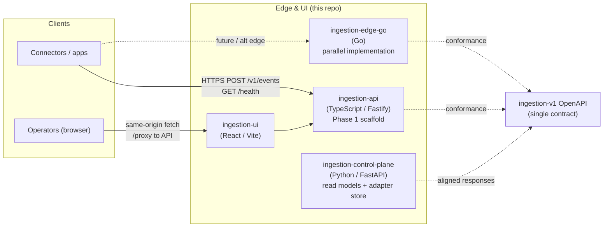
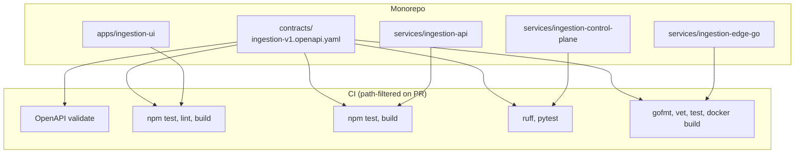
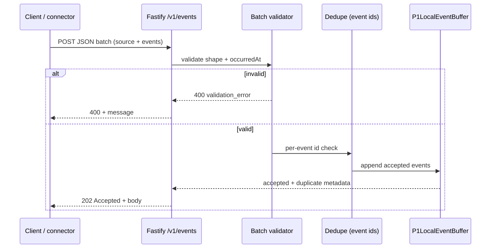
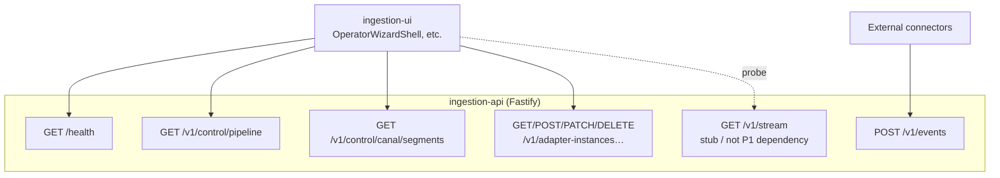
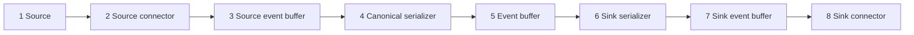
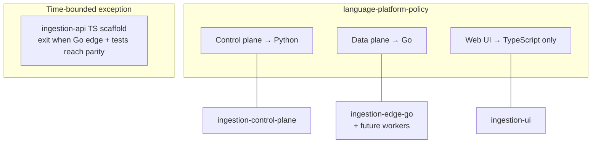

# Architecture diagrams (Canal Phase 1)

**Normative detail:** [`ingestion-v1.md`](./ingestion-v1.md), [`control-api-read-models.md`](./control-api-read-models.md), [`language-platform-policy.md`](./language-platform-policy.md).  
**Contract:** [`contracts/ingestion-v1.openapi.yaml`](../../contracts/ingestion-v1.openapi.yaml).

These diagrams render in GitHub, many IDEs, and static-site generators that support Mermaid. They summarize the **current repo layout** and the **target** language split (Python control, Go data plane, TS browser only).

---

## 1. System context

Actors and systems at the boundary of Phase 1 HTTP ingestion and operator UX.

**Notes:** Default dev experience often colocates UI and API (Vite proxy). Python control plane can run on its own port for split-stack dev; until a gateway splits traffic, TS and Python may expose overlapping routes—responses must stay aligned per `control-api-read-models.md`.

---

## 2. Repository map and CI touchpoints

How major paths relate to automation (from `.github/workflows/ci.yml`).

---

## 3. Ingestion batch flow (TypeScript edge)

Logical path for `POST /v1/events` through in-process Phase 1 components.

---

## 4. Operator read paths and adapter instances

What the operator wizard consumes today (TS service registers these routes; Python service mirrors read models and adapter CRUD shape).

---

## 5. Conceptual pipeline (control read model)

Stages and buffer segments are **deterministic scaffolding** for the operator board (not a live streaming topology in Phase 1).

Buffer segments (`providerProfile: p1-local` in read model) attach after selected ordinals; see OpenAPI **Control** schemas and `control-api-read-models.md` for JSON examples.

---

## 6. Target language split (policy)

Canonical placement of new work vs the Phase 1 TS exception.

---

## Changelog

| Date       | Change                                      |
| ---------- | ------------------------------------------- |
| 2026-05-03 | Initial diagrams for CAN-67 (CTO heartbeat) |
